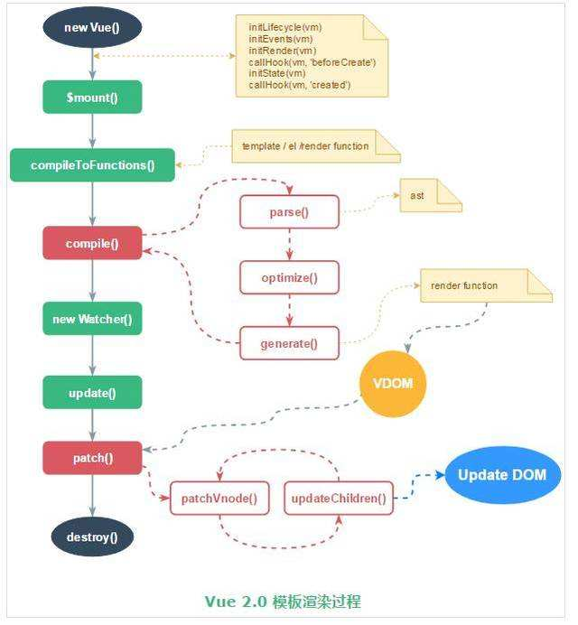

# Vue原理学习

> 推荐阅读链接：
> - [Vue2中Dep， Observer 与Watcher 之间的关系（不含patch部分）
>   ](https://github.com/AnnVoV/blog/blob/master/js/vue2%20Dep%20Observer%20%E4%B8%8E%20Watcher%E4%B9%8B%E9%97%B4%E7%9A%84%E5%85%B3%E8%81%94.md)
> - [vue.js源码解读系列 - 剖析observer,dep,watch三者关系 如何具体的实现数据双向绑定](https://blog.seosiwei.com/detail/24)
> - [Vue2.x源码解析系列七：深入Compiler理解render函数的生成过程](https://juejin.im/post/5b68fe48e51d4519125369b6)
> - [vue源码阅读之数据响应式原理 -- The question](https://juejin.im/post/5ce23e16e51d4510664d162c#heading-3)
> - [vue源码阅读之数据渲染过程 -- The question](https://juejin.im/post/5ce263bf518825645c34cd4e)

Vue 渲染原理如下：



```shell
# 安装
npm install
# 执行后访问 http://127.0.0.1:3000
npm start
```

Vue 响应式函数执行可以分为收集依赖到视图渲染两部分：

1. 收集依赖：
    - observe -> 
    - walk -> 
    - defineReactive -> 
    - get -> 
    - dep.depend() -> 
    - watcher.addDep(new Dep()) -> 
    - watcher.newDeps.push(dep) -> 
    - dep.addSub(new Watcher()) -> 
    - dep.subs.push(watcher)
2. 视图更新：
    - set -> 
    - dep.notify() -> 
    - subs[i].update() -> 
    - watcher.run() || queueWatcher(this) -> 
    - watcher.get() || watcher.cb -> 
    - watcher.getter() -> 
    - vm._update() -> 
    - vm.__patch__()

## 总结：我所理解的 Vue 原理

Vue 从`new Vue()`到渲染到视图大致分为以下几步：

1. **执行 initState**，执行 observe 函数对数据进行响应化处理，对每个属性都定义好 getter 和 setter
2. **执行 $mount 函数**，该函数执行以下几步：
    - 调用 compileToFunctions 方法，该方法的最终目的是让template字符串模板——>render function 函数。compile这个编译过程在Vue2会经历3个阶段：
        - 把html生成ast语法树 （Vue 源码中借鉴 jQuery 作者 John Resig 的 HTML Parser 对模板进行解析）
        - 对ast语法树进行静态优化optimize() （找到静态结点，做标记就是在ast上添加了static属性优化diff）
        - 根据优化过的ast generate生成render function 字符串，执行该 render Function 可以得到一个 VNode 对象
    - 执行`new Watcher(vm, updateComponent, noop, {})`生成 Watcher 实例，将渲染视图对应的函数 updateComponent 传入 Watcher 中
3. **Wathcer 进行实例化**，实例化后先会将 Dep.target 设为当前 watcher 实例，**然后执行一个 get 函数，get 函数会执行传入的 updateComponent 渲染函数**（该函数是对第二步生成的 render 方法的包装，该 render 方法会利用 with 语法在执行过程中访问属性的 getter 函数，从而将当前 Wathcer 入栈到 dep 实例中）
4. 执行 render 方法得到 VNode 以后，**updateComponent 函数会继续执行 _update 函数**，将得到的 VNode 映射为真实 DOM，从而完成页面的渲染。
5. 当 data 更新时，通过 data 的 setter 会触发 dep 的 notify 方法，从而通知所有相关联的 Watcher 运行 update 方法，而 update 方法又会调用 run 方法，run 方法再调用上面提到的 get 方法，从而更新视图。