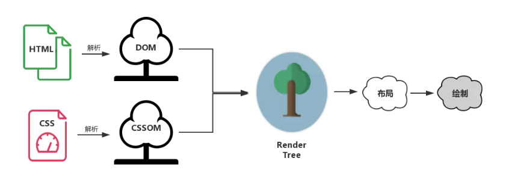
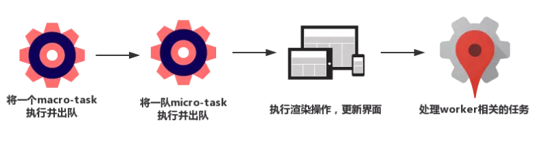
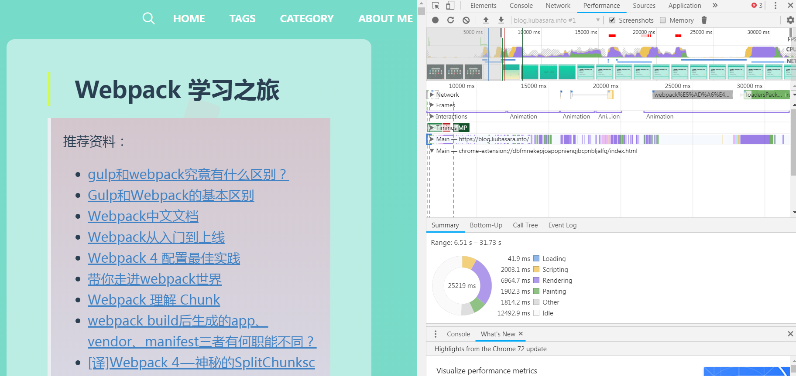
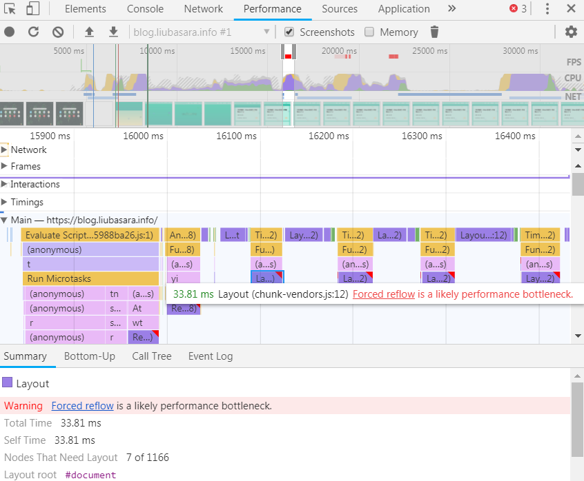
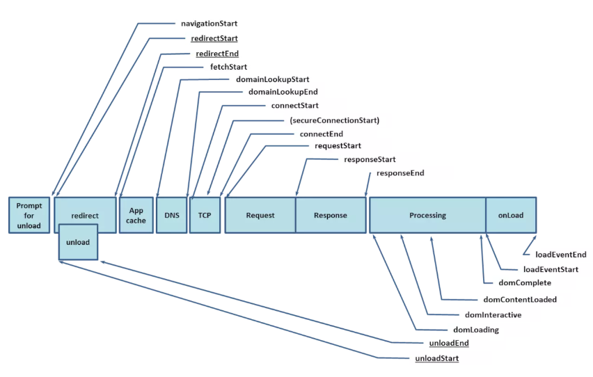

# 《前端性能优化原理与实践》学习记录

> 推荐小册：
>
> [前端性能优化原理与实践](https://juejin.im/book/5b936540f265da0a9624b04b/)
>
> 其他参考资料：
>
> - [原来 CSS 与 JS 是这样阻塞 DOM 解析和渲染的](https://juejin.im/post/59c60691518825396f4f71a1)
> - [是js的加载阻塞了页面的渲染还是js的执行阻塞了页面的渲染？](https://www.zhihu.com/question/61309490)
> - [HTML Standard系列：Event loop、requestIdleCallback 和 requestAnimationFrame](https://juejin.im/post/6844904056457003015#heading-5)
> - [在单页应用中，如何优雅的上报前端性能数据](https://github.com/forthealllight/blog/issues/38)
> - [前端性能监控：window.performance](https://juejin.im/entry/6844903465899016205)

**笔者总体读后感**：能够帮助像笔者这样的小白建立起前端优化的整体概念和体系，虽然有些地方讲得不太详细，但总体指明了方向，能够让人沿着方向继续努力，有的放矢。这一点难能可贵，所以可以说得上是一本值得一**买**的小册。

[TOC]

## 知识体系

> Q：从输入 URL 到页面加载完成，发生了什么？ 
>
> A：我们现在站在性能优化的角度，一起简单地复习一遍这个经典的过程：首先我们需要通过 DNS（域名解析系统）将 URL 解析为对应的 IP 地址，然后与这个 IP 地址确定的那台服务器建立起 TCP 网络连接，随后我们向服务端抛出我们的 HTTP 请求，服务端处理完我们的请求之后，把目标数据放在 HTTP 响应里返回给客户端，拿到响应数据的浏览器就可以开始走一个渲染的流程。渲染完毕，页面便呈现给了用户，并时刻等待响应用户的操作（如下图所示）。 

从这道常见的面试题中，我们可以得出前端性能优化的三个大方面：

- 网络层面
  1. 请求过程优化（HTTP 请求优化、构建工具性能优化、图片优化）
  2. 减少网络请求（缓存机制、本地存储方式）
- 渲染层面
  1. 浏览器渲染机制（JS 和 CSS 的堵塞渲染机制）
  2. DOM 优化（事件循环、异步更新、回流重绘）
  3. 首屏渲染（懒加载）
  4. SSR 服务端渲染
- 性能监测
  1. 通过 Performance 等工具监测网页性能
  2. 通过 W3C 的性能 API 自定义监测网络性能

## 网络层面

### 构建工具 webpack 优化

具体分为两点：

- 打包速度的优化
  1. 引入 HappyPack 插件进行多线程构建
  2. 引入 DllPlugin 对某些公共依赖库作标记，只有当依赖自身发生版本变化时才会重新打包
- 构建结果体积压缩
  1. 拆分资源，按需加载（webpack 的具体打包逻辑可见[Webpack 学习之旅](https://blog.liubasara.info/#/blog/articleDetail/mdroot%2F%E6%8A%80%E6%9C%AF%2F%E7%9E%8E%E6%8A%98%E8%85%BE%2Fwebpack%E5%AD%A6%E4%B9%A0%E4%B9%8B%E6%97%85.md#%25E5%259B%259B%25E3%2580%2581webpack-4-%25E9%2585%258D%25E7%25BD%25AE%25E5%2588%259D%25E8%25A7%25A3)）
  2. webpack-bundle-analyzer 分析过大的包进行按需拆解

### HTTP 请求优化

GZIP 压缩，还有 HTTP2.0 的多路复用，这里小册并没有讲得特别细。

### 图片优化

主要有几点：

- 小图片小图标适当转为 base64
- 常用不变的图片使用雪碧图
- webP，新生代图片格式，不常用

### 缓存机制

纠正 [浅谈HTTP缓存](https://blog.liubasara.info/#/blog/articleDetail/mdroot%2F%E6%8A%80%E6%9C%AF%2F%E6%B5%85%E8%B0%88HTTP%E7%BC%93%E5%AD%98.md) 中关于 MemoryCache 和硬盘缓存的看法，**并不是** 200 强缓存返回的缓存就会被塞入内存，而 304 返回的就会被塞入硬盘。

> 那么哪些文件会被放入内存呢？
>
> 事实上，这个划分规则，一直以来是没有定论的。不过想想也可以理解，内存是有限的，很多时候需要先考虑即时呈现的内存余量，再根据具体的情况决定分配给内存和磁盘的资源量的比重——资源存放的位置具有一定的随机性。
>
> 虽然划分规则没有定论，但根据日常开发中观察的结果，包括我们开篇给大家展示的 Network 截图，我们至少可以总结出这样的规律：资源存不存内存，浏览器秉承的是“节约原则”。我们发现，Base64 格式的图片，几乎永远可以被塞进 memory cache，这可以视作浏览器为节省渲染开销的“自保行为”；此外，体积不大的 JS、CSS 文件，也有较大地被写入内存的几率——相比之下，较大的 JS、CSS 文件就没有这个待遇了，内存资源是有限的，它们往往被直接甩进磁盘。

是否将缓存放入内存是由浏览器决定的，可以放入内存的资源有下列这些：

- base64 格式图片
- 体积不大的 JS、CSS 文件

### 本地存储

老生常谈介绍了一下 Cookie、Local Storage、Session Storage、IndexDB 的历史渊源和粗浅用法。

### CDN 作用

CDN两大功能：

- 缓存：把资源 copy 到服务器上
- 回源：CDN 服务器发现自己没有这个资源，转头向上层服务器索要资源的过程

CDN 的另一个好处就是，使用 CDN 的往往是一些静态资源，这些静态资源被部署在不同的域名上，请求它们的时候，由于同源策略，**浏览器就可以无需携带大量的主站 Cookie 来发送 HTTP 请求**，从而提高了效率和安全性。

## 渲染层面

### 浏览器的渲染机制

> 渲染过程说白了，首先是基于 HTML 构建一个 DOM 树，这棵 DOM 树与 CSS 解释器解析出的 CSSOM 相结合，就有了布局渲染树。最后浏览器以布局渲染树为蓝本，去计算布局并绘制图像，我们页面的初次渲染就大功告成了。 



其中，重新布局导致的就是我们常说的回流（Reflow），重新绘制导致的就是常说的重绘（Repaint）。

### 基于渲染机制所做的优化

分为以下几点：

- CSS 选择器优化，尽量减少选择器的嵌套
- CSS 的**下载**和 JS 的**执行**都会阻塞 DOM 的渲染，原因是为了避免没有 CSS 的 HTML 页面丑陋地“裸奔”在用户眼前和防止 JS 修改了 DOM 导致渲染的无用功。所以为了优化这点，应该要做到的是：
  1. 尽早让 CSS 下载到浏览器，将 CSS 链接放到 head 标签提前的地方
  2. 将 JS 文件往后放，或者使用 defer 和 async 的方式来加载 DOM。（defer 会让 JS 在 DOM 文档加载结束后再执行，而 async 则干脆直接不阻塞 DOM 文档的渲染，下载完后立即执行）

**update：**

总结：

- CSS 下载会阻止 Render 树的解析，所以会阻塞渲染（如果不阻塞用户就会先看到光秃秃的 DOM 再看到样式，体验很差而且渲染了两次），但不会阻塞 DOM 树的解析。
- **不带 async 和 defer 的 JS** 会阻塞 DOM 的解析（浏览器为了不做无用功解析多余的 DOM），且执行完毕之后会触发渲染（eventLoop，每次执行完一次宏任务之后进行渲染），而触发渲染时若 CSS 尚未全部加载完成，就会一不小心连带渲染一起阻塞，所以需要将 JS 文件的加载尽量放在文档的后面。

### 基于 DOM 的优化

DOM API 由于不是 ECMAScript 的一部分，只是浏览器给出的底层 API，所以操作时非常非常慢的，JS 脚本执行时应该尽可能的减少 DOM 的操作。主要可以通过以下几点来做：

- 使用 DOM Fragment 来代替真实 DOM，在 JS 内部调整好 DOM 结点结构后再一次性插入。

- 使用 Event Loop，将多次更新合并到一次 micro Task 中去做

  

  这样可以不需要多消耗一轮 macro-task 去专门执行渲染操作。Vue 中的 nextTick、React 中的 setState 都是用了类似的优化思想。

- 减少回流操作

  > 当你要用到像这样的属性：offsetTop、offsetLeft、 offsetWidth、offsetHeight、scrollTop、scrollLeft、scrollWidth、scrollHeight、clientTop、clientLeft、clientWidth、clientHeight，getComputedStyle 时，你就要注意了！ 

  JS 调用上面这些属性都会导致页面回流，因为这些都需要通过即时计算来得到一个精确的结果。

  此外，如果万不得已一定要修改元素的几何属性，可以先将元素离线（display: none;）再进行修改，最后再将元素上线（display:block;），力求一次回流，全部搞定。

- 浏览器也会对过分的回流绘制操作进行限制和优化

### 首屏渲染懒加载

以下是笔者自己写的一个简单例子，欢迎参考。

```html
<!DOCTYPE html>
<html lang="en">
  <head>
    <meta charset="UTF-8" />
    <meta name="viewport" content="width=device-width, initial-scale=1.0" />
    <meta http-equiv="X-UA-Compatible" content="ie=edge" />
    <title>Document</title>
  </head>
  <body>
      
      
      
      
      
      
      
      
      
      
      
  </body>
  <script>
    // 图片懒加载 !
    window.onload = function () {
      var allImg = document.getElementsByTagName('IMG')
      var n = 0 //存储图片加载到的位置，避免每次都从第一张图片开始遍历
      const DEFAULT_IMG = 'default.jpg'
      function lazyLoad () {
        let docElement = document.documentElement
        Array.from(allImg).slice(n).forEach((item, index) => {
          // if ((item.offsetTop < docElement.scrollTop + docElement.clientHeight) && item.getAttribute('src') === DEFAULT_IMG) {
          // 条件代码可读性优化：用 可视区域高度 减去 元素顶部距离可视区域顶部的高度，如果可视区域高度大于等于元素顶部距离可视区域顶部的高度，说明元素露出
          if (( docElement.clientHeight - item.getBoundingClientRect().top > 0 ) && item.getAttribute('src') === DEFAULT_IMG) {
            item.setAttribute('src', item.dataset.src)
            n = index
          }
        })
      }
      lazyLoad() // 页面初始化第一次加载
      window.onscroll = lazyLoad // 绑定监听函数, 还可以加入节流函数
    }
  </script>
  <style>
    img {
      display: block;
      margin-bottom: 50px;
      width: 400px;
      height: 400px;
    }
  </style>
</html>
```

### 节流防抖

这个已经很常见了，节流和防抖的代码不贴，但小册有一个有意思的场景：

> debounce 设置的 delay 时间结束就进行下一次操作，于是每次 debounce 都为该用户重新生成定时器，回调函数被延迟了不计其数次。频繁的延迟会导致用户迟迟得不到响应，用户同样会产生“这个页面卡死了”的观感。 
>
> 为了避免弄巧成拙，我们需要借力 throttle 的思想，打造一个“有底线”的 debounce——等你可以，但我有我的原则：delay 时间内，我可以为你重新生成定时器；但只要delay的时间到了，我必须要给用户一个响应。这个 throttle 与 debounce “合体”思路，已经被很多成熟的前端库应用到了它们的加强版 throttle 函数的实现中 。

```javascript
// 节流的防抖函数
function throttleToDebounce(fn, delay = 5000) {
  let canRun = true
  let timer
  return function (...arg) {
    if (typeof timer !== "undefined") clearTimeout(timer)
    timer = setTimeout(() => {
      fn.apply(this, arg)
    }, delay)
    if (canRun) {
      canRun = false
      fn.apply(this, arg)
      clearTimeout(timer)
      setTimeout(() => {
        canRun = true
      }, delay)
    }
  }
}

// 节流的防抖函数（第一次不立即触发版）
function throttleToDebounce2(fn, delay = 5000) {
  let canRun = true
  let timer
  return function (...arg) {
    if (typeof timer !== "undefined") clearTimeout(timer)
    timer = setTimeout(() => {
      fn.apply(this, arg)
      timer = undefined
    }, delay)
    if (canRun) {
      canRun = false
      setTimeout(() => {
        if (typeof timer !== "undefined") {
          fn.apply(this, arg)
        }
        setTimeout(() => {
          canRun = true
        }, 0)
      }, delay)
    }
  }
}
```

优点：不易造成卡死现象，优化体验。

缺点：由于用了两个定时器，必然会导致执行两次，区别只是第一次有没有延时执行。

结论：所以该方法仅适用于多次执行不影响结果的场景（也就是目的是限制触发次数的场景，比如`onscroll`），而不适用于一些 UI 交互的防抖场景（比如说 button 弹窗之类的，还是应该老老实实用普通的防抖）

## 性能监测

### Performance 面板

小册作者详细介绍了 Performance 面板火焰图的用法，以下是一点心得：



以我的博客页面为例，明显能看到我的博客渲染任务占了最多的时间，也就是优化点在于 Rendering。



随后针对红点进行分析，可以看到最严重的性能问题是由于多次强制回流导致的。

针对这些事件，就能够在日后的开发中对这些性能存在问题的页面进行改进了。

### W3C Performance API

除了这些工具以外，还可以通过 JS 的全局 performance 对象来对页面性能做一个自定义的监听。



以上是不同事件所对应的 API 中的不同字段。

**2020/8/7 update**

字段含义如下：

> - `redirectStart`和`redirectEnd`：如果页面是由redirect而来，则redirectStart和redirectEnd分别代表redirect开始和结束的时间节点；
>
> - `unloadEventStart`和`unloadEventEnd`：如果前一个文档和请求的文档是同一个域的，则`unloadEventStart`和`unloadEventEnd`分别代表浏览器unload前一个文档的开始和结束时间节点。否则两者都等于0；
>
> - `fetchStart`是指在浏览器发起任何请求之前的时间值。在fetchStart和`domainLookupStart`之间，浏览器会检查当前文档的缓存；
>
> - `domainLookupStart`和`domainLookupEnd`分别代表DNS查询的开始和结束时间节点。如果浏览器没有进行DNS查询（比如使用了cache），则两者的值都等于`fetchStart`；
>
> - `connectStart`和`connectEnd`分别代表TCP建立连接和连接成功的时间节点。如果浏览器没有进行TCP连接（比如使用持久化连接webscoket），则两者都等于`domainLookupEnd`；
>
> - `secureConnectionStart`：可选。如果页面使用HTTPS，它的值是安全连接握手之前的时刻。如果该属性不可用，则返回undefined。如果该属性可用，但没有使用HTTPS，则返回0；
>
> - `requestStart`代表浏览器发起请求的时间节点，请求的方式可以是请求服务器、缓存、本地资源等；
>
> - `responseStart`和`responseEnd`分别代表浏览器收到从服务器端（或缓存、本地资源）响应回的第一个字节和最后一个字节数据的时刻；
>
> - `domLoading`代表浏览器开始解析html文档的时间节点。我们知道IE浏览器下的document有`readyState`属性，`domLoading`的值就等于`readyState`改变为`loading`的时间节点；
>
> - `domInteractive`代表浏览器解析html文档的状态为`interactive`时的时间节点。`domInteractive`并非DOMReady，它早于DOMReady触发，代表html文档解析完毕（即dom tree创建完成）但是内嵌资源（比如外链css、js等）还未加载的时间点；
>
> - `domContentLoadedEventStart`：代表`DOMContentLoaded`事件触发的时间节点：
>
>   > 页面文档完全加载并解析完毕之后,会触发DOMContentLoaded事件，HTML文档不会等待样式文件,图片文件,子框架页面的加载(load事件可以用来检测HTML页面是否完全加载完毕(fully-loaded))。
>
>   
>
> - `domContentLoadedEventEnd`：代表`DOMContentLoaded`事件完成的时间节点，此刻用户可以对页面进行操作，也就是jQuery中的domready时间；
>
> - `domComplete`：html文档完全解析完毕的时间节点；
>
> - `loadEventStart`和`loadEventEnd`分别代表onload事件触发和结束的时间节点

通过求两个时间点之间的差值，我们可以得出某个过程花费的时间。

> ```javascript
> let times = {};
> let t = window.performance.timing;
> 
> // 重定向时间
> times.redirectTime = t.redirectEnd - t.redirectStart;
> 
> // dns查询耗时
> times.dnsTime = t.domainLookupEnd - t.domainLookupStart;
> 
> // TTFB 读取页面第一个字节的时间
> times.ttfbTime = t.responseStart - t.navigationStart;
> 
> // DNS 缓存时间
> times.appcacheTime = t.domainLookupStart - t.fetchStart;
> 
> // 卸载页面的时间
> times.unloadTime = t.unloadEventEnd - t.unloadEventStart;
> 
> // tcp连接耗时
> times.tcpTime = t.connectEnd - t.connectStart;
> 
> // request请求耗时
> times.reqTime = t.responseEnd - t.responseStart;
> 
> // 解析dom树耗时
> times.analysisTime = t.domComplete - t.domInteractive;
> 
> // 白屏时间
> times.blankTime = t.domLoading - t.fetchStart;
> 
> // domReadyTime
> times.domReadyTime = t.domContentLoadedEventEnd - t.fetchStart;
> ```
>
> 以上这些通过 Performance API 获取到的时间信息都具有较高的准确度。我们可以对此进行一番格式处理之后上报给服务端，也可以基于此去制作相应的统计图表，从而实现更加精准、更加个性化的性能耗时统计。 
>
> 此外，通过访问 performance 的 memory 属性，我们还可以获取到内存占用相关的数据；通过对 performance 的其它属性方法的灵活运用，我们还可以把它耦合进业务里，实现更加多样化的性能监测需求。


