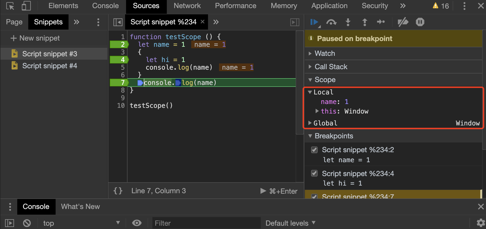

# 从 scope 理解块级作用域

> 参考资料：
>
> - [深入理解JavaScript作用域和作用域链](https://juejin.im/post/6844903797135769614)
> - [Javascript作用域原理](https://www.laruence.com/2009/05/28/863.html)

## 理解 scope 作用域链

两个重要的概念：

- [[scope]] 私有属性，一个数组，在函数创建时被创建在函数上，一开始被指向于当前的作用域链。在函数执行时会生成活动对象并将该活动对象入栈。

- 活动对象，在函数预编译时被创建（JS 是一边编译一边执行的语言），包括的属性有 arguments 指针等私有变量，函数内被声明的变量，被传入的变量（此时未赋值）

有了上面的作用域链, 在发生标识符解析的时候, 就会逆向查询当前scope chain列表的每一个活动对象的属性，如果找到同名的就返回。找不到，那就是这个标识符没有被定义。

下面是一道经典面试题，说出下面程序的输出：

```javascript
var foo = { n: 1 };
(function (foo) {
 var foo; // 声明了 foo 变量，但这个变量实际上是函数的入参，已经被声明过且有值，由于 var 可以重复声明，所以这一步什么都没发生，但如果是 let 或者 const 这样的块操作符，这一步就会报错
 console.log(foo.n);
 foo.n = 3; // 改变了 foo 指针指向对象中的属性值
 var foo = { n: 2 }; // 对 foo 指针重新进行了覆盖，此时函数内部的 foo 指针与函数外部的正式脱钩
 console.log(foo.n);
})(foo);

console.log(foo.n);
```

正确答案：1、2、3

## 理解块级作用域

在理解了作用域链后，就不难假设出其实块级作用域的原理其实跟上面一样的猜想。在 ES6 之前，javascript 通过`var`关键字 + 一个独立的函数作用域的形式来实现隔离作用域，其目的无非也就是为了在 scope 作用域链上插入新的活动对象而已。

像下面这段经典的憨憨代码一样：

```javascript
for (var i = 0; i < 10; i++) {
  // 生成一个函数并立即执行，主要目的就是利用该函数执行时生成的活动对象，让函数在执行的时候首先找到的 i 是活动对象上的 i，且由于传入的是基本类型，数值复制，引用被解除。
  (function (i) {
    setTimeout(() => {
      console.log(i)
    }, 0)
  })(i)
}
```

之后来到 ES6 的时代，`let`和`const`两个关键字配合`{}`块级作用域，就能够达成在 scope 作用域链上新生成并入栈一个活动对象的效果，而该活动对象所包括的内容自然也就是在块级作用域内被声明的内容。如下面这段代码：

```javascript
function testScope () {
  let name = 1
  {
    let hi = 2 // 如果没有使用 let/const 声明而只有块作用域，是不会生成新的活动对象的
    console.log(hi)
  }
  console.log(name)
}

testScope()
```


可以看到执行到第一行时，作用域链上只有两个对象，当前函数的活动对象 Local 和 全局对象 Global。


而执行到块作用域里面后，作用域链上果断多出了一个名为 Block 的活动对象，里面包含着被声明的 hi 变量。



而等到出了块作用域，该临时生成的活动对象便被作用域链无情出栈了，从此作用域链上再也找不到名为 hi 的变量。

此外，要注意的是如果块作用域里如果没有`let`和`const`声明而只有`var`声明，那这片块作用域相当于是无效的，函数并不会为他生成任何新的活动对象，毕竟实在没什么好存的，这也算是理所应当的性能优化吧。