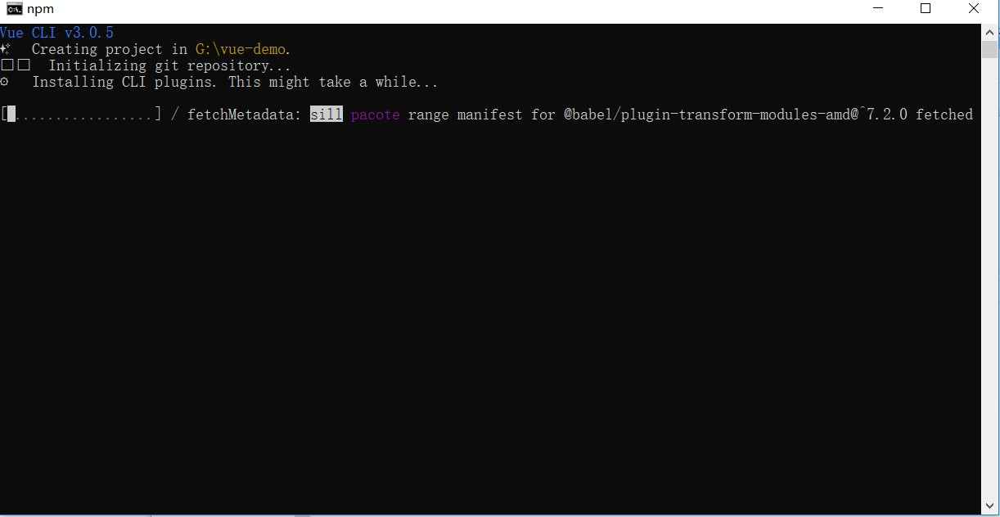
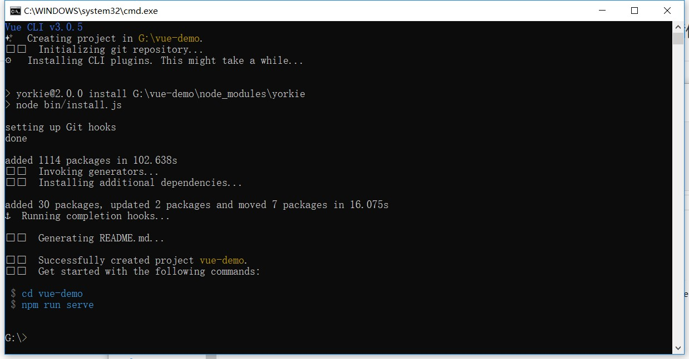
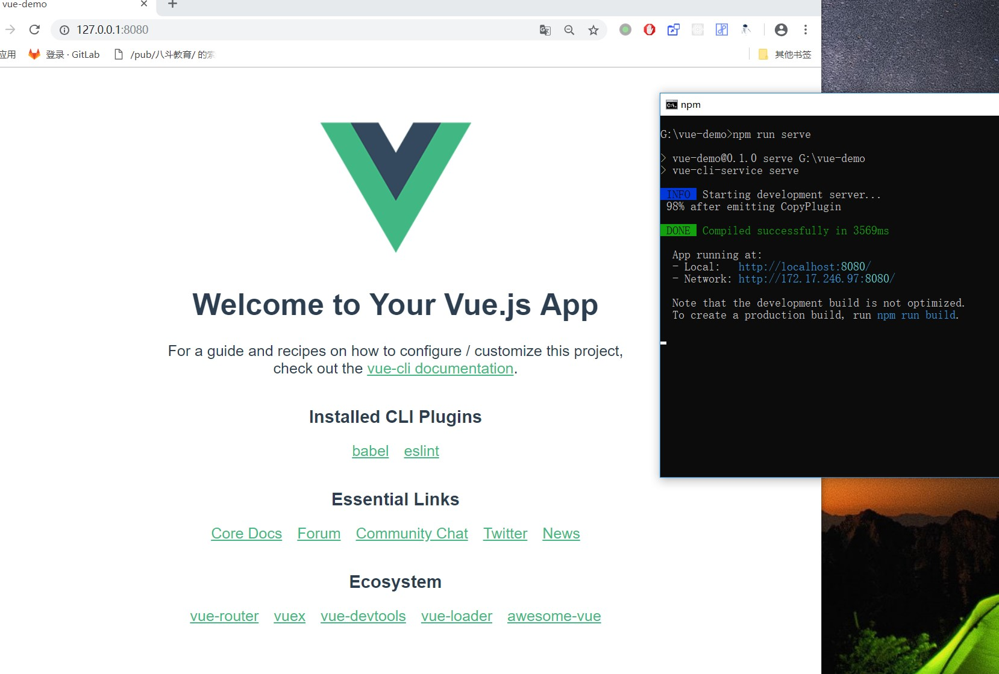

# 基于Vue-Cli3用Vue搭建一个GitHub Page博客（一）

> 引用资料：
>
> - [Build your own site](http://www.dendoink.com/#/post/2018-11-14-Life)
> - [使用 github pages, 快速部署你的静态网页](https://blog.csdn.net/baidu_25464429/article/details/80805237)
> - [ Vue CLI 3](https://cli.vuejs.org/zh/)
> - [ 手把手教你用vue搭建个人站](https://segmentfault.com/a/1190000015721550)
> - [gray-matter](https://github.com/jonschlinkert/gray-matter)
> - [深入浅出 VuePress（一）：如何做到在 Markdown 中使用 Vue 语法](https://www.jianshu.com/p/c7b2966f9d3c)

## 写在开头

通读本文，您将获得以下技能点：

1. 使用vue-cli3搭建一个新项目
2. 对vue-cli3进行简单的设置，使其支持github page页面
3. 将打包的项目部署到github page上(项目方式， 个人主页方式)

若您对以上内容已经了然，那么可以跳过本章节继续阅读本系列的其他内容。

## 前言

vue在不久前发布了其最新的脚手架Vue-cli3，该脚手架基于webpack4，对项目目录进行了极大的优化和简化，并且在迭代了几个版本以后也逐渐趋于稳定，可以说是当下新建Vue项目的不二之选。

正好之前一直想要自己开发一个博客系统，又正好看到了这个十分优秀的[开源项目](https://github.com/DendiSe7enGitHub/Align)，在看了一遍代码之后心潮澎湃，干脆说做就做，开发一个博客系统出来。虽然说现在开源社区已经提供了很多优秀的开源博客系统供我们选择，但是程序员的天性就是把复杂的东西简单化，把简单的东西复杂化，自己手撸轮子的爽快感是无论用任何框架都难以代替的。

那么既然要开发一个博客系统，我们需要哪几项功能呢？

## 需求分析

一个最简单的博客系统应该具备的两项最基础的功能：

- 支持markdown样式
- 自动识别markdown文件，并生成对应页面的路由

没有以上这两个功能，博客系统也就无从谈起，而市面上几乎所有的博客生成器，也都具备以上两点功能，但是对于我们来说，上面的功能还是显得略微有些单薄，所以稍加升级，我们将上面的需求改为：

- 支持完全自定义的markdown样式
- 自动**递归**识别特定文件夹下的所有文件夹，找出所有的markdown文件并生成路由。

第一点的改进意义自然不必多说，实现方法大概也就是添加css，让整个页面显得更加美观。

而第二点的改进会让博客文章管理起来更加的方便，避免出现博客文章一多，posts文件夹里的markdown文件显得杂乱无章的情况。

那么说干就干，开始我们的博客搭建的第一步：生成项目。

## 生成项目

我的开发环境：

- 操作系统：win10
- node版本：v8.11.3
- npm版本：5.6.0

无论你以前是否有通过vue-cli2脚手架搭建前端项目的经验，在通过vue-cli3搭建项目时，你要做的东西都是一样的。即通过以下命令来安装脚手架。

```shell
npm install -g @vue/cli
# or
yarn global add @vue/cli
```

安装之后，就可以通过vue命令的create命令初始化一个项目了。

```shell
vue create blog-demo
```





> ps: 对于以前使用过vue-cli2建立过项目的同学来说，安装vue-cli3会把你系统中的vue命令覆盖掉，如果这时候仍需要使用旧版本的**vue init**功能，那么你需要全局安装一个桥接工具。
>
> ```shell
> npm install -g @vue/cli-init
> # vue init 的运行效果将会跟 vue-cli@2.x 相同
> vue init webpack my-projec
> ```

成功创建完项目以后，进入到vue-demo目录。我们可以发现相比于vue-cli2时代，基于webpack4的vue-cli3简洁了不少，在当前目录下运行npm run serve，就可以在8080端口下访问到初始化的项目了。



> 与vue-cli2不同的是，vue-cli3实现了对webpack4的封装，开发者不再是直接通过webpack-server来启动服务，而是通过由脚手架封装过的vue-cli-service来启动服务，相对应的，启动命令也从npm run dev变更到了npm run serve。

至此，项目已经成功跑了起来，接下来我们要对vue-cli做一些设置，从而让它打包出来的文件能够被github page所识别，方便我们进一步的部署。

## vue.config.js

秉承着开箱即用的开发理念，在vue-cli3所生成的文件目录中，并没有build和config目录文件夹，开发者如果想对webpack作自定义配置，需要自己在根目录下生成一个vue.config.js的文件，让vue在开启服务和打包的时候进行识别。

在vue.config.js文件中，可以根据脚手架制定的规则进行webpack的配置，常用的配置都能直接通过module.exports输出设置，一些额外的配置也可以使用**chainWebpack**选项和**configureWebpack**选项进行额外注入配置。

> 具体配置详情可见官网: [配置参考](https://cli.vuejs.org/zh/config/#%E9%85%8D%E7%BD%AE%E5%8F%82%E8%80%83)

**这里要注意的有两点**，第一点是因为我们最终的目的是将博客部署在github page上，所以在进行baseUrl的设置的时候，要先确定自己的博客项目的名字是否为*username.github.io*样式。如果不是的话，我们需要将baseUrl设置为''/${项目名称}/''，否则就算布上去了，Vue也无法获取到对应的页面。

第二点是记得将outputDir设置为docs，这么设置的原因也是为了最后方便github部署，具体会在下一节讲到。

下面贴一下我的配置文件，有兴趣的同学可以参考一波。

```javascript
// vue.config.js
var path = require('path')
// vue.config.js 配置说明
//官方vue.config.js 参考文档 https://cli.vuejs.org/zh/config/#css-loaderoptions
// 这里只列一部分，具体配置参考文档
function resolve (dir) {
  return path.join(__dirname, dir)
}
module.exports = {
  // 部署生产环境和开发环境下的URL。
  // 默认情况下，Vue CLI 会假设你的应用是被部署在一个域名的根路径上
  //例如 https://www.my-app.com/。如果应用被部署在一个子路径上，你就需要用这个选项指定这个子路径。例如，如果你的应用被部署在 https://www.my-app.com/my-app/，则设置 baseUrl 为 /my-app/。
  // baseUrl: process.env.NODE_ENV === "production" ? "/blog/" : "/",
  baseUrl: "/",
  // outputDir: 在npm run build 或 yarn build 时 ，生成文件的目录名称（要和baseUrl的生产环境路径一致）
  outputDir: "docs",
  //用于放置生成的静态资源 (js、css、img、fonts) 的；（项目打包之后，静态资源会放在这个文件夹下）
  assetsDir: "static",
  //指定生成的 index.html 的输出路径  (打包之后，改变系统默认的index.html的文件名)
  // indexPath: "myIndex.html",
  //默认情况下，生成的静态资源在它们的文件名中包含了 hash 以便更好的控制缓存。你可以通过将这个选项设为 false 来关闭文件名哈希。(false的时候就是让原来的文件名不改变)
  filenameHashing: false,
 
  //   lintOnSave：{ type:Boolean default:true } 问你是否使用eslint
  lintOnSave: true,
  //如果你想要在生产构建时禁用 eslint-loader，你可以用如下配置
  // lintOnSave: process.env.NODE_ENV !== 'production',
 
  //是否使用包含运行时编译器的 Vue 构建版本。设置为 true 后你就可以在 Vue 组件中使用 template 选项了，但是这会让你的应用额外增加 10kb 左右。(默认false)
  // runtimeCompiler: false,
 
  /**
   * 如果你不需要生产环境的 source map，可以将其设置为 false 以加速生产环境构建。
   *  打包之后发现map文件过大，项目文件体积很大，设置为false就可以不输出map文件
   *  map文件的作用在于：项目打包后，代码都是经过压缩加密的，如果运行时报错，输出的错误信息无法准确得知是哪里的代码报错。
   *  有了map就可以像未加密的代码一样，准确的输出是哪一行哪一列有错。
   * */
  productionSourceMap: false,

  configureWebpack: {
    module: {
      rules: [
        {
          test: /\.md$/,
          use: [
            {
              loader: 'vue-loader',
              options: {
                compilerOptions: {
                  preserveWhitespace: false
                }
              }
            },
            {
              loader: require.resolve('./build_utils/markdown')
            }
          ]
        }
      ]
    },
    resolve: {
      symlinks: false // 关闭这个以防build之后出现type error报错 ["Cannot assign to read only property 'exports' of object '#<Object>'" when importing library](https://github.com/vuejs/vue-cli/issues/2675)
    },
  },
  chainWebpack: (config)=>{
    config.resolve.alias
        .set('@', resolve('src'))
        .set('assets', resolve('src/assets'))
        .set('build_utils', resolve('build_utils'))
        .set('components', resolve('src/components'))
  },

 
  // 它支持webPack-dev-server的所有选项
  devServer: {
    host: "0.0.0.0",
    port: 8099, // 端口号
    https: false, // https:{type:Boolean}
    open: false, //配置自动启动浏览器
    // proxy: 'http://localhost:4000' // 配置跨域处理,只有一个代理
 
    // 配置多个代理
    // proxy: {
    //   "/api": {
    //     target: "<url>",
    //     ws: true,
    //     changeOrigin: true
    //   },
    //   "/foo": {
    //     target: "<other_url>"
    //   }
    // }
  }
}
```

## 将项目部署打包上github page

关于这一节，其实已经有无数博客教程讲解过这个流程了，有心人只要随便[google(github page 个人博客)](https://www.google.com/search?ei=UNRCXLWOBNH8wAPjtpWQDw&q=github+page+%E4%B8%AA%E4%BA%BA%E5%8D%9A%E5%AE%A2&oq=github+page+%E4%B8%AA%E4%BA%BA%E5%8D%9A%E5%AE%A2&gs_l=psy-ab.3...99.840..973...0.0..0.0.0.......0....1..gws-wiz.0LZsImR_tvI)一下就能找到详细的部署流程。(在这里推荐[一篇博客](https://blog.csdn.net/baidu_25464429/article/details/80805237)，有不清楚流程的同学可以移步到此处观看。)

在此要补充一点比较重要的是：

github page的部署目前有两种方式，一种是以**用户名.github.io**为命名的仓库，这类仓库在生成之后github会自动识别其为github page仓库，在这类仓库下，你只能将index.html文件放在master分支的根目录下，然后通过*https://用户名.github.io*来访问。

第二种方式则是以项目的形式部署，这种github page页面通过项目的setting页面可以在任何项目仓库中生成。并且接受两种index.html的存在方式（可以在master的根目录下，也可以在master分支的docs文件夹下），然后通过*https://用户名.github.io/项目仓库名/* 来访问。

所以我们在vue.config.js中将outputDir设为docs，这样在打包完成后就可以把整个项目一起push上去，达到部署的目的。当然你也可以选择把新开一个名为**用户名.github.io**的项目，在每次build之后单独把docs文件夹部署上去。

部署上页面之后，所有的基础工作就算是准备完成了，下一节开始，我们将会正式开始博客功能的搭建。


---

本文首发地址: [基于Vue-Cli3用Vue搭建一个GitHub Page博客（一）](https://blog.liubasara.info/#/post/基于Vue-Cli3用Vue搭建一个GitHub%20Page博客（一）)

欢迎转载，能注明出处就更好啦~

如有任何疑问或者建议，欢迎各位大佬在博客里留言，谢谢各位。