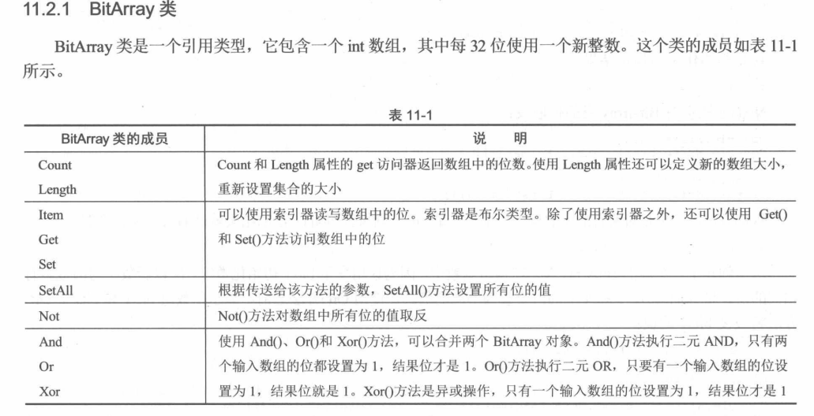
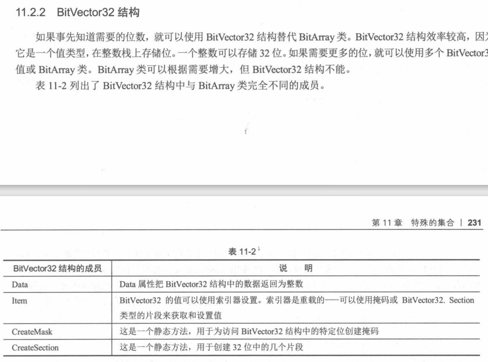
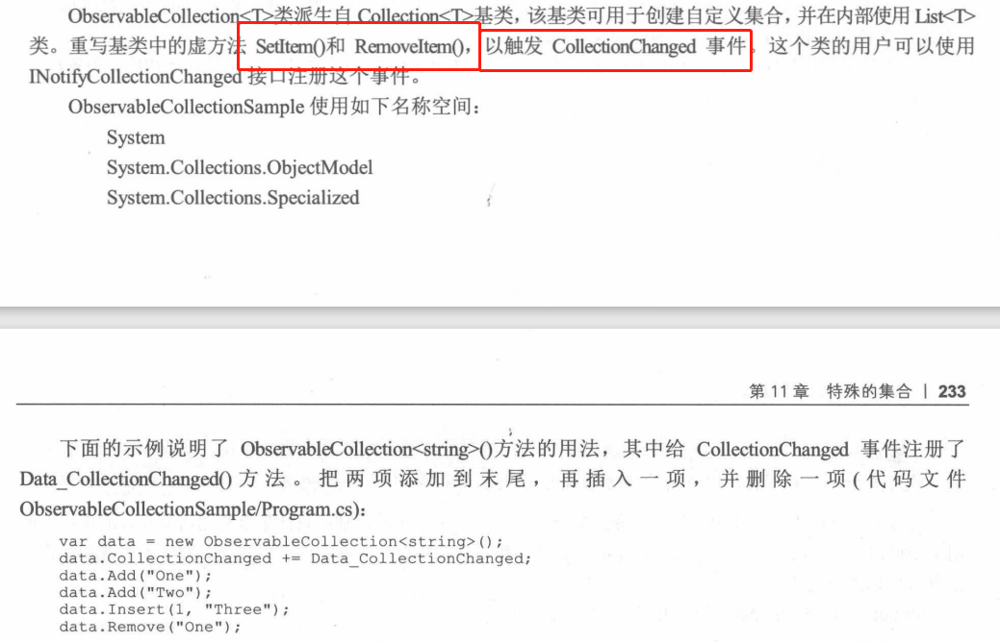

#  《C#高级编程》学习笔记（10）

## 第11章 特殊的集合

 本章要点：

- 使用位数组和位矢量
- 使用可观察的集合
- 使用不可变的集合
- 使用并发的集合

### 11.1 概述

本章将继续介绍特殊的集合，例如：处理位的集合、改变时可以观察的集合、不能改变的集合，以及可以在多个线程中同时访问的集合

### 11.2 处理位

C# 为位处理提供了二进制字面量和数字分隔符，处理二进制数据时，还可以用 BitArray 类和 BitVector32 结构。





### 11.3 可观察的集合

如果需要知道集合中的元素何时删除或添加的信息，就可以使用`ObservableCollection<T>`类。



### 11.4 不变的集合

不变的对象和集合很容易在多个线程中使用，它与只读集合不一样的是，只读集合仍然有可能被强制改变，但是不可变的集合就是真正不可变的。

> ChatGPT：
>
> 在 C# 中，不可变集合是指一旦创建就不能被修改的集合。它们是线程安全的，并且可以提供更高的性能和更好的内存管理。C# 中的不可变集合有以下几种类型：`ImmutableArray<T>`、`ImmutableList<T>`、`ImmutableDictionary<TKey, TValue>` 和 `ImmutableHashSet<T>`。
>
> 1. `ImmutableArray<T>`：不可变数组，使用类似于普通数组的语法，但不能进行修改。示例代码如下：
>
> ```csharp
> ImmutableArray<int> immutableArray = ImmutableArray.Create(1, 2, 3);
> // 添加元素
> immutableArray = immutableArray.Add(4);
> // 删除元素
> immutableArray = immutableArray.Remove(2);
> // 获取元素
> int element = immutableArray[0];
> ```
>
> 2. `ImmutableList<T>`：不可变列表，类似于链表，支持添加、删除和获取元素。示例代码如下：
>
> ```csharp
> ImmutableList<int> immutableList = ImmutableList.Create(1, 2, 3);
> // 添加元素
> immutableList = immutableList.Add(4);
> // 删除元素
> immutableList = immutableList.Remove(2);
> // 获取元素
> int element = immutableList[0];
> ```
>
> 3. `ImmutableDictionary<TKey, TValue>`：不可变字典，存储键值对，支持添加、删除和获取元素。示例代码如下：
>
> ```csharp
> ImmutableDictionary<string, int> immutableDictionary = ImmutableDictionary.Create<string, int>()
>     .Add("one", 1)
>     .Add("two", 2)
>     .Add("three", 3);
> // 添加元素
> immutableDictionary = immutableDictionary.Add("four", 4);
> // 删除元素
> immutableDictionary = immutableDictionary.Remove("two");
> // 获取元素
> int value = immutableDictionary["one"];
> ```
>
> 4. `ImmutableHashSet<T>`：不可变哈希集合，存储不重复的元素，支持添加、删除和判断元素是否存在。示例代码如下：
>
> ```csharp
> ImmutableHashSet<int> immutableHashSet = ImmutableHashSet.Create(1, 2, 3);
> // 添加元素
> immutableHashSet = immutableHashSet.Add(4);
> // 删除元素
> immutableHashSet = immutableHashSet.Remove(2);
> // 判断元素是否存在
> bool contains = immutableHashSet.Contains(1);
> ```
>
> 这些不可变集合类型都位于 `System.Collections.Immutable` 命名空间中，并且可以通过 NuGet 包管理器安装 `System.Collections.Immutable` 包来使用。使用不可变集合可以避免因修改集合而引发的线程安全问题，并且可以提供更好的性能和内存管理。

与其他集合类相反，Add() 方法不会改变【不变集合】的本身，而是会返回一个新的不变集合。

### 11.5 并发集合

如果希望在多个线程中使用可以改变的集合，C# 在 System.Collections.Concurrent 命名空间中提供了几个线程安全的集合类。线程安全的集合可以防止多个线程以互相冲突的方式访问集合。

> ChatGPT：
>
> 在 C# 中，有几种并发集合可用于在多线程环境中安全地访问和修改数据。这些并发集合提供了线程安全的操作，以确保在多个线程同时访问集合时不会发生冲突。下面是一些常见的并发集合及其使用示例：
>
> 1. ConcurrentBag\<T\>：
>    ConcurrentBag\<T\> 是一个无序的线程安全集合，可用于存储任意类型的元素。它支持并发的添加和获取元素操作。
>
>    ```csharp
>    ConcurrentBag<int> bag = new ConcurrentBag<int>();
>    bag.Add(1);
>    bag.Add(2);
>    bag.Add(3);
>
>    foreach (int item in bag)
>    {
>        Console.WriteLine(item);
>    }
>    ```
>
> 2. ConcurrentQueue\<T\>：
>    ConcurrentQueue\<T\> 是一个线程安全的先进先出队列，可用于在多线程环境中进行安全的入队和出队操作。
>
>    ```csharp
>    ConcurrentQueue<string> queue = new ConcurrentQueue<string>();
>    queue.Enqueue("apple");
>    queue.Enqueue("banana");
>    queue.Enqueue("orange");
>
>    string item;
>    while (queue.TryDequeue(out item))
>    {
>        Console.WriteLine(item);
>    }
>    ```
>
> 3. ConcurrentStack\<T\>：
>    ConcurrentStack\<T\> 是一个线程安全的后进先出堆栈，可用于在多线程环境中进行安全的入栈和出栈操作。
>
>    ```csharp
>    ConcurrentStack<int> stack = new ConcurrentStack<int>();
>    stack.Push(1);
>    stack.Push(2);
>    stack.Push(3);
>
>    int item;
>    while (stack.TryPop(out item))
>    {
>        Console.WriteLine(item);
>    }
>    ```
>
> 4. ConcurrentDictionary\<TKey, TValue\>：
>    ConcurrentDictionary\<TKey, TValue\> 是一个线程安全的字典，可用于在多线程环境中进行安全的添加、删除和获取操作。
>
>    ```csharp
>    ConcurrentDictionary<string, int> dictionary = new ConcurrentDictionary<string, int>();
>    dictionary.TryAdd("one", 1);
>    dictionary.TryAdd("two", 2);
>    dictionary.TryAdd("three", 3);
>
>    int value;
>    if (dictionary.TryGetValue("two", out value))
>    {
>        Console.WriteLine(value);
>    }
>    ```
>
> 这些并发集合提供了一种方便且安全的方式来处理多线程环境中的数据访问和修改。无论是在并行编程还是在异步编程中，它们都非常有用。请根据您的实际需求选择适合的并发集合。

## 第 12 章 LINQ

### 12.1 LINQ 概述


> 本次阅读至 P278  12.1 LINQ 概述 下次阅读应至 P293 有用的一共也就17章