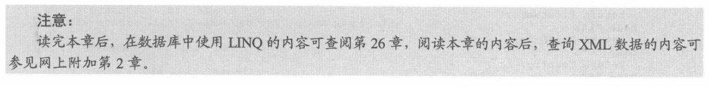
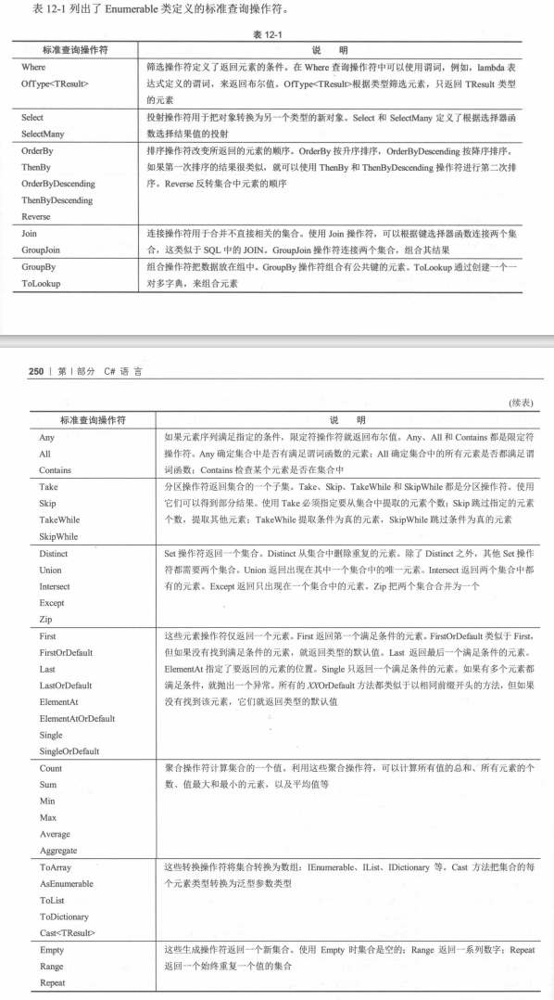
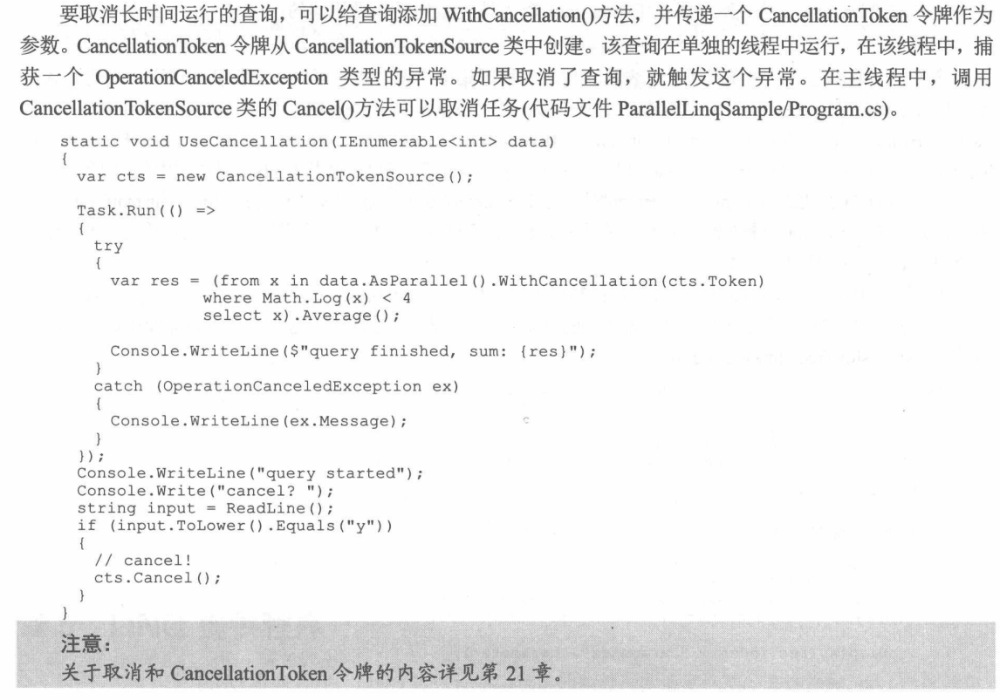

#  《C#高级编程》学习笔记（10）

## 第11章 特殊的集合

 本章要点：

- 使用位数组和位矢量
- 使用可观察的集合
- 使用不可变的集合
- 使用并发的集合

### 11.1 概述

本章将继续介绍特殊的集合，例如：处理位的集合、改变时可以观察的集合、不能改变的集合，以及可以在多个线程中同时访问的集合

### 11.2 处理位

C# 为位处理提供了二进制字面量和数字分隔符，处理二进制数据时，还可以用 BitArray 类和 BitVector32 结构。


### 11.3 可观察的集合

如果需要知道集合中的元素何时删除或添加的信息，就可以使用`ObservableCollection<T>`类。


### 11.4 不变的集合

不变的对象和集合很容易在多个线程中使用，它与只读集合不一样的是，只读集合仍然有可能被强制改变，但是不可变的集合就是真正不可变的。

> ChatGPT：
>
> 在 C# 中，不可变集合是指一旦创建就不能被修改的集合。它们是线程安全的，并且可以提供更高的性能和更好的内存管理。C# 中的不可变集合有以下几种类型：`ImmutableArray<T>`、`ImmutableList<T>`、`ImmutableDictionary<TKey, TValue>` 和 `ImmutableHashSet<T>`。
>
> 1. `ImmutableArray<T>`：不可变数组，使用类似于普通数组的语法，但不能进行修改。示例代码如下：
>
> ```csharp
> ImmutableArray<int> immutableArray = ImmutableArray.Create(1, 2, 3);
> // 添加元素
> immutableArray = immutableArray.Add(4);
> // 删除元素
> immutableArray = immutableArray.Remove(2);
> // 获取元素
> int element = immutableArray[0];
> ```
>
> 2. `ImmutableList<T>`：不可变列表，类似于链表，支持添加、删除和获取元素。示例代码如下：
>
> ```csharp
> ImmutableList<int> immutableList = ImmutableList.Create(1, 2, 3);
> // 添加元素
> immutableList = immutableList.Add(4);
> // 删除元素
> immutableList = immutableList.Remove(2);
> // 获取元素
> int element = immutableList[0];
> ```
>
> 3. `ImmutableDictionary<TKey, TValue>`：不可变字典，存储键值对，支持添加、删除和获取元素。示例代码如下：
>
> ```csharp
> ImmutableDictionary<string, int> immutableDictionary = ImmutableDictionary.Create<string, int>()
>     .Add("one", 1)
>     .Add("two", 2)
>     .Add("three", 3);
> // 添加元素
> immutableDictionary = immutableDictionary.Add("four", 4);
> // 删除元素
> immutableDictionary = immutableDictionary.Remove("two");
> // 获取元素
> int value = immutableDictionary["one"];
> ```
>
> 4. `ImmutableHashSet<T>`：不可变哈希集合，存储不重复的元素，支持添加、删除和判断元素是否存在。示例代码如下：
>
> ```csharp
> ImmutableHashSet<int> immutableHashSet = ImmutableHashSet.Create(1, 2, 3);
> // 添加元素
> immutableHashSet = immutableHashSet.Add(4);
> // 删除元素
> immutableHashSet = immutableHashSet.Remove(2);
> // 判断元素是否存在
> bool contains = immutableHashSet.Contains(1);
> ```
>
> 这些不可变集合类型都位于 `System.Collections.Immutable` 命名空间中，并且可以通过 NuGet 包管理器安装 `System.Collections.Immutable` 包来使用。使用不可变集合可以避免因修改集合而引发的线程安全问题，并且可以提供更好的性能和内存管理。

与其他集合类相反，Add() 方法不会改变【不变集合】的本身，而是会返回一个新的不变集合。

### 11.5 并发集合

如果希望在多个线程中使用可以改变的集合，C# 在 System.Collections.Concurrent 命名空间中提供了几个线程安全的集合类。线程安全的集合可以防止多个线程以互相冲突的方式访问集合。

> ChatGPT：
>
> 在 C# 中，有几种并发集合可用于在多线程环境中安全地访问和修改数据。这些并发集合提供了线程安全的操作，以确保在多个线程同时访问集合时不会发生冲突。下面是一些常见的并发集合及其使用示例：
>
> 1. ConcurrentBag\<T\>：
>    ConcurrentBag\<T\> 是一个无序的线程安全集合，可用于存储任意类型的元素。它支持并发的添加和获取元素操作。
>
>    ```csharp
>    ConcurrentBag<int> bag = new ConcurrentBag<int>();
>    bag.Add(1);
>    bag.Add(2);
>    bag.Add(3);
>
>    foreach (int item in bag)
>    {
>        Console.WriteLine(item);
>    }
>    ```
>
> 2. ConcurrentQueue\<T\>：
>    ConcurrentQueue\<T\> 是一个线程安全的先进先出队列，可用于在多线程环境中进行安全的入队和出队操作。
>
>    ```csharp
>    ConcurrentQueue<string> queue = new ConcurrentQueue<string>();
>    queue.Enqueue("apple");
>    queue.Enqueue("banana");
>    queue.Enqueue("orange");
>
>    string item;
>    while (queue.TryDequeue(out item))
>    {
>        Console.WriteLine(item);
>    }
>    ```
>
> 3. ConcurrentStack\<T\>：
>    ConcurrentStack\<T\> 是一个线程安全的后进先出堆栈，可用于在多线程环境中进行安全的入栈和出栈操作。
>
>    ```csharp
>    ConcurrentStack<int> stack = new ConcurrentStack<int>();
>    stack.Push(1);
>    stack.Push(2);
>    stack.Push(3);
>
>    int item;
>    while (stack.TryPop(out item))
>    {
>        Console.WriteLine(item);
>    }
>    ```
>
> 4. ConcurrentDictionary\<TKey, TValue\>：
>    ConcurrentDictionary\<TKey, TValue\> 是一个线程安全的字典，可用于在多线程环境中进行安全的添加、删除和获取操作。
>
>    ```csharp
>    ConcurrentDictionary<string, int> dictionary = new ConcurrentDictionary<string, int>();
>    dictionary.TryAdd("one", 1);
>    dictionary.TryAdd("two", 2);
>    dictionary.TryAdd("three", 3);
>
>    int value;
>    if (dictionary.TryGetValue("two", out value))
>    {
>        Console.WriteLine(value);
>    }
>    ```
>
> 这些并发集合提供了一种方便且安全的方式来处理多线程环境中的数据访问和修改。无论是在并行编程还是在异步编程中，它们都非常有用。请根据您的实际需求选择适合的并发集合。

## 第 12 章 LINQ

### 12.1 LINQ 概述

LINQ（Language Integrated Query，语言集成查询）在 C# 中集成了查询语法，提供了不同数据源的抽象层，因此可以用相同的语法查询不同的数据源。



以 List\<T\> 类为例，以前在 List 类中想要根据某些条件进行搜索和排序，需要用到 FindAll() 和 Sort() 方法，而使用 LINQ 所抽象出来的统一的语法则无需使用这些特定的方法。

> ChatGPT：
>
> LINQ（Language Integrated Query）是C#中的一种查询语法，它提供了一种统一的方式来查询和操作各种数据源，包括集合、数据库、XML等。
>
> LINQ语法使用类似于SQL的查询表达式，可以方便地对数据进行筛选、排序、分组和投影等操作。它使用一组标准的查询操作符（如`where`、`select`、`orderBy`等）来构建查询表达式，这些操作符可以与数据源进行交互，并返回查询结果。
>
> 以下是一个简单的示例，演示如何使用LINQ查询一个整数集合中的偶数：
>
> ```csharp
> using System;
> using System.Linq;
> 
> class Program
> {
>     static void Main()
>     {
>         int[] numbers = { 1, 2, 3, 4, 5, 6, 7, 8, 9, 10 };
> 
>         var evenNumbers = from num in numbers
>                           where num % 2 == 0
>                           select num;
> 
>         foreach (var num in evenNumbers)
>         {
>             Console.WriteLine(num);
>         }
>     }
> }
> ```
>
> 在上面的示例中，我们首先定义了一个整数数组`numbers`，然后使用LINQ查询语法从该数组中筛选出偶数。查询表达式的结构如下：
>
> ```csharp
> var result = from item in collection
>              where condition
>              select item;
> ```
>
> 其中，`item`表示集合中的每个元素，`collection`表示要查询的数据源，`condition`表示筛选条件，`select item`表示选择需要返回的元素。
>
> 在上面的示例中，`from num in numbers`表示从`numbers`数组中逐个取出元素赋值给`num`，`where num % 2 == 0`表示筛选出偶数，`select num`表示选择满足条件的元素。
>
> 最后，我们通过`foreach`循环遍历查询结果，并输出每个偶数。
>
> 这只是一个简单的示例，LINQ还提供了更多的查询操作符和功能，可以用于更复杂的查询和操作。

### 12.2 标准的查询操作符



### 12.3 并行 LINQ

System.Linq 名称空间中的 ParallelEnumerable 类可以分解查询工作，使其分布在多个线程上。

> 在C#中，可以使用并行LINQ（PLINQ）来并行执行LINQ查询，以提高查询性能。PLINQ利用多线程和并行处理的能力，自动将查询操作并行化，从而加快查询速度。
>
> 下面是一个详细的示例，演示如何使用PLINQ查询一个整数集合中的偶数，并计算它们的平均值：
>
> ```csharp
> using System;
> using System.Linq;
> 
> class Program
> {
>     static void Main()
>     {
>         int[] numbers = Enumerable.Range(1, 1000000).ToArray();
> 
>         var evenNumbers = numbers.AsParallel()
>                                  .Where(num => num % 2 == 0);
> 
>         double average = evenNumbers.Average();
> 
>         Console.WriteLine($"Average: {average}");
>     }
> }
> ```
>
> 在上面的示例中，我们首先使用`Enumerable.Range`方法生成一个包含100万个整数的数组`numbers`。然后，我们使用PLINQ的`AsParallel`方法将查询并行化。
>
> 接下来，我们使用`Where`操作符筛选出偶数。在这里，我们使用Lambda表达式`num => num % 2 == 0`作为筛选条件，表示只选择满足条件的偶数。
>
> 最后，我们使用`Average`操作符计算偶数的平均值，并将结果输出。
>
> 在这个示例中，PLINQ会自动将查询操作并行化，利用多线程同时处理数组中的不同元素，从而提高查询速度。请注意，PLINQ适用于大型数据集和耗时的查询操作，对于小型数据集和简单的查询操作，PLINQ的开销可能会超过性能提升。
>
> 除了`Where`和`Average`操作符，PLINQ还支持其他LINQ操作符，如`Select`、`OrderBy`、`GroupBy`等，你可以根据具体需求选择合适的操作符进行并行查询。
>
> 需要注意的是，并行查询可能会引入线程安全问题，特别是在多线程环境下修改共享状态时。因此，在使用PLINQ时，需要谨慎处理并发访问问题，确保数据的一致性和正确性。



### 12.4 表达式树

表达式树允许在运行期间构建对数据源的查询。

> ChatGPT：
>
> 在LINQ中，表达式树是一种数据结构，用于表示代码中的表达式。它将代码中的表达式以树形结构的方式表示出来，可以在运行时分析和操作这些表达式。
>
> 表达式树由一系列节点组成，每个节点表示一个操作或值。节点之间通过连接关系构成了树状结构，其中根节点表示整个表达式，而叶子节点表示具体的操作或值。
>
> 表达式树的主要用途是在LINQ to SQL、LINQ to Entities等提供程序中，将查询表达式转换为对数据库的查询操作。通过分析表达式树，这些提供程序可以将查询翻译成适当的SQL语句或其他查询语言。
>
> 表达式树还可以用于动态创建和执行代码，例如在运行时动态生成Lambda表达式或动态调用方法。
>
> 总而言之，表达式树是LINQ中用于表示代码中表达式的数据结构，它提供了对表达式的分析和操作能力。

### 12.5 LINQ 提供程序

LINQ 提供程序为特定的数据源实现了标准的查询操作符。

> LINQ提供程序是一种用于将LINQ查询转换为特定数据源（如数据库、XML文档、对象集合等）的组件或库。它们充当LINQ查询的执行引擎，负责将LINQ查询转换为适当的查询语言（如SQL）或操作（如遍历对象集合）。
>
> 每个数据源都有对应的LINQ提供程序，例如：
>
> 1. LINQ to SQL：用于将LINQ查询转换为SQL语句，以操作关系型数据库。示例代码如下：
>
>    ```csharp
>    using (var context = new DataContext(connectionString))
>    {
>        var query = from c in context.Customers
>                    where c.City == "London"
>                    select c;
>
>        foreach (var customer in query)
>        {
>            Console.WriteLine(customer.Name);
>        }
>    }
>    ```
>
> 2. LINQ to Entities：用于将LINQ查询转换为Entity Framework的查询语言，以操作对象关系映射（ORM）框架。示例代码如下：
>
>    ```csharp
>    using (var context = new DbContext())
>    {
>        var query = from p in context.Products
>                    where p.Category == "Electronics"
>                    select p;
>
>        foreach (var product in query)
>        {
>            Console.WriteLine(product.Name);
>        }
>    }
>    ```
>
> 3. LINQ to XML：用于将LINQ查询转换为XML文档的查询操作。示例代码如下：
>
>    ```csharp
>    XDocument doc = XDocument.Load("data.xml");
>
>    var query = from e in doc.Descendants("Employee")
>                where (int)e.Element("Age") > 30
>                select e;
>
>    foreach (var employee in query)
>    {
>        Console.WriteLine(employee.Element("Name").Value);
>    }
>    ```
>
> 这些示例展示了不同的LINQ提供程序的使用方式，它们根据不同的数据源将LINQ查询转换为适当的查询语言或操作，从而实现数据的查询和操作。

