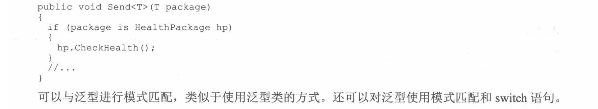

#  《C#高级编程》学习笔记（11）

## 第13章 C#函数式编程

C# 从来都不是纯面向对象的编程语言，从一开始 C# 就是面向组件的编程语言，即除了提供了面向对象的继承和多态特性以外，还提供了更多基于其他类型编程范式的功能，比如说函数式编程。

函数式编程的最重要概念基于两种方法：避免状态突变，以及将函数作为一等公民。

#### 13.1.1 避免状态突变

在典型的函数式语言 F# 中，对象可以在构造函数中初始化，但以后不能修改，如果需要可变性，该类型就需要显式地声明为可变的，这点与 C# 不同。

使用不可变类型的优点是保证没有人可以更改实例。


#### 13.1.2 函数作为一等公民

这意味着函数可以用作函数的参数，函数可以从函数中返回，函数可以赋予变量。

在 C# 中，委托可以保留函数的地址，也可以用作方法的参数，也可以从方法中返回委托。但需要注意，委托会创建一个委托类的实例，因此有一些相关的性能开销。

### 13.2 表达式体的成员

在类的构造函数中，可以仅通过一条表达式代码即完成一些成员的定义。


实际使用：


### 13.3 扩展方法

将委托作为参数传入方法中，有助于扩展方法。

使用 using 语句将委托使用到的参数包裹起来，有助于在使用之后释放该参数的内存。

> ChatGPT：
>
> 在C#中，`using`语句是一种用于管理资源的语法结构。它用于确保在使用完资源后，及时释放资源，以避免资源泄漏。
>
> `using`语句的一般语法如下：
>
> ```csharp
> using (resource)
> {
>     // 使用资源的代码
> }
> ```
>
> `resource`是需要在代码块结束时自动释放的资源对象，它必须实现`IDisposable`接口。`IDisposable`接口定义了一个`Dispose`方法，用于释放资源。
>
> 当进入`using`代码块时，会自动创建`resource`对象，并在代码块结束时调用`resource`对象的`Dispose`方法进行资源释放。即使在代码块中发生异常，也会确保资源得到释放。
>
> 下面是一个使用`using`语句的示例，用于操作文件流：
>
> ```csharp
> using (FileStream fs = new FileStream("data.txt", FileMode.Open))
> {
>     // 使用文件流进行读写操作
> }
> ```
>
> 在上述示例中，`FileStream`是一个实现了`IDisposable`接口的类，通过使用`using`语句，可以确保在使用完文件流后，自动释放文件流所占用的资源。
>
> 需要注意的是，`using`语句只能用于管理实现了`IDisposable`接口的资源对象。对于不需要显式释放的资源，如内存中的对象，不需要使用`using`语句。
>
> 总结起来，`using`语句是C#中用于管理资源的语法结构，通过自动调用`Dispose`方法，确保资源在使用完后得到及时释放，避免资源泄漏。

### 13.4 using static 声明

使用 using static 声明可以去除类名前缀。如：

```csharp
using static System.Console;

// 下面的代码
Console.WriteLine("Hello World!");

// 可以改为
WriteLine("Hello World!");
```

需要确保在打开类的其他静态成员时不要陷入冲突，或者在使用静态方法时不要使用了其基类的方法。

### 13.5 本地函数

本地函数是 C# 7 的一个新特性：使得方法可以在方法中声明。本地函数只能在当前作用域内调用。

本地函数允许使用的唯一修饰符是 async 和 unsafe。

使用本地函数的一个原因是，只需要在方法（或属性、构造函数等）的作用域内部使用功能，与 lambda 表达式相比，本地函数的语法更简单，执行得也更出色，委托需要一个委托类的实例和一个引用的集合，而本地函数只需要对函数的引用。

> ChatGPT：
>
> Q：C# 中的本地函数和lambda表达式，还有委托的区别是什么？
>
> A：本地函数是在方法内部定义的函数，lambda表达式是一种匿名函数，委托是一种封装方法引用的类型。它们在语法和使用方式上有所不同，但都可以用于函数式编程和实现回调等场景。


> ChatGPT：
>
> Q：详细介绍 C# 中的本地函数及其用法和特点，每个特点和用法都要有单独的示例。
>
> A：在C#中，本地函数是在一个方法内部定义的函数。它们具有以下特点和用法：
>
> 1. 本地函数可以访问它们所在方法的局部变量和参数。
>    示例：
>
> ```csharp
> void OuterMethod()
> {
>     int x = 5;
> 
>     void LocalFunction()
>     {
>         Console.WriteLine(x);
>     }
> 
>     LocalFunction(); // 输出：5
> }
> ```
>
> 在上面的示例中，`LocalFunction`是在`OuterMethod`方法内部定义的本地函数。它可以访问`OuterMethod`方法中的局部变量`x`。
>
> 2. 本地函数可以在外部方法中重复使用。
>    示例：
>
> ```csharp
> void OuterMethod()
> {
>     void LocalFunction()
>     {
>         Console.WriteLine("Local Function");
>     }
> 
>     LocalFunction(); // 输出：Local Function
> }
> 
> void AnotherMethod()
> {
>     LocalFunction(); // 编译错误：未定义名为“LocalFunction”的方法
> }
> ```
>
> 在上面的示例中，`LocalFunction`是在`OuterMethod`方法内部定义的本地函数。它只能在`OuterMethod`方法内部使用，无法在其他方法中使用。
>
> 3. 本地函数可以作为委托或事件的处理程序。
>    示例：
>
> ```csharp
> void ButtonClick()
> {
>     int count = 0;
> 
>     Button button = new Button();
>     button.Click += ButtonClickHandler;
> 
>     void ButtonClickHandler(object sender, EventArgs e)
>     {
>         count++;
>         Console.WriteLine($"Button clicked {count} times");
>     }
> }
> ```
>
> 在上面的示例中，`ButtonClickHandler`是在`ButtonClick`方法内部定义的本地函数。它作为`button.Click`事件的处理程序，每次按钮点击时会增加`count`变量的值并打印出来。
>
> 4. 本地函数可以具有递归调用。
>    示例：
>
> ```csharp
> int Factorial(int n)
> {
>     if (n <= 1)
>         return 1;
>     else
>         return n * Factorial(n - 1);
> }
> ```
>
> 在上面的示例中，`Factorial`是一个递归的本地函数。它在计算阶乘时调用自身。
>
> 5. 本地函数可以具有不同的访问修饰符。
>    示例：
>
> ```csharp
> void OuterMethod()
> {
>     void LocalFunction()
>     {
>         Console.WriteLine("Local Function");
>     }
> 
>     LocalFunction(); // 输出：Local Function
> }
> 
> class MyClass
> {
>     private void InnerMethod()
>     {
>         void LocalFunction()
>         {
>             Console.WriteLine("Local Function");
>         }
> 
>         LocalFunction(); // 输出：Local Function
>     }
> }
> ```
>
> 在上面的示例中，`LocalFunction`可以具有与所在方法或类相同或不同的访问修饰符。在`OuterMethod`中，`LocalFunction`具有与`OuterMethod`相同的访问修饰符（默认为`private`）。在`MyClass`中，`LocalFunction`具有与`InnerMethod`相同的访问修饰符（显式指定为`private`）。
>
> 这些是C#中本地函数的特点和用法。本地函数提供了一种在方法内部定义和使用函数的方式，使代码更加模块化和可读性更高。

#### 13.5.1 本地函数与 yield 语句


> ChatGPT：
>
> 在C#中，可以使用`yield`语句和本地函数来更早地向调用者提供错误信息。当在迭代器函数中发生错误时，可以使用`yield break`语句提前终止迭代，并返回错误信息给调用者。
>
> 下面是一个示例，演示了如何在迭代器函数中使用本地函数和`yield break`语句来提供错误信息：
>
> ```csharp
> public IEnumerable<int> GenerateNumbers()
> {
>     bool hasError = false;
> 
>     // 本地函数：用于报告错误信息
>     void ReportError(string errorMessage)
>     {
>         hasError = true;
>         Console.WriteLine(errorMessage);
>     }
> 
>     // 迭代器函数
>     IEnumerable<int> Generate()
>     {
>         for (int i = 0; i < 10; i++)
>         {
>             if (i == 5)
>             {
>                 ReportError("An error occurred at index 5");
>                 yield break; // 提前终止迭代
>             }
> 
>             yield return i;
>         }
>     }
> 
>     // 调用迭代器函数
>     foreach (int number in Generate())
>     {
>         if (hasError)
>         {
>             // 处理错误情况
>             break;
>         }
> 
>         // 处理正常情况
>         Console.WriteLine(number);
>     }
> }
> ```
>
> 在上面的示例中，`GenerateNumbers`方法内部定义了一个本地函数`ReportError`，用于报告错误信息。在迭代器函数`Generate`中，当`i`等于5时，调用`ReportError`函数报告错误，并使用`yield break`语句提前终止迭代。在`GenerateNumbers`方法中，通过调用`Generate`函数来遍历生成的整数，并在出现错误时进行处理。
>
> 使用本地函数和`yield break`语句可以在迭代器函数中提供更早的错误信息。当发生错误时，可以立即中断迭代，并将错误信息传递给调用者，以便进行相应的处理。

#### 13.5.2 递归本地函数

本地函数可以具有递归调用。


### 13.6 元组

使用数组可以组合相同类型的对象，但元组允许使用类型的不同组合。

元组以泛型 Tuple 类的形式存在。

> ChatGPT：
>
> Q：介绍 C# 中的元组类，详细说明它的使用方法跟特点，并为每一个使用方法和每一种特点都配上有注释的，详细的使用示例
>
> A：在C#中，元组（Tuple）类是一种用于组合多个值的数据结构。它可以存储不同类型的值，并且可以通过索引或命名访问其中的元素。元组类提供了一种方便的方式来处理多个相关的值，而无需创建新的自定义类型。
>
> 以下是元组类的使用方法和特点的详细说明，每个示例都有注释：
>
> ```csharp
> using System;
> 
> class Program
> {
>     static void Main()
>     {
>         // 创建元组
>         var tuple = Tuple.Create(1, "Hello", 3.14);
>         Console.WriteLine(tuple.Item1); // 访问第一个元素
>         Console.WriteLine(tuple.Item2); // 访问第二个元素
>         Console.WriteLine(tuple.Item3); // 访问第三个元素
> 
>         // 解构元组
>         var (first, second, third) = tuple;
>         Console.WriteLine(first);  // 解构后的第一个元素
>         Console.WriteLine(second); // 解构后的第二个元素
>         Console.WriteLine(third);  // 解构后的第三个元素
> 
>         // 具名元组
>         var namedTuple = (Id: 1, Name: "John", Age: 25);
>         Console.WriteLine(namedTuple.Id);   // 访问 Id 属性
>         Console.WriteLine(namedTuple.Name); // 访问 Name 属性
>         Console.WriteLine(namedTuple.Age);  // 访问 Age 属性
> 
>         // 具名元组的解构
>         var (id, name, age) = namedTuple;
>         Console.WriteLine(id);   // 解构后的 Id 属性
>         Console.WriteLine(name); // 解构后的 Name 属性
>         Console.WriteLine(age);  // 解构后的 Age 属性
>     }
> }
> ```
>
> 在上面的示例中，我们首先使用`Tuple.Create`方法创建了一个元组，其中包含一个整数、一个字符串和一个浮点数。然后，我们使用`Item1`、`Item2`和`Item3`属性访问元组的各个元素。
>
> 接下来，我们使用解构语法将元组的元素分别赋值给变量`first`、`second`和`third`，并打印出它们的值。
>
> 然后，我们创建了一个具名元组，其中包含`Id`、`Name`和`Age`属性。我们可以通过属性名访问具名元组的元素。
>
> 最后，我们使用解构语法将具名元组的属性值分别赋值给变量`id`、`name`和`age`，并打印出它们的值。
>
> 元组类提供了一种方便的方式来组合和访问多个值，尤其适用于临时存储和传递相关的数据。它可以简化代码，并提高可读性。

#### 13.6.1 ValueTuple

旧的元组类型 Tuple 是一个类，在 C#2 中就已经存在，而 C#7 中引入的 ValueTuple 是一个结构，能够有效减少 GC，性能更好。

旧的 Tuple 类型的实现是一个具有只读属性的不可变类，而在 ValueTuple 中，成员是公共字段，使得这种类型可变。

> ChatGPT：
>
> 在C#中，ValueTuple是一个用于创建和操作元组的结构。它是一个轻量级的数据结构，用于存储一组不同类型的值。与Tuple类不同，ValueTuple是一个值类型，而不是引用类型。
>
> ValueTuple的使用方法和特点如下所示：
>
> 1. 创建ValueTuple：
>    - 使用ValueTuple.Create方法创建ValueTuple。
>    - 使用带有元素的构造函数创建ValueTuple。
>
>    示例：
>    ```csharp
>    var person = ValueTuple.Create("John", 25);
>    var person2 = (Name: "John", Age: 25);
>    ```
>
> 2. 访问ValueTuple的元素：
>    - 使用.ItemX属性（如.Item1，.Item2）来访问ValueTuple的元素。
>    - 使用命名元组的成员名称来访问元素。
>
>    示例：
>    ```csharp
>    var name = person.Item1;
>    var age = person.Item2;
>
>    var name2 = person2.Name;
>    var age2 = person2.Age;
>    ```
>
> 3. 解构ValueTuple：
>    - 使用解构语法将ValueTuple的元素分配给变量。
>
>    示例：
>    ```csharp
>    var (name, age) = person;
>    ```
>
> 4. 比较ValueTuple：
>    - ValueTuple实现了相等性比较操作符（==和!=），可以用来比较两个ValueTuple的相等性。
>
>    示例：
>    ```csharp
>    var person1 = (Name: "John", Age: 25);
>    var person2 = (Name: "John", Age: 25);
>    var person3 = (Name: "Jane", Age: 30);
>
>    bool isEqual = person1 == person2; // true
>    bool isNotEqual = person1 != person3; // true
>    ```
>
> 5. 转换ValueTuple和Tuple：
>    - ValueTuple可以通过显式转换转换为Tuple。
>    - Tuple可以通过隐式转换转换为ValueTuple。
>
>    示例：
>    ```csharp
>    var tuple = (ValueTuple<string, int>)person;
>    var valueTuple = person2.ToValueTuple();
>    ```
>
> ValueTuple与Tuple之间的区别如下：
> - ValueTuple是值类型，而Tuple是引用类型。
> - ValueTuple可以具有命名元素，而Tuple只能使用.ItemX属性访问元素。
> - ValueTuple是使用结构体实现的，而Tuple是使用类实现的。
> - ValueTuple的创建和解构更加简洁，不需要使用.ItemX属性。
>


### 13.7 模式匹配

从 C# 7 的模式匹配中，is 运算符和 switch 语句得到了三种模式的增强：const 模式、type 模式和 var 模式。

> ChatGPT：
>
> 在C#中，模式匹配是一种强大的语言特性，它允许我们根据不同的模式来匹配和处理数据。C#中的模式匹配主要通过const、type和var三种匹配模式来实现。下面我会逐个介绍它们的特点、作用以及与is操作符和switch操作符的结合用法，并提供详细的示例和注释。
>
> 1. const模式匹配：
>    - 特点：const模式匹配用于匹配常量值。
>    - 作用：可以在模式匹配中使用常量值作为匹配条件，以便执行相应的逻辑。
>    - 与is操作符的结合用法：可以使用const模式匹配结合is操作符来检查一个对象是否与指定的常量值匹配。
>    - 示例代码：
>
> ```csharp
> object obj = "Hello";
> 
> if (obj is "Hello") // 使用const模式匹配和is操作符检查obj是否等于"Hello"
> {
>     Console.WriteLine("obj匹配了常量值\"Hello\"");
> }
> else
> {
>     Console.WriteLine("obj不匹配常量值\"Hello\"");
> }
> ```
>
> 2. type模式匹配：
>    - 特点：type模式匹配用于匹配类型。
>    - 作用：可以在模式匹配中使用类型作为匹配条件，以便执行相应的逻辑。
>    - 与is操作符的结合用法：可以使用type模式匹配结合is操作符来检查一个对象的类型是否与指定的类型匹配。
>    - 示例代码：
>
> ```csharp
> object obj = "Hello";
> 
> if (obj is string str) // 使用type模式匹配和is操作符检查obj是否为string类型，并将其转换为str变量
> {
>     Console.WriteLine($"obj是string类型，值为：{str}");
> }
> else
> {
>     Console.WriteLine("obj不是string类型");
> }
> ```
>
> 3. var模式匹配：
>    - 特点：var模式匹配用于匹配任意类型。
>    - 作用：可以在模式匹配中使用var关键字作为匹配条件，以便执行相应的逻辑，并将匹配的值赋给一个变量。
>    - 与switch操作符的结合用法：可以使用var模式匹配结合switch操作符来根据不同的匹配结果执行相应的逻辑。
>    - 示例代码：
>
> ```csharp
> object obj = "Hello";
> 
> switch (obj)
> {
>     case var x when x is string: // 使用var模式匹配和is操作符检查obj是否为string类型，并将其赋给x变量
>         Console.WriteLine($"obj是string类型，值为：{x}");
>         break;
>     case var y when y is int: // 使用var模式匹配和is操作符检查obj是否为int类型，并将其赋给y变量
>         Console.WriteLine($"obj是int类型，值为：{y}");
>         break;
>     default:
>         Console.WriteLine("obj的类型不是string也不是int");
>         break;
> }
> ```
>
> 总结：
> 模式匹配是C#中强大的特性，通过const、type和var三种匹配模式，我们可以根据常量值、类型和任意类型来匹配和处理数据。通过与is操作符和switch操作符的结合使用，我们可以更灵活地进行条件判断和逻辑处理。以上示例代码展示了每种模式匹配的用法和结合操作符的示例，希望对你有所帮助！
>
> 
>
> Q：在 C# 中，is 操作符和 switch 操作符调用的是类当中的哪个方法？可以自定义该操作符的表现吗？如果可以，具体要如何做，举例表示。
>
> A：在C#中，is操作符调用的是对象的GetType方法，用于检查一个对象是否与指定的类型兼容。switch操作符调用的是对象的Equals方法，用于比较对象的相等性。
>
> 目前，C#中的is操作符和switch操作符的行为是固定的，无法直接自定义它们的表现。它们的行为是由语言规范定义的，并且与特定的运行时行为紧密相关。
>
> 不过，你可以通过自定义类的Equals方法和==运算符来改变对象的相等性比较行为。例如，你可以在自定义的类中重写Equals方法，定义自己的相等性规则：
>
> ```csharp
> public class MyClass
> {
>     public int Value { get; set; }
> 
>     public override bool Equals(object obj)
>     {
>         if (obj is MyClass other)
>         {
>             // 自定义相等性规则
>             return this.Value == other.Value;
>         }
> 
>         return false;
>     }
> 
>     public override int GetHashCode()
>     {
>         return Value.GetHashCode();
>     }
> }
> ```
>
> 然后，你可以在使用switch操作符或进行相等性比较时，使用自定义的相等性规则：
>
> ```csharp
> MyClass obj1 = new MyClass { Value = 10 };
> MyClass obj2 = new MyClass { Value = 10 };
> 
> if (obj1.Equals(obj2))
> {
>     // 执行相等性比较的逻辑
> }
> 
> switch (obj1)
> {
>     case MyClass myObj when myObj.Value == 10:
>         // 匹配自定义的相等性规则
>         break;
>     default:
>         // 其他情况的处理逻辑
>         break;
> }
> ```
>
> 在这个例子中，我们重写了MyClass类的Equals方法，定义了自己的相等性规则。然后，在使用switch操作符或进行相等性比较时，会使用这个自定义的相等性规则进行匹配和比较。

#### 13.7.1 模式匹配与 is 运算符

在 is 运算符中，const 模式允许变量与常量进行对比。


若使用 type 模式，则可以匹配特定的类型，该模式还允许声明变量，例如`if (item is int i)`，即如果该模式适用，则将变量`i`分配给该项。

还有一种模式类型 var，一切元素都可以应用于 var。


#### 13.7.2 模式匹配与 switch 语句

对于 switch 语句，也可以使用三种模式类型。

对于 switch，可以用类型模式指定变量，还可以在 when 子句中应用一个附加的过滤器。


#### 13.7.3 模式匹配与泛型

如果需要与泛型相匹配的模式，则需要将编译器配置为至少 C# 7.1。




