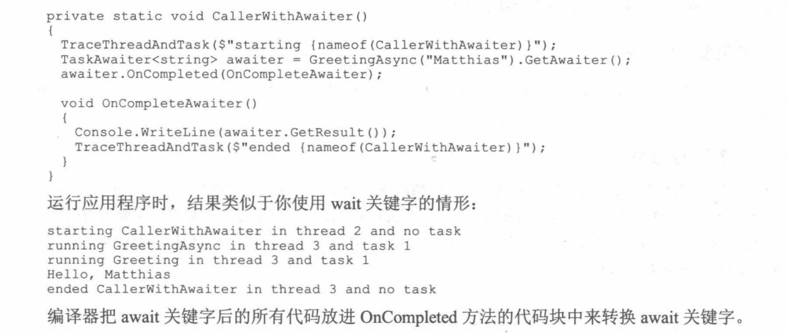
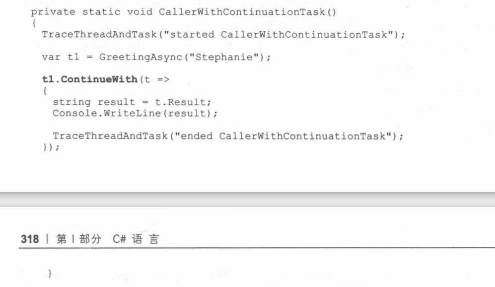
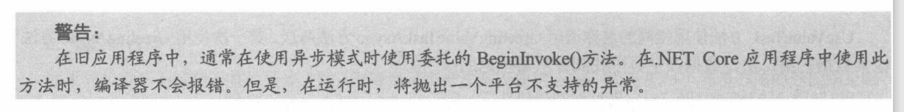
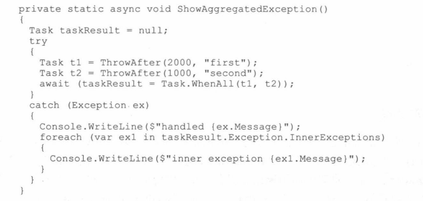

#  《C#高级编程》学习笔记（12）

## 第14章 错误和异常

### 14.1 简介

本章介绍：

- 在多种不同的场景中捕获和抛出异常的方式
- 讨论不同 namespace 中定义的异常类型及其层次结构
- 学习如何创建自定义异常类型
- 捕获异常的不同方式
- try/finally 块

### 14.2 异常类

C# 提供了许多预定义的异常类，以下是其中一些常见的类：


### 14.3 捕获异常

为了在 C# 代码中处理可能的错误情况，一般要把程序的相关部分分成 3 种不同类型的代码块：

- try 块
- catch 块
- finally 块


> 值得注意的是，传递给 catch 块的参数只能用于该 catch 块，这就是为什么在上面的代码中，所有后续 catch 块都使用相同的参数名 ex。

在 System.Exception 异常类中，除了 Message 属性以外，还有许多其他属性。


从 C#6 之后，catch 块支持了异常过滤器，用于过滤筛选一些具有特定属性的异常。比如：


#### 14.3.6 重新抛出异常

捕获异常后重新再抛出异常也是非常普遍的，再次抛出异常时，可以改变异常的类型，或者给调用程序提供异常相关的更多信息。

重新抛出异常的问题是，调用程序往往需要通过以前的异常找出其发生的原因和地点，堆栈跟踪信息可能会丢失。


### 14.4 用户定义的异常类

> ChatGPT：
>
> 在C#中，可以通过继承`Exception`类来创建自定义异常类，并定义该异常类的行为。下面是一个具体的例子：
>
> ```csharp
> using System;
> 
> // 自定义异常类
> public class MyCustomException : Exception
> {
>     // 自定义异常类的构造函数
>     public MyCustomException(string message) : base(message)
>     {
>         // 在构造函数中可以执行一些自定义的逻辑
>         // 例如记录日志、发送通知等
>     }
>     
>     // 可以在自定义异常类中定义其他的属性和方法
>     // 根据需要来扩展异常类的行为
> }
> 
> public class Program
> {
>     public static void Main()
>     {
>         try
>         {
>             // 抛出自定义异常
>             throw new MyCustomException("发生了自定义异常");
>         }
>         catch (MyCustomException ex)
>         {
>             // 捕获并处理自定义异常
>             Console.WriteLine("捕获到自定义异常：" + ex.Message);
>         }
>         catch (Exception ex)
>         {
>             // 捕获其他异常
>             Console.WriteLine("捕获到异常：" + ex.Message);
>         }
>     }
> }
> ```
>
> 在上面的例子中，我们首先定义了一个名为`MyCustomException`的自定义异常类，该类继承自`Exception`类。在自定义异常类中，我们可以添加自己的构造函数、属性和方法，以满足特定的需求。
>
> 在`Main`方法中，我们使用`throw`关键字抛出了一个`MyCustomException`的实例，并在`catch`块中捕获并处理该异常。注意，异常的`catch`块是按照顺序匹配的，所以在捕获自定义异常之前，如果存在其他更一般的异常类型，也会被匹配并处理。
>
> 通过自定义异常类，我们可以根据具体的业务需求来定义异常的行为，例如记录日志、发送通知等。这样可以提高代码的可读性和可维护性，同时也能更好地处理异常情况。

### 14.5 调用者信息

为了在报错中从堆栈中获得行号、文件名和成员名，我们可以在编写代码时使用 C# 编译器支持的特性和可选参数。


## 第 15 章 异步编程

C# 5.0 增加了两个关键字 async 和 await 来简化异步编程，在线程或任务（Task）的帮助下，使用异步编程会在后台运行并且不会阻塞调用线程。

C# 中有 3 种不同模式的异步编程：

- 异步模式
- 基于事件的异步模式
- 基于任务的异步模式（Task-based Asynchronous Pattern，TAP），利用 async 和 await 关键字来实现。

> ChatGPT：
>
> 在 C# 中，异步编程是一种处理并发任务的重要技术，它允许你在执行耗时操作时不会阻塞主线程，从而提高程序的响应性能。以下是 C# 中异步编程的几种模式，以及每种模式的示例代码和详细注释。
>
> ### 1. 使用 `async/await` 关键字
>
> `async/await` 是 C# 中最常用的异步编程模式，它基于任务(Task)的概念，通过在方法前加上 `async` 关键字，以及在方法内部使用 `await` 关键字来等待异步操作的完成。
>
> ```csharp
> using System;
> using System.Net.Http;
> using System.Threading.Tasks;
> 
> class Program
> {
>     static async Task Main(string[] args)
>     {
>         await DoAsyncWork();
>         Console.WriteLine("Async work completed.");
>     }
> 
>     static async Task DoAsyncWork()
>     {
>         using (HttpClient client = new HttpClient())
>         {
>             string result = await client.GetStringAsync("https://www.example.com");
>             Console.WriteLine(result.Length);
>         }
>     }
> }
> ```
>
> ### 2. 使用 `Task.Run` 启动任务
>
> `Task.Run` 方法允许你将同步操作包装成异步任务，通过在另一个线程上执行。
>
> ```csharp
> using System;
> using System.Threading.Tasks;
> 
> class Program
> {
>     static async Task Main(string[] args)
>     {
>         await DoAsyncWork();
>         Console.WriteLine("Async work completed.");
>     }
> 
>     static async Task DoAsyncWork()
>     {
>         await Task.Run(() =>
>         {
>             // 在另一个线程上执行的耗时操作
>             for (int i = 0; i < 5; i++)
>             {
>                 Console.WriteLine($"Step {i}");
>                 Task.Delay(1000).Wait(); // 模拟耗时操作
>             }
>         });
>     }
> }
> ```
>
> ### 3. 使用事件和委托
>
> 在某些情况下，你可能需要异步操作来响应事件，可以使用事件和委托来实现异步编程。
>
> ```csharp
> using System;
> using System.Threading;
> 
> class Program
> {
>     // 声明委托
>     delegate void AsyncEventHandler(string message);
> 
>     // 声明事件
>     static event AsyncEventHandler AsyncEvent;
> 
>     static void Main(string[] args)
>     {
>         // 订阅事件
>         AsyncEvent += DisplayMessage;
> 
>         // 异步触发事件
>         ThreadPool.QueueUserWorkItem(state =>
>         {
>             AsyncEvent?.Invoke("Async event executed.");
>         });
> 
>         Console.WriteLine("Main thread continues.");
>         Thread.Sleep(2000); // 等待异步事件完成
>     }
> 
>     static void DisplayMessage(string message)
>     {
>         Console.WriteLine(message);
>     }
> }
> ```
>
> 这些是 C# 中异步编程的几种常见模式，每种模式都适用于不同的情况和需求。无论选择哪种模式，都需要注意异常处理、取消操作、资源管理等问题，以确保异步操作能够安全和有效地运行。


### 15.3 异步编程的基础

async 和 await 关键字只是编译器功能，实际上编译器会用 Task 类创建代码。这意味着如果不使用这两个关键字，也可以用 C# 4.0 和 Task 类的方法来实现同样的功能，只是没有那么方便。

> ChatGPT：
>
> 在 C# 中，可以使用 `Task` 类的方法结合委托或 lambda 表达式来进行异步编程，而不使用 `async` 和 `await` 关键字。以下是一个使用 `Task` 类实现异步编程的示例，包含详细的注释。
>
> ```csharp
> using System;
> using System.Threading.Tasks;
> 
> class Program
> {
>  static void Main(string[] args)
>  {
>      Console.WriteLine("Main thread started.");
> 
>      // 创建一个 Task 对象并启动异步操作
>      Task<int> task = Task.Run(() =>
>      {
>          Console.WriteLine("Async operation started.");
>          Task.Delay(2000).Wait(); // 模拟耗时操作
>          Console.WriteLine("Async operation completed.");
>          return 42; // 返回异步操作的结果
>      });
> 
>      // 注册任务完成时的回调
>      task.ContinueWith(previousTask =>
>      {
>          Console.WriteLine($"Async operation result: {previousTask.Result}");
>      });
> 
>      // 主线程继续执行其他操作
>      Console.WriteLine("Main thread continues.");
> 
>      // 等待异步任务完成
>      task.Wait();
> 
>      Console.WriteLine("Main thread completed.");
>  }
> }
> ```
>
> 这个示例中，我们使用了 `Task.Run` 方法创建了一个异步任务，该任务在另一个线程上执行。然后，我们使用 `ContinueWith` 方法注册了一个回调，该回调会在任务完成时被调用，用于处理任务的结果。主线程继续执行其他操作，最后使用 `Wait` 方法等待异步任务完成。
>
> 请注意，虽然这种方式可以实现异步操作，但不使用 `async` 和 `await` 关键字可能会使代码更加复杂，而且需要手动处理一些线程同步和异常处理的问题。在实际开发中，推荐使用 `async` 和 `await` 关键字来更方便地编写异步代码。
>
> 
>
> **Q：详细介绍 C# 中的异步编程中的 Task.wait 方法，并举例说明该方法如何使用，会在什么情况下用到。**
>
> A：在 C# 异步编程中，`Task.Wait` 方法是用于阻塞当前线程，直到指定的任务完成为止。这个方法可以在同步的上下文中等待异步任务的完成，但需要小心使用，以避免潜在的死锁或阻塞问题。
>
> ### 使用方式：
>
> ```csharp
> public void Wait();
> public bool Wait(int millisecondsTimeout);
> public bool Wait(TimeSpan timeout);
> public void Wait(CancellationToken cancellationToken);
> ```
>
> ### 示例：
>
> 假设有一个异步方法 `DoAsyncWork`，它返回一个异步操作：
>
> ```csharp
> async Task<int> DoAsyncWork()
> {
>     await Task.Delay(2000);
>     return 42;
> }
> ```
>
> 你可以使用 `Wait` 方法在同步上下文中等待异步操作的完成：
>
> ```csharp
> Task<int> asyncTask = DoAsyncWork();
> asyncTask.Wait(); // 阻塞当前线程，直到异步操作完成
> 
> int result = asyncTask.Result; // 获取异步操作的结果
> ```
>
> ### 适用情况：
>
> `Task.Wait` 方法在以下情况下可能有用，但需要小心使用：
>
> 1. **同步等待**：当你在需要等待异步操作完成的同步上下文中，例如在主线程中等待异步操作完成，`Task.Wait` 可以实现同步等待异步操作完成。
>
> 2. **控制流程**：在某些情况下，你可能需要确保某个异步操作完成后再继续执行后续的代码，这时可以使用 `Task.Wait` 来阻塞当前线程，直到异步操作完成。
>
> 3. **测试和调试**：在测试或调试过程中，你可能需要暂停代码的执行，等待异步操作完成以便观察结果。`Task.Wait` 可以帮助你实现这一点。
>
> ### 注意事项：
>
> 虽然 `Task.Wait` 方法可以在一些情况下实现同步等待异步操作完成，但也有一些风险和注意事项：
>
> - **潜在的死锁**：在某些情况下，使用 `Task.Wait` 可能会导致死锁，特别是在 UI 线程中等待异步操作完成时。这是因为在 UI 线程上使用 `Wait` 会导致阻塞 UI 线程，而异步操作可能需要访问 UI 线程。
>
> - **线程资源浪费**：在一些情况下，使用 `Wait` 可能会浪费线程资源，因为线程会被阻塞，而不会释放给线程池。
>
> 因此，在使用 `Task.Wait` 时需要谨慎，并确保避免潜在的死锁和资源浪费问题。通常情况下，更推荐使用异步/等待模式（`await`）来处理异步操作，以避免这些潜在的问题。

#### 15.3.3 使用 Awaiter

Task 类的 GetAwaiter 返回一个 TaskAwaiter，可以使用 OnCompleted 方法，分配一个在任务完成时调用的本地函数。



#### 15.3.4 延续任务

Task 类的 ContinueWith 方法定义了任务完成后就调用的代码。（像 JavaScript 中的 then）



#### 15.3.6 使用多个异步方法

调用 Task.WhenAll 方法，它可以等待直到多个任务的完成后再返回。

> ChatGPT：
>
> 在 C# 中，除了 `Task.WhenAll` 和 `Task.WhenAny` 之外，还有一些功能相类似的方法，用于异步编程。让我们逐个介绍这些方法，包括它们的使用方式和适用情况：
>
> 1. **Task.WhenAll**：
>
> `Task.WhenAll` 方法用于并行地等待多个异步操作完成，并返回一个表示所有任务的异步操作。适用于以下情况：
>
> - 当你有多个独立的异步任务，且需要等待它们全部完成后继续处理。
> - 当你想要提高程序的并行性和效率，以同时处理多个任务。
>
> ```csharp
> Task WhenAll(params Task[] tasks);
> Task WhenAll(IEnumerable<Task> tasks);
> ```
>
> 示例：
>
> ```csharp
> Task<int> task1 = DoAsyncWork(1);
> Task<int> task2 = DoAsyncWork(2);
> 
> await Task.WhenAll(task1, task2);
> ```
>
> 2. **Task.WhenAny**：
>
> `Task.WhenAny` 方法用于等待多个异步操作中的任意一个完成，并返回一个表示完成的任务。适用于以下情况：
>
> - 当你有多个异步任务，但只关心最先完成的任务的结果。
> - 当你想要在其中一个任务完成时立即采取行动，而不必等待其他任务。
>
> ```csharp
> Task<Task> WhenAny(params Task[] tasks);
> Task<Task> WhenAny(IEnumerable<Task> tasks);
> ```
>
> 示例：
>
> ```csharp
> Task<int> task1 = DoAsyncWork(1);
> Task<int> task2 = DoAsyncWork(2);
> 
> Task<int> completedTask = await Task.WhenAny(task1, task2);
> int result = await completedTask;
> ```
>
> 3. **Task.Delay**：
>
> `Task.Delay` 方法用于创建一个延迟异步操作，表示等待一段时间后继续执行。适用于以下情况：
>
> - 当你需要在异步操作中添加一个时间间隔，以模拟延迟、超时或轮询等操作。
>
> ```csharp
> Task Delay(int millisecondsDelay);
> Task Delay(TimeSpan delay);
> ```
>
> 示例：
>
> ```csharp
> await Task.Delay(3000); // 等待3秒钟
> ```
>
> 4. **Task.Run**：
>
> `Task.Run` 方法用于将一个同步操作包装为异步操作，使其在线程池上运行。适用于以下情况：
>
> - 当你有一个密集型的计算或同步操作，希望将其异步执行以避免阻塞主线程。
> - 当你想要在后台线程上执行某些操作，而不影响主线程。
>
> ```csharp
> Task Run(Action action);
> Task<TResult> Run<TResult>(Func<TResult> function);
> ```
>
> 示例：
>
> ```csharp
> await Task.Run(() => CalculateIntensiveOperation());
> ```
>
> 这些方法在异步编程中非常有用，它们可以帮助你控制和组合异步操作，以实现更高效的并行性和响应性。根据具体的需求，你可以选择使用 `Task.WhenAll`、`Task.WhenAny`、`Task.Delay`、`Task.Run` 等方法来达到预期的异步编程目标。

#### 15.3.7 使用 ValueTasks

> chatGPT：
>
> 在 C# 异步编程中，`ValueTask<T>` 是一个用于表示异步操作结果的结构。它类似于 `Task<T>`，但是设计用来在某些情况下减少不必要的分配和资源开销。`ValueTask<T>` 可以在某些特定情况下提供性能优势，尤其是在异步操作频繁返回已经完成的任务时。
>
> ### `ValueTask<T>` 的使用方式：
>
> ```csharp
> public struct ValueTask<TResult>
> {
>     public ValueTask(TResult result);
>     public ValueTask(Task<TResult> task);
>     public bool IsCompleted { get; }
>     public bool IsCanceled { get; }
>     public bool IsFaulted { get; }
>     public TResult Result { get; }
>     public Task<TResult> AsTask();
> }
> ```
>
> ### 适用情况：
>
> 1. **频繁的异步操作完成**：当你的异步操作通常很快就能完成，而不需要经过多次 await，使用 `ValueTask<T>` 可以避免不必要的 `Task` 分配。
>
> 2. **性能优化**：在某些情况下，`ValueTask<T>` 可以减少异步操作中的堆分配，从而提高性能，特别是在高频率的异步操作中。
>
> 3. **避免资源浪费**：当异步操作已经完成时，使用 `ValueTask<T>` 可以避免创建额外的 `Task` 对象，从而减少内存和资源的使用。
>
> ### 示例：
>
> 考虑以下示例，其中 `FetchDataAsync` 方法返回一个已完成的任务，因为数据已经提前缓存好了：
>
> ```csharp
> async ValueTask<int> FetchDataAsync()
> {
>     if (dataIsCached)
>     {
>         return cachedData;
>     }
>     else
>     {
>         // Simulate fetching data asynchronously
>         await Task.Delay(100);
>         cachedData = fetchedData;
>         dataIsCached = true;
>         return fetchedData;
>     }
> }
> ```
>
> 在这种情况下，`ValueTask<int>` 可以更有效地表示已完成的任务，而不必在每次调用时创建新的 `Task` 对象。
>
> ### 优劣势：
>
> **优势**：
>
> - **性能优化**：当异步操作经常在瞬间完成时，`ValueTask<T>` 可以避免不必要的 `Task` 分配，从而减少内存和资源的使用，提高性能。
> - **避免资源浪费**：对于已完成的异步操作，`ValueTask<T>` 可以避免创建额外的 `Task` 对象，减少资源消耗。
>
> **劣势**：
>
> - **不适用于长时间操作**：当异步操作可能花费较长时间完成时，使用 `ValueTask<T>` 可能会导致性能损失，因为它不会为异步操作的中间状态分配 `Task` 对象，而是直接封装在结构中。
> - **可能引入复杂性**：`ValueTask<T>` 需要谨慎使用，因为在某些情况下，可能会导致代码逻辑变得复杂，尤其是需要在不同的情况下处理已完成和未完成的任务结果。
>
> 总之，`ValueTask<T>` 在异步编程中可以在某些情况下提供性能优势，特别是对于频繁完成的异步操作。然而，它需要根据具体的使用场景进行权衡，避免引入过多的复杂性。在性能要求较高且适用的情况下，`ValueTask<T>` 可以是一个有效的工具。

#### 15.3.8 转换异步模式

> chatGPT：
>
> 在 C# 异步编程中，`Task.Factory.FromAsync` 方法是用于将已有的基于异步模式（APM）的操作转换为 `Task` 或 `Task<TResult>` 的静态方法。这个方法主要用于将旧的异步编程模式与新的异步编程模式（基于 `Task` 和异步/等待模式）结合起来，使得在异步编程中更加统一和灵活。
>
> ### 使用方式：
>
> ```csharp
> public static Task FromAsync(IAsyncResult asyncResult, Action<IAsyncResult> endMethod);
> public static Task<TResult> FromAsync<TResult>(IAsyncResult asyncResult, Func<IAsyncResult, TResult> endMethod);
> ```
>
> ### 示例：
>
> 假设有一个基于异步模式的方法，例如 `BeginDownload` 和 `EndDownload`，它们允许你下载某个资源：
>
> ```csharp
> public IAsyncResult BeginDownload(string url, AsyncCallback callback, object state);
> public byte[] EndDownload(IAsyncResult asyncResult);
> ```
>
> 你可以使用 `Task.Factory.FromAsync` 将其转换为 `Task<byte[]>`：
>
> ```csharp
> public Task<byte[]> DownloadAsync(string url)
> {
>     return Task.Factory.FromAsync(
>         (callback, state) => BeginDownload(url, callback, state),
>         asyncResult => EndDownload(asyncResult),
>         null
>     );
> }
> ```
>
> ### 适用情况：
>
> `Task.Factory.FromAsync` 在以下情况下特别有用：
>
> 1. **与旧代码集成**：当你有一些使用了旧的异步模式（如 `BeginXXX` 和 `EndXXX`）的代码，而你希望在现代的异步编程模式下使用它们时，`Task.Factory.FromAsync` 可以方便地将它们转换为 `Task`，以便更好地与现代异步编程方式集成。
>
> 2. **异步/等待模式转换**：如果你的代码库中仍然使用了异步/等待模式（`async`/`await`），但某些部分需要与基于 APM 的操作交互，`Task.Factory.FromAsync` 可以帮助你将这些异步操作转换为 `Task`。
>
> 3. **异步流程整合**：当你需要将不同的异步操作整合到一个统一的异步流程中时，`Task.Factory.FromAsync` 可以帮助你统一编写代码，而不必混合使用不同的异步模式。
>
> 总之，`Task.Factory.FromAsync` 是将基于异步模式的操作与现代异步编程模式（`Task` 和异步/等待模式）结合的一个便捷方法。它可以在你需要在异步编程中集成旧代码、转换异步操作以及统一异步流程时发挥重要作用。



### 15.4 错误处理

如果调用异步方法并且没有等待，就会捕捉不到异常。

较好的处理方式是使用 await 关键字，将其放在 try/catch 语句中。

如果需要在同一个 try catch 块中获取多个异步任务的错误，可以这样写：



### 15.6 小结

基于任务的异步模式，比 .NET 早期版本中的异步模式和基于事件的异步模式更具优势。


> PS：额外扩展
>
> ChatGPT：
>
> Q：C# 中的 Task 如何类似 TypeScript 中的 Promise 那样，new 一个 Promise 对象并且将 resolve 完成方法放到外部的变量中，让外部来决定该 Promise 何时完成。
>
> A：在 C# 中，`TaskCompletionSource<T>` 是一个用于创建和操作异步操作的类。它允许你手动创建一个 `Task<T>` 对象，并在某个地方将其标记为完成或失败，从而使等待此任务完成的代码能够继续执行。这在某些情况下非常有用，例如在异步操作中需要进行自定义的处理逻辑，或者需要将非异步的操作包装为异步操作。
>
> `TaskCompletionSource<T>` 类有以下几个重要的方法：
>
> 1. `TaskCompletionSource<T>.SetResult(T result)`: 将与此 `TaskCompletionSource<T>` 关联的任务标记为成功完成，并将结果设置为指定的值。
> 2. `TaskCompletionSource<T>.SetException(Exception exception)`: 将与此 `TaskCompletionSource<T>` 关联的任务标记为失败，并将异常信息设置为指定的异常。
> 3. `TaskCompletionSource<T>.SetCanceled()`: 将与此 `TaskCompletionSource<T>` 关联的任务标记为已取消。
>
> 下面是一个使用 `TaskCompletionSource<T>` 的简单示例，演示了如何创建一个异步操作并在某个条件满足时标记为完成：
>
> ```csharp
> using System;
> using System.Threading.Tasks;
> 
> class Program
> {
>     static async Task Main(string[] args)
>     {
>         Task<int> delayedTask = DelayedResultAsync();
> 
>         // 在这里可以执行其他操作
> 
>         int result = await delayedTask;
>         Console.WriteLine($"Result: {result}");
>     }
> 
>     static async Task<int> DelayedResultAsync()
>     {
>         TaskCompletionSource<int> tcs = new TaskCompletionSource<int>();
> 
>         // 模拟异步操作，比如等待一段时间
>         await Task.Delay(3000);
> 
>         // 在某个条件满足时，标记任务为完成
>         int randomValue = new Random().Next(1, 100);
>         if (randomValue > 50)
>         {
>             tcs.SetResult(randomValue);
>         }
>         else
>         {
>             tcs.SetException(new Exception("Operation failed."));
>         }
> 
>         return await tcs.Task;
>     }
> }
> ```
>
> 在这个示例中，`DelayedResultAsync` 方法创建了一个 `TaskCompletionSource<int>` 对象，并在模拟的异步操作完成后根据随机条件决定是使用 `SetResult` 标记任务成功完成，还是使用 `SetException` 标记任务失败。最后，通过 `tcs.Task` 返回一个关联的任务供外部代码等待。
>
> `TaskCompletionSource<T>` 在以下情况下可能会用到：
>
> 1. **异步操作的自定义控制**：如果你需要手动控制异步操作的完成，而不是依赖于框架提供的异步方法，可以使用它来创建自定义的异步操作。
>
> 2. **将同步操作转换为异步操作**：有时候你可能有一些原本是同步的操作，但是你希望将它们封装为异步操作，这时可以使用 `TaskCompletionSource<T>` 来创建异步版本。
>
> 3. **与非任务（非 `Task`）的异步操作集成**：有些异步操作可能并不返回 `Task`，但你仍然想在异步编程模型中使用它们，这时可以将其封装为 `Task`，然后使用 `TaskCompletionSource<T>` 来手动标记其完成状态。
>
> 需要注意的是，使用 `TaskCompletionSource<T>` 时需要小心处理异常和取消操作，确保在适当的时候调用 `SetException` 或 `SetCanceled` 来通知任务的失败或取消。


