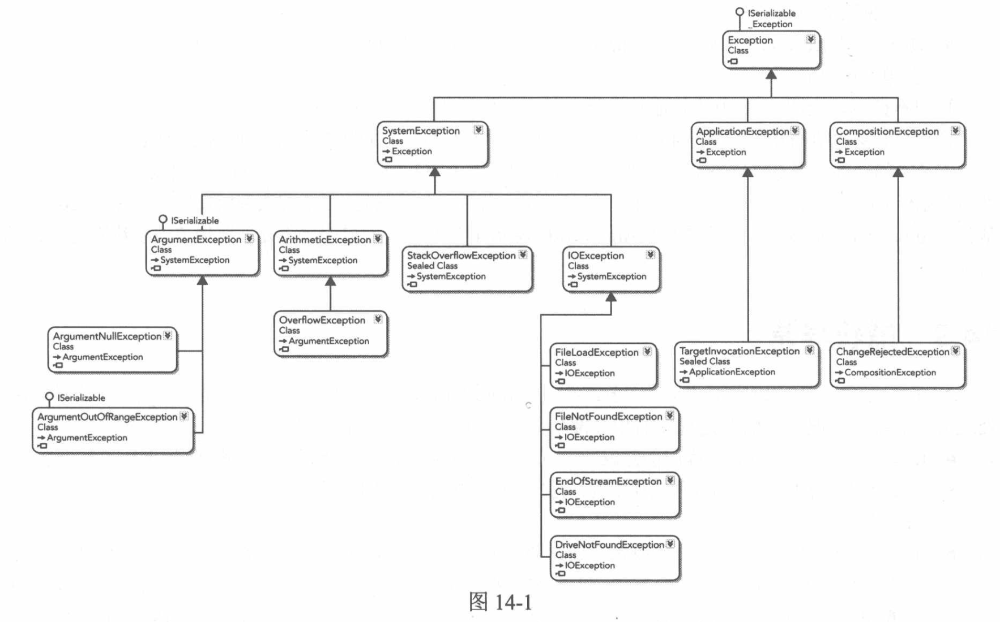
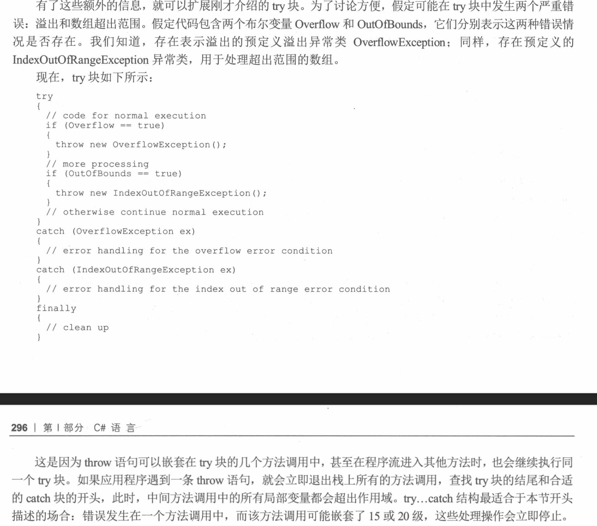
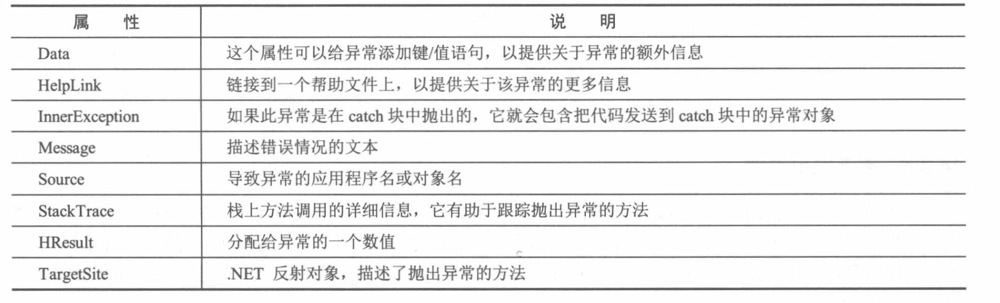
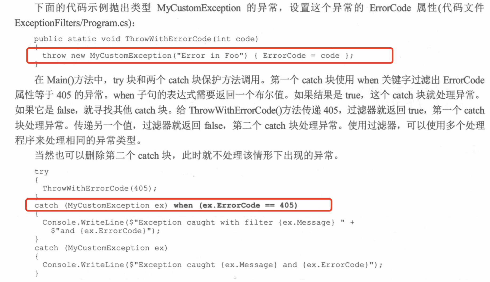
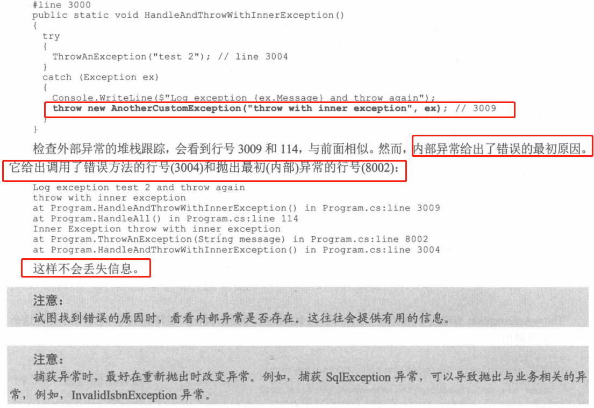
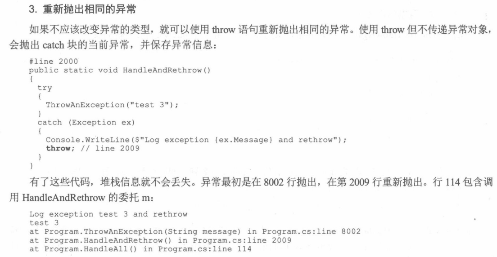
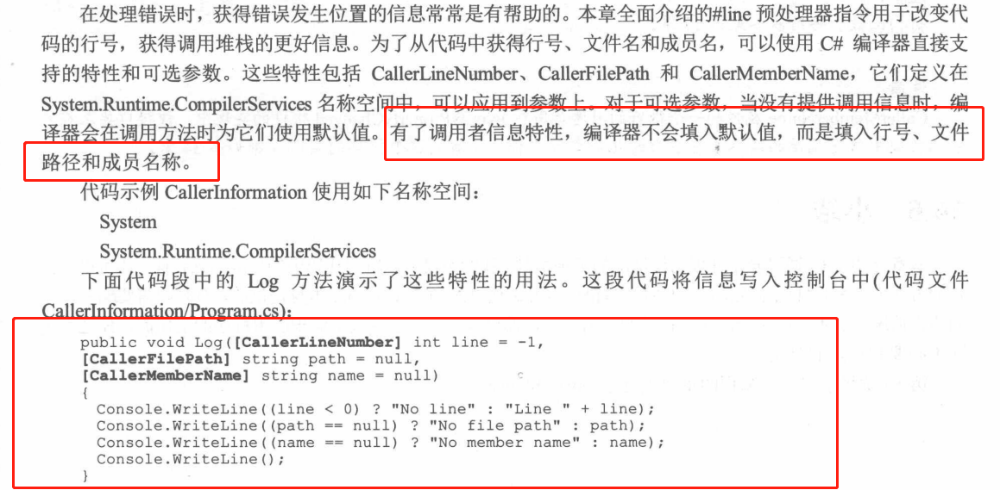
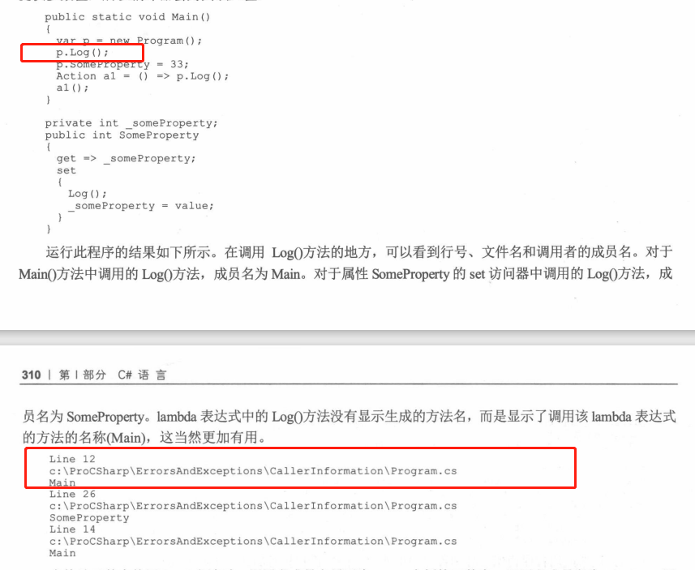
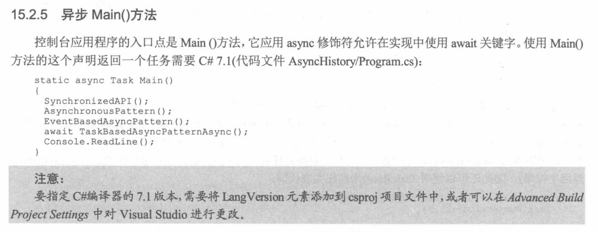

#  《C#高级编程》学习笔记（12）

## 第14章 错误和异常

### 14.1 简介

本章介绍：

- 在多种不同的场景中捕获和抛出异常的方式
- 讨论不同 namespace 中定义的异常类型及其层次结构
- 学习如何创建自定义异常类型
- 捕获异常的不同方式
- try/finally 块

### 14.2 异常类

C# 提供了许多预定义的异常类，以下是其中一些常见的类：



### 14.3 捕获异常

为了在 C# 代码中处理可能的错误情况，一般要把程序的相关部分分成 3 种不同类型的代码块：

- try 块
- catch 块
- finally 块



> 值得注意的是，传递给 catch 块的参数只能用于该 catch 块，这就是为什么在上面的代码中，所有后续 catch 块都使用相同的参数名 ex。

在 System.Exception 异常类中，除了 Message 属性以外，还有许多其他属性。



从 C#6 之后，catch 块支持了异常过滤器，用于过滤筛选一些具有特定属性的异常。比如：



#### 14.3.6 重新抛出异常

捕获异常后重新再抛出异常也是非常普遍的，再次抛出异常时，可以改变异常的类型，或者给调用程序提供异常相关的更多信息。

重新抛出异常的问题是，调用程序往往需要通过以前的异常找出其发生的原因和地点，堆栈跟踪信息可能会丢失。





### 14.4 用户定义的异常类

> ChatGPT：
>
> 在C#中，可以通过继承`Exception`类来创建自定义异常类，并定义该异常类的行为。下面是一个具体的例子：
>
> ```csharp
> using System;
> 
> // 自定义异常类
> public class MyCustomException : Exception
> {
>     // 自定义异常类的构造函数
>     public MyCustomException(string message) : base(message)
>     {
>         // 在构造函数中可以执行一些自定义的逻辑
>         // 例如记录日志、发送通知等
>     }
>     
>     // 可以在自定义异常类中定义其他的属性和方法
>     // 根据需要来扩展异常类的行为
> }
> 
> public class Program
> {
>     public static void Main()
>     {
>         try
>         {
>             // 抛出自定义异常
>             throw new MyCustomException("发生了自定义异常");
>         }
>         catch (MyCustomException ex)
>         {
>             // 捕获并处理自定义异常
>             Console.WriteLine("捕获到自定义异常：" + ex.Message);
>         }
>         catch (Exception ex)
>         {
>             // 捕获其他异常
>             Console.WriteLine("捕获到异常：" + ex.Message);
>         }
>     }
> }
> ```
>
> 在上面的例子中，我们首先定义了一个名为`MyCustomException`的自定义异常类，该类继承自`Exception`类。在自定义异常类中，我们可以添加自己的构造函数、属性和方法，以满足特定的需求。
>
> 在`Main`方法中，我们使用`throw`关键字抛出了一个`MyCustomException`的实例，并在`catch`块中捕获并处理该异常。注意，异常的`catch`块是按照顺序匹配的，所以在捕获自定义异常之前，如果存在其他更一般的异常类型，也会被匹配并处理。
>
> 通过自定义异常类，我们可以根据具体的业务需求来定义异常的行为，例如记录日志、发送通知等。这样可以提高代码的可读性和可维护性，同时也能更好地处理异常情况。

### 14.5 调用者信息

为了在报错中从堆栈中获得行号、文件名和成员名，我们可以在编写代码时使用 C# 编译器支持的特性和可选参数。





## 第 15 章 异步编程

C# 5.0 增加了两个关键字 async 和 await 来简化异步编程，在线程或任务（Task）的帮助下，使用异步编程会在后台运行并且不会阻塞调用线程。

C# 中有 3 种不同模式的异步编程：

- 异步模式
- 基于事件的异步模式
- 基于任务的异步模式（Task-based Asynchronous Pattern，TAP），利用 async 和 await 关键字来实现。

> ChatGPT：
>
> 在 C# 中，异步编程是一种处理并发任务的重要技术，它允许你在执行耗时操作时不会阻塞主线程，从而提高程序的响应性能。以下是 C# 中异步编程的几种模式，以及每种模式的示例代码和详细注释。
>
> ### 1. 使用 `async/await` 关键字
>
> `async/await` 是 C# 中最常用的异步编程模式，它基于任务(Task)的概念，通过在方法前加上 `async` 关键字，以及在方法内部使用 `await` 关键字来等待异步操作的完成。
>
> ```csharp
> using System;
> using System.Net.Http;
> using System.Threading.Tasks;
> 
> class Program
> {
>     static async Task Main(string[] args)
>     {
>         await DoAsyncWork();
>         Console.WriteLine("Async work completed.");
>     }
> 
>     static async Task DoAsyncWork()
>     {
>         using (HttpClient client = new HttpClient())
>         {
>             string result = await client.GetStringAsync("https://www.example.com");
>             Console.WriteLine(result.Length);
>         }
>     }
> }
> ```
>
> ### 2. 使用 `Task.Run` 启动任务
>
> `Task.Run` 方法允许你将同步操作包装成异步任务，通过在另一个线程上执行。
>
> ```csharp
> using System;
> using System.Threading.Tasks;
> 
> class Program
> {
>     static async Task Main(string[] args)
>     {
>         await DoAsyncWork();
>         Console.WriteLine("Async work completed.");
>     }
> 
>     static async Task DoAsyncWork()
>     {
>         await Task.Run(() =>
>         {
>             // 在另一个线程上执行的耗时操作
>             for (int i = 0; i < 5; i++)
>             {
>                 Console.WriteLine($"Step {i}");
>                 Task.Delay(1000).Wait(); // 模拟耗时操作
>             }
>         });
>     }
> }
> ```
>
> ### 3. 使用事件和委托
>
> 在某些情况下，你可能需要异步操作来响应事件，可以使用事件和委托来实现异步编程。
>
> ```csharp
> using System;
> using System.Threading;
> 
> class Program
> {
>     // 声明委托
>     delegate void AsyncEventHandler(string message);
> 
>     // 声明事件
>     static event AsyncEventHandler AsyncEvent;
> 
>     static void Main(string[] args)
>     {
>         // 订阅事件
>         AsyncEvent += DisplayMessage;
> 
>         // 异步触发事件
>         ThreadPool.QueueUserWorkItem(state =>
>         {
>             AsyncEvent?.Invoke("Async event executed.");
>         });
> 
>         Console.WriteLine("Main thread continues.");
>         Thread.Sleep(2000); // 等待异步事件完成
>     }
> 
>     static void DisplayMessage(string message)
>     {
>         Console.WriteLine(message);
>     }
> }
> ```
>
> 这些是 C# 中异步编程的几种常见模式，每种模式都适用于不同的情况和需求。无论选择哪种模式，都需要注意异常处理、取消操作、资源管理等问题，以确保异步操作能够安全和有效地运行。



### 15.3 异步编程的基础

async 和 await 关键字只是编译器功能，实际上编译器会用 Task 类创建代码。这意味着如果不使用这两个关键字，也可以用 C# 4.0 和 Task 类的方法来实现同样的功能，只是没有那么方便。

> ChatGPT：
>
> 在 C# 中，可以使用 `Task` 类的方法结合委托或 lambda 表达式来进行异步编程，而不使用 `async` 和 `await` 关键字。以下是一个使用 `Task` 类实现异步编程的示例，包含详细的注释。
>
> ```csharp
> using System;
> using System.Threading.Tasks;
> 
> class Program
> {
>     static void Main(string[] args)
>     {
>         Console.WriteLine("Main thread started.");
> 
>         // 创建一个 Task 对象并启动异步操作
>         Task<int> task = Task.Run(() =>
>         {
>             Console.WriteLine("Async operation started.");
>             Task.Delay(2000).Wait(); // 模拟耗时操作
>             Console.WriteLine("Async operation completed.");
>             return 42; // 返回异步操作的结果
>         });
> 
>         // 注册任务完成时的回调
>         task.ContinueWith(previousTask =>
>         {
>             Console.WriteLine($"Async operation result: {previousTask.Result}");
>         });
> 
>         // 主线程继续执行其他操作
>         Console.WriteLine("Main thread continues.");
> 
>         // 等待异步任务完成
>         task.Wait();
> 
>         Console.WriteLine("Main thread completed.");
>     }
> }
> ```
>
> 这个示例中，我们使用了 `Task.Run` 方法创建了一个异步任务，该任务在另一个线程上执行。然后，我们使用 `ContinueWith` 方法注册了一个回调，该回调会在任务完成时被调用，用于处理任务的结果。主线程继续执行其他操作，最后使用 `Wait` 方法等待异步任务完成。
>
> 请注意，虽然这种方式可以实现异步操作，但不使用 `async` 和 `await` 关键字可能会使代码更加复杂，而且需要手动处理一些线程同步和异常处理的问题。在实际开发中，推荐使用 `async` 和 `await` 关键字来更方便地编写异步代码。

#### 15.3.3 使用 Awaiter


> 本次阅读至 P352  第 15 章 异步编程 下次阅读应至 P367 有用的一共也就17章

