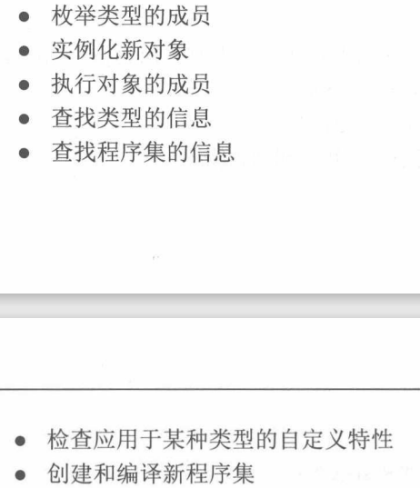

#  《C#高级编程》学习笔记（13）

## 第 16 章 反射、元数据和动态编程


### 16.1 在运行期间检查代码和动态编程

- 自定义特性允许把【自定义元数据】与程序关联起来，这些元数据是在编译过程中创造的，并嵌入到程序集中。

- 而反射是一个普通术语，它描述了程序在运行的过程中，检查和处理程序元素的功能。反射允许完成以下的任务：

  

- 动态编程自 C# 4 以后添加了 dynamic 类型，使用动态语言功能，允许在 C# 中调用脚本函数。

### 16.2 自定义特性

自定义特性的元数据在【文档说明】时非常有用，但是，自定义特性最强大的用途是使用反射，代码可以读取这些元数据，并使用它们，在运行期间做出决策。例如在开发可扩展的架构时，允许加载插件或模块。

#### 16.2.1 编写自定义特性

> ChatGPT：
>
> **Q：在 C# 中如何编写自定义特性？**
>
> A：在 C# 中，自定义特性（Custom Attributes）是一种元数据，可以用来为程序中的类型、方法、属性等元素添加附加信息。自定义特性能够在运行时被检查，从而让开发者能够编写更灵活、更具有描述性的代码。以下是创建和使用自定义特性的步骤：
>
> 1. **定义特性类**：创建一个继承自 `System.Attribute` 类的特性类。特性类的命名一般以 "Attribute" 结尾。
>
> 2. **添加构造函数和字段/属性**：在特性类中定义字段或属性来存储特性的数据。如果需要在特性使用时传入参数，就为特性类添加构造函数。
>
> 3. **应用特性**：将特性应用到目标元素上，可以使用 `[特性名]` 的形式来标记元素。
>
> 下面是一个示例，展示如何创建自定义特性并应用它：
>
> ```csharp
> using System;
> 
> // 定义一个自定义特性类
> [AttributeUsage(AttributeTargets.Class | AttributeTargets.Method, AllowMultiple = false)]
> public class MyCustomAttribute : Attribute
> {
>     public string Description { get; }
> 
>     public MyCustomAttribute(string description)
>     {
>         Description = description;
>     }
> }
> 
> // 使用自定义特性
> [MyCustom("This is a custom attribute example.")]
> class MyClass
> {
>     [MyCustom("This is a method with the custom attribute.")]
>     public void MyMethod()
>     {
>         Console.WriteLine("Executing MyMethod");
>     }
> }
> 
> class Program
> {
>     static void Main(string[] args)
>     {
>         Type type = typeof(MyClass);
>         object[] attributes = type.GetCustomAttributes(true);
> 
>         foreach (var attribute in attributes)
>         {
>             if (attribute is MyCustomAttribute customAttribute)
>             {
>                 Console.WriteLine($"Description: {customAttribute.Description}");
>             }
>         }
> 
>         MyClass myClass = new MyClass();
>         myClass.MyMethod();
>     }
> }
> ```
>
> 在这个例子中，我们首先定义了一个名为 `MyCustomAttribute` 的自定义特性类，并在其中添加了一个属性 `Description` 用于存储特性的描述信息。然后我们在 `MyClass` 类和 `MyMethod` 方法上分别应用了这个自定义特性。
>
> 在 `Main` 方法中，我们使用反射来获取类的特性，并打印出其描述信息。然后，我们实例化了 `MyClass` 类并调用了其中的 `MyMethod` 方法。
>
> 可使用的自定义特性包括（但不限于）：
>
> - `[Obsolete]`: 标记代码为已过时，编译器会在使用该代码时给出警告或错误。
> - `[Serializable]`: 标记类为可序列化，使其能够在网络或存储中进行序列化和反序列化。
> - `[Conditional]`: 根据预处理符号控制方法是否被调用。
> - `[DebuggerDisplay]`: 控制在调试时如何显示对象的值。
> - `[DefaultValue]`: 为属性指定默认值。
> - `[DataContract]` 和 `[DataMember]`: 用于支持 WCF 数据合同序列化。
>
> 在实际项目中，自定义特性能够帮助你为代码添加元数据和描述信息，提高代码的可读性和维护性。
>
> 
>
> Q：如何理解 C# 中的 AttributeUsage 和 AttributeTargets？
>
> A：在 C# 中，`AttributeUsage` 和 `AttributeTargets` 都是与自定义特性（Attribute）相关的重要概念。
>
> **`AttributeUsage`**：它是一个特性类，用于控制自定义特性应该应用到哪些类型的元素（如类、方法、属性等），以及是否允许多次应用同一特性，是否允许派生的类型继承特性。`AttributeUsage` 的实例化用于自定义特性类的构造函数中。
>
> **`AttributeTargets`**：它是一个枚举，定义了不同类型的代码元素，表示自定义特性可以应用的目标类型。
>
> 下面是一个带有详细注释的示例，演示如何使用 `AttributeUsage` 和 `AttributeTargets`：
>
> ```csharp
> using System;
> 
> // 定义 AttributeTargets 枚举，指定特性可以应用到哪些类型的元素
> [AttributeUsage(AttributeTargets.Class | AttributeTargets.Method, AllowMultiple = false)]
> public class MyCustomAttribute : Attribute
> {
>     public string Description { get; }
> 
>     public MyCustomAttribute(string description)
>     {
>         Description = description;
>     }
> }
> 
> // 使用自定义特性
> [MyCustom("This is a custom attribute applied to the class.")]
> class MyClass
> {
>     [MyCustom("This is a custom attribute applied to the method.")]
>     public void MyMethod()
>     {
>         Console.WriteLine("Executing MyMethod");
>     }
> }
> 
> class Program
> {
>     static void Main(string[] args)
>     {
>         // 获取类的特性并打印描述信息
>         Type type = typeof(MyClass);
>         object[] attributes = type.GetCustomAttributes(true);
>         foreach (var attribute in attributes)
>         {
>             if (attribute is MyCustomAttribute customAttribute)
>             {
>                 Console.WriteLine($"Class Description: {customAttribute.Description}");
>             }
>         }
> 
>         // 获取方法的特性并打印描述信息
>         var methodInfo = typeof(MyClass).GetMethod("MyMethod");
>         object[] methodAttributes = methodInfo.GetCustomAttributes(true);
>         foreach (var attribute in methodAttributes)
>         {
>             if (attribute is MyCustomAttribute customAttribute)
>             {
>                 Console.WriteLine($"Method Description: {customAttribute.Description}");
>             }
>         }
>     }
> }
> ```
>
> 在这个示例中，我们首先定义了 `AttributeTargets` 枚举，以便在 `MyCustomAttribute` 类中使用。然后，我们定义了一个 `MyCustomAttribute` 类，并使用 `AttributeUsage` 控制特性的应用范围。
>
> 我们将自定义特性应用到 `MyClass` 类和其中的 `MyMethod` 方法。在 `Main` 方法中，我们使用反射获取特性，并打印出其描述信息。
>
> 可应用的 `AttributeTargets` 枚举值包括（但不限于）：
>
> - `Assembly`: 程序集。
> - `Module`: 模块。
> - `Class`: 类。
> - `Struct`: 结构体。
> - `Enum`: 枚举。
> - `Constructor`: 构造函数。
> - `Method`: 方法。
> - `Property`: 属性。
> - `Field`: 字段。
> - `Event`: 事件。
> - `Interface`: 接口。
>
> 通过使用 `AttributeUsage` 和 `AttributeTargets`，你可以精确地控制特性的应用范围，以及在何处可以使用你自定义的特性。

### 16.3 反射

通过 System.Type 类可以访问关于任何数据类型的信息。而 System.Reflection.Assembly 类可以用于访问给定程序集的相关信息。

```csharp
Type t = typeof(dobule);
dobule d = 10;
Type tt = d.GetType();
Type ttt = Type.GetType("System.Dobule");
```

Type 是许多反射功能的入口，其中的所有属性都是只读的，也就是说其中的属性都是不可修改的。

> ChatGPT：
>
> 在 C# 中，反射（Reflection）是一种强大的技术，允许你在运行时获取和操作程序集、类型、成员等信息。以下是一些与反射相关的主要类以及它们的主要属性和常见用途：
>
> 1. **System.Type 类**：
>
>    `System.Type` 类表示一个运行时类型，它是反射的核心。通过 `typeof()` 运算符、`GetType()` 方法或从其他反射操作中获得的类型信息，可以获取 `Type` 对象。
>
>    常用属性：
>    - `FullName`: 获取类型的完全限定名，包括命名空间。
>    - `Name`: 获取类型的名称。
>    - `IsClass`, `IsInterface`, `IsEnum`, `IsValueType`: 判断类型的类别。
>    - `IsPublic`, `IsPrivate`, `IsAbstract`, `IsSealed`: 判断类型的修饰符。
>
>    常见用途：获取类型信息、实例化对象、调用方法等。
>
>    示例：
>    ```csharp
>    Type type = typeof(MyClass);
>    Console.WriteLine($"Type name: {type.Name}");
>    Console.WriteLine($"Is class: {type.IsClass}");
>    ```
>
> 2. **System.Reflection.Assembly 类**：
>
>    `System.Reflection.Assembly` 类表示一个程序集，它可以用来获取有关程序集的信息。
>
>    常用属性：
>    - `Location`: 获取程序集的物理路径。
>    - `FullName`: 获取程序集的完全限定名称。
>    - `EntryPoint`: 获取程序集的入口方法。
>
>    常见用途：加载程序集、获取程序集信息。
>
>    示例：
>    ```csharp
>    Assembly assembly = Assembly.GetExecutingAssembly();
>    Console.WriteLine($"Assembly name: {assembly.FullName}");
>    ```
>
> 3. **System.Reflection.MethodInfo 类**：
>
>    `System.Reflection.MethodInfo` 类表示一个方法的信息，用于反射调用方法。
>
>    常用属性：
>    - `Name`: 获取方法的名称。
>    - `ReturnType`: 获取方法的返回类型。
>    - `GetParameters()`: 获取方法的参数信息。
>
>    常见用途：调用方法、获取方法信息。
>
>    示例：
>    ```csharp
>    MethodInfo methodInfo = typeof(MyClass).GetMethod("MyMethod");
>    object result = methodInfo.Invoke(instance, null);
>    ```
>
> 4. **System.Reflection.PropertyInfo 类**：
>
>    `System.Reflection.PropertyInfo` 类表示一个属性的信息，用于反射访问属性。
>
>    常用属性：
>    - `Name`: 获取属性的名称。
>    - `PropertyType`: 获取属性的类型。
>
>    常见用途：访问和设置属性的值。
>
>    示例：
>    ```csharp
>    PropertyInfo propertyInfo = typeof(MyClass).GetProperty("MyProperty");
>    object value = propertyInfo.GetValue(instance);
>    ```
>
> 5. **System.Reflection.FieldInfo 类**：
>
>    `System.Reflection.FieldInfo` 类表示一个字段的信息，用于反射访问字段。
>
>    常用属性：
>    - `Name`: 获取字段的名称。
>    - `FieldType`: 获取字段的类型。
>
>    常见用途：访问和设置字段的值。
>
>    示例：
>    ```csharp
>    FieldInfo fieldInfo = typeof(MyClass).GetField("myField");
>    object value = fieldInfo.GetValue(instance);
>    ```
>
> 反射在以下常见场景中非常有用：
>
> - 动态加载程序集。
> - 动态创建类型的实例。
> - 动态调用方法、访问属性和字段。
> - 运行时生成代码。
>
> 然而，反射通常会引入一些性能开销，并且使代码难以理解和维护。在使用反射时，应该仔细考虑性能和代码清晰度之间的权衡。

### 16.4 为反射使用动态语言扩展


> 本次阅读至 P374  第 15 章 异步编程 下次阅读应至 P389 有用的一共也就17章

