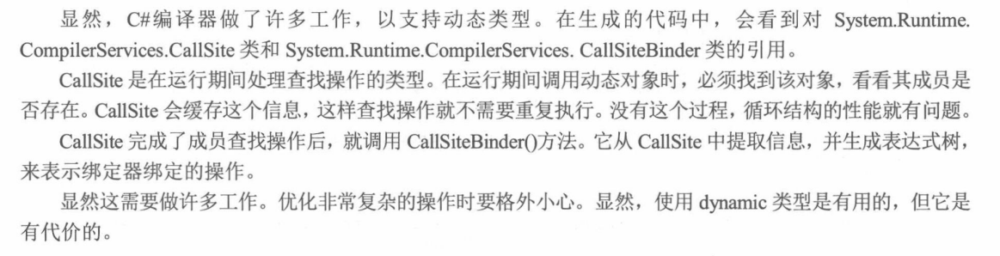

#  《C#高级编程》学习笔记（13）

## 第 16 章 反射、元数据和动态编程


### 16.1 在运行期间检查代码和动态编程

- 自定义特性允许把【自定义元数据】与程序关联起来，这些元数据是在编译过程中创造的，并嵌入到程序集中。

- 而反射是一个普通术语，它描述了程序在运行的过程中，检查和处理程序元素的功能。反射允许完成以下的任务：

  

- 动态编程自 C# 4 以后添加了 dynamic 类型，使用动态语言功能，允许在 C# 中调用脚本函数。

### 16.2 自定义特性

自定义特性的元数据在【文档说明】时非常有用，但是，自定义特性最强大的用途是使用反射，代码可以读取这些元数据，并使用它们，在运行期间做出决策。例如在开发可扩展的架构时，允许加载插件或模块。

#### 16.2.1 编写自定义特性

> ChatGPT：
>
> **Q：在 C# 中如何编写自定义特性？**
>
> A：在 C# 中，自定义特性（Custom Attributes）是一种元数据，可以用来为程序中的类型、方法、属性等元素添加附加信息。自定义特性能够在运行时被检查，从而让开发者能够编写更灵活、更具有描述性的代码。以下是创建和使用自定义特性的步骤：
>
> 1. **定义特性类**：创建一个继承自 `System.Attribute` 类的特性类。特性类的命名一般以 "Attribute" 结尾。
>
> 2. **添加构造函数和字段/属性**：在特性类中定义字段或属性来存储特性的数据。如果需要在特性使用时传入参数，就为特性类添加构造函数。
>
> 3. **应用特性**：将特性应用到目标元素上，可以使用 `[特性名]` 的形式来标记元素。
>
> 下面是一个示例，展示如何创建自定义特性并应用它：
>
> ```csharp
> using System;
> 
> // 定义一个自定义特性类
> [AttributeUsage(AttributeTargets.Class | AttributeTargets.Method, AllowMultiple = false)]
> public class MyCustomAttribute : Attribute
> {
>     public string Description { get; }
> 
>     public MyCustomAttribute(string description)
>     {
>         Description = description;
>     }
> }
> 
> // 使用自定义特性
> [MyCustom("This is a custom attribute example.")]
> class MyClass
> {
>     [MyCustom("This is a method with the custom attribute.")]
>     public void MyMethod()
>     {
>         Console.WriteLine("Executing MyMethod");
>     }
> }
> 
> class Program
> {
>     static void Main(string[] args)
>     {
>         Type type = typeof(MyClass);
>         object[] attributes = type.GetCustomAttributes(true);
> 
>         foreach (var attribute in attributes)
>         {
>             if (attribute is MyCustomAttribute customAttribute)
>             {
>                 Console.WriteLine($"Description: {customAttribute.Description}");
>             }
>         }
> 
>         MyClass myClass = new MyClass();
>         myClass.MyMethod();
>     }
> }
> ```
>
> 在这个例子中，我们首先定义了一个名为 `MyCustomAttribute` 的自定义特性类，并在其中添加了一个属性 `Description` 用于存储特性的描述信息。然后我们在 `MyClass` 类和 `MyMethod` 方法上分别应用了这个自定义特性。
>
> 在 `Main` 方法中，我们使用反射来获取类的特性，并打印出其描述信息。然后，我们实例化了 `MyClass` 类并调用了其中的 `MyMethod` 方法。
>
> 可使用的自定义特性包括（但不限于）：
>
> - `[Obsolete]`: 标记代码为已过时，编译器会在使用该代码时给出警告或错误。
> - `[Serializable]`: 标记类为可序列化，使其能够在网络或存储中进行序列化和反序列化。
> - `[Conditional]`: 根据预处理符号控制方法是否被调用。
> - `[DebuggerDisplay]`: 控制在调试时如何显示对象的值。
> - `[DefaultValue]`: 为属性指定默认值。
> - `[DataContract]` 和 `[DataMember]`: 用于支持 WCF 数据合同序列化。
>
> 在实际项目中，自定义特性能够帮助你为代码添加元数据和描述信息，提高代码的可读性和维护性。
>
> 
>
> Q：如何理解 C# 中的 AttributeUsage 和 AttributeTargets？
>
> A：在 C# 中，`AttributeUsage` 和 `AttributeTargets` 都是与自定义特性（Attribute）相关的重要概念。
>
> **`AttributeUsage`**：它是一个特性类，用于控制自定义特性应该应用到哪些类型的元素（如类、方法、属性等），以及是否允许多次应用同一特性，是否允许派生的类型继承特性。`AttributeUsage` 的实例化用于自定义特性类的构造函数中。
>
> **`AttributeTargets`**：它是一个枚举，定义了不同类型的代码元素，表示自定义特性可以应用的目标类型。
>
> 下面是一个带有详细注释的示例，演示如何使用 `AttributeUsage` 和 `AttributeTargets`：
>
> ```csharp
> using System;
> 
> // 定义 AttributeTargets 枚举，指定特性可以应用到哪些类型的元素
> [AttributeUsage(AttributeTargets.Class | AttributeTargets.Method, AllowMultiple = false)]
> public class MyCustomAttribute : Attribute
> {
>     public string Description { get; }
> 
>     public MyCustomAttribute(string description)
>     {
>         Description = description;
>     }
> }
> 
> // 使用自定义特性
> [MyCustom("This is a custom attribute applied to the class.")]
> class MyClass
> {
>     [MyCustom("This is a custom attribute applied to the method.")]
>     public void MyMethod()
>     {
>         Console.WriteLine("Executing MyMethod");
>     }
> }
> 
> class Program
> {
>     static void Main(string[] args)
>     {
>         // 获取类的特性并打印描述信息
>         Type type = typeof(MyClass);
>         object[] attributes = type.GetCustomAttributes(true);
>         foreach (var attribute in attributes)
>         {
>             if (attribute is MyCustomAttribute customAttribute)
>             {
>                 Console.WriteLine($"Class Description: {customAttribute.Description}");
>             }
>         }
> 
>         // 获取方法的特性并打印描述信息
>         var methodInfo = typeof(MyClass).GetMethod("MyMethod");
>         object[] methodAttributes = methodInfo.GetCustomAttributes(true);
>         foreach (var attribute in methodAttributes)
>         {
>             if (attribute is MyCustomAttribute customAttribute)
>             {
>                 Console.WriteLine($"Method Description: {customAttribute.Description}");
>             }
>         }
>     }
> }
> ```
>
> 在这个示例中，我们首先定义了 `AttributeTargets` 枚举，以便在 `MyCustomAttribute` 类中使用。然后，我们定义了一个 `MyCustomAttribute` 类，并使用 `AttributeUsage` 控制特性的应用范围。
>
> 我们将自定义特性应用到 `MyClass` 类和其中的 `MyMethod` 方法。在 `Main` 方法中，我们使用反射获取特性，并打印出其描述信息。
>
> 可应用的 `AttributeTargets` 枚举值包括（但不限于）：
>
> - `Assembly`: 程序集。
> - `Module`: 模块。
> - `Class`: 类。
> - `Struct`: 结构体。
> - `Enum`: 枚举。
> - `Constructor`: 构造函数。
> - `Method`: 方法。
> - `Property`: 属性。
> - `Field`: 字段。
> - `Event`: 事件。
> - `Interface`: 接口。
>
> 通过使用 `AttributeUsage` 和 `AttributeTargets`，你可以精确地控制特性的应用范围，以及在何处可以使用你自定义的特性。

### 16.3 反射

通过 System.Type 类可以访问关于任何数据类型的信息。而 System.Reflection.Assembly 类可以用于访问给定程序集的相关信息。

```csharp
Type t = typeof(dobule);
dobule d = 10;
Type tt = d.GetType();
Type ttt = Type.GetType("System.Dobule");
```

Type 是许多反射功能的入口，其中的所有属性都是只读的，也就是说其中的属性都是不可修改的。

> ChatGPT：
>
> 在 C# 中，反射（Reflection）是一种强大的技术，允许你在运行时获取和操作程序集、类型、成员等信息。以下是一些与反射相关的主要类以及它们的主要属性和常见用途：
>
> 1. **System.Type 类**：
>
>    `System.Type` 类表示一个运行时类型，它是反射的核心。通过 `typeof()` 运算符、`GetType()` 方法或从其他反射操作中获得的类型信息，可以获取 `Type` 对象。
>
>    常用属性：
>    - `FullName`: 获取类型的完全限定名，包括命名空间。
>    - `Name`: 获取类型的名称。
>    - `IsClass`, `IsInterface`, `IsEnum`, `IsValueType`: 判断类型的类别。
>    - `IsPublic`, `IsPrivate`, `IsAbstract`, `IsSealed`: 判断类型的修饰符。
>
>    常见用途：获取类型信息、实例化对象、调用方法等。
>
>    示例：
>    ```csharp
>    Type type = typeof(MyClass);
>    Console.WriteLine($"Type name: {type.Name}");
>    Console.WriteLine($"Is class: {type.IsClass}");
>    ```
>
> 2. **System.Reflection.Assembly 类**：
>
>    `System.Reflection.Assembly` 类表示一个程序集，它可以用来获取有关程序集的信息。
>
>    常用属性：
>    - `Location`: 获取程序集的物理路径。
>    - `FullName`: 获取程序集的完全限定名称。
>    - `EntryPoint`: 获取程序集的入口方法。
>
>    常见用途：加载程序集、获取程序集信息。
>
>    示例：
>    ```csharp
>    Assembly assembly = Assembly.GetExecutingAssembly();
>    Console.WriteLine($"Assembly name: {assembly.FullName}");
>    ```
>
> 3. **System.Reflection.MethodInfo 类**：
>
>    `System.Reflection.MethodInfo` 类表示一个方法的信息，用于反射调用方法。
>
>    常用属性：
>    - `Name`: 获取方法的名称。
>    - `ReturnType`: 获取方法的返回类型。
>    - `GetParameters()`: 获取方法的参数信息。
>
>    常见用途：调用方法、获取方法信息。
>
>    示例：
>    ```csharp
>    MethodInfo methodInfo = typeof(MyClass).GetMethod("MyMethod");
>    object result = methodInfo.Invoke(instance, null);
>    ```
>
> 4. **System.Reflection.PropertyInfo 类**：
>
>    `System.Reflection.PropertyInfo` 类表示一个属性的信息，用于反射访问属性。
>
>    常用属性：
>    - `Name`: 获取属性的名称。
>    - `PropertyType`: 获取属性的类型。
>
>    常见用途：访问和设置属性的值。
>
>    示例：
>    ```csharp
>    PropertyInfo propertyInfo = typeof(MyClass).GetProperty("MyProperty");
>    object value = propertyInfo.GetValue(instance);
>    ```
>
> 5. **System.Reflection.FieldInfo 类**：
>
>    `System.Reflection.FieldInfo` 类表示一个字段的信息，用于反射访问字段。
>
>    常用属性：
>    - `Name`: 获取字段的名称。
>    - `FieldType`: 获取字段的类型。
>
>    常见用途：访问和设置字段的值。
>
>    示例：
>    ```csharp
>    FieldInfo fieldInfo = typeof(MyClass).GetField("myField");
>    object value = fieldInfo.GetValue(instance);
>    ```
>
> 反射在以下常见场景中非常有用：
>
> - 动态加载程序集。
> - 动态创建类型的实例。
> - 动态调用方法、访问属性和字段。
> - 运行时生成代码。
>
> 然而，反射通常会引入一些性能开销，并且使代码难以理解和维护。在使用反射时，应该仔细考虑性能和代码清晰度之间的权衡。

### 16.4 为反射使用动态语言扩展

在之前的示例中，一直使用反射来读取元数据。而实际上，还可以使用反射从编译时不清楚的类型中动态创建实例。

> ChatGPT：
>
> 在 C# 中，反射（Reflection）是一种机制，可以在运行时获取并操作类型、对象、属性、方法等信息。通过反射，您可以实例化编译时未确定的类型。下面我将为您提供一个具体的例子来演示如何使用反射来实例化未知类型。
>
> 假设有以下接口和两个实现类：
>
> ```csharp
> // 接口定义
> public interface IShape
> {
>     void Draw();
> }
> 
> // 实现类 1
> public class Circle : IShape
> {
>     public void Draw()
>     {
>         Console.WriteLine("Drawing a circle");
>     }
> }
> 
> // 实现类 2
> public class Square : IShape
> {
>     public void Draw()
>     {
>         Console.WriteLine("Drawing a square");
>     }
> }
> ```
>
> 现在，假设您希望根据用户输入的类型名称来实例化相应的类，但在编译时无法确定具体是哪个类。您可以使用反射来实现这一目标。
>
> ```csharp
> using System;
> using System.Reflection;
> 
> class Program
> {
>     static void Main()
>     {
>         Console.Write("Enter the type name (Circle or Square): ");
>         string typeName = Console.ReadLine();
> 
>         // 获取类型
>         Type shapeType = Type.GetType("NamespaceName." + typeName);
> 
>         if (shapeType != null && typeof(IShape).IsAssignableFrom(shapeType))
>         {
>             // 使用 Activator 创建实例
>             IShape shape = (IShape)Activator.CreateInstance(shapeType);
>             shape.Draw();
>         }
>         else
>         {
>             Console.WriteLine("Invalid type name or type does not implement IShape.");
>         }
>     }
> }
> ```
>
> **解释：**
>
> 1. 在 `Main` 方法中，我们首先要求用户输入一个类型名称，即 "Circle" 或 "Square"。
> 2. 我们使用 `Type.GetType` 方法根据类型名称获取相应的 `Type` 对象。注意，此处需要提供完整的类型名称，包括命名空间。
> 3. 使用 `typeof(IShape).IsAssignableFrom(shapeType)` 来检查获取的类型是否实现了 `IShape` 接口。
> 4. 如果类型是有效的，并且实现了 `IShape` 接口，我们使用 `Activator.CreateInstance` 创建该类型的实例。然后，我们可以调用 `Draw` 方法来执行绘制操作。
> 5. 如果类型无效或者未实现接口，我们显示一条相应的错误消息。
>
> 请确保将 "NamespaceName" 替换为您实际的命名空间。这个例子演示了如何在运行时使用反射来实例化编译时未确定的类型。然而，反射可能会影响性能，因此在实际应用中需要谨慎使用。
>
> 
>
> **Q：上面的代码中，Activator 是什么？**
>
> A：`Activator` 是 C# 中的一个内置类，它提供了在运行时创建对象实例的功能。它包含一组静态方法，用于实例化对象，调用构造函数以及创建 COM 对象等操作。在上述代码中，我们使用了 `Activator.CreateInstance` 方法来动态地创建指定类型的实例。
>
> 以下是关于 `Activator` 类的一些重要信息：
>
> - `Activator.CreateInstance(Type type)`：根据提供的 `Type` 对象创建该类型的默认实例。返回一个新的对象，该对象是给定类型的实例。
>
> - `Activator.CreateInstance(Type type, params object[] args)`：根据提供的 `Type` 对象和构造函数参数，创建该类型的实例。可以使用 `args` 参数传递构造函数所需的参数。
>
> 使用 `Activator` 类的好处是可以在运行时根据类型名称或 `Type` 对象来创建实例，而不需要在编译时知道具体的类型。这对于动态插件加载、配置驱动的应用程序和反射等场景非常有用。
>
> 需要注意的是，虽然 `Activator` 提供了方便的方式来动态创建实例，但它可能会在性能上产生一些开销。在一些性能敏感的情况下，您可能会考虑其他创建实例的方法，例如使用工厂模式或依赖注入框架。
>
> 
>
> **Q：在 C# 中，Activator.CreateInstance 和 assembly 的 createInstance 方法有区别吗？**
>
> A：在 C# 中，`Activator.CreateInstance` 方法和 `Assembly` 的 `CreateInstance` 方法都用于在运行时创建对象实例，但它们之间存在一些区别。
>
> 1. **命名空间和使用方式：**
>    - `Activator.CreateInstance` 是 `System.Activator` 类的一个静态方法，可以直接通过 `Activator.CreateInstance(...)` 调用。
>    - `Assembly.CreateInstance` 是 `System.Reflection.Assembly` 类的实例方法，需要先获取一个 `Assembly` 对象，然后通过该对象调用 `assembly.CreateInstance(...)`。
>
> 2. **参数和使用情境：**
>    - `Activator.CreateInstance` 方法可以接受一个 `Type` 对象或类型的完全限定名称，以及构造函数参数。它适用于不涉及特定程序集的情况，通常用于动态创建对象。
>    - `Assembly.CreateInstance` 方法需要在调用之前已经获取了目标程序集的 `Assembly` 对象。它适用于需要在特定程序集中创建对象实例的情况。
>
> 3. **程序集和安全性：**
>    - `Activator.CreateInstance` 可以从任何可用的程序集中创建对象，因此它需要适当的权限来执行。这意味着它可能会引发一些安全性问题，特别是在不受信任的环境中。
>    - `Assembly.CreateInstance` 方法在创建对象时限制在指定的程序集中。这可以提供更精细的控制，避免一些潜在的安全问题。
>
> 下面是一个示例，演示了两种方法的使用：
>
> ```csharp
> using System;
> using System.Reflection;
> 
> class Program
> {
>     static void Main()
>     {
>         // 使用 Activator.CreateInstance
>         Type type1 = typeof(SomeClass);
>         object instance1 = Activator.CreateInstance(type1);
>         Console.WriteLine("Instance created using Activator: " + instance1.GetType().Name);
> 
>         // 使用 Assembly.CreateInstance
>         Assembly assembly = Assembly.GetExecutingAssembly();
>         Type type2 = assembly.GetType("NamespaceName.SomeClass");
>         object instance2 = assembly.CreateInstance(type2.FullName);
>         Console.WriteLine("Instance created using Assembly: " + instance2.GetType().Name);
>     }
> }
> 
> public class SomeClass
> {
>     // ...
> }
> ```
>
> 在上述代码中，`SomeClass` 是一个示例类。`Activator.CreateInstance` 和 `Assembly.CreateInstance` 方法都用于创建 `SomeClass` 的实例。需要注意的是，`NamespaceName` 需要替换为实际的命名空间。
>
> 总之，两种方法在创建对象实例方面都具有相似的功能，但其主要区别在于使用的上下文、安全性和调用方式。选择使用哪种方法取决于您的需求和设计。

#### 16.4.3 用 Reflection API 调用成员

使用反射调用方法的有点是，类型不需要在编译期间可用，只要把库复制到指定的目录中，就可以在稍后添加它。

使用反射调用方法要经过以下几步：

- 利用 GetType 方法检索实例的 Type 对象
- 通过 GetMethod() 方法访问对象的相应方法
- 然后使用获取到的该方法的 Invoke 方法，该方法有两个参数（类似于 javascript 的 apply）


#### 16.4.4 使用动态类型调用成员

> ChatGPT：
>
> C# 中的反射（Reflection）和 `dynamic` 关键字都涉及到在编译时或运行时处理类型信息，但它们的使用方式、用途和特点有一些不同。以下是它们之间的关系和区别：
>
> **反射（Reflection）：**
>
> 1. **定义：** 反射是一种在运行时检查、获取和操作程序集、类型、成员（字段、方法、属性等）的机制。通过反射，您可以动态地获取类型的信息、调用成员和创建对象，而不需要在编译时知道具体的类型。
> 2. **用途：** 反射适用于需要在运行时动态处理类型信息的场景，如插件系统、反射调用、序列化、自定义属性等。它允许您在运行时根据类型的特征执行各种操作。
> 3. **代码示例：** 在之前的回答中已经提供了关于如何使用反射的示例。
>
> **`dynamic` 关键字：**
>
> 1. **定义：** `dynamic` 是 C# 中的一个关键字，用于声明一个动态类型。通过使用 `dynamic` 关键字，您可以在编译时不知道变量的具体类型，而是在运行时解析类型。变量使用 `dynamic` 关键字后，编译器将推迟类型检查到运行时。
> 2. **用途：** `dynamic` 关键字适用于与 COM 交互、处理动态类型语言交互（如 JSON 序列化和反序列化）、LINQ 查询结果以及需要延迟类型检查的情况。
> 3. **特点：** 
>    - `dynamic` 变量的类型是在运行时确定的，因此编译器不会对其进行静态类型检查，也不会提供 IntelliSense 支持。
>    - 由于类型检查延迟到运行时，如果存在类型错误，可能会在运行时抛出异常。
>    - 与静态类型相比，使用 `dynamic` 可能会带来一些性能损失，因为类型信息需要在运行时进行解析。
>
> **关系和区别：**
>
> - 反射是一种机制，用于在运行时获取和处理类型信息，包括程序集、类型、成员等。
> - `dynamic` 关键字用于声明动态类型的变量，在编译时不确定类型，而是在运行时解析。
> - 反射适用于处理类型和成员的信息，动态地创建对象、调用方法等。`dynamic` 关键字适用于需要与动态类型交互的情况，如 COM 互操作和动态数据。
>
> 总之，反射和 `dynamic` 关键字在不同的情况下有各自的用途。选择使用哪种方式取决于您的需求和设计。需要注意的是，由于 `dynamic` 变量在编译时不进行类型检查，因此在使用时需要小心，以避免可能的运行时错误。
>
> 
>
> **Q：举个具体的例子来解释C# 中，反射和 dynamic 关键字的区别，要求有详细的注释和解释**
>
> A：当使用反射和 `dynamic` 关键字时，一个常见的情况是与 JSON 数据进行交互。让我们来看一个例子，演示如何使用反射和 `dynamic` 关键字来处理 JSON 数据，以突显它们之间的区别。
>
> 首先，假设我们有一个 JSON 数据表示一个人的信息：
>
> ```json
> {
>     "name": "John Doe",
>     "age": 30,
>     "isStudent": false
> }
> ```
>
> 我们想要解析这个 JSON 数据并在控制台上打印出人的信息。我们将使用 `Newtonsoft.Json` 库来处理 JSON，这是一个常用的库。
>
> **使用反射：**
>
> ```csharp
> using System;
> using Newtonsoft.Json.Linq;
> 
> class Program
> {
>     static void Main()
>     {
>         string json = "{\"name\":\"John Doe\",\"age\":30,\"isStudent\":false}";
> 
>         JObject jsonObject = JObject.Parse(json);
>         Type personType = typeof(Person);
> 
>         object person = Activator.CreateInstance(personType);
>         
>         foreach (var property in jsonObject.Properties())
>         {
>             var propertyInfo = personType.GetProperty(property.Name);
>             if (propertyInfo != null)
>             {
>                 var propertyValue = Convert.ChangeType(property.Value, propertyInfo.PropertyType);
>                 propertyInfo.SetValue(person, propertyValue);
>             }
>         }
> 
>         Console.WriteLine($"Name: {((Person)person).Name}");
>         Console.WriteLine($"Age: {((Person)person).Age}");
>         Console.WriteLine($"IsStudent: {((Person)person).IsStudent}");
>     }
> }
> 
> public class Person
> {
>     public string Name { get; set; }
>     public int Age { get; set; }
>     public bool IsStudent { get; set; }
> }
> ```
>
> **使用 dynamic 关键字：**
>
> ```csharp
> using System;
> using Newtonsoft.Json.Linq;
> 
> class Program
> {
>     static void Main()
>     {
>         string json = "{\"name\":\"John Doe\",\"age\":30,\"isStudent\":false}";
> 
>         dynamic person = JObject.Parse(json);
> 
>         Console.WriteLine($"Name: {person.name}");
>         Console.WriteLine($"Age: {person.age}");
>         Console.WriteLine($"IsStudent: {person.isStudent}");
>     }
> }
> ```
>
> **解释：**
>
> 在这两个示例中，我们都使用了 `Newtonsoft.Json` 库来解析 JSON 数据，然后从中提取属性值。但是，在处理属性值时，有明显的区别：
>
> - **反射示例：** 我们使用了反射来动态地创建 `Person` 类的实例，并使用反射的方式将 JSON 数据中的属性值赋给相应的属性。这需要在运行时检查属性信息并进行类型转换。
> - **dynamic 示例：** 我们使用了 `dynamic` 关键字来解析 JSON 数据，并直接通过属性名称访问属性值，而无需显式的类型检查或类型转换。
>
> 需要注意的是：
>
> - 使用反射需要更多的代码，因为我们需要手动处理属性和类型的映射、类型转换等。
> - 使用 `dynamic` 关键字更简洁，但由于类型信息在运行时解析，可能会隐藏一些类型错误，而且 IntelliSense 功能不可用。
> - 在性能方面，使用 `dynamic` 可能会稍微快一些，因为避免了类型检查和转换的开销。
>
> 总之，反射和 `dynamic` 关键字都是在运行时处理类型信息的方法，但它们的使用方式和适用场景有所不同。选择使用哪种方法取决于您的需求和偏好。

### 16.5 dynamic 类型

对 dynamic 类型对象的任何操作都是有效的，编译器不会对此报错。

dynamic 关键字和 var 关键字的区别是，var 关键字会让对象类的类型确认延迟。但是一旦确认就不能改变。

而 dynamic 对象的类型可以改变，而且可以改变多次。




### 16.6 DynamicObject 和 ExpandoObject 概述

如果要创建自己的动态对象，有两种方法：

1. 从 DynamicObject 中派生，需要重写几个方法，工作量较多
2. 直接使用 ExpandoObject

> ChatGPT：
>
> 在 C# 中，`DynamicObject` 类和 `ExpandoObject` 类都涉及到动态类型的创建和操作，但它们的作用和用法有所不同。让我为您详细介绍这两个类，并通过一个具体的示例来解释它们之间的关系和如何使用。
>
> ### DynamicObject 类：
>
> `DynamicObject` 是 C# 中的一个基类，用于创建自定义的动态对象。通过继承 `DynamicObject`，您可以重写一些特定的方法，从而实现自定义的动态行为。这可以用于创建一种支持动态成员的对象，这些成员在运行时才能确定。
>
> ### ExpandoObject 类：
>
> `ExpandoObject` 是 C# 中的一个类，实现了 `IDictionary<string, object>` 接口，允许您在运行时动态地添加、删除和访问属性和值。`ExpandoObject` 是一个动态对象，您可以在其上添加新的属性和方法，而无需在编译时定义类型。它常用于需要在运行时扩展对象属性的场景。
>
> ### 关系：
>
> `ExpandoObject` 类实际上是一个具体的应用示例，它继承了 `DynamicObject` 类，通过实现了一些方法来提供动态属性的添加和访问功能。
>
> ### 使用示例：
>
> 以下是一个示例，演示了如何使用 `ExpandoObject` 类来创建并操作动态对象：
>
> ```csharp
> using System;
> using System.Dynamic;
> 
> class Program
> {
>     static void Main()
>     {
>         // 创建一个 ExpandoObject 动态对象
>         dynamic person = new ExpandoObject();
>         person.Name = "John Doe";
>         person.Age = 30;
> 
>         Console.WriteLine($"Name: {person.Name}, Age: {person.Age}");
> 
>         // 添加新属性
>         person.IsStudent = false;
>         Console.WriteLine($"IsStudent: {person.IsStudent}");
> 
>         // 修改属性值
>         person.Age = 31;
>         Console.WriteLine($"Updated Age: {person.Age}");
> 
>         // 动态调用方法
>         person.Introduce = new Action(() =>
>         {
>             Console.WriteLine($"Hello, my name is {person.Name} and I'm {person.Age} years old.");
>         });
>         person.Introduce();
> 
>         // 删除属性
>         ((IDictionary<string, object>)person).Remove("IsStudent");
> 
>         // 尝试访问已删除的属性会引发异常
>         try
>         {
>             Console.WriteLine($"IsStudent: {person.IsStudent}");
>         }
>         catch (Exception ex)
>         {
>             Console.WriteLine("Error: " + ex.Message);
>         }
>     }
> }
> ```
>
> **解释：**
>
> 1. 我们使用 `ExpandoObject` 类创建了一个动态对象 `person`，并动态地添加了属性 `Name` 和 `Age`。
> 2. 我们可以直接访问和修改这些动态属性，就像操作普通对象一样。
> 3. 我们还可以在运行时动态添加新属性（如 `IsStudent`）。
> 4. 我们使用动态委托 `Action` 将 `Introduce` 方法添加到动态对象中，并在方法中访问动态属性。
> 5. 我们演示了如何删除动态属性，并且尝试访问已删除属性会引发异常。
>
> 通过使用 `ExpandoObject`，我们可以在运行时动态地创建、操作和扩展对象的属性，而无需提前定义类的结构。这在需要动态性和灵活性的情况下非常有用，例如在解析和处理动态数据或在动态脚本语言交互中。
>
> 
>
> **Q：再举一个例子，详细介绍 DynamicObject 类的使用**
>
> A：当您想要创建一个自定义的动态对象，可以通过继承 `DynamicObject` 类来实现。这样，您可以根据自己的需求重写一些特定的方法，从而实现您所需要的动态行为。让我为您提供一个具体的示例，演示如何使用 `DynamicObject` 类以及需要重写哪些方法才能正常使用。
>
> 考虑以下情景：您想要创建一个动态对象，该对象可以接受任何属性的赋值，而无需在编译时定义这些属性。
>
> ```csharp
> using System;
> using System.Dynamic;
> using System.Collections.Generic;
> 
> class DynamicDictionary : DynamicObject
> {
>     private Dictionary<string, object> _properties = new Dictionary<string, object>();
> 
>     // 重写 TrySetMember 方法，用于设置属性值
>     public override bool TrySetMember(SetMemberBinder binder, object value)
>     {
>         _properties[binder.Name] = value;
>         return true;
>     }
> 
>     // 重写 TryGetMember 方法，用于获取属性值
>     public override bool TryGetMember(GetMemberBinder binder, out object result)
>     {
>         if (_properties.ContainsKey(binder.Name))
>         {
>             result = _properties[binder.Name];
>             return true;
>         }
>         result = null;
>         return false;
>     }
> }
> 
> class Program
> {
>     static void Main()
>     {
>         dynamic dynamicObject = new DynamicDictionary();
> 
>         // 设置属性值
>         dynamicObject.Name = "John Doe";
>         dynamicObject.Age = 30;
>         dynamicObject.IsStudent = false;
> 
>         // 获取属性值
>         Console.WriteLine($"Name: {dynamicObject.Name}");
>         Console.WriteLine($"Age: {dynamicObject.Age}");
>         Console.WriteLine($"IsStudent: {dynamicObject.IsStudent}");
> 
>         // 未定义的属性
>         Console.WriteLine($"UndefinedProperty: {dynamicObject.UndefinedProperty}");
>     }
> }
> ```
>
> **解释：**
>
> 1. 我们创建了一个名为 `DynamicDictionary` 的类，继承自 `DynamicObject`。
> 2. 在 `DynamicDictionary` 类中，我们使用私有字段 `_properties` 来存储属性和值的键值对。这是一个用于模拟属性的字典。
> 3. 我们重写了 `TrySetMember` 方法，该方法在尝试给属性赋值时被调用。在该方法中，我们将属性名称作为键，将值存储到 `_properties` 字典中。
> 4. 我们重写了 `TryGetMember` 方法，该方法在尝试获取属性值时被调用。在该方法中，我们检查 `_properties` 字典中是否存在相应的属性，并返回相应的值。
> 5. 在 `Main` 方法中，我们创建了一个名为 `dynamicObject` 的动态对象，实际上是 `DynamicDictionary` 的实例。
> 6. 我们可以像访问普通属性一样使用 `dynamicObject` 来设置和获取属性的值。因为我们重写了 `TrySetMember` 和 `TryGetMember` 方法，所以可以实现动态属性的赋值和获取。
>
> 通过继承 `DynamicObject` 并重写相关方法，我们可以创建出具有自定义动态行为的动态对象。这种方式在需要在运行时创建自定义属性的情况下非常有用，比如在动态配置或数据解析场景中。


