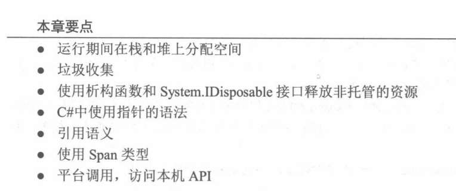
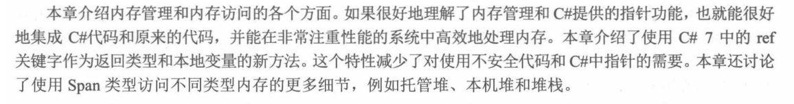
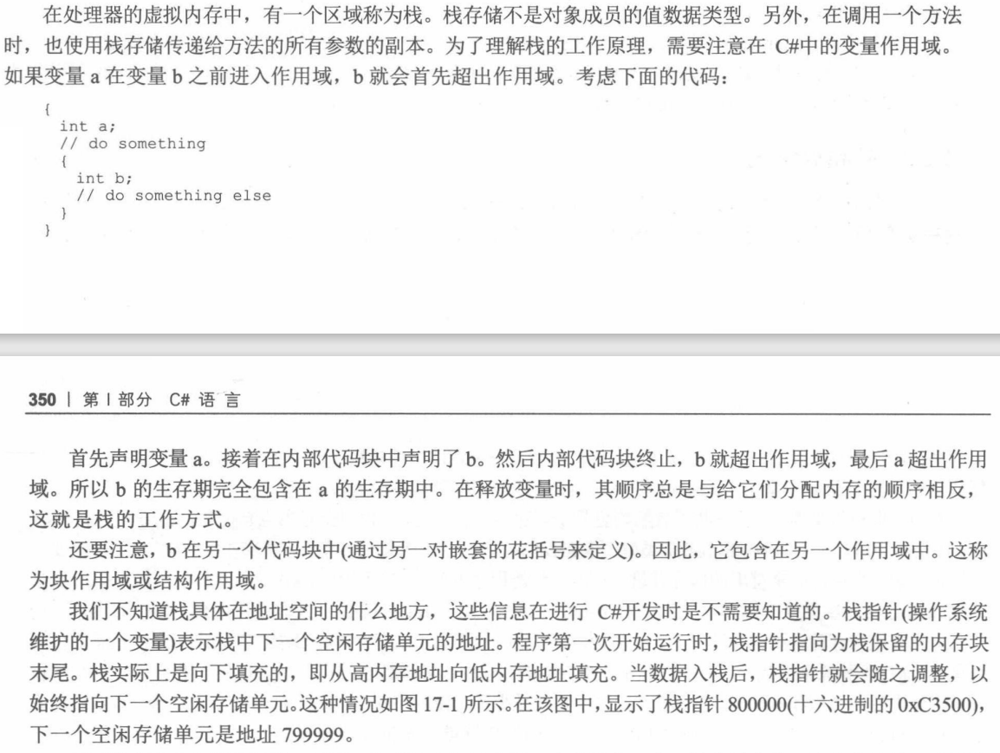
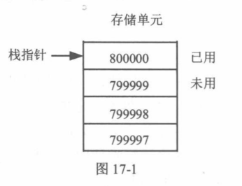

#  《C#高级编程》学习笔记（14）

## 第 17 章 托管和非托管内存

本章将详细介绍如何使用 IDisposable 接口释放原生资源，并使用不安全的 C# 代码。

### 17.1 内存

变量存储在堆栈中，它引用的数据可以位于栈（结构）或堆（类）上。而结构体也可以装箱，这样对象就会在堆上创建。

### 17.2 后台内存管理

C# 的一个有点是开发者不需要担心具体的内存管理，垃圾收集器会自动处理所有的内存清理工作，使得开发者可以得到像 C++ 语言那样的效率而无需付出相应的代价。

但开发者仍需要理解程序在后台是如何管理内存的，这有助于提高应用程序的速度和性能。

#### 17.2.1 值数据类型

Windows 的虚拟寻址系统决定了，32 位处理器上的每个进程都可以使用 4GB 内存，无论计算机上实际有多少内存。（在 64 位处理器上这个数字会更大）

#### 17.2.2 引用数据类型

> 本次阅读至 P386  17.2.2 引用数据类型 下次阅读应至 P401 有用的一共也就17章

