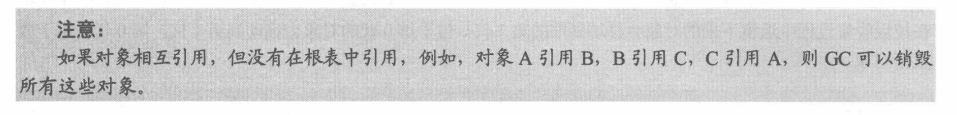

#  《C#高级编程》学习笔记（14）

## 第 17 章 托管和非托管内存

本章将详细介绍如何使用 IDisposable 接口释放原生资源，并使用不安全的 C# 代码。


### 17.1 内存

变量存储在堆栈中，它引用的数据可以位于栈（结构）或堆（类）上。而结构体也可以装箱，这样对象就会在堆上创建。

### 17.2 后台内存管理

C# 的一个有点是开发者不需要担心具体的内存管理，垃圾收集器会自动处理所有的内存清理工作，使得开发者可以得到像 C++ 语言那样的效率而无需付出相应的代价。

但开发者仍需要理解程序在后台是如何管理内存的，这有助于提高应用程序的速度和性能。

#### 17.2.1 值数据类型

Windows 的虚拟寻址系统决定了，32 位处理器上的每个进程都可以使用 4GB 内存，无论计算机上实际有多少内存。（在 64 位处理器上这个数字会更大）


#### 17.2.2 引用数据类型

尽管栈有非常高的性能，但有些变量的生存期要求在退出函数以后依然是可用的，而不是像栈一样嵌套后被回收。

例如，对于所有的引用类型，此时就要使用托管堆。

托管堆（简称为堆 heap）是可用内存的另一个内存区域。


有了堆，就可以对数据的生存期进行非常强大的控制，只要保持对数据的引用，该数据就肯定存在于堆上。

#### 17.2.3 垃圾收集


### 17.3 强引用和弱引用

有时候开发者可能会忘记释放引用，而垃圾收集器不能收集仍在引用的对象的内存——前提是这是一个强引用。



而使用`WeakReference`可以避免这种无法释放内存的情况。


### 17.4 处理非托管的资源

垃圾收集器通常意味着开发者不需要担心不再需要的对象，但是，垃圾收集器并不知道要如何释放非托管的资源。例如：文件句柄、网络连接和数据库连接。

托管类在封装对非托管资源的引用时，需要制定专门的规则，确保这些非托管资源随着托管类的实例一起释放。

对于开发者而言，在定义一个类时，可以使用两种机制来自动释放非托管的资源：

- 声明一个析构函数（或终结器），作为类的一个成员
- 在类中实现 System.IDisposable 接口

这两种机制通常放在一起实现，每种机制都为该问题提供了略为不同的解决方案。

#### 17.4.1 析构函数或终结器

> ChatGPT：
>
> 在 C# 中，析构函数和 `Finalize` 方法都与对象的生命周期和资源管理有关。它们的主要目的是在对象被销毁时执行清理操作。让我们更详细地了解析构函数和 `Finalize` 方法，并讨论它们的优缺点以及适用场景。
>
> ### 析构函数：
>
> 析构函数在 C# 中也被称为 `finalizer`，是对象在被销毁之前自动调用的特殊方法。它用于执行对象资源的释放和清理操作。析构函数使用 `~` 符号定义，名称与类名相同，前面带有 `~` 符号。
>
> **示例：**
>
> ```csharp
> using System;
> 
> class MyClass
> {
>     public MyClass()
>     {
>         Console.WriteLine("Constructor called");
>     }
> 
>     ~MyClass()
>     {
>         Console.WriteLine("Destructor (Finalize) called");
>         // Perform cleanup tasks here
>     }
> }
> 
> class Program
> {
>     static void Main(string[] args)
>     {
>         MyClass obj = new MyClass();
>         Console.WriteLine("Object created");
>     }
> }
> ```
>
> **优点：**
> - 提供了一种在对象销毁时执行资源清理的机制。
> - 可以用于非托管资源的释放，例如关闭文件句柄或数据库连接。
> - 显式地控制资源的释放，避免资源泄漏。
>
> **缺点：**
> - 不保证析构函数何时被调用，依赖于垃圾回收器的工作方式。
> - 析构函数的调用顺序是不确定的，可能会导致一些意外问题。
> - 在析构函数中不应该进行过于耗时的操作，因为垃圾回收器可能在不合适的时间点调用它。
>
> **适用场景：**
> - 当需要在对象销毁时释放非托管资源时，可以使用析构函数。
> - 析构函数适用于需要在对象销毁时执行资源清理的情况。
>
> ### `Finalize` 方法：
>
> `Finalize` 方法是 C# 中与垃圾回收器（Garbage Collector）相关的概念。它在对象即将被回收时自动调用，用于执行对象的清理操作。要重写 `Finalize` 方法，需要使用 `protected override void Finalize()` 的形式。
>
> **示例：**
>
> ```csharp
> using System;
> 
> class MyClass
> {
>     public MyClass()
>     {
>         Console.WriteLine("Constructor called");
>     }
> 
>     ~MyClass()
>     {
>         Console.WriteLine("Finalize method called");
>         // Perform cleanup tasks here
>     }
> }
> 
> class Program
> {
>     static void Main(string[] args)
>     {
>         MyClass obj = new MyClass();
>         Console.WriteLine("Object created");
>         obj = null; // Set to null to trigger garbage collection
>         GC.Collect(); // Explicitly trigger garbage collection
>     }
> }
> ```
>
> **优点：**
> - 不需要显式调用，由垃圾回收器自动管理对象的销毁和资源清理。
> - 适用于非托管资源的释放。
>
> **缺点：**
> - 终结器的执行时间不确定，可能会导致资源释放的延迟。
> - 终结器的开销较大，可能影响程序性能。
> - 由于不控制执行顺序，可能导致资源依赖问题。
>
> **适用场景：**
> - 当不需要精确控制资源释放时，可以使用 `Finalize` 方法。
> - 在处理非托管资源（如文件句柄、数据库连接等）时，`Finalize` 方法可确保资源得到释放。
>
> **总结：**
> 析构函数和 `Finalize` 方法都用于对象资源的清理，但由于它们存在一些缺点，如执行时间不确定性、性能开销等，推荐使用 `IDisposable` 接口和 `using` 语句来实现更精确和可控的资源管理。如果需要处理非托管资源，可以使用 `Finalize` 方法作为一种备选方案。


#### 17.4.2 IDisposable 接口

在 C# 中，推荐使用 System.IDisposable 接口替代终结器。


#### 17.4.3 using 语句

使用 using 语句可以省略掉上面的 try catch，using 会确保 IDisposable 接口的对象在超出作用域或出现异常的时候，自动调用其 Dispose 方法。


#### 17.4.4 实现 IDisposable 接口和析构函数

对于一个健壮的类来说，如果创建了终结器，就应该同时实现 IDisposable 接口。即使假定大多数程序员都能够正确调用 Dispose 方法，也应该把同时实现析构函数作为一种安全机制，以防止没有调用 Dispose() 方法。


> ChatGPT：
>
> 当在 C# 中使用 `IDisposable` 接口与析构函数配合工作时，主要目的是为了更精确地控制对象资源的释放，并在需要释放资源的时候及时执行清理操作。这样做可以避免不确定的析构函数调用时间以及对于非托管资源的延迟释放。下面是一个例子，以及详细的注释说明。
>
> ```csharp
> using System;
> 
> class ResourceHolder : IDisposable
> {
>     private bool disposed = false; // 标志位，用于跟踪对象是否已被释放
>     private IntPtr handle; // 模拟一个非托管资源（例如文件句柄）
> 
>     public ResourceHolder()
>     {
>         // 模拟资源获取
>         handle = new IntPtr(/* 初始化资源 */);
>         Console.WriteLine("ResourceHolder 已创建");
>     }
> 
>     // 自定义 Dispose 方法
>     public void Dispose()
>     {
>         Dispose(true);
>         GC.SuppressFinalize(this); // 抑制终结器，因为已显式调用了 Dispose
>     }
> 
>     // 受保护的 Dispose 方法，用于执行清理操作
>     protected virtual void Dispose(bool disposing)
>     {
>         if (!disposed)
>         {
>             if (disposing)
>             {
>                 // 释放托管资源
>             }
> 
>             // 释放非托管资源
>             ReleaseUnmanagedResources();
> 
>             disposed = true;
>         }
>     }
> 
>     // 释放非托管资源
>     private void ReleaseUnmanagedResources()
>     {
>         if (handle != IntPtr.Zero)
>         {
>             // 模拟资源释放
>             // 关闭文件句柄，释放内存等操作
>             Console.WriteLine("非托管资源已释放");
>             handle = IntPtr.Zero;
>         }
>     }
> 
>     // 终结器（析构函数）
>     ~ResourceHolder()
>     {
>         Dispose(false); // 仅在终结器中释放非托管资源
>     }
> }
> 
> class Program
> {
>     static void Main(string[] args)
>     {
>         using (ResourceHolder resource = new ResourceHolder())
>         {
>             // 使用资源执行操作
>         } // 当 using 块结束时，Dispose 方法会自动调用，确保资源得到及时释放
>     }
> }
> ```
>
> **注释说明：**
> 1. `ResourceHolder` 类实现了 `IDisposable` 接口，并定义了一个用于管理资源的类。
> 2. 构造函数用于模拟资源的获取，例如打开文件或分配内存。
> 3. `Dispose` 方法是 `IDisposable` 接口的一部分，用于释放对象持有的资源。
> 4. `Dispose(bool disposing)` 是用来处理释放资源的逻辑，它接收一个 `disposing` 参数，用来区分是否由 `Dispose` 方法调用。这种设计可以防止在析构函数中释放托管资源，因为析构函数只应该释放非托管资源。
> 5. `ReleaseUnmanagedResources` 方法用于释放非托管资源，例如关闭文件句柄或释放内存。
> 6. 析构函数 `~ResourceHolder()` 调用 `Dispose(false)` 以释放非托管资源。但是，由于我们已经显式调用了 `Dispose()`，所以使用 `GC.SuppressFinalize(this)` 来禁用垃圾回收器调用析构函数。
> 7. 在 `Main` 方法中，使用 `using` 块创建一个 `ResourceHolder` 实例。当代码块结束时，`Dispose` 方法会自动调用，确保资源得到适时释放。
>
> **好处：**
> - 通过实现 `IDisposable` 接口和使用 `using` 块，可以确保在资源不再需要时及时释放资源，而无需依赖垃圾回收器的不确定性。
> - 通过显式地调用 `Dispose` 方法，可以确保释放非托管资源，从而提高资源的管理效率。
> - 避免了垃圾回收器在未知的时间点执行析构函数，从而避免了资源泄漏和延迟释放。
>
> 综上所述，结合 `IDisposable` 接口和析构函数可以更加可控地管理对象的资源释放，提高了程序的性能和可靠性。

#### 17.4.5 IDisposable 和终结器的规则


> 本次阅读至 P393  17.4.5 IDisposable 和终结器的规则 下次阅读应至 P408 有用的一共也就17章

