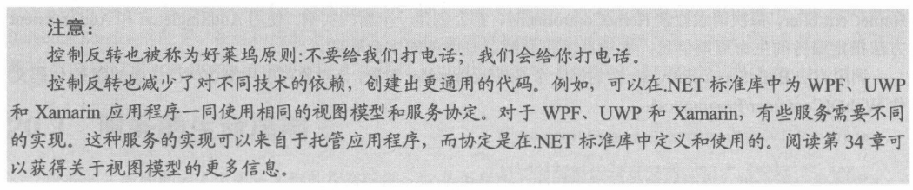
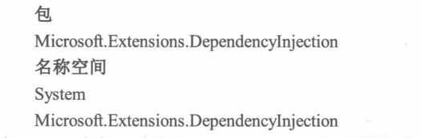
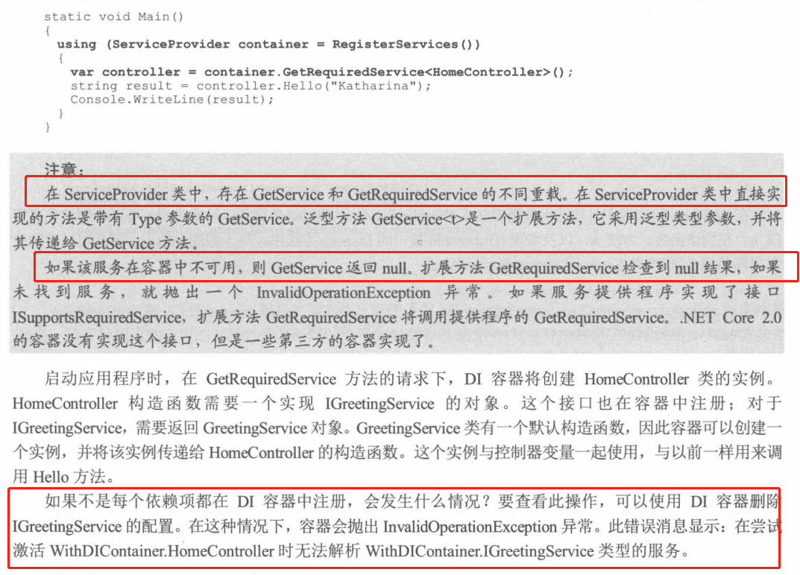

#  《C#高级编程》学习笔记（15）

## 第 18 章 Visual Studio 2017

> 无聊的一章，略过

**第二部分 .NET Core 与 Windows Runtime**

## 第 19 章 库、程序集、包和NuGet

简单来说，在 NuGet 包管理器出现之前，C# 的程序会由于多版本依赖造成库的依赖非常复杂，而且对于不同版本的库没有一个好的兼容机制。

而 NuGet 包在库中添加了另一个抽象层，NuGet 包可以包含一个或多个程序集的多个版本，以及一些手动重定向的版本配置。

## 第 20 章 依赖注入

### 20.1 依赖注入的概念

依赖注入（DI）允许从类的外部注入依赖项，因此注入的依赖项只需要知道一个协议（接口）即可。

使用依赖注入，可以使用不同的实现来区分生产模式和开发模式，也可以在不同的平台上使用不同的实现，还允许用自定义特性替换标准功能。

DI 是敏捷软件开发和持续软件交付实践的核心模式。



### 20.2 使用 .NET Core DI 容器

虽然依赖注入可以不需要依赖注入容器，但该容器有助于管理依赖项，依赖注入容器管理的服务列表越长，就越能看到它的优点。

在依赖注入容器中，可以定义一个服务，将某个 Interface 映射到哪个具体的实现类上，还可以指定将该服务，是作为一个单例来使用，还是每次使用都创建一个新的实例。

Microsoft.Extensions.DependencyInjection 是 C# 自带的一个依赖注入容器的实现。



> ChatGPT：
>
> **Q：详细介绍 C# 中的 Microsoft.Extensions.DependencyInjection 包**
>
> A：`Microsoft.Extensions.DependencyInjection` 是 .NET Core 和 .NET 5+ 中的一个扩展包，用于支持依赖注入（Dependency Injection，简称 DI）模式。依赖注入是一种设计模式，通过将组件之间的依赖关系从代码中解耦，提高了代码的可维护性、可测试性和灵活性。
>
> 该包主要提供了一组 API，用于配置和管理应用程序中的依赖关系。以下是一些常用的用法和示例：
>
> ### 1. 添加服务到容器
>
> ```csharp
> using Microsoft.Extensions.DependencyInjection;
> 
> // 创建一个服务容器
> var serviceProvider = new ServiceCollection()
>     .AddTransient<IMyService, MyService>()  // 注册一个瞬时生命周期的服务
>     .AddSingleton<ISingletonService, SingletonService>()  // 注册一个单例生命周期的服务
>     .AddScoped<IScopedService, ScopedService>()  // 注册一个作用域生命周期的服务
>     .BuildServiceProvider();  // 构建服务提供程序
> 
> // 从容器中获取服务实例
> var myService = serviceProvider.GetRequiredService<IMyService>();
> ```
>
> ### 2. 构造函数注入
>
> ```csharp
> public class Consumer
> {
>     private readonly IMyService _myService;
> 
>     public Consumer(IMyService myService)
>     {
>         _myService = myService;
>     }
> 
>     public void DoSomething()
>     {
>         _myService.DoWork();
>     }
> }
> ```
>
> ### 3. 属性注入
>
> ```csharp
> public class Consumer
> {
>     [Inject]
>     private IMyService _myService { get; set; }
> 
>     public void DoSomething()
>     {
>         _myService.DoWork();
>     }
> }
> ```
>
> ### 4. 通过接口获取服务
>
> ```csharp
> public interface IMyService
> {
>     void DoWork();
> }
> 
> public class MyService : IMyService
> {
>     public void DoWork()
>     {
>         Console.WriteLine("MyService is doing work.");
>     }
> }
> 
> // 在 Main 方法中使用
> var myService = serviceProvider.GetRequiredService<IMyService>();
> myService.DoWork();
> ```
>
> ### 5. 配置服务
>
> ```csharp
> // 在 Startup.cs 中的 ConfigureServices 方法中配置服务
> public void ConfigureServices(IServiceCollection services)
> {
>     services.AddTransient<IMyService, MyService>();
>     services.AddControllers();
> }
> ```
>
> ### 6. 中间件中使用
>
> ```csharp
> public class MyMiddleware
> {
>     private readonly RequestDelegate _next;
>     private readonly IMyService _myService;
> 
>     public MyMiddleware(RequestDelegate next, IMyService myService)
>     {
>         _next = next;
>         _myService = myService;
>     }
> 
>     public async Task InvokeAsync(HttpContext context)
>     {
>         // 使用 _myService 执行操作
>         await _next(context);
>     }
> }
> ```
>
> 这里的示例展示了如何使用 `Microsoft.Extensions.DependencyInjection` 包来实现依赖注入，它有助于解耦组件之间的关系，使代码更加可维护和可测试。在一个真实的应用程序中，通常会使用更多的服务和配置选项，但上述示例应该能够帮助你入门。



### 20.3 服务的生命周期


> 本次阅读至 P479  第 20 章 依赖注入  下次阅读应至 P494 有用的一共也就17章

