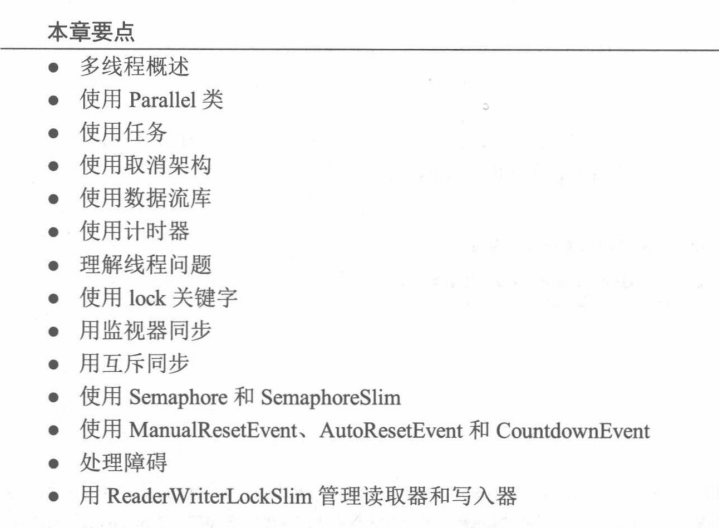
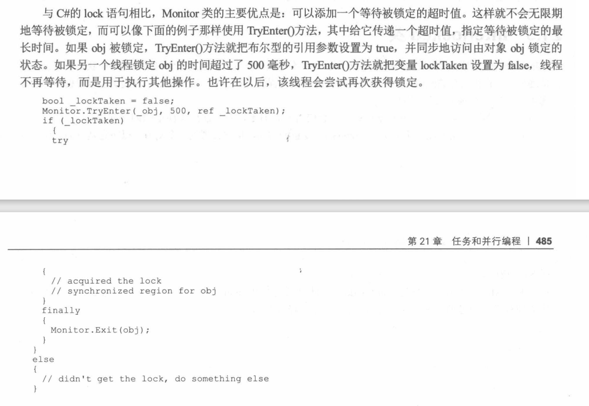

#  《C#高级编程》学习笔记（16）

## 第 21 章 任务和并行编程



### 21.1 概述

多线程用于将所有需要等待的 CPU 密集型任务分割到不同的线程上，一个进程的多个线程可以同时运行在不同的 CPU 上，或者多核 CPU 的不同内核上。

必须注意的是，多线程可以同时运行，但如果线程访问相同的数据，就很容易出问题，所以必须实现其同步机制。

本章首先介绍 Parallel 类，它提供了非常简单的并行性，如果需要更多的控制，比如说需要管理任务之间的关系，或定义返回任务的方法，就要使用 Task 类。若需要更多地控制并行性，如设置优先级，就需要使用 Thread 类。


### 21.2 Parallel 类

> ChatGPT：
>
> 在 C# 中，`Parallel` 类是用于支持并行编程的一个重要工具。它提供了一种简化并行任务执行的方式，可以有效地利用多核处理器来提高应用程序的性能。`Parallel` 类包含了一系列方法，可以用于执行循环、迭代和任务并行操作。下面我会详细介绍一些常用的 `Parallel` 类的使用方法和使用场景，并附带示例和注释。
>
> **注意：并行编程涉及多线程操作，需要注意线程安全性和性能问题。确保在实际应用中进行适当的测试和优化。**
>
> ### 1. 并行循环 - `Parallel.For` 和 `Parallel.ForEach`
>
> `Parallel.For` 和 `Parallel.ForEach` 方法可以用于在一个范围内执行循环或迭代任务。这在需要对一个大型数据集或迭代集合进行操作时特别有用。
>
> **使用场景：** 处理大型数组、列表或集合，计算密集型任务。
>
> ```csharp
> using System;
> using System.Threading.Tasks;
> 
> class Program
> {
>     static void Main()
>     {
>         int[] data = new int[10000];
> 
>         // 使用 Parallel.For 处理数组
>         Parallel.For(0, data.Length, (int i, ParalleLoopState pls) =>
>         {
>             data[i] = i * i;
>           	if (i > 12)
>             {
>               // 提前中断 For 方法而不是完成所有迭代
>               pls.Break();
>             }
>         });
> 
>         // 使用 Parallel.ForEach 处理集合
>         string[] names = { "Alice", "Bob", "Charlie" };
>         Parallel.ForEach(names, name =>
>         {
>             Console.WriteLine($"Hello, {name}!");
>         });
>     }
> }
> ```
>
> ### 2. 并行任务 - `Parallel.Invoke`
>
> `Parallel.Invoke` 方法允许同时调用多个方法，这些方法可以在不同的线程中并行执行。
>
> **使用场景：** 并行地执行多个独立的方法，适用于并行启动多个任务。
>
> ```csharp
> using System;
> using System.Threading.Tasks;
> 
> class Program
> {
>     static void Main()
>     {
>         // 并行调用多个方法
>         Parallel.Invoke(
>             () => DoWork("Task 1"),
>             () => DoWork("Task 2"),
>             () => DoWork("Task 3")
>         );
>     }
> 
>     static void DoWork(string taskName)
>     {
>         Console.WriteLine($"Starting {taskName}");
>         // 模拟耗时操作
>         Task.Delay(1000).Wait();
>         Console.WriteLine($"Completed {taskName}");
>     }
> }
> ```
>
> ### 3. 数据聚合 - `Parallel.Aggregate` 和 `ParallelReduce`
>
> `Parallel.Aggregate` 和 `ParallelReduce` 方法用于将并行执行的结果聚合为一个最终结果，这在需要合并多个部分结果的情况下非常有用。
>
> **使用场景：** 将部分结果聚合成一个总体结果，例如累积和、最大/最小值等。
>
> ```csharp
> using System;
> using System.Linq;
> using System.Threading.Tasks;
> 
> class Program
> {
>     static void Main()
>     {
>         int[] numbers = Enumerable.Range(1, 1000).ToArray();
> 
>         // 使用 Parallel.Aggregate 计算累积和
>         int sum = Parallel.Aggregate(
>             numbers,
>             0, // 初始值
>             (localTotal, chunk) => localTotal + chunk, // 部分结果的聚合
>             (total, localTotal) => total + localTotal // 最终聚合
>         );
> 
>         Console.WriteLine($"Sum: {sum}");
>     }
> }
> ```
>
> ### 4. 数据分区 - `ParallelPartitioner`
>
> `ParallelPartitioner` 可以用于自定义数据分区策略，使并行操作更加灵活。
>
> **使用场景：** 在某些情况下，需要自定义数据的分割方式以获得更好的性能。
>
> ```csharp
> using System;
> using System.Linq;
> using System.Threading.Tasks;
> 
> class Program
> {
>     static void Main()
>     {
>         int[] data = Enumerable.Range(1, 1000).ToArray();
> 
>         // 使用自定义分区策略
>         var partitioner = Partitioner.Create(data, loadBalance: true);
>         Parallel.ForEach(partitioner, chunk =>
>         {
>             foreach (var item in chunk)
>             {
>                 Console.WriteLine(item);
>             }
>         });
>     }
> }
> ```
>
> 这些示例涵盖了 `Parallel` 类的一些常见用法和使用场景。请注意，在实际应用中，要根据问题的性质和数据量选择合适的并行策略，并进行性能测试和调优，以确保获得最佳的并行处理效果。

### 21.3 任务 Task

使用 System.Threading.Tasks 中的 Task 类，可以以同步的方式启动一个任务，但也可以让并行操作在单独的线程中运行。

任务不仅可以获得一个抽象层，还可以对底层线程进行很多的控制。

> Task 类之前已经介绍过，详情可见 [《C# 高级编程》学习笔记（12）](https://blog.liubasara.site/#/blog/post/%E3%80%8AC%23%E9%AB%98%E7%BA%A7%E7%BC%96%E7%A8%8B%E3%80%8B%E5%AD%A6%E4%B9%A0%E7%AC%94%E8%AE%B0%EF%BC%8812%EF%BC%89)

### 21.4 取消架构

允许以标准方式取消长时间运行的任务，每个阻塞调用都应该支持这种机制，比如 Task，Parallel、并行 LINQ 等等。

支持取消的方法通常接受一个 CancellationToken 参数。

> ChatGPT：
>
> 在 C# 中，取消架构是一种用于协调多线程或并发操作的机制，允许您优雅地取消正在进行的操作，以便在用户请求取消或其他条件满足时停止任务的执行。取消架构主要通过 `CancellationToken` 和相关的类型与方法来实现，用于在不同的多线程和并发编程场景中取消任务。
>
> 以下是如何在 `Task` 类、`Parallel` 类和 LINQ 中使用取消架构的详细示例：
>
> 1. **Task 类中的取消：**
>
> ```csharp
> using System;
> using System.Threading;
> using System.Threading.Tasks;
> 
> class Program
> {
>     static async Task Main(string[] args)
>     {
>         // 创建一个 CancellationTokenSource 以便可以取消任务
>         CancellationTokenSource cts = new CancellationTokenSource();
>         CancellationToken token = cts.Token;
> 
>         // 创建一个 Task，在其中执行一些操作
>         Task task = Task.Run(() =>
>         {
>             for (int i = 0; i < 10; i++)
>             {
>                 // 检查是否请求取消任务
>                 token.ThrowIfCancellationRequested();
>                 Console.WriteLine($"任务正在运行: {i}");
>                 Thread.Sleep(1000);
>             }
>         }, token);
> 
>         // 模拟用户输入来取消任务
>         Console.WriteLine("按任意键取消任务...");
>         Console.ReadKey();
>         cts.Cancel();
> 
>         try
>         {
>             await task;
>         }
>         catch (OperationCanceledException)
>         {
>             Console.WriteLine("任务已取消。");
>         }
>     }
> }
> ```
>
> 2. **Parallel 类中的取消：**
>
> ```csharp
> using System;
> using System.Linq;
> using System.Threading;
> using System.Threading.Tasks;
> 
> class Program
> {
>     static void Main(string[] args)
>     {
>         // 创建一个 CancellationTokenSource 以便可以取消并行操作
>         CancellationTokenSource cts = new CancellationTokenSource();
>         CancellationToken token = cts.Token;
> 
>         try
>         {
>             // 使用 Parallel.ForEach 进行并行迭代，传入 CancellationToken
>             Parallel.ForEach(Enumerable.Range(0, 10), new ParallelOptions { CancellationToken = token }, (i) =>
>             {
>                 Console.WriteLine($"并行任务正在运行: {i}");
>                 Thread.Sleep(1000);
>             });
>         }
>         catch (OperationCanceledException)
>         {
>             Console.WriteLine("并行任务已取消。");
>         }
>         finally
>         {
>             cts.Dispose();
>         }
>     }
> }
> ```
>
> 3. **LINQ 中的取消：**
>
> ```csharp
> using System;
> using System.Collections.Generic;
> using System.Linq;
> using System.Threading;
> using System.Threading.Tasks;
> 
> class Program
> {
>     static void Main(string[] args)
>     {
>         // 创建一个 CancellationTokenSource 以便可以取消 LINQ 查询
>         CancellationTokenSource cts = new CancellationTokenSource();
>         CancellationToken token = cts.Token;
> 
>         List<int> numbers = Enumerable.Range(0, 10).ToList();
> 
>         var query = numbers.AsParallel()
>             .WithCancellation(token)
>             .Select(i =>
>             {
>                 Console.WriteLine($"处理数字: {i}");
>                 Thread.Sleep(1000);
>                 return i * i;
>             });
> 
>         try
>         {
>             foreach (var result in query)
>             {
>                 Console.WriteLine($"结果: {result}");
>             }
>         }
>         catch (OperationCanceledException)
>         {
>             Console.WriteLine("查询已取消。");
>         }
>         finally
>         {
>             cts.Dispose();
>         }
>     }
> }
> ```
>
> 在上述示例中，我们使用了 `CancellationToken` 和相关的取消架构，可以看到如何在不同的场景中实现任务取消。这种机制可以确保在任务进行时，可以优雅地取消任务，而不会造成资源泄漏或异常情况。

### 21.5 数据流

Parallel 类、Task 类和 Parallel LINQ 这些类虽然能够并行执行，但不能直接支持数据流的处理，且并行转换数据。要使用流处理，需要使用 TPL Data Flow。（System.Threading.Tasks.DataFlow 类）

### 21.6 Timer 类

计时器类。System.Threading.Timer 类和基于 XAML 应用的 DispatcherTimer 类。

### 21.7 线程问题

线程相关的问题：争用条件和死锁。

> ChatGPT：
>
> 在 C# 中，多线程的争用条件（Race Condition）和死锁（Deadlock）是两种常见的并发编程问题。
>
> **1. 争用条件（Race Condition）：** 争用条件是指多个线程同时访问共享资源，并且至少一个线程修改了该资源的状态，从而导致最终结果与线程执行顺序相关。这可能会导致意外的行为或结果。
>
> **示例：**
> ```csharp
> using System;
> using System.Threading;
> 
> class Program
> {
>     static int counter = 0;
> 
>     static void Main(string[] args)
>     {
>         Thread thread1 = new Thread(IncrementCounter);
>         Thread thread2 = new Thread(IncrementCounter);
> 
>         thread1.Start();
>         thread2.Start();
> 
>         thread1.Join();
>         thread2.Join();
> 
>         Console.WriteLine("Final counter value: " + counter);
>     }
> 
>     static void IncrementCounter()
>     {
>         for (int i = 0; i < 100000; i++)
>         {
>             int temp = counter;
>             temp++;
>             counter = temp;
>         }
>     }
> }
> ```
>
> **解决方案：** 使用互斥锁（Mutex）或其他同步机制确保在访问共享资源时只有一个线程可以进行修改操作。
>
> **2. 死锁（Deadlock）：** 死锁是指两个或多个线程被阻塞，它们在等待彼此持有的资源，从而无法继续执行。
>
> **示例：**
>
> ```csharp
> using System;
> using System.Threading;
> 
> class Program
> {
>     static object lock1 = new object();
>     static object lock2 = new object();
> 
>     static void Main(string[] args)
>     {
>         Thread thread1 = new Thread(DoWork1);
>         Thread thread2 = new Thread(DoWork2);
> 
>         thread1.Start();
>         thread2.Start();
> 
>         thread1.Join();
>         thread2.Join();
> 
>         Console.WriteLine("Execution complete.");
>     }
> 
>     static void DoWork1()
>     {
>         lock (lock1)
>         {
>             Console.WriteLine("Thread 1: Holding lock 1...");
>             Thread.Sleep(100);
>             Console.WriteLine("Thread 1: Waiting for lock 2...");
>             lock (lock2)
>             {
>                 Console.WriteLine("Thread 1: Acquired lock 2.");
>             }
>         }
>     }
> 
>     static void DoWork2()
>     {
>         lock (lock2)
>         {
>             Console.WriteLine("Thread 2: Holding lock 2...");
>             Thread.Sleep(100);
>             Console.WriteLine("Thread 2: Waiting for lock 1...");
>             lock (lock1)
>             {
>                 Console.WriteLine("Thread 2: Acquired lock 1.");
>             }
>         }
>     }
> }
> ```
>
> **解决方案：** 使用资源分配策略和避免策略来防止死锁，例如按顺序获取锁，使用超时机制等。
>
> 以上示例代码仅用于演示问题。在实际项目中，您应该使用并发库中提供的更高级的同步机制，如 `Monitor`、`Mutex`、`Semaphore`、`Monitor.Wait` 和 `Monitor.Pulse` 等，以更安全和高效地处理多线程问题。

#### 21.7.1 争用条件

如果两个或多个线程访问相同的对象，并且对共享状态的访问没有同步，就会出现争用条件（竞态）。

#### 21.7.2 死锁

在死锁中，会有至少有两个线程被挂起，并等待对方解除锁定，这将导致线程将无限等待下去。

### 21.8 lock 语句和线程安全

lock 语句是设置锁定和解除锁定的一种简单方式。

> ChatGPT：
>
> 当使用 `lock` 语句时，通常需要锁定一个对象，以确保只有一个线程可以进入锁定区域。以下是一个更简单的示例，演示了如何使用 `lock` 保护一个共享的计数器。
>
> ```csharp
> using System;
> using System.Threading;
> 
> class Program
> {
>     private static int counter = 0;
>     private static object lockObject = new object(); // 用于锁定的对象
> 
>     static void Main()
>     {
>         Thread thread1 = new Thread(IncrementCounter);
>         Thread thread2 = new Thread(IncrementCounter);
> 
>         thread1.Start();
>         thread2.Start();
> 
>         thread1.Join();
>         thread2.Join();
> 
>         Console.WriteLine("Final Counter Value: " + counter);
>     }
> 
>     static void IncrementCounter()
>     {
>         for (int i = 0; i < 100000; i++)
>         {
>             lock (lockObject) // 使用 lock 语句锁定 lockObject
>             {
>                 counter++;
>             }
>         }
>     }
> }
> ```
>
> 在这个示例中，我们有一个共享的 `counter` 变量，并且我们使用 `lockObject` 对象来锁定共享资源。两个线程 `thread1` 和 `thread2` 同时执行 `IncrementCounter` 方法，每次增加 `counter` 变量的值。
>
> 通过使用 `lock` 语句锁定 `lockObject`，我们确保了在任何时刻只有一个线程可以进入 `lock` 代码块，执行 `counter` 的增加操作。这样，我们避免了竞态条件，从而确保了 `counter` 变量的正确递增。
>
> 最终，当两个线程都完成时，我们打印出 `counter` 的最终值，它应该是 200,000，因为每个线程递增 100,000 次。
>
> 这个示例应该更容易理解，演示了 `lock` 语句如何确保多个线程安全地访问共享资源。

### 21.9 Interlocked 类

> ChatGPT：
>
> `System.Threading.Interlocked` 类提供了一组原子操作，用于在多线程环境下进行线程安全的操作。这些操作是原子性的，意味着它们在执行时不会被其他线程中断，从而避免了竞态条件和数据不一致性问题。下面是一个使用 `Interlocked` 类的简单示例，演示如何使用它来增加和减少一个共享的计数器。
>
> ```csharp
> using System;
> using System.Threading;
> 
> class Program
> {
>     private static int counter = 0;
> 
>     static void Main()
>     {
>         Thread thread1 = new Thread(IncrementCounter);
>         Thread thread2 = new Thread(DecrementCounter);
> 
>         thread1.Start();
>         thread2.Start();
> 
>         thread1.Join();
>         thread2.Join();
> 
>         Console.WriteLine("Final Counter Value: " + counter);
>     }
> 
>     static void IncrementCounter()
>     {
>         for (int i = 0; i < 100000; i++)
>         {
>             Interlocked.Increment(ref counter); // 使用 Interlocked 增加计数器的值
>         }
>     }
> 
>     static void DecrementCounter()
>     {
>         for (int i = 0; i < 100000; i++)
>         {
>             Interlocked.Decrement(ref counter); // 使用 Interlocked 减少计数器的值
>         }
>     }
> }
> ```
>
> 在这个示例中，我们使用 `Interlocked.Increment` 方法和 `Interlocked.Decrement` 方法来分别增加和减少 `counter` 变量的值。这些方法确保原子性操作，不需要显式地使用 `lock` 语句来保护共享资源。因此，即使多个线程同时调用这些方法，也不会发生竞态条件。
>
> 最终，当两个线程都完成时，我们打印出 `counter` 的最终值，它应该是 0，因为增加和减少操作相互抵消了。
>
> `Interlocked` 类提供了多种原子操作，包括增加、减少、交换、比较并交换等，这些操作可以在多线程环境下执行，确保线程安全性。这种方式比使用 `lock` 语句更轻量级，并且适用于一些简单的场景。但需要注意，它并不适用于所有情况，通常在更复杂的多线程同步需求下，仍然需要使用 `lock` 语句或其他同步机制。

### 21.10 Monitor 类



> ChatGPT：
>
> `System.Threading.Monitor` 类提供了另一种用于多线程同步的方式，它允许你在代码块内部锁定一个对象，以确保只有一个线程可以同时访问这个代码块。`Monitor` 是一个重量级的同步机制，通常与 `lock` 语句搭配使用，用于控制多个线程对共享资源的访问。下面是一个使用 `Monitor` 类的示例，演示如何使用它来保护一个共享的队列。
>
> ```csharp
> using System;
> using System.Collections.Generic;
> using System.Threading;
> 
> class Program
> {
>     private static Queue<int> sharedQueue = new Queue<int>();
>     private static object lockObject = new object(); // 用于锁定的对象
> 
>     static void Main()
>     {
>         Thread producerThread = new Thread(ProduceItems);
>         Thread consumerThread = new Thread(ConsumeItems);
> 
>         producerThread.Start();
>         consumerThread.Start();
> 
>         producerThread.Join();
>         consumerThread.Join();
>     }
> 
>     static void ProduceItems()
>     {
>         for (int i = 0; i < 10; i++)
>         {
>             lock (lockObject) // 使用 lock 语句锁定 lockObject
>             {
>                 sharedQueue.Enqueue(i);
>                 Console.WriteLine("Produced: " + i);
>                 Monitor.Pulse(lockObject); // 通知等待的线程
>             }
>             Thread.Sleep(100);
>         }
>     }
> 
>     static void ConsumeItems()
>     {
>         for (int i = 0; i < 10; i++)
>         {
>             lock (lockObject) // 使用 lock 语句锁定 lockObject
>             {
>                 while (sharedQueue.Count == 0)
>                 {
>                     Monitor.Wait(lockObject); // 等待生产者通知
>                 }
> 
>                 int item = sharedQueue.Dequeue();
>                 Console.WriteLine("Consumed: " + item);
>             }
>             Thread.Sleep(200);
>         }
>     }
> }
> ```
>
> 在这个示例中，我们有一个共享的队列 `sharedQueue`，并且使用 `lockObject` 对象来锁定共享资源。`ProduceItems` 方法负责将项目添加到队列中，而 `ConsumeItems` 方法负责从队列中取出项目。
>
> 使用 `lock` 语句锁定 `lockObject`，我们确保了在任何时刻只有一个线程可以进入 `lock` 代码块，以执行对 `sharedQueue` 的操作。`Monitor.Pulse` 和 `Monitor.Wait` 方法用于在线程之间进行通信，以确保消费者线程在队列为空时等待，直到生产者线程通知它们有新的项目可供消费。
>
> 虽然 `Monitor` 提供了更细粒度的线程同步控制，但需要谨慎使用，因为使用不当可能会导致死锁。通常，建议在简单情况下使用 `lock` 语句，只有在需要更高级的线程同步机制时才使用 `Monitor`。


> 本章剩余的 SpinLock 结构、WaitHandle 基类、Mutex 类、Semaphore 类、Events 类、Barrier 类、ReaderWriterLockSlim 类、Lock 和 await 等内容过于繁琐且不涉及核心用法，用到的时候再来学习。


