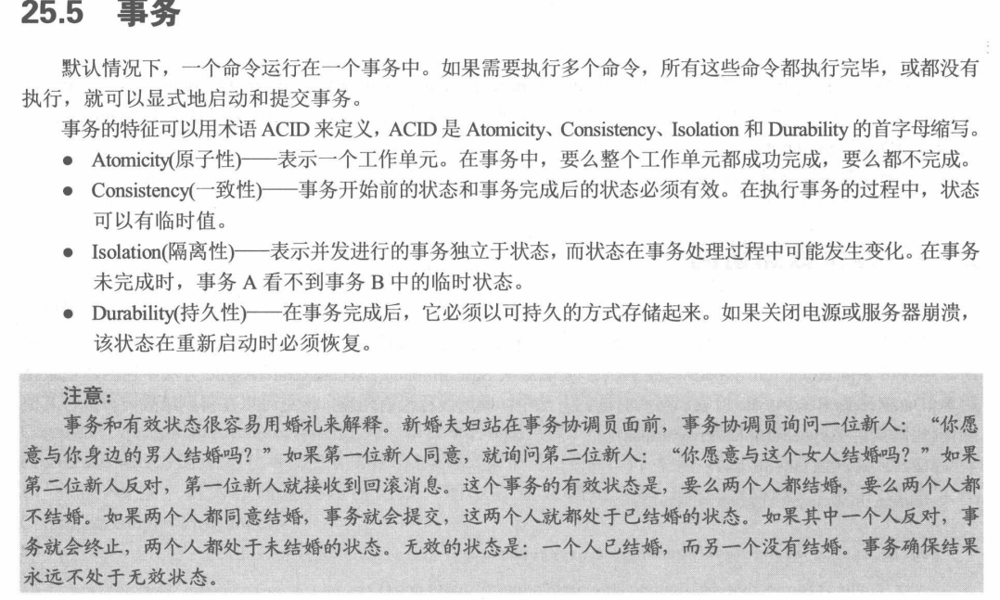

#  《C#高级编程》学习笔记（17）

## 第 22 章 文件和流

本章介绍了 WindowsRuntime 提供的读写文件和目录的相关 API，还可以使用流对数据进行压缩，并且利用内存映射的文件和管道在不同的任务间共享数据。

## 第 23 章 网络

本章讨论 C# 关于网络操作，阐明如何给服务器发送请求以及如何存储响应的信息。

然后讨论如何创建 HTTP 服务器，分拆和创建 URI，把主机名解析为 IP 地址，通过 TCP 和 UDP 收发数据，以及如何利用 Socket 类。

HttpClient 类用于发送 HTTP 请求。

无需 IIS 这么繁多的功能，使用 WebListener 类也可以用于创建一个简单 HTTP 服务器。

使用 URI 类和 UriBuilder 类可以用于表示和构建 URI。IPAddress 类可以处理 IP 地址。IPHostEntry 可以将主机名 HostName 映射到 IPAddress 数组中。Dns 类能够与默认的 DNS 服务器进行通信来检索 IP 地址。

使用 TcpClient 类可以深入 HTTP 协议，使用 TcpListener 类可以使用 IP 地址和端口号实例化成一个服务器。

使用 UdpClient 类可以发送 Udp 请求。

使用 SocketServerSender 和 SocketClient 类可以用于创建基于套接字的协议，即可以创建自己的自定义通信协议。

## 第 24 章 安全性

本章讨论 .NET 中的安全相关内容，跳过。

## 第 25 章 ADO.NET 和事务

本章简述 .NET 如何连接并访问不同的数据库，跳过。

> PS：事务这玩意不就是 git 的 commit 吗...

## 第 26 章 Entity Framework Core

Entity Framework Core（简称 EF Core） 是一个 C# 用来支持数据库的 ORM 框架，支持使用 LINQ 创建数据库查询，创建和更新对象并写入到数据库。本章讲述它的使用和原理，跳过。

## 第 27 章 本地化

本章介绍 .NET 应用如何支持 Windows 和 Web 应用的全球化和本地化，如何使用翻译的字符串资源，或支持不同的日历。跳过。

## 第 28 章 测试

> 本次阅读至 P713  第 27 章 本地化  下次阅读应至 P813 有用的一共也就17章

