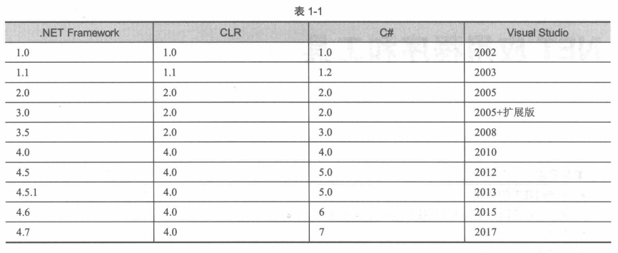
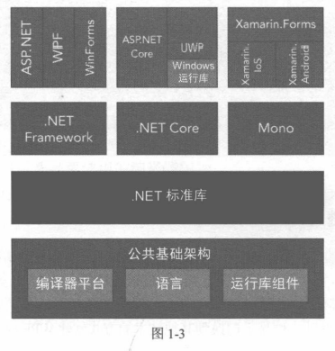

#  《C#高级编程》学习笔记（1）

> 资料下载地址(pdf压缩文件):
>
> [百度网盘（第 11 版）](https://pan.baidu.com/s/1KkGd9IJS2vANd_-gUJ1q4A?pwd=5sjz)
>
> 提取码: 5sjz 
>
> **本资料仅用于学习交流，如有能力请到各大销售渠道支持正版 !**

**译者序**

C# 是微软公司在 2000 年 6 月发布的一种面向对象的，运行于 .NET Framework 之上的高级程序设计语言。

C# 是兼顾了系统开发和应用开发的最佳实用预言，很有可能成为编程语言历史上的第一个“全能型”预言，它提供了一下软件工程要素的支持：

- 强类型检查
- 数组维度检查
- 未初始化的变量引用检测
- 自动垃圾收集

目前，C# 已发布到 7.x 版本，自 C# 6 以后，.NET Core 提供了代码的共享，使 C# 能够运行在 Windows、Linux 和 Mac 操作系统上，也因此让 C# 得以在任何操作系统上进行构建。

本书分为四个部分：

1. 第一部分：给出 C# 语言的基础知识
2. 第二部分：介绍独立于应用程序类型的 .NET Core 和 Windows Runtime
3. 第三部分：论述 Web 应用程序和服务
4. 第四部分：介绍如何使用 XAML 构建应用程序

## 前言

.NET 有很长的历史，但是 .NET Core 很年轻，.NET Core 2.0 从 .NET Freamework 中获得了许多新的 API，使其更容易将现有的 .NET Framework 程序迁移到 .NET Core 中。

下面是 .NET Core 部分特性的总结：

- .NET Core 是开源的
- .NET Core 使用现代模式
- .NET Core 支持在多个平台上开发
- ASP.NET Core 可以再 Windows 和 Linux 上运行

## 第 1 章 .NET 应用程序和工具

### 1.1 选择技术

.NET 是在 Windows 平台上创建应用程序的杰出技术。但现在，.NET 是在 Windows、Linux 和 Mac 上创建应用程序的杰出技术。

.NET Core 是 .NET 自其发明以来最大的变化，它是开源的代码，还可以为其他平台创建应用程序。

### 1.2 回顾 .NET 历史

下图显示了 .NET Framework 的版本、对应的公共语言运行库（Common Language Runtime，CLR）的版本、C# 的版本以及 Visual Studio 版本。



#### 1.2.1 C# 1.0 —— 一种新语言

C# 1.0 是一种全新的编程语言，用于 .NET Framework。C# 编程语言主要受到 C++、Java 和 Pascal 的影响。.NET 的编译器会将 C# 代码编译成中间语言代码（Intermediate Language，IL）代码。IL 代码是面向对象的机器码。CLR 包含一个 JIT 编译器，垃圾收集器，调试器扩展和线程实用工具。

### 1.3 .NET 术语

使用 .NET Framework，可以创建 Windows Forms、WPF 和在 Windows 上运行的旧 ASP.NET 应用程序。

使用 .NET Core，可以创建在不同平台上运行的 ASP.NET Core 和控制台应用程序。



#### 1.3.3 .NET Standard

.NET Standard 是一个协定，该协定规定了需要实现哪些 API。.NET Framework、.NET Core 和 Xamarin 实现了这个标准。

### 1.4 用 .NET Core CLI 编译

在本书的许多章节并不需要 Visual Studio，而可以使用任何的编辑器和命令行。可以使用 .NET Core 命令行接口来创建和编译应用程序。

#### 1.4.1 设置环境

访问 https://dot.net 并单击 Get Started 按钮，可以下载各操作系统平台的 .NET SDK。

在 WIndows 上，不同版本的 .NET Core 运行库以及 NuGet 包安装在用户配置文件中。所有不同版本的 NuGet 包（一种 zip 文件，包含单个或多个程序、配置信息和 PowerShell 脚本）都存储在这个文件夹中。

安装 .NET Core CLI 工具，要把 dotnet 工具作为入口点来启动所有这些工具，只需要启动：

```shell
dotnet --help
# 或者
dotnet -h
```

#### 1.4.2 创建应用程序

dotnet 工具提供一种简单的方法创建“Hello World！”应用程序，命令如下：

```shell
dotnet new console --output HelloWorld
```

这个命令创建一个新的 HelloWorld 目录并添加源代码文件 Program.cs 和项目文件 HelloWorld.csproj。从 .NET Core2.0 开始，还有一个`dotnet restore`命令来下载所有的 NuGet 包。

如果要查看应用程序所使用的库的依赖项和版本列表，可以检查 obj 子目录中的文件 project.assets.json。如果不使用`--output`选项，文件就会在当前目录中生成。

#### 1.4.3 构建应用程序

使用`dotnet build`可以为 .NET Core 2.0 和 .NET Framework 4.7 编译。

#### 1.4.4 运行应用程序

使用`dotnet run`命令可以运行应用程序。如果项目文件面向多个框架，就需要通过 --framework 选项来告诉 dotnet，使用哪个框架来运行应用程序。这个框架必须通过 csproj 文件来配置。

```shell
dotnet run --framework netcooreapp2.0
```

在生产系统中，不使用 dotnet run 运行应用程序，而可以使用 dotnet 和库的名称。

#### 1.4.5 创建 Web 应用程序

还可以使用 .NET Core CLI 创建 Web 应用程序。使用`dotnet new`命令，可以看到可用的模板列表。

```shell
dotnet new mvc -o WebApp
```

使用下述命令构建和运行程序：

```shell
dotnet build
dotnet run
```

上述代码会启动一个 Kestrel 服务器监听 5000 端口。

#### 1.4.6 发布应用程序

使用 dotnet 工具可以创建一个 NuGet 包并发布应用程序来进行部署。

使用`dotnet publish -f netcoreapp2.0 -c Release`就可以创建发布所需的文件，使用`-f`选择框架，使用`-c`选择版本配置。发布所需的文件放在 bin/Release/netcoreapp2.0/publish 目录中。

### 1.6 应用程序类型和技术

本届概述可以用 C# 编写的不同类型的应用程序。

- 数据访问
- Windows 应用程序，对于创建 WIndows 应用程序，选择的技术应该是 UWP。如果需要支持像 Win7 这样的旧 OS。则可以使用 WPF。与 WPF 相比，UWP 提供了更现代的 XAML 来创建用户界面。
- Xamarin：通过Xamarin，可以使用 C# 和 XAML 在 iPhone 和 Android 上创建应用程序。
- Web 应用程序：使用 ASP.NET Core 构建应用程序，基于著名的 MVC 模式。
- Web API
- WebHooks 和 SignalR
- Microsoft Azure，云服务技术。

### 1.7 开发工具

- Visual Studio Commuity
- Visual Studio Professional
- Visual Studio Enterprise
- Visual Studio for Mac
- Visual Studio code


