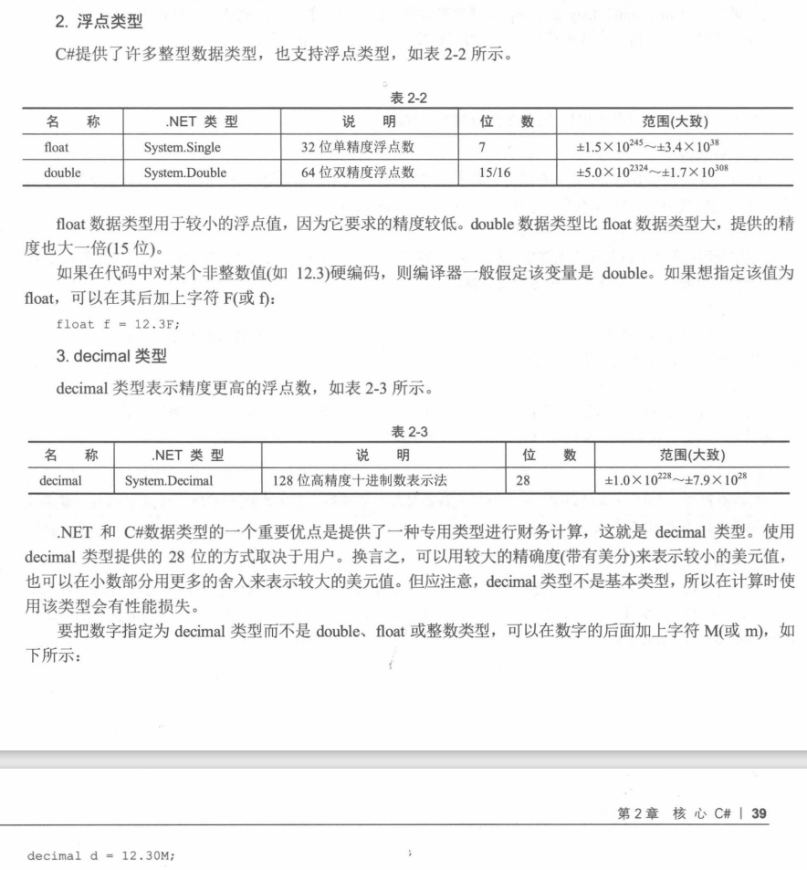

#  《C#高级编程》学习笔记（2）

## 第 2 章 核心C#

### 2.1 C# 基础

namespace 关键字声明了与类相关的名称空间。编译器在 using 语句指定的名称空间中查找没有在当前名称空间中定义，但在代码中引用了的类。这与 Java 中的 import 语句和 C++ 中的 using namespace 语句非常类似。

使用 using static 声明，不仅可以打开名称空间，还可以打开类的所有静态成员。声明`using static System.Console`，就可以调用 Console 类的 WriteLine 方法但不使用类名。

```c#
using static System.Console;

namespace HelloWorld {
  class Program {
    public static void Main() {
      WriteLine("Hello world!");
    }
  }
}
```

标准的 System 名称空间包含了最常见的 .NET 类型。

所有的 C# 代码都必须包含在类中。类的声明包括 class 关键字。

每个 C# 可执行文件都必须有一个入口点——Main() 方法，注意 M 必须大写。该方法要么没有返回值（void），要么返回一个整数（int）。

在本例中，只调用了 System.Console 类的 WriteLine() 方法，WriteLine() 是一个静态方法，在调用之前不需要实例化 Console 对象。

### 2.2 变量

在 C# 中使用`datatype identifier;`来声明变量，例如：`init i;`。该语句声明 int 变量 i，然后就可以使用赋值运算符（=）给它赋值。还可以在一行代码中同时声明变量并赋值：

```c#
int i;
i = 10;
// 或者
int i = 10;
```

#### 2.2.1 初始化变量

C# 有两个办法确保变量在使用前进行了初始化：

- 变量在创建时，如果不是类或结构，则默认值就是 0
- 方法的局部变量必须在代码中显式初始化才能进行使用，如果检测到局部变量在初始化之前就使用了它的值，就会标记错误。
- 在 C# 中实例化一个引用对象，需要使用 new 关键字

#### 2.2.2 类型推断

类型推断使用 var 关键字。使用 var 关键字替代实际的类型，编译器可以根据变量的初始化值“推断”变量的类型。

```c#
var someNumber = 0;
// 就变成
int someNumber = 0;
```

声明了变量且推断出类型后，就不能再改变变量的类型了。变量的类型确定后，对该变量进行任何赋值时，其强类型化规则必须以推断出的类型为基础。

#### 2.2.3 变量的作用域

- 同名的局部变量不能再同一个作用域内声明两次

- 对于字段和局部变量的作用域冲突，一个是在类级别上的定义，而另一个是在函数中的定义。如果要引用类级别的变量，可以使用语法 object.fieldname。如下：

  ```c#
  using System;
  
  namespace Wrox {
    class Program {
      static int j = 20;
      static void Main() {
        int j = 30;
        Console.WriteLine(j); // 30
        Console.WriteLine(Program.j); // 20
      }
    }
  }
  ```

#### 2.2.4 常量

在声明和初始化变量时，在变量前面加上关键字 const 就可以把该变量指定为一个常量：

```c#
const int a = 1000;
```

### 2.3 预定义数据类型

下面将讨论 C# 中可用的数据类型。

#### 2.3.1 值类型和引用类型

值类型存储在堆栈（stack）中，而引用类型存储在托管堆（mamaged heap）上。把基本类型（如 int 和 bool）规定为值类型，而把包含许多字段的较大类型规定为引用类型，C# 这么做是为了得到最佳性能。

如果要把自己的类型定义为值类型，就应该把它声明为一个结构。

#### 2.3.2 .NET 类型

在 C# 中声明一个 int 类型的数据时，声明的实际上是 .NET struct:Stystem.Int32 的一个实例。这意味着在语法上，可以把所有的基本数据类型看成是支持某些方法的类。

C# 有15个预定义类型，其中 13 个是值类型，两个是引用类型（string 和 object）。

#### 2.3.3 预定义的值类型


描述二进制时，如果在变量值前面加`0b`，则值允许使用 0 和 1 作为二进制值分配给变量。如果在值前面加`0x`，则使用十六进制计数法。

```c#
unit binary1 = 0b1111_1110_1101;
uint hex1 = 0xfedcba98;
```



#### 2.3.4 预定义的引用类型


**1. object 类型**

在 C# 中，object 类型就是最终的父类型。所有内置类型和用户定义的类型都从它派生而来。这样，object 类型就可以用于两个目的：

- 可以使用 object 来帮顶任何特定子类型的对象，也可以用于反射。
- object 类型实现了许多一般用途的基本方法，包括 Equals，GetHashCode，GetType 和 ToString

**2. string 类型**

可以再字符串字面量的前面加上字符 @，在这个字符后的所有字符都看成原来的含义，而不会解释为转义字符，甚至允许在字符串字面量中包含换行符：

```c#
string filepath = @"C:\ProCSharp\First.cs";
```

C# 用 $ 前缀来标记，可以使用字符串插值格式。

```c#
string s1 = "a string";
string s2 = s1;
Console.WriteLine($"s1 is {s1}");
```

### 2.4 程序流控制

#### 2.4.1 条件语句

**1. if 语句**

对于 if 语句，C# 使用 “==” 对变量进行比较，if 子句中的表达式必须等于布尔值，不能直接测试整数，而必须显式地把返回的值转换为布尔值 true 或者 false。

**2. switch 语句**

C# 的 switch 语句中不能出现两条相同的 case，可以通过 goto 语句在不同的 case 之间进行切换。此外还有一个模式匹配模式。


#### 2.4.2 循环


> 本次阅读至 P79 下次阅读应至 P90