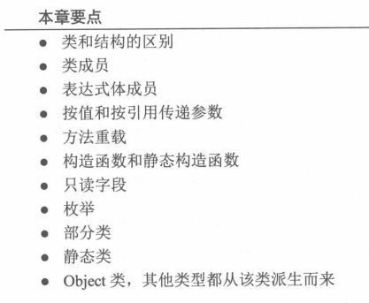
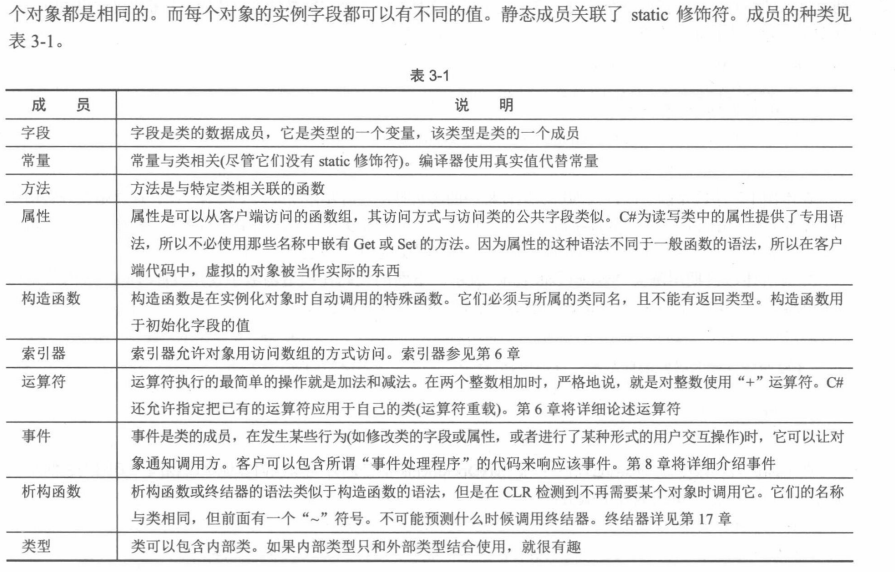
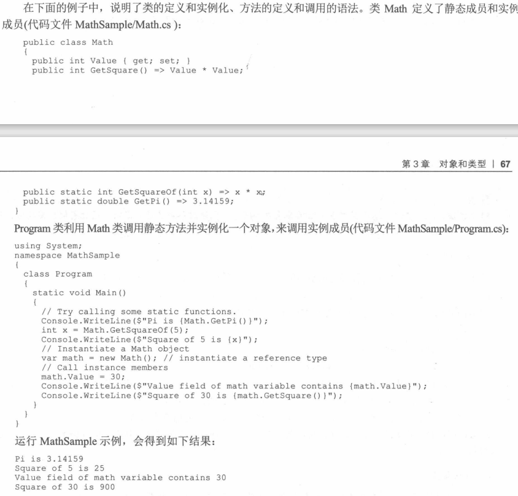
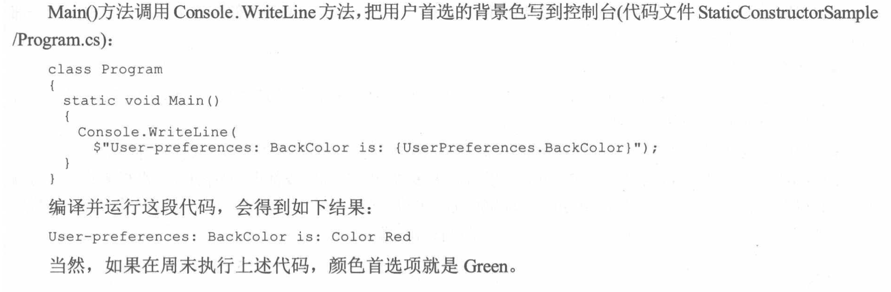

#  《C#高级编程》学习笔记（3）

## 第 3 章 对象和类型



### 3.1 创建及使用类

本章将讨论与类相关的基本语法，第 4 章将介绍继承以及与继承相关的特性。

### 3.2 类和结构

类和结构实际上都是创建对象的模板，每个对象都包含数据，并提供了处理和访问数据的方法。

结构不同于类的是，它们不需要在堆上分配空间（类是引用类型，总是存储在堆上），而结构是值类型，通常存储在栈上，且结构也不支持继承。

较小的数据类型可以使用结构，以提高性能。在堆栈上存储值类型可以避免垃圾收集。

>类的对象是存储在堆空间中，结构存储在栈中。堆空间大，但访问速度较慢，栈空间小，访问速度相对更快。故而，当我们描述一个轻量级对象的时候，结构可提高效率，成本更低。当然，这也得从需求出发，假如我们在传值的时候希望传递的是对象的引用地址而不是对象的拷贝，就应该使用类了。

对于类和结构，都是用`new`来声明实例，在下面的例子中，类和结构的字段值都默认为0：

```c#
var myCustomer = new PhoneCustomer(); // works for a class
var myCustomer2 = new PhoneCustomerStruct(); // works for a struct
```

在大多数情况下，类要比结构常用得多，但类的对象通过引用传递，而结构类型的对象按值传递，除非特别说明，否则就可以假定用于类的代码也适用于结构。

### 3.3 类

类包含成员，成员可以是静态成员或是实例成员。

静态成员属于类，而实例成员属于对象。



```c#
class PhoneCustomer
{
  /**
  可以使用 const 关键字声明常量，声明 public，就可以在类的外部访问它
  const 会被编译器识别并优化，在使用的地方将其取代成该常量
  */
  public const string DayofSendingBill = "Monday";
  /**
  readonly 保证对象的字段不能改变，与 const 修饰符不同的是，只读字段不会被编译器识别并替换
  也就是说，只是保证它可变，但并不会被硬编码到编译后的代码中。
  */
  private static readonly unit s_maxDocuments;
}
var customer1 = new PhoneCustomer();
customer1.FirstName = "Simon";
```

#### 3.3.3 属性

属性（property）的概念是，它是一个方法或是一对方法，但在客户端代码看来，它们确实是一个字段。

```c#
class PhoneCustomer
{
  private string _firstName;
  // FirstName 就是一个属性，包含 get 和 set 访问器，来检索和设置支持字段的值
  public string FirstName
  {
    // get 访问器不带任何参数，且必须返回字段所声明类型的值
    get
    {
      return _firstName;
    }
    // set 访问器没有任何显式参数，但编译器假定它带一个 value 参数，类型与声明相同
    set
    {
      _firstName = value;
    }
  }
  
  // 在 C# 7 中，还支持使用 => 编写
  public string theFirstName
  {
    get => _firstName;
    set => _firstName = value;
  }
  
  // 如果属性的 set 和 get 访问器中没有任何逻辑，可以使用自动实现的属性，自动实现的属性可以使用属性初始化器来初始化
  public int Age { get; set; } = 42;
  
  // 允许给属性的 get 和 set 访问器设置不同的访问修饰符，所以属性可以有公有的 get 访问器和私有的或受保护的 set 访问器。在 get 和 set 访问器中，必须有一个具备`属性`的访问级别。
  public string Name
  {
    get => _name;
    private set => _name = value;
  }
  // 自动实现的属性, 也可以设置不同的访问级别
  public int RealAge { get; private set; }
  
  /**
  只读属性，在属性定义中省略 set 访问器，就可以创建只读属性
  用 readonly 修饰符声明字段，只允许在构造函数中初始化属性的值
  
  可以创建`只读属性`，就可以创建`只写属性`，只要在属性定义中省略 get 访问器即可。只是不推荐这么做，如果一定要做，最好使用一个方法替代。
  */
  private readonly string _readOnlyName;
  public string ReadOnlyName
  {
    get => _name;
  }
  
  // 自动实现的只读属性语法糖
  // 在后台编译器会创建一个只读字段和一个属性，其 get 访问器可以访问这个字段。初始化的代码进入构造函数的实现代码，并在调用构造函数体之前调用。
  public string Id { get; } = "an Id";
}

// 当然只读属性也可以显式地在构造函数中初始化，如下：
public class Person {
  public string Name { get; }
  public Person(string name)
  {
    Name = name;
  }
}

/**
表达式体属性: 从 C#6 开始可以使用
*/
public class Person2
{
  public string Firstname { get; }
  public string LastName { get; }
  public string FullName => $"{FirstName}-{LastName}"
  public Person(string firstName, string lastName)
  {
    FirstName = firstName;
    LastName = lastName;
  }
}
```

**不可变类型**

一个类型中如果包含可以改变的成员，那它就是一个可变的类型。使用`readonly`修饰符，编译器会在状态改变时报错。如果对象没有任何可以改变的成员，只有只读（readonly）成员，那它就是一个不可变的类型，其内容只能在初始化时设置。这种类型对于多线程非常有用。因为内容不可改变，所以不需要同步。

不可变类型的一个例子是 String 类。这个类没有定义任何允许改变其内容的成员，诸如 ToUpper 的方法总是会返回一个新的字符串，但传递到构造函数的原始字符串保持不变。

#### 3.3.4 匿名类型

第 2 章讨论了 var 关键字，用于表示隐式类型化的变量。`var`与`new`关键字一起使用时，可以创建匿名类型。匿名类型只是一个继承 Object 且没有名称的类，该类的定义从初始化器中推断，类似于隐式类型化的变量。

如下：

```c#
var captain = new
{
  FirstName = "James",
  MiddleName = "T",
  LastName = "Kirk"
};
```

这会生成一个包含 FirstName、MIddleName 和 LastName 属性的对象，如果创建另一个对象，如下所示：

```c#
var doctor = new
{
  FirstName = "Leonard",
  MiddleName = "string",
  LastName = "Kirk"
};
```

那么上面两个对象的类型就相同。**只有所有属性都匹配，才能相互赋值，如`captain = doctor`**

如果已有一个实例，captain 对象还可以初始化为：

```c#
var captain = new
{
  person.FirstName,
  person.MiddleName,
  person.LastName
}
```

person 对象的属性名会投射到新对象。因为这些新对象的类型名未知，所以我们不能也不应使用新对象上的类型反射，因为这不会得到一致的结果。

#### 3.3.5 方法

正式的 C# 术语区分函数和方法。方法的定义包括：任意方法修饰符（如方法的可访问性）、返回值的类型、然后依次是方法名、输入参数的列表和方法体：

```c#
class HaHa {
  public bool IsSquare(Rectangle rect)
  {
    return (rect.Height == rect.Width);
  }
}
```

上面的定义中，不能省略返回类型（如果没有返回值，就把返回类型指定为 void），但是可以省略参数和 return。

如果方法实现只有一条语句，可以使用一个简化的语法：表达体式方法。

```c#
class HaHa {
  public bool IsSquare(Rectangle rect) => rect.Height == rect.Width;
}
```

**方法调用**



**方法的重载**

C# 支持方法的重载，只要方法的几个版本有不同的签名即可（即，方法名相同，但参数的个数或数据类型不同）。为了重载方法，只需要声明同名但参数个数或者类型不同的方法即可：

对于方法重载，仅仅通过**返回类型**、**参数名称**不足以区分它们，需要区分参数的数量或类型。

```c#
class ResultDisplayer
{
  public void DisplayResult(string result)
  {
    // implementation
  }
  
  public void DisplayResult(int result)
  {
    // implementation
  }
  
  // 参数的数量和类型也可以不同
  public int DoSomething(int x)
  {
    // invoke DoSomething with two parameters
    return DoSomething(x, 10)
  }
  
  public int DoSomething(int x, int y)
  {
    // implementation
  }
}
```

**命名的参数**

调用方法时，变量名可以不用添加到调用中，但是也可以改变调用，明确数字的含义（编译器会去掉变量名，创建一个方法调用，就像没有变量名一样，还可以改变变量的顺序，编译器会重新安排以获得正确的顺序。在使用早期的 C# 版本时，在使用了第一个命名参数以后，需要为所有参数提供名称）：

```c#
// 假如有如下方法
public void MoveAndResize(int x, int y, int width, int height)
  
// 以下几种调用是等价的
r.MoveAndResize(30, 40, 20, 40);
r.MoveAndResize(x: 30, y: 40, width: 20, height: 40);
r.MoveAndResize(x: 30, y: 40, width: 20, height: 40);
```

**可选参数**

参数也可以是可选的，必须为可选参数提供默认值，可选参数还必须是方法定义的最后的参数：

```c#
public void TestMethod(int notOptionalNumber, int optionalNumber = 42)
{
  Console.WriteLine(optionalNumber + notOptionalNumber);
}

// 这个方法可以使用一个或两个参数调用。传递一个参数，编译器就修改方法调用，给第二个参数传递 42。
TestMethod(11);
TestMethod(11, 22);

// 可以定义多个可选参数，如下所示
public void TestMethod1(int n, int opt1 = 11, int opt2 = 22, int opt3 = 33)
{
  Console.WriteLine(n + opt1 + opt2 + opt3);
}
// 这样就可以使用命名参数传递任何可选参数
TestMethod1(1, opt3: 4);
```


**个数可变的参数**

使用可选参数，可以定义数量可变的参数，但还有另一种语法允许传递数量可变的参数，且没有版本控制问题。

声明数组类型的参数，提那家 params 关键字，就可以使用任意数量的 int 参数调用该方法。

```c#
// AnyNumberOrArguments 方法的参数类型是 int[]，因此可以传递一个 int 数组，又因为 params 关键字，所以可以传递一个或任意数量的 int 值
public void AnyNumberOrArguments(params int[] data)
{
  foreach (var x in data)
  {
    Console.WriteLine(x);
  }
}

AnyNumberOrArguments(1);
AnyNumberOrArguments(1, 3, 5, 7, 11, 13);

// 如果要把不同类型的参数传递给方法，可以使用 object 数组
// 则可以使用任何类型调用这个方法
public void AnyNumberOrArguments1(params object[] data)
{
  foreach (var x in data)
  {
    Console.WriteLine(x);
  }
}
AnyNumberOrArguments1("text", 42);

// 如果 params 关键字与方法签名定义的多个参数一起使用，则 params 只能使用一次，且它必须是最后一个参数
public void AnyNumberOrArguments2(string format, params object[] data)
{
  foreach (var x in data)
  {
    Console.WriteLine(x);
  }
}
```

#### 3.3.6 构造函数

构造函数是一种特殊的方法，声明其语法就是声明一个与包含的类同名的方法，**但该方法没有返回类型**。

```c#
public class MyClass
{
  public MyClass()
  {}
}
```

一般情况下如果没有提供任何构造函数，编译器会在后台生成一个默认的，基本的构造函数（它会把所有的成员字段初始化为标准的默认值，例如引用类型为空引用，数值数据类型为0，bool 为 false）。如果这些功能不满足，就需要编写自己的构造函数。

构造函数同样支持重载，只要它们的签名有明显的区别即可：

```c#
class MyClass
{
  public MyClass()
  {
    // construction code
  }
  
  public MyClass(int number)
  {
    // overload construction code
  }
}
```

如果提供了带参数的构造函数且仅有这一个构造函数，编译器不会自动提供默认的构造函数，此时如果试图使用无参数的构造函数实例化类，就会得到一个编译错误。

也可以把构造函数定义为 private 或 procted，这样不相关的类就不能访问它们，也会使得类不能使用`new`运算符在外部代码中实例化。（但可以在类中编写一个公有静态属性或方法，以实例化该类）。

```c#
public class MyNumber
{
  // 
  private static MyNumber m_instance;
  private int _number;
  // 私有构造函数，只能在类中实例化 MyNumber 本身
  private MyNumber(int number)
  {
    _number = number;
  }
  // 静态属性 Instance 返回字段 m_instance
  // 当这个字段尚未初始化时，调用构造函数创建新实例，从而做到单例模式
  public static MyNumber Instance
  {
    get => m_instance ?? (m_instance = new Number(42));
  }
}
```

这种做法在两种情况下是有用的：

- 类仅用作某些静态成员或属性的容器，因此永远不会被实例化，这种情况下，可以用`static`修饰符声明类。使用这个修饰符，类只能包含静态成员，不能实例化。
- 类仅能通过调用某个静态成员函数来实例化（即对象实例化的类工厂方法），如上面的单例模式。

**表达式和构造函数**

构造函数可以通过一个表达式体来实现：

```c#
public class Singleton
{
  private static Singleton s_instance;
  private int _state;
  private Singleton(int state) => _state = state;
  
  public static Singleton Instance => s_instance ?? (s_instance = new Singleton(42));
}
```

**从构造函数中调用其他构造函数**

一个类中有几个构造函数，以容纳某些可选参数，这些构造函数包含一些共同的代码，如下：

```c#
class Car
{
  private string _description;
  private uint _nWheels;
  
  public Car(string description, uint nWheels)
  {
    _description = description;
    _nWheels = nWheels;
  }
  
  public Car(string description)
  {
    _description = description;
    _nWheels = 4;
  }
}
```

这两个构造函数初始化相同的手段，C# 有一个特殊的语法，称为构造器函数初始化器，可以实现此目的：

```c#
class Car
{
  private string _description;
  private uint _nWheels;
  
  public Car(string description, uint nWheels)
  {
    _description = description;
    _nWheels = nWheels;
  }
  // this 关键字仅调用参数最匹配的那个构造函数
  public Car(string description): this(description, 4)
  {
  }
}
```

C# 构造函数初始化器可以包含对同一个类的另一个构造函数的调用，也可以包含对直接基类的构造函数的调用（使用相同的语法，但应该使用`base`关键字替代`this`）。

**静态构造函数**

前面的构造函数是实例构造函数，只要创建类的对象，就会执行它。

C# 的另一个特征是可以给类编写无参数的静态构造函数。这种构造函数只执行一次（编译器并没有确保什么时候执行静态构造函数，只保证了这些静态构造函数至多运行一次，即在代码引用类之前调用它，因此，不应该把要求在某个特定时刻执行的代码放在静态构造函数中，也不能预计不同类的静态构造函数按照什么顺序执行）。

```c#
class MyClass
{
  static MyClass()
  {
    // initialization code
  }
  // rest of class definition
}
```

编写静态构造函数的一个原因是，类有一些静态字段或属性，需要在第一次使用类之前，从外部源中初始化这些静态字段和属性。

**静态构造函数没有访问修饰符**，其他C#代码从来不显式调用它，但是在加载类时总会运行，所以像 public 或 private 这样的访问修饰符没有任何意义。出于同样的原因，静态构造函数不能带任何参数，一个类只能有一个静态构造函数，静态构造函数也只能访问类的静态成员，不能访问类的实例成员。

如果任何静态字段有默认值，执行器会在调用静态构造函数之前分配他们。实例构造函数和静态构造函数可以在同一个类中定义，因为两者的执行时机并不同，所以不会有冲突。

```c#
public enum Color
{
  White,
  Red,
  Green,
  Blue,
  Black
}

public static class UserPreferences
{
  public static Color BackColor { get; }
  static UserPreferences()
  {
    DateTime now = DateTime.Now;
    if (now.DayOfWeek == DayOfWeek.Saturday || now.DayOfWeek == DayOfWeek.Sunday) {
      BackColor = Color.Green;
    } else {
      BackColor = Color.Red;
    }
  }
}
```



### 3.4 结构

之前介绍了类如何封装程序中的对象，通过这种方式可以将数据存储在堆中，并且可以在数据的生存周期上获得很大的灵活性，但性能会有一定的损失（因为托管堆的优化，这种性能损失较小）。

但是有时仅需要一个比较小的数据结构，出于性能顾虑，我们最好使用结构，像如下这种类结构：

```c#
public class Dimensions
{
  public dobule Length { get; }
  public dobule Width { get; }
  public Dimensions(dobule length, dobule width)
  {
    // 即便是没有 setter 的属性，或是 readonly 标识的字段，在构造函数中也能够被赋值
    Length = length;
    Width = width;
  }
}
```

上面的代码定义了一个类，只用来存储某一项的长度和宽度，并不需要类的很多方法，也不需要从类中继承，只需要存储两个 dobule 类型的数据即可。

因此，只需要修改代码，用关键字`struct`代替`class`，定义一个结构而不是类。

```c#
public struct Dimensions
{
  public dobule Length { get; }
  public dobule Width { get; }
  public Dimensions(dobule length, dobule width)
  {
    Length = length;
    Width = width;
  }
  // 还可以添加 Diagonal 属性，以调用 Math 类的 Sqrt 方法
  // 也可以使用表达式体属性
  public dobule Diagonal => Math.Sqrt(Length * Length + Width * Width);
}
```

结构是值类型，不是引用类型，存储在栈中，其生存期的限制与简单的数据类型一样。所以：

- 结构不支持继承。
- 对于结构，构造函数的工作方式有一些区别。如果没有提供默认的构造函数，编译器会自动提供一个，把成员初始化为默认值
- 使用结构，可以指定字段如何在内存中布局（16章会详细论述）

因为结构实际上是把数据项组合在一起，所以有时大多数或者全部字段都声明为 public。

下面详细说明类和结构之间的区别：

#### 3.4.1 结构是值类型

```c#
// 如果是类定义，初始化需要使用 new 关键字
var point = new Dimensions();
point.Length = 3;
point.Width = 6;

// 如果是结构定义，则可以直接把结构作为类型进行赋值, 也可以使用 new 关键字
Dimensions point;
point.Length = 3;
poing.Width = 6;
```

在使用前所有元素都必须初始化，如果未初始化又使用了该字段，如下面的代码，编译器就会产生一个编译错误，提醒用户使用了未初始化的变量

```c#
Dimensions point;
dobule d = point.Length; // error
```

如果对结构使用 new 关键字但没有传参，编译器会传入一些默认的参数以初始化它的属性（它会把所有的成员字段初始化为标准的默认值，例如引用类型为空引用，数值数据类型为0，bool 为 false）。

```c#
Dimensions point = new Dimensions();
dobule d = point.Length; // 0
```

结构对于程序性能的影响可能是正面的，也可能是负面的：

- 正面：为结构分配内存时，速度非常快，因为它们将内联或者保存在栈中，结构因超出了作用域被删除时，速度也很快，不需要等待垃圾收集。
- 负面：只要把结构作为参数传递，或者把一个结构赋予给另一个结构，结构的所有内容就会被复制，这样就会有性能损失，根据结构的大小， 性能损失也不同。（而如果是类，则只会复制其引用指针）如果把结构作为 ref 参数传递以避免性能损失，这样传递速度虽然可以跟类的传递速度一样快，但如果这样做，就要注意被调用的方法可以改变结构的值了。

注意，结构主要用于小的数据结构。

#### 3.4.2 只读结构

使用 C# 7.2 时，readonly 修饰符可以用于结构，因此编译器会保证结构体的不变性。

```c#
public readonly struct Dimensions
{
  public dobule Length { get; }
  public dobule Width { get; }
  public Dimensions(dobule length, dobule width)
  {
    Length = length;
    Width = width;
  }
  // 还可以添加 Diagonal 属性，以调用 Math 类的 Sqrt 方法
  // 也可以使用表达式体属性
  public dobule Diagonal => Math.Sqrt(Length * Length + Width * Width);
}
```

使用 readonly 修饰符，如果创建结构体后类型更改了字段或属性，编译器就会报错。正因如此，编译器会主动优化代码，在使用 readonly 修饰符的结构体作为参数传递时，编译器会使用引用，因为能够确定它的值永远不会改变。

#### 3.4.3 结构和继承

结构不是为继承设计的。这意味着它不能从一个结构中继承，唯一的例外时对应的结构最终派生于类`System.Object`，因此结构也可以访问甚至重写`System.Object`中的方法——如`ToString()`方法。

结构的继承链：

```txt
System.Object -> System.ValueType -> 具体的结构
```


#### 3.3.4 结构的构造函数

结构定义构造函数的方式与类相同。

默认构造函数把字段置为对应的空值，该默认构造函数不会被重载覆盖（跟类的行为不同，PS：这代表着你永远可以无参数的`new`一个或声明一个结构体）。

另外，可以像类那样为结构提供 Close 或 Dispose 方法。详细会在 17 章讨论。

#### 3.4.5 ref 结构


> 本次阅读至 P111  3.4.5 ref 结构 下次阅读应至 P126

