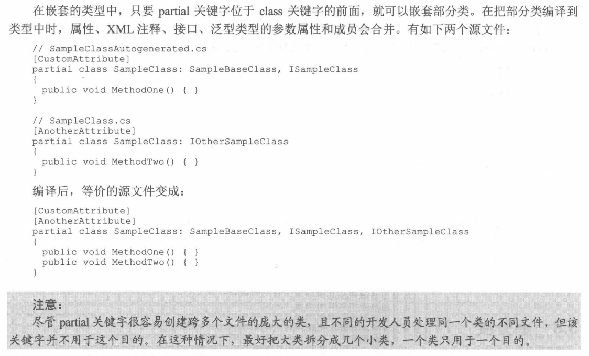
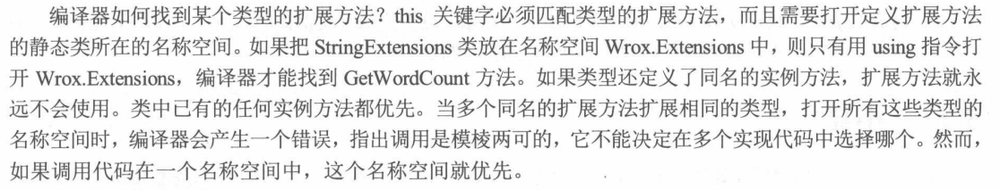
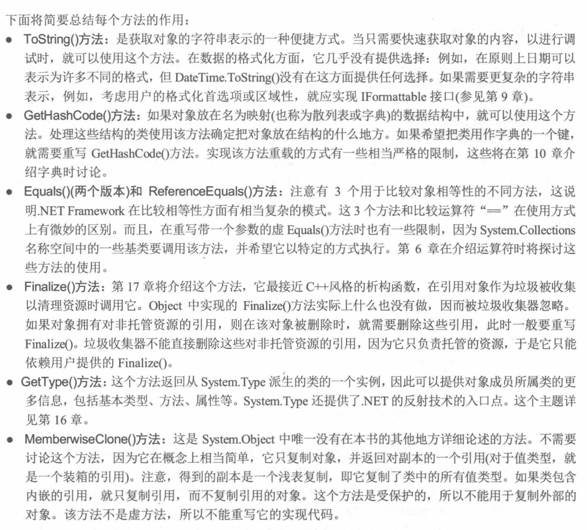
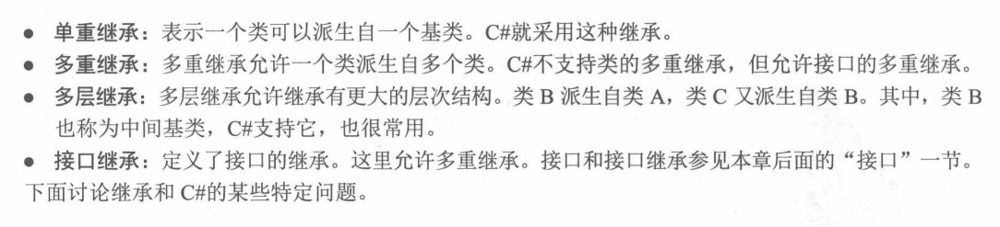
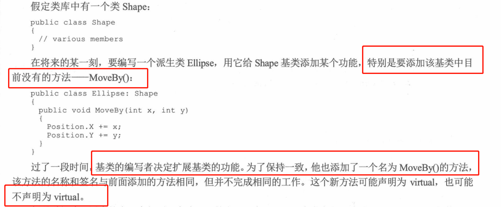
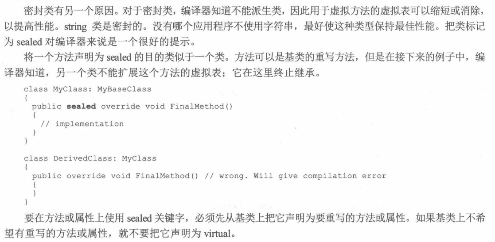

#  《C#高级编程》学习笔记（4）

## 第 3 章 对象和类型

### 3.8 部分类

partial 关键字允许把类、结构或者方法或者接口放在多个文件中，然后让编译器去将它们自动合并。

该关键字的用法是：把 partial 放在 class、struct 或 interface 关键字的前面。

如果声明类时使用了下面的关键字，则这些关键字必须应用于同一个类的所有部分：public、private、protected、internal、abstract、sealed、new、一般约束。




部分类中也可以包含【部分方法】，【部分方法】的实现代码可以放在【部分类】的任何地方，也可以没有具体的实现（编译器会自动删除这个方法调用，但【部分方法】必须是 void 类型，否则编译器在没有实现代码的情况下无法删除调用）

```c#
partial class SampleClass
{
  public partial void APartialMethod();
}

// another file
partial class SampleClass: IOtherSampleClass
{
  public void APartialMethod()
  {
    // 具体实现
  }
}
```

### 3.9 扩展方法

扩展方法是给对象添加功能的另一个选项，在不能使用继承时（比如类是密封的），也可以使用这个选项。

> 扩展方法也可以用于扩展接口，这样实现该接口的所有类就有了公共功能。

扩展方法是静态方法，它是类的一部分，但实际上没有放在类的源代码中（PS：这句话是给正常人理解的吗？？？）。

（还是 AI 的解释靠谱一点）

> chatGPT：
>
> 在 C# 中，可以使用扩展方法来扩展一个类的方法，而无需使用继承。
>
> 扩展方法是一种特殊的静态方法，它可以在现有的类中添加新的方法，而无需修改原始类的定义。扩展方法的语法如下所示：
>
> ```csharp
> public static class ExtensionClass
> {
>     public static void NewMethod(this OriginalClass original)
>     {
>         // 扩展方法的实现
>     }
> }
> ```
>
> 在上面的代码中，`ExtensionClass` 是一个静态类，其中定义了一个扩展方法 `NewMethod`。这个方法的第一个参数使用 `this` 关键字来指定要扩展的类型，这里是 `OriginalClass`。在方法体内，可以实现扩展方法的具体逻辑。
>
> **使用扩展方法时，需要注意以下几点**：
>
> 1. 扩展方法必须定义在一个静态类中。
> 2. 扩展方法必须是静态的。
> 3. 第一个参数必须使用 `this` 关键字来指定要扩展的类型。
>
> 使用扩展方法时，可以像调用普通方法一样调用它们：
>
> ```csharp
> OriginalClass original = new OriginalClass();
> original.NewMethod();
> ```
>
> 通过扩展方法，可以在不修改原始类定义的情况下，为现有的类添加新的方法，从而实现对类的功能进行扩展。这种方式可以提高代码的可读性和可维护性。



### 3.10 Object 类

所有的 .NET 类最终都派生自 System.Object。实际上如果在定义类的时候没有指定基类，编译器就会自动假定这个类派生自 Object。对于结构，这个派生是间接的：结构总是派生自 System.ValueType，而 System.ValueType 又派生自 System.Object。

它的实际意义是，开发者除了可以访问自己定义的方法和属性外，还可以访问许多共有的和受保护的成员方法，这些方法也可以自己来定义并覆盖。



## 第4章 继承

### 4.1 面向对象

面向对象是 C# 的一个重要概念，而面向对象的三个最重要概念是继承、封装和多态性。

本章介绍如何创建类的层次结构，多态性如何应用与 C#，还会描述与继承相关的所有 C# 关键字。

### 4.2 继承的类型

继承有几种，以下是 C# 在继承方面支持和不支持的功能：



#### 4.2.1 多重继承

一些语言（如 C++、Python）支持多重继承，即一个类继承自多个类。但多重继承会给生成的代码增加复杂性，还会带来一些性能开销。

但 C# 允许类型派生自多个接口，一个类型也可以实现多个接口。这说明，C# 类可以派生自另一个类和任意多个接口。

> chatGPT
>
> Q：相比于 Python 和 C++ 这类可以多重继承的语言，C# 为什么要这么设计呢？举个例子？
>
> A：C# 在设计上选择了不支持直接的多重继承，而是通过接口实现多重继承的功能。这是为了解决多重继承带来的一些问题，同时提供更好的语言安全性和可维护性。
>
> 一方面，直接的多重继承可能引发"菱形继承"问题，即一个类同时继承了两个具有相同基类的类，导致在调用基类成员时产生二义性。这种二义性会增加代码的复杂性，使得代码难以理解和维护。
>
> 另一方面，直接的多重继承也会引发"资源冲突"问题，即多个基类定义了相同的成员，而子类继承了这些基类，导致在子类中出现重复的成员定义。这样会增加代码冗余，降低代码的可维护性和可读性。
>
> 通过使用接口实现多重继承，C# 可以避免上述问题。接口只定义契约，不包含实现，因此不会引发资源冲突和二义性的问题。同时，接口还提供了更好的代码组织和可扩展性，使得类的设计更加灵活和可维护。
>
> 举个例子，假设我们有一个 `Animal` 类作为基类，同时有 `IFlyable` 和 `ISwimable` 接口定义了飞行和游泳的能力。在 C# 中，我们可以这样设计：
>
> ```csharp
> public abstract class Animal
> {
>     // 基类的成员和行为
>     // ...
> }
> 
> public interface IFlyable
> {
>     void Fly();
> }
> 
> public interface ISwimable
> {
>     void Swim();
> }
> 
> public class Bird : Animal, IFlyable
> {
>     public void Fly()
>     {
>         // 实现飞行的逻辑
>         // ...
>     }
> }
> 
> public class Fish : Animal, ISwimable
> {
>     public void Swim()
>     {
>         // 实现游泳的逻辑
>         // ...
>     }
> }
> 
> public class Duck : Animal, IFlyable, ISwimable
> {
>     public void Fly()
>     {
>         // 实现飞行的逻辑
>         // ...
>     }
> 
>     public void Swim()
>     {
>         // 实现游泳的逻辑
>         // ...
>     }
> }
> ```
>
> 在这个例子中，`Bird` 类继承了 `Animal` 基类，并实现了 `IFlyable` 接口，表示鸟可以飞行。`Fish` 类继承了 `Animal` 基类，并实现了 `ISwimable` 接口，表示鱼可以游泳。`Duck` 类继承了 `Animal` 基类，并同时实现了 `IFlyable` 和 `ISwimable` 接口，表示鸭子既可以飞行又可以游泳。
>
> 通过接口的灵活组合，我们可以实现类似多重继承的效果，同时避免了直接多重继承可能带来的问题。这样的设计使得代码更加清晰、可读性更强，并且提高了代码的可维护性和扩展性。

#### 4.2.2 结构和类

结构是值类型，类是引用类型。虽然每个结构都自动派生自 System.ValueType，也可以实现接口，但不支持继承。

换言之，结构不支持【实现继承】，但支持【接口继承】。


### 4.3 实现继承

```csharp
// 声明一个类继承另一个类
class MyDerivedClass: MyBaseClass
{
  // members
}

// 如果类也派生自接口，则用逗号分隔列表中的基类和接口
public class MyDerviedClass1: MyBaseClass, IInterface1, IInterface2
{
  // members
}
```

**注意，如果类和接口都用于派生，则类总是必须放在接口的前面**。

如果没有指定基类，编译器就会假定 System.Object 是基类。

#### 4.3.1 虚方法

把一个基类方法声明为 virtual，就可以在任何派生类中重写该方法：

```csharp
public class Shape
{
  public virtual void Draw() => Console.WriteLine($"shape")
}
```

也可以把属性声明为 virtual。

```csharp
public class Shape
{
  public virtual int Size { get; set; }
}
```

在 Java 中，所有的函数默认都是虚拟的，但 C# 和 C++ 则不同，除非显式指定，否则函数就不是虚拟的。

在 C++ 中，虚拟函数可以在派生类中直接被覆盖，但 C# 不同，C# 要求派生类的函数在重写另一个函数时，要使用`override`关键字显式声明，这种语法避免了 C++ 中很容易发生的潜在运行错误。

```csharp
public class Position
{
  public override string ToString() => $"X, Y"
}
```

`virtual`字段只对类中的实例函数和实例属性有用，静态成员字段和静态函数都不能声明为 virtual。

#### 4.3.2 多态性

> chatGPT
>
> Q：C# 中继承的多态性是什么意思？
>
> A：在C#中，继承的多态性是指一个基类的对象可以被其派生类的对象替代，并且在运行时会根据实际对象的类型来调用相应的方法。这意味着，通过继承，我们可以使用基类类型的引用来引用派生类的对象，并且可以根据实际对象的类型来调用相应的方法。
>
> 多态性在面向对象编程中非常重要，它允许我们编写更灵活和可扩展的代码。通过多态性，我们可以编写通用的代码，能够处理多种不同类型的对象，而无需关心具体的对象类型。这样可以提高代码的可重用性和可维护性。
>
> 在C#中，实现多态性的关键是使用虚方法和重写方法。通过在基类中声明虚方法，然后在派生类中使用`override`关键字重写这些方法，我们就可以实现多态性。当调用虚方法时，实际执行的是派生类中重写的方法，而不是基类中的方法。
>
> 以下是一个简单的示例，演示了继承的多态性：
>
> ```csharp
> class Animal
> {
>     public virtual void MakeSound()
>     {
>         Console.WriteLine("The animal makes a sound.");
>     }
> }
> 
> class Dog : Animal
> {
>     public override void MakeSound()
>     {
>         Console.WriteLine("The dog barks.");
>     }
> }
> 
> class Cat : Animal
> {
>     public override void MakeSound()
>     {
>         Console.WriteLine("The cat meows.");
>     }
> }
> 
> class Program
> {
>     static void Main(string[] args)
>     {
>         Animal animal = new Animal();
>         Animal dog = new Dog();
>         Animal cat = new Cat();
> 
>         animal.MakeSound();  // 输出："The animal makes a sound."
>         dog.MakeSound();     // 输出："The dog barks."
>         cat.MakeSound();     // 输出："The cat meows."
>     }
> }
> ```
>
> 在上面的示例中，`Animal` 类是基类，`Dog` 类和 `Cat` 类是派生类。通过创建不同类型的对象并调用它们的 `MakeSound` 方法，我们可以看到实际执行的是派生类中重写的方法，这就是继承的多态性的体现。

#### 4.3.3 隐藏方法

> ChatGPT：
>
> 在C#中，隐藏方法是指在派生类中重新定义与基类中具有相同名称的方法。通过使用关键字`new`来隐藏基类中的方法。隐藏方法允许派生类使用自己的实现来覆盖基类的方法，而不会调用基类的方法。
>
> 当在派生类中使用`new`关键字隐藏基类方法时，编译器会发出警告，提示开发人员可能会出现隐藏方法的情况。这是因为隐藏方法可能会导致代码的可读性和维护性问题。因此，在使用隐藏方法时，开发人员应该谨慎考虑，并确保隐藏方法的使用是必要的。
>
> 下面是一个示例，展示了如何在派生类中隐藏基类方法：
>
> ```csharp
> class BaseClass
> {
>     public void Method()
>     {
>         Console.WriteLine("BaseClass Method");
>     }
> }
> 
> class DerivedClass : BaseClass
> {
>     public new void Method()
>     {
>         Console.WriteLine("DerivedClass Method");
>     }
> }
> 
> class Program
> {
>     static void Main(string[] args)
>     {
>         BaseClass baseObj = new BaseClass();
>         DerivedClass derivedObj = new DerivedClass();
> 
>         baseObj.Method();    // 输出：BaseClass Method
>         derivedObj.Method(); // 输出：DerivedClass Method
> 
>         BaseClass derivedAsBase = new DerivedClass();
>         derivedAsBase.Method(); // 输出：BaseClass Method
>     }
> }
> ```
>
> 在上面的示例中，`DerivedClass`隐藏了`BaseClass`中的`Method`方法。当使用派生类的实例调用`Method`方法时，会调用派生类中的方法。**但是，当将派生类的实例赋值给基类的引用时**，调用`Method`方法会调用基类中的方法，而不是派生类中的方法。**这是因为隐藏方法是静态绑定的，即在编译时就确定了调用的方法**，而不是根据对象的类型在运行时进行动态绑定。

也就是说，隐藏方法的`new`关键字，是用来覆盖父类的不声明为 virtual 的方法的。

在大多数情况下，对于派生的子类而言都是要重写方法而不是隐藏方法，在使用隐藏方法时，C# 编译器也会给开发人员发出警告。那隐藏方法是用来干什么的？



也就是说，这个是用来当基类“坑”了子类的时候，子类为了兼容的一种选项做法。

#### 4.3.4 调用方法的基类版本

C# 有一种特殊的语法用于从派生类中调用方法的基类版本：`base.<MethodName>()`。

```csharp
public class BaseClass
{
  public virtual void SomeMethod()
  {
    Debug.Log("BaseClass");
  }
}

public class IntermediateClass : BaseClass
{
  public override void SomeMethod()
  {
    base.SomeMethod() // 调用 BaseClass 的方法
    Debug.Log("IntermediateClass");
  }
}

public class DerivedClass : IntermediateClass
{
  public override void SomeMethod()
  {
    base.SomeMethod(); // 调用IntermediateClass的方法
  }
}
```

#### 4.3.5 抽象类和抽象方法

C# 允许把类和方法声明为 abstract。抽象类不能实例化，抽象方法则不能直接实现，必须在非抽象的派生类中重写。如果类包含抽象方法，则该类也必须声明为抽象的。

```csharp
public abstract class Shape
{
  public abstract void Resize(int width, int height);
}
```

而从抽象基类中派生类型时，需要实现所有抽象成员。否则编译器会报错。抽象类也中可以包含具体的方法实现（但该方法不能标记为 abstract）。

#### 4.3.6 密封类和密封方法

给类添加`sealed`修饰符，表示不允许创建该类的子类。如果密封一个类的方法，就表示不能重写该方法（但是在子类方法中还是可以用`new`关键字重写）。

使用密封类和密封方法的原因如下：



#### 4.3.7 派生类的构造函数

在创建派生类的实例时，实际上会有多个构造函数起作用，构造函数总是按照层次结构的顺序调用，先调用 System.Object 类的构造函数，再按照层次结构由上向下进行。

如果自定义构造函数，就需要用构造函数初始化基类的构造函数。

注意，**如果基类的构造函数中包含入参**，那么派生类也需要手动调用该构造函数，传入参数，调用方法如下：

```csharp
public class Person
{
    public string Name { get; set; }
    public string damn {
        get => Name;
    }
    public Person(
        string name
    )
    {
        Name = name;
    }
}

class Jack : Person
{
  // 使用 base 语法调用 Person 构造函数（跟普通函数调用一样也可以用命名参数）
    public Jack(string name): base(name: name)
    {
        base.Name = name;
    }
}
```

如果没有在默认的构造函数中初始化成员，则编译器会自动把引用类型初始化为 null，值类型初始化为 0，布尔值类型初始化为 false。

### 4.4 修饰符

修饰符可以指定方法的可见性（public/private）；还可以指定一个项的本质（virtual abstract）。

#### 4.4.1 访问修饰符


> 本次阅读至 P126  4.3.7 派生类的构造函数 下次阅读应至 P141

