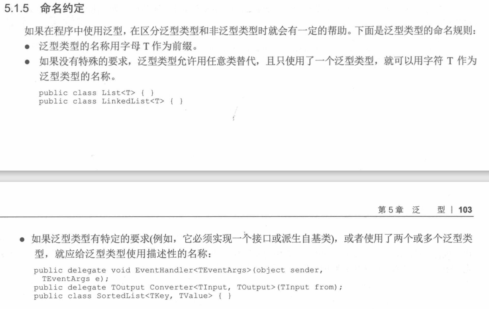
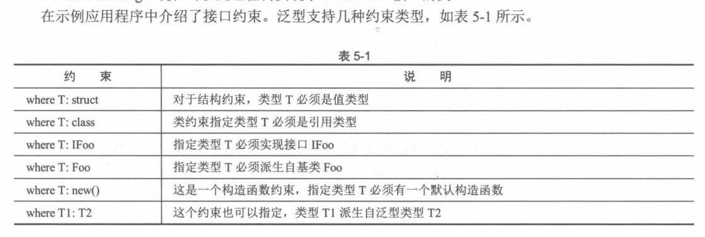
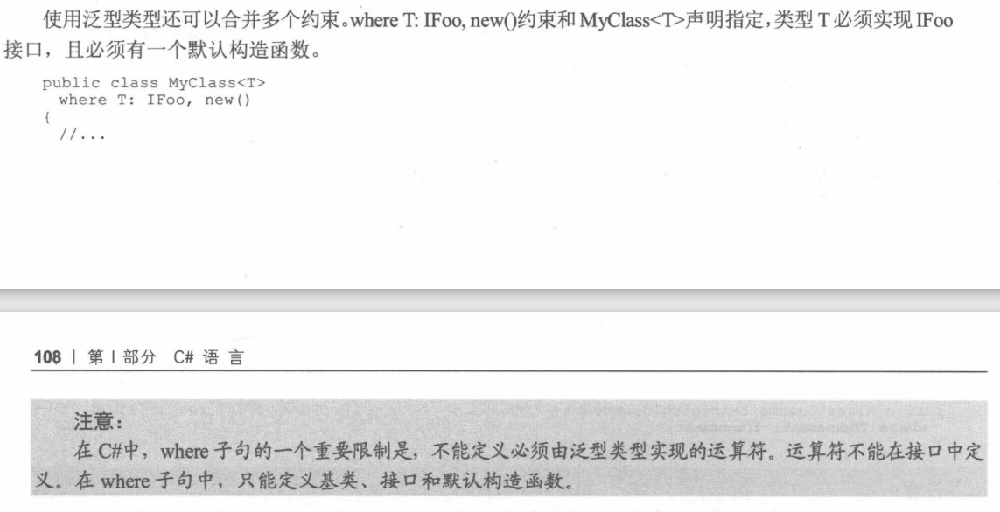

#  《C#高级编程》学习笔记（5）

## 第5 章 泛型

### 5.1 泛型概述

泛型让开发者不必给不同的类型编写功能相同的许多方法或类，只创建一个方法或类即可。

另一个减少代码的选项是使用 Object 类，但是用派生自 Object 类的类型进行传递不是类型安全的。

泛型不仅限于类，本章还将介绍用于接口和方法的泛型。

泛型不仅存在于 C# 中，C++ 的模板就与泛型相似。

> chatGPT
>
> Q：C# 的泛型和 C++ 的模板有什么区别？
>
> A：
>
> C#的泛型和C++的模板都是用于实现通用编程的特性，但它们在语法和实现上有一些区别。
>
> 1. 语法差异：
>    - C#的泛型使用尖括号（<>）来指定类型参数，如`List<T>`。
>    - C++的模板使用尖括号（<>）或双尖括号（<<>>)来指定模板参数，如`vector<T>`或`map<Key, Value>`。
>
> 2. 编译时和运行时：
>    - **C#的泛型是在编译时进行类型检查和实例化的，生成的IL代码只包含一份通用代码，可以在运行时根据需要生成具体的类型**。
>    - **C++的模板是在编译时进行代码生成的，每个具体的模板参数都会生成一份对应的代码**。
>
> 3. 实现方式：
>    - **C#的泛型是通过类型擦除实现的，编译器在编译时将泛型类型替换为实际的类型，并进行类型检查**。
>    - **C++的模板是通过代码生成实现的，编译器会根据模板参数生成对应的代码，每个具体的参数都会生成一份独立的代码**。
>
> 下面是一个简单的示例来说明它们的区别：
>
> C#泛型示例：
>
> ```csharp
> public class MyGenericClass<T>
> {
>     private T data;
> 
>     public MyGenericClass(T value)
>     {
>         data = value;
>     }
> 
>     public T GetData()
>     {
>         return data;
>     }
> }
> 
> // 使用泛型类
> MyGenericClass<int> intObj = new MyGenericClass<int>(10);
> int value = intObj.GetData(); // 获取int类型的数据
> ```
>
> C++模板示例：
>
> ```cpp
> template <typename T>
> class MyTemplateClass
> {
> private:
>     T data;
> 
> public:
>     MyTemplateClass(T value)
>     {
>         data = value;
>     }
> 
>     T GetData()
>     {
>         return data;
>     }
> };
> 
> // 使用模板类
> MyTemplateClass<int> intObj(10);
> int value = intObj.GetData(); // 获取int类型的数据
> ```
>
> 在这个示例中，我们定义了一个泛型类（C#）和一个模板类（C++），它们都可以存储和返回一个特定类型的数据。通过在实例化时指定类型参数，我们可以创建具体类型的对象并使用它们。
>
> 总结起来，C#的泛型和C++的模板都是用于实现通用编程的特性，但它们在语法和实现上有所不同。C#的泛型是通过类型擦除实现的，而C++的模板是通过代码生成实现的。

#### 5.1.1 性能

泛型的一个主要优点是性能。不需要进行过多的强制类型转换操作。

> chatGPT：
>
> 当涉及到性能优化时，使用泛型的 List 类比 ArrayList 类更好，因为 List 类是泛型的，可以在编译时执行类型检查，避免了装箱和拆箱操作，从而提高了性能。下面是一个使用泛型的 List 和 ArrayList 的例子：
>
> ```csharp
> using System;
> using System.Collections;
> 
> public class Program
> {
>     public static void Main(string[] args)
>     {
>         // 使用泛型的 List
>         List<int> numbersList = new List<int>();
>         numbersList.Add(1);
>         numbersList.Add(2);
>         numbersList.Add(3);
> 
>         // 使用 ArrayList
>         ArrayList numbersArrayList = new ArrayList();
>         numbersArrayList.Add(1);
>         numbersArrayList.Add(2);
>         numbersArrayList.Add(3);
> 
>         // 遍历 List（每个元素本身就是 int，无需转换）
>         foreach (int number in numbersList)
>         {
>             Console.WriteLine(number);
>         }
> 
>         // 遍历 ArrayList（每个元素都要经历从 object 到 int 的强制类型转换）
>         foreach (int number in numbersArrayList)
>         {
>             Console.WriteLine(number);
>         }
>     }
> }
> ```
>
> 在上面的例子中，我们创建了一个泛型的 List<int> 和一个非泛型的 ArrayList，然后向它们中添加了一些整数。最后，我们使用 foreach 循环遍历这两个集合并打印出每个元素。
>
> 使用泛型的 List 可以直接指定元素的类型，而 ArrayList 存储的是 object 类型，需要进行装箱和拆箱操作。因此，使用泛型的 List 在性能方面更优。

#### 5.1.2 类型安全

跟上面的例子一样，如果在 ArrayList 中添加一个对象，最后在遍历的时候会由于无法转换成 int 而出现一个运行时错误。而在泛型类 List\<T\> ，由于只能添加 int 类型，若添加类型到 List 中，编译器会提前报错。

#### 5.1.3 二进制代码的重用

反省允许更好地重用二进制代码，不需要像 C++ 那样访问源代码，泛型类型可以在一种语言中定义，然后在其他任何`.NET`语言中使用。

#### 5.1.4 代码的扩展

编译器会把泛型类编译为本地代码，由于泛型类只定义一次且为引用类型，而包含具体值类型的类则需要定义多次且为值类型，所以能够节省编译后的占用空间。

#### 5.1.5 命名约定



### 5.2 创建泛型类

（PS：原书的例子又是一坨）

> chatGPT：
>
> Q：C# 中如何创建泛型类，以及如何在其中使用相应的泛型方法，请举一个具体的例子并详细说明
>
> A：在C#中，可以使用泛型来创建泛型类和泛型方法。泛型类可以在定义时使用占位符类型参数，然后在实例化时指定具体的类型参数。泛型方法可以在方法定义时使用类型参数，然后在调用方法时传入具体的类型参数。下面是一个具体的例子：
>
> ```csharp
> using System;
> 
> public class GenericClass<T>
> {
>     private T value;
> 
>     public GenericClass(T value)
>     {
>         this.value = value;
>     }
> 
>     public T GetValue()
>     {
>         return value;
>     }
> 
>     public void SetValue(T newValue)
>     {
>         value = newValue;
>     }
> 
>     public void GenericMethod<U>(U parameter)
>     {
>         Console.WriteLine($"Generic method called with parameter: {parameter}");
>     }
> }
> 
> public class Program
> {
>     public static void Main(string[] args)
>     {
>         // 创建泛型类的实例
>         GenericClass<int> intGenericClass = new GenericClass<int>(10);
>         int value = intGenericClass.GetValue();
>         Console.WriteLine($"Value: {value}");
> 
>         intGenericClass.SetValue(20);
>         value = intGenericClass.GetValue();
>         Console.WriteLine($"Value: {value}");
> 
>         // 调用泛型方法
>         intGenericClass.GenericMethod("Hello");
> 
>         GenericClass<string> stringGenericClass = new GenericClass<string>("World");
>         string stringValue = stringGenericClass.GetValue();
>         Console.WriteLine($"Value: {stringValue}");
> 
>         stringGenericClass.SetValue("GPT-3.5 Turbo");
>         stringValue = stringGenericClass.GetValue();
>         Console.WriteLine($"Value: {stringValue}");
> 
>         // 调用泛型方法
>         stringGenericClass.GenericMethod(42.5);
>     }
> }
> ```
>
> 在上面的例子中，我们创建了一个泛型类 GenericClass\<T\>，它有一个泛型类型参数 T。在类的实例化时，我们指定了具体的类型参数 int 和 string。泛型类中有一个泛型方法 GenericMethod\<U\>，它也有一个类型参数 U。我们通过调用泛型类的实例方法 GetValue 和 SetValue 来获取和设置值，并通过调用泛型方法 GenericMethod 来演示泛型方法的使用。
>
> 运行上面的代码，将会输出以下结果：
>
> ```
> Value: 10
> Value: 20
> Generic method called with parameter: Hello
> Value: World
> Value: GPT-3.5 Turbo
> Generic method called with parameter: 42.5
> ```
>
> 从输出结果可以看出，我们成功创建了一个泛型类 GenericClass，并在实例化时指定了不同的类型参数。同时，我们也成功调用了泛型方法 GenericMethod，并在调用时传入了不同的类型参数。这样，我们就可以在泛型类和泛型方法中使用相应的泛型类型。

注意每个处理对象类型的类都可以有泛型实现方式。另外，如果类使用了层次结构，泛型就有助于消除不必要的类型强制转换操作。

### 5.3 泛型类的功能

在创建泛型类时，还需要一些其他 C# 关键字。比如不能把 null 赋值给泛型类型，而此时可以使用 default 关键字，还可以对泛型定义约束。

#### 5.3.1 默认值

不能把 null 赋予泛型类型，原因是泛型类型也可以实例化为值类型，而 null 只能用于引用类型。为了解决这个问题，可以使用 default 关键字，当 T 是引用类型时，它会给变量赋值 null，当 T 是值类型时，它会将变量赋为 0。

```csharp
public T GetDocument()
{
  T doc = default;
}
```


#### 5.3.2 约束

使用`where`关键字可以给泛型类型添加约束，约束指定了泛型必须实现的接口，从而避免在强制类型转换时出现错误。



> 只能为默认构造函数定义构造函数约束，不能为其他构造函数定义构造函数约束。

> ChatGPT：
>
> Q：C# 中，只能为默认构造函数定义构造函数约束，不能为其他构造函数定义构造函数约束，是什么意思？
>
> A：当使用构造函数约束时，只能要求泛型类型参数具有无参数的公共构造函数。如果泛型类型参数需要使用带参数的构造函数，就不能使用构造函数约束。
>
> 下面是一个示例，展示了如何使用构造函数约束和无法使用构造函数约束的情况：
>
> ```csharp
> using System;
> 
> public class MyClass
> {
>     public MyClass()
>     {
>         Console.WriteLine("Default constructor");
>     }
> 
>     public MyClass(int value)
>     {
>         Console.WriteLine("Parameterized constructor with value: " + value);
>     }
> }
> 
> public class GenericClass<T> where T : new()
> {
>     public T CreateInstance()
>     {
>         return new T();
>     }
> }
> 
> public class Program
> {
>     public static void Main(string[] args)
>     {
>         GenericClass<MyClass> genericObj = new GenericClass<MyClass>();
>         
>         MyClass obj1 = genericObj.CreateInstance(); // 使用构造函数约束，调用默认构造函数
>         // 输出：Default constructor
>         
>         // GenericClass<MyClassWithParam> genericObj2 = new GenericClass<MyClassWithParam>();
>         // 上面这行代码会报错，因为 MyClassWithParam 类型的构造函数带有参数，无法满足构造函数约束
>         
>         MyClassWithParam obj2 = new MyClassWithParam(10);
>         // 输出：Parameterized constructor with value: 10
>     }
> }
> 
> public class MyClassWithParam
> {
>     public MyClassWithParam(int value)
>     {
>         Console.WriteLine("Parameterized constructor with value: " + value);
>     }
> }
> ```
>
> 在上面的示例中，我们定义了一个 `MyClass` 类和一个 `MyClassWithParam` 类。`MyClass` 类拥有默认构造函数和带参数的构造函数，而 `MyClassWithParam` 类只有带参数的构造函数。
>
> 然后，我们定义了一个泛型类 `GenericClass<T>`，并使用构造函数约束 `where T : new()` 来限制泛型类型参数必须具有无参数的公共构造函数。
>
> 在 `Main` 方法中，我们创建了一个 `GenericClass<MyClass>` 的实例，并调用了 `CreateInstance` 方法。由于 `MyClass` 类满足构造函数约束，它具有无参数的公共构造函数，所以可以成功创建实例并调用默认构造函数。
>
> 然而，如果我们尝试使用 `GenericClass<MyClassWithParam>`，就会导致编译错误。因为 `MyClassWithParam` 类的构造函数带有参数，无法满足构造函数约束。
>
> 最后，我们手动创建了一个 `MyClassWithParam` 类的实例，并调用了带参数的构造函数。这个操作与泛型类无关，只是为了展示带参数构造函数的使用。
>
> 总结：构造函数约束只能应用于无参数的公共构造函数，不能应用于带参数的构造函数。如果泛型类型参数需要使用带参数的构造函数，就不能使用构造函数约束。



#### 5.3.3 继承

泛型类型可以实现泛型接口，也可以派生自一个类。而类可以派生自泛型基类，也可以派生自非泛型类。

```csharp
public class A<T, U>
{
  
}

public class AChild<Z>: A<Z, string>
{
  
}
```

#### 5.3.4 静态成员

泛型类的静态成员需要特别关注。泛型类的静态成员只能在类的一个实例中共享。

```csharp
public class StaticDemo<T>
{
  public static int x;
}

StaticDemo<string>.x = 4;
StaticDemo<int>.x = 5;

Console.WriteLine(StaticDemo<string>.x) // 4
```

由于同时对一个 string 类型和一个 int 类型使用了 StaticDemo\<T\> 类，因此存在两组静态字段。

### 5.4 泛型接口

使用泛型可以定义接口，在接口中定义的方法可以带上泛型参数。而泛型参数中又有`in`和`out`关键字，但是跟前文中提到的用于实际方法参数定义中用于将入参变为只读的`in`参数和用于在调用方法时声明变量的`out`参数又不一样。

#### 5.4.1 协变和抗变

泛型接口中的 in 和 out 关键字它们用于描述抗变（逆变）与协变。

> chatGPT：
>
> Q：C# 中用于类型的 in 和 out 关键字是什么？
>
> A：
>
> 在C#中，`in`和`out`是用于泛型类型参数的关键字，用于指定类型参数的协变性和逆变性。
>
> - `in`关键字用于指定类型参数是逆变的。逆变意味着可以将泛型类型参数声明为只能作为方法的输入参数，而不能作为输出参数或返回值类型。例如，`IEnumerable<in T>`表示`T`是逆变的，因此可以将`IEnumerable<object>`赋值给`IEnumerable<string>`。
>
> - `out`关键字用于指定类型参数是协变的。协变意味着可以将泛型类型参数声明为只能作为方法的输出参数或返回值类型，而不能作为输入参数。例如，`Action<out T>`表示`T`是协变的，因此可以将`Action<string>`赋值给`Action<object>`。
>
> 这些关键字可以在定义泛型接口、泛型委托和泛型类时使用，以控制类型参数的协变性和逆变性。
>
> 当使用`in`和`out`关键字时，可以通过以下示例来说明它们的使用：
>
> ```csharp
> // 定义一个逆变的接口
> interface IContravariant<in T>
> {
>     void Process(T item);
> }
> 
> // 实现逆变接口
> class Contravariant<T> : IContravariant<T>
> {
>     public void Process(T item)
>     {
>         Console.WriteLine(item.ToString());
>     }
> }
> 
> // 定义一个协变的接口
> interface ICovariant<out T>
> {
>     T GetItem();
> }
> 
> // 实现协变接口
> class Covariant<T> : ICovariant<T>
> {
>     private T item;
> 
>     public Covariant(T item)
>     {
>         this.item = item;
>     }
> 
>     public T GetItem()
>     {
>         return item;
>     }
> }
> 
> class Program
> {
>     static void Main(string[] args)
>     {
>         // 使用逆变接口
>         IContravariant<object> contravariant = new Contravariant<string>();
>         contravariant.Process("Hello");
> 
>         // 使用协变接口
>         ICovariant<string> covariant = new Covariant<object>("World");
>         string item = covariant.GetItem();
>         Console.WriteLine(item);
>     }
> }
> ```
>
> 在上述示例中，`IContravariant<T>`是一个逆变接口，其中的`T`类型参数被声明为逆变的。`Contravariant<T>`类实现了该接口，并使用`string`作为泛型类型参数。
>
> `ICovariant<T>`是一个协变接口，其中的`T`类型参数被声明为协变的。`Covariant<T>`类实现了该接口，并使用`object`作为泛型类型参数。
>
> 在`Main`方法中，我们创建了一个逆变接口的实例`contravariant`，并将其赋值为`Contravariant<string>`的实例。然后调用`contravariant.Process`方法，将字符串"Hello"作为参数传递给`Process`方法。
>
> 我们还创建了一个协变接口的实例`covariant`，并将其赋值为`Covariant<object>`的实例。然后调用`covariant.GetItem`方法，将返回的字符串赋值给`item`变量，并将其打印出来。
>
> 通过这个例子，可以看到`in`关键字允许我们将`Contravariant<string>`赋值给`IContravariant<object>`，而`out`关键字允许我们将`Covariant<object>`赋值给`ICovariant<string>`。这展示了`in`和`out`关键字的逆变和协变特性。

在 .NET4 之前，泛型接口是不变的。但 .NET4 通过协变和抗变为泛型接口和泛型委托添加了一个重要的扩展。

在 .NET 中，参数类型是抗变的


> 本次阅读至 P144  5.4.1 协变和抗变 下次阅读应至 P159

