#  《C#高级编程》学习笔记（6）

## 第6章 运算符和类型强制转换

### 6.1 运算符和类型转换

本章将讨论运算符的内容，后面还会讨论运算符的重载，以及如何使用运算符实现定制的功能。

### 6.2 运算符

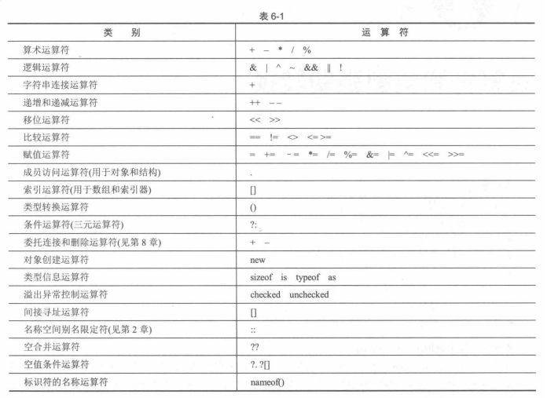

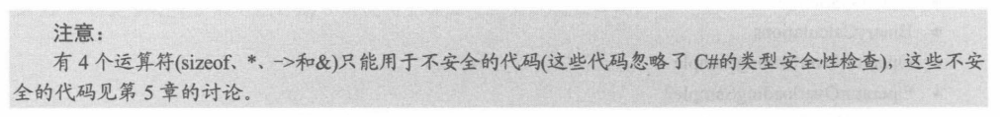

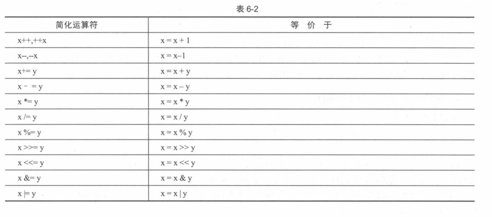

#### 6.2.1-1 checked 和 unchecked 运算符

byte 数据类型只能包含 0~255 的数，对于超过 255 的二进制数，如果再往上递增，则会导致溢出，得到 0。

为此 C# 提供了 checked 和 unchecked 运算符，如果把一个代码块标记为 checked，编译器会执行溢出检查，如果发现溢出，就抛出 OverflowException 异常。如下：

```csharp
byte b = 255;
checked
{
  b++;
}
Console.WriteLine(b);
```

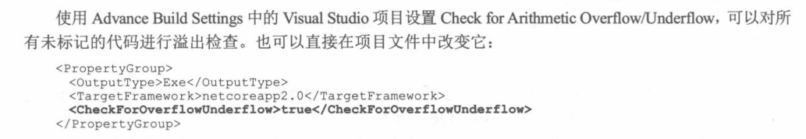

反之如果要禁止溢出检查，则可以把代码标记为 unchecked：

```csharp
byte b = 255;
unchecked
{
  b++;
}
Console.WriteLine(b); // b 的值是 0
```

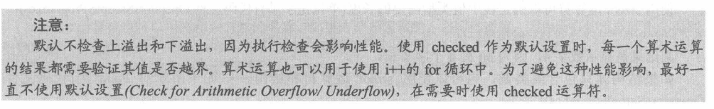

#### 6.2.1-2 is 运算符

is 运算符可以检查对象是否与特定的类型兼容。如下：

```csharp
// 检查变量是否与 object 类型兼容
int i = 10;
if (i is object)
{
  Console.WriteLine("i is an object");
}
// C# 7 以后，is 可以用来检查常量，类型和 var
if (i is 42)
{
  Console.WriteLine("i has the value 42");
}
if (i is null)
{
  Console.WriteLine("i has the value null");
}

// 可以在类型的右边声明变量，如果 is 运算符返回 true，则该变量通过对该类型的对象引用来填充
// 然后可以在这个 if 块语句范围内使用该变量
public class Person
{
  string word;
}
if (i is Person p)
{
   Console.WriteLine(p.word);
}
```

#### 6.2.1-3 as 运算符

`as`运算符用于执行引用类型的显示类型转换。**如果要转换的类型与指定的类型兼容，转换就会成功。如果类型不兼容，as 运算符就会返回 null 值**。as 运算符允许在一步中进行安全的类型转换，不需要先使用 is 运算符测试类型后再转换。

```csharp
object o1 = "Some String";
object o2 = 5;
string s1 = o1 as string; // s1 = "Some String"
string s2 = o2 as string; // s2 = null
```

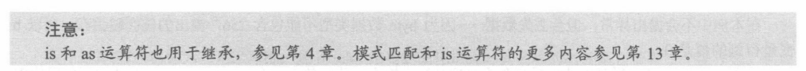

#### 6.2.1-4 sizeof 运算符

使用 sizeof 运算符可以确定栈中值类型需要的长度（单位是字节），如果结构体只包含值类型，也可以使用 sizeof 运算符。

**注意，类不能使用 sizeof 运算符**。

如果对复杂类型使用 sizeof 运算符，需要把代码放入 unsafe 块中，如下：

```csharp
public struct Point
{
  public int X { get; }
  public int Y { get; }
  public Point(int x, int y)
  {
    X = x;
    Y = y;
  }
}
unsafe
{
  Console.WriteLine(sizeof(Point));
}
```

> ChatGPT：
>
> Q：C# 运算符中的sizeof运算符的作用是什么？举个例子
>
> A：在C#中，`sizeof`运算符用于获取指定类型的大小（以字节为单位）。它可以用于计算值类型（如`int`、`float`、`char`等）的大小，以及结构体的大小。
>
> 下面是一个示例，展示了如何使用`sizeof`运算符获取类型的大小：
>
> ```csharp
> using System;
> 
> public class Program
> {
>  public static void Main()
>  {
>      Console.WriteLine(sizeof(int)); // 输出：4，int类型的大小为4字节
>      Console.WriteLine(sizeof(float)); // 输出：4，float类型的大小为4字节
>      Console.WriteLine(sizeof(char)); // 输出：2，char类型的大小为2字节
> 
>      struct MyStruct
>      {
>          public int x;
>          public bool y;
>      }
> 
>      Console.WriteLine(sizeof(MyStruct)); // 输出：8，MyStruct结构体的大小为8字节（int和bool各占4字节）
> 
>      // 注意：sizeof运算符只能用于值类型和结构体，不能用于引用类型（如类、接口、委托等）
>  }
> }
> ```
>
> 在上面的示例中，我们使用`sizeof`运算符获取了`int`、`float`和`char`类型的大小，并将结果输出到控制台。然后，我们定义了一个名为`MyStruct`的结构体，其中包含一个`int`类型和一个`bool`类型的字段。我们使用`sizeof`运算符获取了`MyStruct`结构体的大小，并将结果输出到控制台。
>
> 请注意，`sizeof`运算符只能用于值类型和结构体，不能用于引用类型（如类、接口、委托等）。此外，`sizeof`运算符返回的是类型的大小，而不是变量的大小。

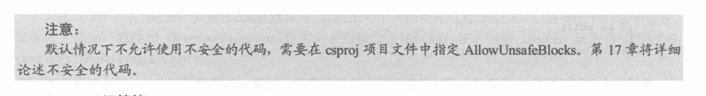

#### 6.2.1-5 typeof 运算符

typeof 运算符返回一个表示特定类型的 System.Type 类型，比如，`typeof(string)`的返回表示 System.String 类型的 Type 对象，在使用反射技术动态查找对象的相关信息时，这个运算符很有用。

#### 6.2.1-6 nameof 运算符

该运算符接受一个符号、属性或者方法、并返回其名称。

> chatGPT：
>
> Q：C# 中的 nameof 关键字如何使用？详细解释并举个例子
>
> A：
>
> 在C#中，`nameof`关键字用于获取指定标识符的名称作为字符串。它可以用于获取变量、类型、成员等的名称，这样可以避免硬编码字符串，提高代码的可维护性。
>
> 下面是一个示例，展示了如何使用`nameof`关键字：
>
> ```csharp
> using System;
> 
> public class Program
> {
>     public static void Main()
>     {
>         string name = "John";
>         Console.WriteLine(nameof(name)); // 输出：name，获取变量name的名称作为字符串
> 
>         Console.WriteLine(nameof(Console)); // 输出：Console，获取类型Console的名称作为字符串
> 
>         Console.WriteLine(nameof(Console.WriteLine)); // 输出：WriteLine，获取方法WriteLine的名称作为字符串
> 
>         Console.WriteLine(nameof(Program)); // 输出：Program，获取类Program的名称作为字符串
> 
>         Console.WriteLine(nameof(Program.Main)); // 输出：Main，获取方法Main的名称作为字符串
> 
>         // 注意：nameof关键字在编译时求值，所以它是类型安全的，不会引发运行时异常
>     }
> }
> ```
>
> 在上面的示例中，我们使用`nameof`关键字获取了变量`name`、类型`Console`、方法`WriteLine`、类`Program`以及方法`Main`的名称，并将结果输出到控制台。
>
> 请注意，`nameof`关键字在编译时求值，所以它是类型安全的，不会引发运行时异常。这意味着，如果您更改了标识符的名称，`nameof`关键字会自动更新为新的名称，而不需要手动修改字符串。这可以减少因为重构代码而导致的错误。

#### 6.2.1-7 index 运算符

使用索引运算符可以访问数组对应的元素。

```csharp
int arr1 = {1, 2, 3, 4};
int x = arr1[2]; // x == 3

var dict = new Dictionary<string, int>();
dict["first"] = 1;
int x = dict["first"];
```

索引运算符的表现也可以在类中自己进行自定义。

#### 6.2.1-8 可空类型和运算符

值类型和引用类型的一个主要区别是引用类型可以为空，而且垃圾收集器（GC）需要处理引用类型，如果用引用类型来映射可空的数据值，会影响性能。

所以在当下的 C# 版本中，支持了可空类型的值类型，其开销只是使用一个额外的布尔值来检查或设置空值。每个结构都可以定义为可空类型。

```csharp
int i1 = 1;
int? i2 = 2;
int? i3 = null;

long? l1 = null;
DateTime? d1 = null;
```

如果在程序中使用可空类型，就必须考虑 null 值在与各种运算符一起使用时的影响。

```csharp
int? a = null;
int? b = a + 4; // b = null
int? c = a * 5; // c = null

a >= b; // false
a < b; // false
```

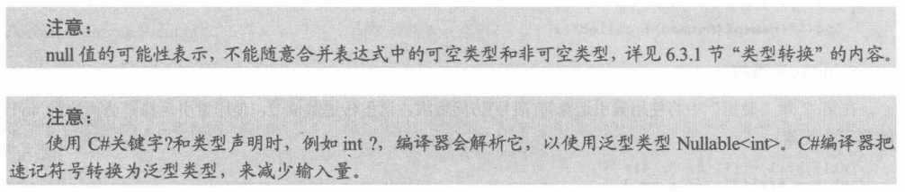

#### 6.2.1-9 空合并运算符

空合并运算符（??），可以用于处理可空类型。

```csharp
int? a = null;
int b;
b = a ?? 10; // b is 10
a = 3;
b = a ?? 10; // a is 3
```

空合并运算符也可以用于引用类型：

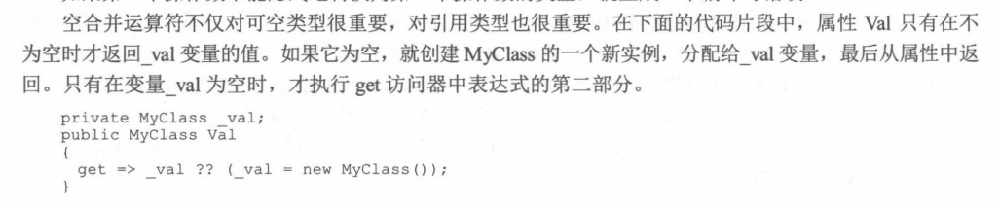

#### 6.2.1-10 空值条件运算符

空值条件运算符（`?`）可以用于检测这个值是否为 null。

```csharp
int[] arr = null;
int x1 = arr?[0] ?? 0;
```

#### 6.2.2 运算符的优先级和关联性

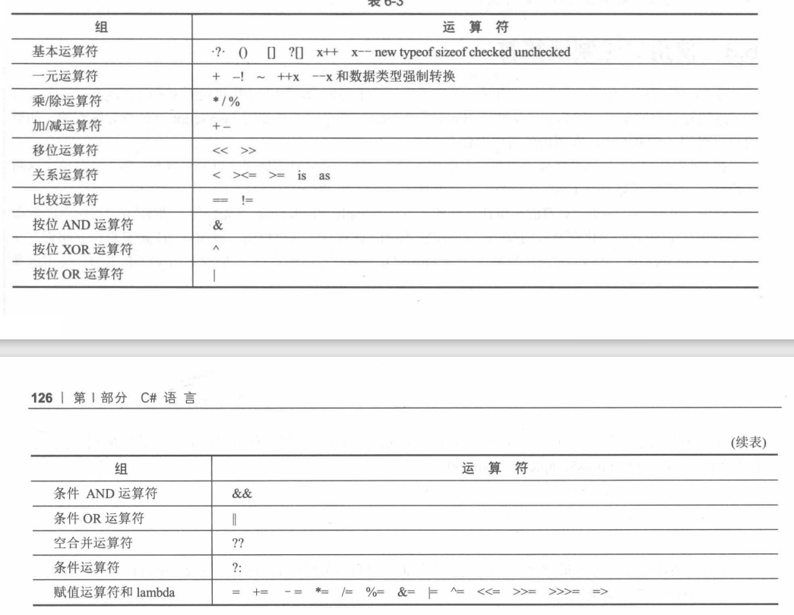

### 6.3 使用二进制运算符

原书的例子一坨...

> chatGPT：
>
> Q：C# 中如何进行二进制计算，举个例子
>
> A：在C#中进行二进制计算可以使用位运算符。以下是一些常用的二进制计算操作和示例：
>
> 1. 与运算（&）：对两个二进制数的每一位进行与操作，结果中的每一位都是两个数对应位上的值相与的结果。
> ```csharp
> int result = 5 & 3; // 二进制：101 & 011，结果为 001，即 1
> ```
>
> 2. 或运算（|）：对两个二进制数的每一位进行或操作，结果中的每一位都是两个数对应位上的值相或的结果。
> ```csharp
> int result = 5 | 3; // 二进制：101 | 011，结果为 111，即 7
> ```
>
> 3. 异或运算（^）：对两个二进制数的每一位进行异或操作，结果中的每一位都是两个数对应位上的值相异或的结果。
> ```csharp
> int result = 5 ^ 3; // 二进制：101 ^ 011，结果为 110，即 6
> ```
>
> 4. 左移运算（<<）：将一个二进制数向左移动指定的位数，右侧用零填充。
> ```csharp
> int result = 5 << 2; // 二进制：101 左移 2 位，结果为 10100，即 20
> ```
>
> 5. 右移运算（>>）：将一个二进制数向右移动指定的位数，左侧用符号位填充（对于正数，用零填充）。
> ```csharp
> int result = 10 >> 2; // 二进制：1010 右移 2 位，结果为 10，即 2
> ```
>
> 请注意，这些示例中的二进制数都是以十进制形式表示的。您可以根据需要将十进制数转换为二进制数进行计算，或者使用二进制字面量（以0b开头）直接表示二进制数。

### 6.4 类型的安全性

C# 语言会编译成中间语言（IL），而 C# 也是强类型，这说明数据类型并不总是可以无缝呼唤。

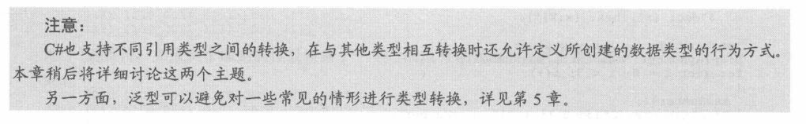

#### 6.4.1 类型转换

```csharp
byte value1 = 10;
byte value2 = 23;
byte total;
total = value1 + value2; // error
```

两个 byte 类型数据加在一起时，会返回 int 类型（返回 byte 类型很可能溢出 8 位字符），因此上面这种代码会报错，如果要把结果存储在一个 byte 变量中，就必须把它转换为 byte 类型。

C# 支持两种转换方式：隐式转换和显示转换。

1. 隐式转换

   只要能保证值不会发生任何变化，类型转换就可以自动进行，比如说，只要将上面代码的 byte 类型换成 long 类型，代码就不会有问题（因为 long 类型变量包含的字节比 btype 类型多）

   下面是 C# 默认支持的隐式类型转换。

   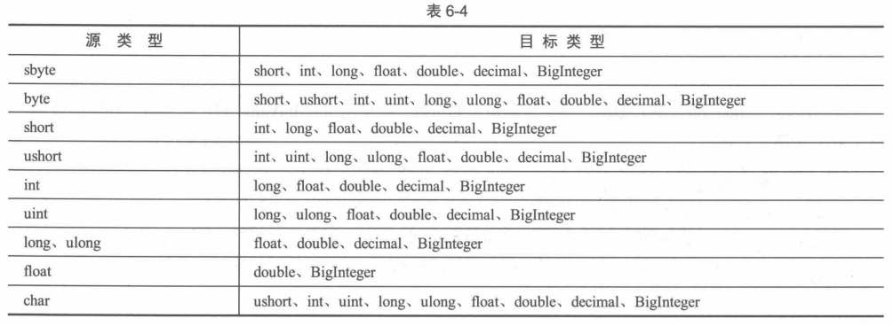

2. 显式转换

   以下场合不能隐式转换：

   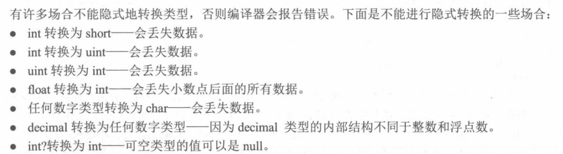

   但是，可以使用类型强制转换（cast）显式地执行这些转换。

   ```csharp
   long val = 30000;
   int i = (int)val;
   
   int? a = null;
   int b = (int)a; // throw exception
   ```

   这种强制类型转换是一种比较危险的操作，很可能会出现运行时错误。所以可以使用 try 语句和 catch 语句引入结构化异常处理。

   就值类型来说，**只能在数字、char类型和enum类型之间进行强制转换**，不能直接把布尔类型强制转换为其他类型，也不能把其他类型强制转换为布尔型。

#### 6.4.2 装箱和拆箱

装箱和拆箱可以把值类型转换和引用类型互相转换，装箱用于描述把一个值类型转换为引用，运行库会为堆上的对象创建个临时的引用类型：“箱子”。

该转换可以隐式进行，如：`string s = 10.ToString()`，编译器会为这个数字 10 进行装箱，让它使用 Int 对象上面的方法。也可以显式进行转换：

```csharp
int num = 20;
object myObject = num;
```

拆箱则用于描述相反的过程：

```csharp
int num = 20;
object myObj = num; // boxing
int secNum = (int)myObj; // unbox
```

只能对以前进行过装箱的变量进行拆箱，如果不能转换，C# 就会在运行期间抛出一个运行时异常。

### 6.5 比较对象的相等性

对象相等的机制有所不同，这取决于比较的类型是引用类型还是值类型。

#### 6.5.1 比较引用类型的相等性

System.Object 定义了三个不同的方法来比较对象的相等性：ReferenceEquals() 和两个版本的 Equals()：一个是静态的方法，一个是可以重写的虚拟实例方法。每个类还可以实现接口 IEquality\<T\>，它提供了一个具有泛型类型参数而不是对象的 Equals 方法。此外，还可以用比较运算符（`==`）来比较两个类。因此一共有四种比较方法，

> ChatGPT：
>
> Q：介绍 C# 中 ReferenceEquals，Equals 还有 == 号的使用方法，介绍它们之间的区别，以及 C# 中还有哪些用于比较是否相等的方法？IEquatable\<T\>.Equals方法和Comparer\<T\>.Default.Equals方法如何使用？
>
> A：在C#中，我们可以使用ReferenceEquals，Equals和==号来比较对象的相等性。下面是它们的使用方法和区别：
>
> 1. ReferenceEquals方法：
>    ReferenceEquals方法是一个静态方法，用于比较两个对象的引用是否相等。它的使用方法如下：
>
>    ```csharp
>    bool result = ReferenceEquals(object1, object2);
>    ```
>
>    如果object1和object2引用的是同一个对象，则返回true；否则返回false。
>
> 2. Equals方法：
>    Equals方法是一个虚方法，它可以被重写以提供自定义的相等性比较逻辑。在默认情况下，Equals方法比较的是对象的引用。使用方法如下：
>
>    ```csharp
>    bool result = object1.Equals(object2);
>    ```
>
>    如果object1和object2引用的是同一个对象，则返回true；否则根据对象的类型和重写的Equals方法的实现返回相应的结果。
>
> 3. ==运算符：
>    ==运算符用于比较两个对象的值是否相等。它可以用于比较值类型和引用类型。使用方法如下：
>
>    ```csharp
>    bool result = object1 == object2;
>    ```
>
>    对于值类型，==运算符比较的是它们的值是否相等；对于引用类型，==运算符比较的是它们的引用是否相等。
>
> 这三种方法的区别在于它们比较的内容和比较方式。ReferenceEquals比较的是对象的引用，即内存地址；Equals方法默认比较的也是对象的引用，但可以被重写以提供自定义的比较逻辑；==运算符比较的是对象的值，对于值类型比较的是值本身，对于引用类型比较的是引用。
>
> 除了上述方法，C#中还有其他用于比较是否相等的方法，例如：
>
> - Object.Equals方法：它与Equals方法类似，也是用于比较对象的相等性。它的使用方式与Equals方法相同。
> - Object.ReferenceEquals方法：它与ReferenceEquals方法功能相同，用于比较两个对象的引用是否相等。
> - IEquatable\<T\>.Equals方法：它是泛型接口IEquatable\<T\>的成员方法，用于比较实现该接口的对象的相等性。它的使用方式与Equals方法相同，但是它只能用于比较相同类型的对象。
> - Comparer\<T\>.Default.Equals方法：它是泛型类Comparer\<T\>的静态方法，用于比较两个对象的相等性。它的使用方式与Equals方法相同，但是它可以处理null值。
>
> 这些方法可以根据具体的需求选择使用，根据需要比较对象的引用或值来确定是否相等。
>
> 
>
> IEquatable\<T\>.Equals方法和Comparer\<T\>.Default.Equals方法都是用于比较对象相等性的方法，但在使用上有一些区别。
>
> 1. IEquatable\<T\>.Equals方法：
>    - IEquatable\<T\>是一个泛型接口，用于定义类型T的相等性比较方法。
>    - 通过实现IEquatable\<T\>接口，并重写Equals方法，可以自定义类型T的相等性比较逻辑。
>    - 使用时，可以通过调用对象的Equals方法来比较对象的相等性。
>    - 示例代码如下：
>      ```csharp
>      public class MyClass : IEquatable<MyClass>
>      {
>          public int Id { get; set; }
>          public string Name { get; set; }
>          
>          public bool Equals(MyClass other)
>          {
>              if (other == null) return false;
>              return Id == other.Id && Name == other.Name;
>          }
>      }
>      
>      MyClass obj1 = new MyClass { Id = 1, Name = "John" };
>      MyClass obj2 = new MyClass { Id = 1, Name = "John" };
>      
>      bool isEqual = obj1.Equals(obj2); // 调用Equals方法进行比较
>      ```
>
> 2. Comparer\<T\>.Default.Equals方法：
>    - Comparer\<T\>.Default是一个静态属性，返回类型T的默认比较器。
>    - Comparer\<T\>.Default.Equals方法是默认比较器的实例方法，用于比较两个对象的相等性。
>    - 默认比较器的相等性比较逻辑是基于对象的默认实现，即使用对象的Equals方法进行比较。
>    - 示例代码如下：
>      ```csharp
>      MyClass obj1 = new MyClass { Id = 1, Name = "John" };
>      MyClass obj2 = new MyClass { Id = 1, Name = "John" };
>      
>      bool isEqual = Comparer<MyClass>.Default.Equals(obj1, obj2); // 调用Comparer<T>.Default.Equals方法进行比较
>      ```
>
> 需要注意的是，使用这些方法进行相等性比较时，需要确保类型T正确地实现了相等性比较的逻辑，否则可能导致不正确的结果。

### 6.6 运算符重载

通过重载运算符，就可以告诉编译器，`+`和`*`对相应的对象执行什么操作。

> Q：用一个例子尽可能地描述清楚C#中加减乘除，大于小于等于这些运算符的重载
>
> A：当我们在C#中定义一个自定义类型时，我们可以重载许多运算符，包括加法运算符、减法运算符、乘法运算符、除法运算符以及比较运算符（大于、小于、等于等）。让我们通过一个例子来说明如何重载这些运算符。
>
> 假设我们正在创建一个名为`Vector`的自定义类型，表示二维向量。我们希望能够对这些向量执行加法、减法、乘法和除法运算，并且能够比较它们的大小。
>
> 首先，让我们定义`Vector`类：
>
> ```csharp
> public class Vector
> {
>     public int X { get; set; }
>     public int Y { get; set; }
> 
>     public Vector(int x, int y)
>     {
>         X = x;
>         Y = y;
>     }
> }
> ```
>
> 接下来，我们将重载加法运算符。我们希望能够将两个向量相加，得到一个新的向量作为结果。我们可以通过在`Vector`类中定义一个名为`operator+`的方法来实现这一点：
>
> ```csharp
> public static Vector operator +(Vector v1, Vector v2)
> {
>     int newX = v1.X + v2.X;
>     int newY = v1.Y + v2.Y;
>     return new Vector(newX, newY);
> }
> ```
>
> 现在，我们可以使用加法运算符来执行向量的相加操作：
>
> ```csharp
> Vector v1 = new Vector(1, 2);
> Vector v2 = new Vector(3, 4);
> Vector result = v1 + v2;
> Console.WriteLine($"Result: ({result.X}, {result.Y})");  // 输出：Result: (4, 6)
> ```
>
> 类似地，我们可以重载减法运算符、乘法运算符和除法运算符。这里是它们的示例实现：
>
> ```csharp
> public static Vector operator -(Vector v1, Vector v2)
> {
>     int newX = v1.X - v2.X;
>     int newY = v1.Y - v2.Y;
>     return new Vector(newX, newY);
> }
> 
> public static Vector operator *(Vector v, int scalar)
> {
>     int newX = v.X * scalar;
>     int newY = v.Y * scalar;
>     return new Vector(newX, newY);
> }
> 
> public static Vector operator /(Vector v, int divisor)
> {
>     int newX = v.X / divisor;
>     int newY = v.Y / divisor;
>     return new Vector(newX, newY);
> }
> ```
>
> 此外，我们还可以重载比较运算符，以便我们可以比较两个向量的大小。以下是大于、小于和等于运算符的示例实现：
>
> ```csharp
> public static bool operator >(Vector v1, Vector v2)
> {
>     return v1.X > v2.X && v1.Y > v2.Y;
> }
> 
> public static bool operator <(Vector v1, Vector v2)
> {
>     return v1.X < v2.X && v1.Y < v2.Y;
> }
> 
> public static bool operator ==(Vector v1, Vector v2)
> {
>     return v1.X == v2.X && v1.Y == v2.Y;
> }
> 
> public static bool operator !=(Vector v1, Vector v2)
> {
>     return !(v1 == v2);
> }
> ```
>
> 现在，我们可以使用这些重载的运算符来执行向量的比较操作：
>
> ```csharp
> Vector v1 = new Vector(1, 2);
> Vector v2 = new Vector(3, 4);
> Console.WriteLine(v1 > v2);  // 输出：False
> Console.WriteLine(v1 < v2);  // 输出：True
> Console.WriteLine(v1 == v2);  // 输出：False
> ```
>
> 通过重载这些运算符，我们可以根据自定义类型的需求来定义运算符行为。这使得我们能够以一种更直观和方便的方式操作自定义类型的实例。请注意，为了正确地重载运算符，我们需要遵循C#的重载运算符规则和约定。

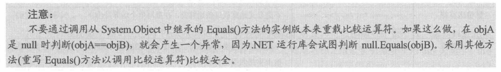

并不是所有的运算符都可以重载，可以重载的运算符如表所示：

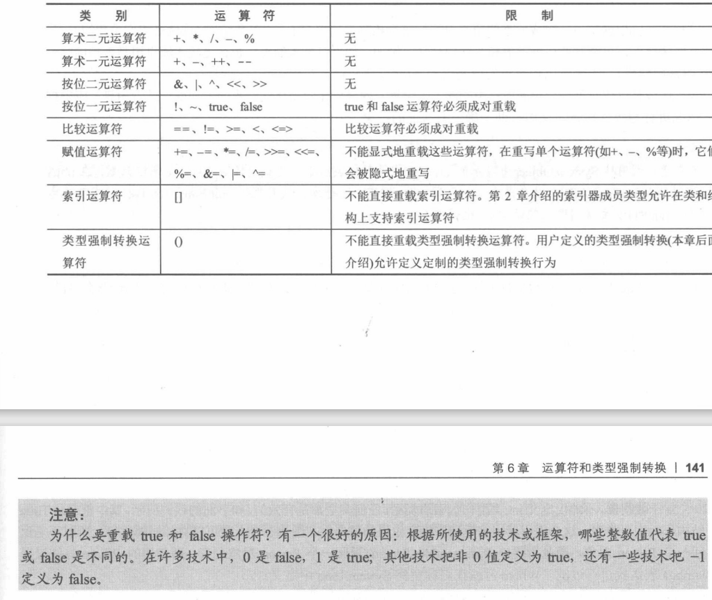

### 6.7 实现自定义的索引运算符

自定义索引器不能使用运算符重载语法来实现，但是它们可以用与属性非常相似的语法来实现。

> ChatGPT：
>
> Q：C# 的自定义索引运算符是什么？举个例子
>
> A：在C#中，自定义索引运算符是一种特殊的运算符，它允许我们为自定义类型定义索引访问行为。通过重载索引运算符，我们可以像使用数组或集合一样使用自定义类型的实例。
>
> 自定义索引运算符使用 this 关键字和方括号 [] 来定义。下面是一个示例，展示了如何在C#中重载索引运算符：
>
> ```csharp
> public class MyCollection
> {
>     private int[] values = new int[5];
> 
>     // 索引器的定义
>     public int this[int index]
>     {
>         get
>         {
>             return values[index];
>         }
>         set
>         {
>             values[index] = value;
>         }
>     }
> }
> 
> // 使用自定义索引运算符
> MyCollection collection = new MyCollection();
> collection[0] = 10; // 设置索引为0的元素的值
> int value = collection[0]; // 获取索引为0的元素的值
> ```
>
> 在上面的示例中，我们创建了一个名为 `MyCollection` 的类，并在其中定义了一个名为 `this` 的索引器。索引器使用 `int` 类型的索引参数，用于访问内部的 `values` 数组。通过重载索引运算符，我们可以像使用数组一样使用 `MyCollection` 类的实例。
>
> 在使用自定义索引运算符时，我们可以使用方括号 `[]` 来访问索引器，并传递适当的索引值。在上面的示例中，我们使用 `collection[0]` 来设置和获取索引为0的元素的值。
>
> 请注意，我们可以根据需要定义多个不同类型的索引器，例如，可以定义一个接受字符串作为索引的索引器，或者定义多个参数的索引器。这使得我们可以根据自己的需求来灵活地定义索引访问行为。

### 6.8 用户定义的类型强制转换

类型强制转换在某种情况下可以看为一种运算符，其作用是从源类型转换为目标类型。

> chatGPT：
>
> Q：C# 中要如何自定义类的强制类型转换，举例子详细说明
>
> A：在C#中，我们可以通过重载类型转换运算符来自定义类的强制类型转换行为。通过重载类型转换运算符，我们可以定义如何将一个自定义类型转换为另一个类型。
>
> 在C#中，有两个主要的类型转换运算符需要重载：`implicit`（隐式转换）和 `explicit`（显式转换）。隐式转换允许在不需要显式转换操作符的情况下进行转换，而显式转换则需要使用显式转换操作符。
>
> 下面是一个示例，展示了如何在C#中重载类型转换运算符：
>
> ```csharp
> public class Distance
> {
>     private double meters;
> 
>     public Distance(double meters)
>     {
>         this.meters = meters;
>     }
> 
>     // 隐式转换运算符的重载
>     public static implicit operator double(Distance distance)
>     {
>         return distance.meters;
>     }
> 
>     // 显式转换运算符的重载
>     public static explicit operator int(Distance distance)
>     {
>         return (int)distance.meters;
>     }
> }
> 
> // 使用自定义类型转换
> Distance distance = new Distance(1000);
> 
> // 隐式转换
> double meters = distance; // 隐式将 Distance 转换为 double
> 
> // 显式转换
> int intMeters = (int)distance; // 显式将 Distance 转换为 int
> ```
>
> 在上面的示例中，我们创建了一个名为 `Distance` 的类，并在其中定义了两个类型转换运算符：`implicit` 和 `explicit`。`implicit` 运算符用于将 `Distance` 类型隐式转换为 `double` 类型，而 `explicit` 运算符用于将 `Distance` 类型显式转换为 `int` 类型。
>
> 在使用自定义类型转换时，我们可以像使用内置类型转换一样使用它们。在上面的示例中，我们使用隐式转换将 `Distance` 对象转换为 `double` 类型，并使用显式转换将 `Distance` 对象转换为 `int` 类型。
>
> 请注意，当定义自定义类型转换运算符时，我们需要考虑潜在的数据丢失或不兼容的情况，并根据需要进行适当的转换。此外，我们还可以根据需要定义多个不同类型的转换运算符，以便在不同的转换场景中使用。
>
> 
>
> 
>
> Q：如果要定义其强制转换到其他类，比如其基类呢？
>
> A：如果要定义一个自定义类向其基类进行强制转换，可以使用C#中的类型转换运算符重载来实现。在C#中，基类和派生类之间的转换通常是隐式的，但是如果你想要显式地将派生类转换为基类，你可以重载基类中的类型转换运算符。
>
> 让我们以一个示例来说明。假设我们有一个基类Animal和一个派生类Dog：
>
> ```csharp
> public class Animal
> {
>     public string Name { get; set; }
> }
> 
> public class Dog : Animal
> {
>     public void Bark()
>     {
>         Console.WriteLine("Woof!");
>     }
> }
> ```
>
> 现在，如果我们想要将Dog对象强制转换为Animal对象，我们可以在基类Animal中重载类型转换运算符：
>
> ```csharp
> public class Animal
> {
>     public string Name { get; set; }
> 
>     public static explicit operator Animal(Dog dog)
>     {
>         Animal animal = new Animal();
>         animal.Name = dog.Name;
>         return animal;
>     }
> }
> ```
>
> 在上面的代码中，我们定义了一个显式的类型转换运算符，将Dog对象转换为Animal对象。在转换过程中，我们创建一个新的Animal对象，并将其Name属性设置为Dog对象的Name属性。然后，我们返回这个新创建的Animal对象。
>
> 现在，我们可以使用显式类型转换将Dog对象转换为Animal对象：
>
> ```csharp
> Dog dog = new Dog();
> dog.Name = "Buddy";
> 
> Animal animal = (Animal)dog;
> Console.WriteLine(animal.Name);  // 输出 "Buddy"
> ```
>
> 在上面的代码中，我们将Dog对象转换为Animal对象，并将结果存储在animal变量中。然后，我们可以访问animal对象的Name属性，并输出它的值。
>
> 请注意，由于这是一个显式的类型转换，所以我们使用了强制转换运算符`(Animal)`来执行转换。如果转换是隐式的，我们可以直接将Dog对象赋值给Animal对象，而不需要显式地进行类型转换。
>
> 希望这可以帮助你理解如何将自定义类强制转换为其基类。如果你有任何疑问，请随时问我。


