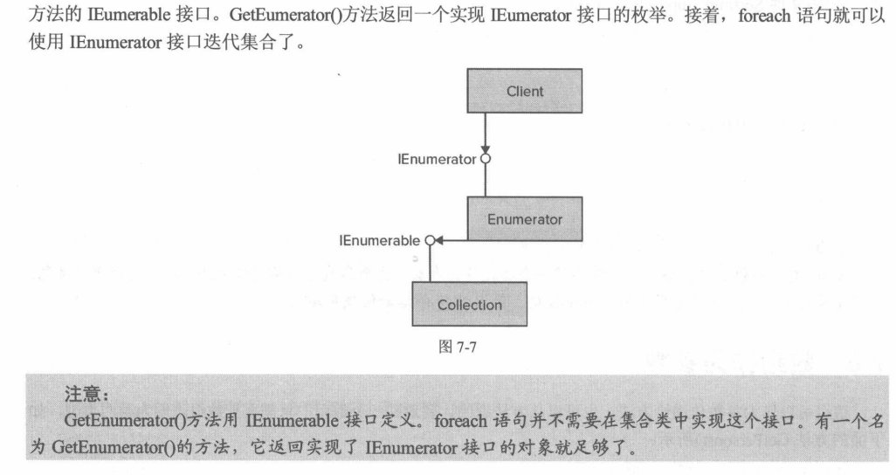
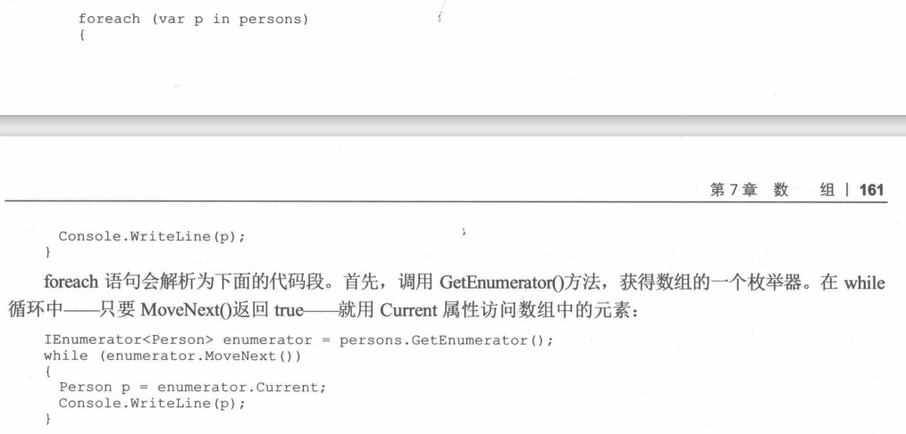
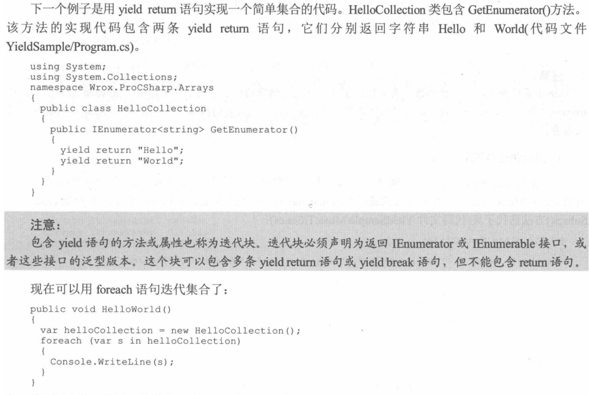
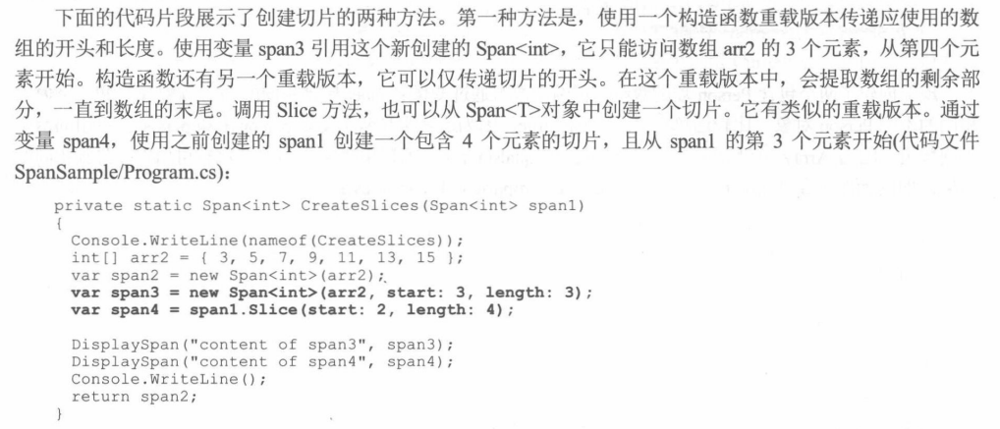
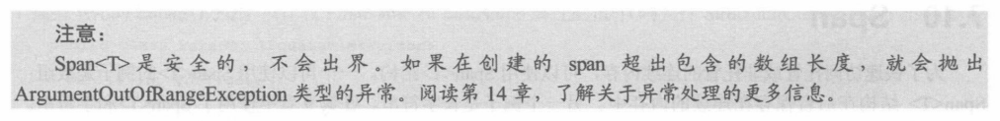
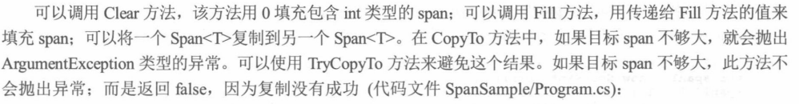

#  《C#高级编程》学习笔记（7）

## 第7章 数组

### 7.1 相同类型的多个对象

需要使用相同类型的多个对象，可以使用集合和数组。C# 用特殊的记号来声明、初始化和使用数组。

> 如果需要使用不同类型的多个对象，可以通过类、结构和元组使用它们

### 7.2 简单数组

数组是一种可以包含多个同一类型的多个元素的数据结构。

```csharp
// 声明
int[] myArray;
myArray = new int[4];
```


还可以使用数组初始化器为数组的每个元素赋值，**数组初始化器只能在声明数组变量时使用，不能在声明数组之后使用。**

```csharp
int[] myArray = new int[4] {4, 7, 11, 2};
// 使用花括号时也可以不指定数组大小，编译器会自动统计
int[] myArray = new int[] {4, 7, 11, 2};
// 还有一种更简单的声明方式
int[] myArray = {4, 7, 11, 2}
```

对于数组，可以使用 Length 获取它的元素个数，可以使用 for 和 foreach 语句迭代其中的元素。


数组也同样能够装载自定义类型。


### 7.3 多维数组

在 C# 中声明多维数组，需要在方括号中加上逗号。且声明数组，就不能修改其阶数了。

```csharp
int [,] twodim = new int[3, 3]; // 3x3 的二维数组
```

**使用数组初始化器时，必须初始化数组的每个元素，而不能把某些值放在以后去初始化**。

### 7.4 锯齿数组


声明锯齿数组时，要依次放置左右括号，之后为每一行指定行中的元素个数。

```csharp
int[][] jagged = new int[3][];
jagged[0] = new int[2] {1,2};
jagged[1] = new int[6] {3,4,5,6,7,8};
jagged[2] = new int[3] {9,10,11};
```

锯齿数组的迭代可以放在嵌套的 for 循环中：


### 7.5 Array 类

如果数组包含的元素个数超出了整数的取值范围，可以使用 LongLength 来获得元素个数，可以使用 Rank 属性来获得数组的维度。

#### 7.5.1 创建数组

除了可以使用 C# 语法创建数组实例之外，还可以使用静态方法 CreateInstance 方法创建数组。如果事先不知道元素的类型，该静态方法就非常有用，因为类型可以作为 Type 对象传递给 CreateInstance 方法。

```c#
// 创建类型为 int，大小为 5 的数组
Array intArray1 = Array.CreateInstance(typeof(int), 5);

// 创建多维数组和不基于0的数组。
// 创建一个包含了 2*3 个元素的数组，第 1 维基于 1，第 2 维基于10
int[] lengths = {2,3};
int[] lowerBounds = {1,10};
Array racers = Array.CreateInstance(typeof(Person), lengths, lowerBounds);
// SetValue() 方法用于设置数组的元素，其参数是每一维的索引
racers.SetValue(new Person(), 1, 10);
racers.SetValue(new Person(), 1, 11);
racers.SetValue(new Person(), 1, 12);
racers.SetValue(new Person(), 2, 10);
racers.SetValue(new Person(), 2, 11);
racers.SetValue(new Person(), 2, 12);
```

还可以将已创建的数组强制转换为特定类型的数组。

```csharp
int[] intArray2 = (int[])intArray1;
```

#### 7.5.2 复制数组

数组所实现的 ICloneable 接口中定义的 Clone 方法会创建数组的浅复制样本。


#### 7.5.3 排序

Array 类使用 Quicksort 算法对数组中的元素进行排序。Sort() 方法需要数组中的元素全部实现 IComparable 接口。如果一个类想要使用 Sort 方法自定义排序，可以自己实现 Icomparer\<T\> 接口。


### 7.6 数组作为参数

数组可以作为参数传递给方法，也可以从方法返回，只需要把数组声明为返回类型或参数。

```csharp
static Person[] GetPersons() => new Person[] {
  new Person("Damon", "Hill"),
}

static void DisplayPersons(Person[] persons) {
  // ...
}
```

### 7.7 数组协变

数组支持协变，这表示数组可以声明为基类，但是基类的派生元素也可以赋予数组。

```csharp
static void DisplayArray(object[] data) {
  // ...
}
```


### 7.8 枚举

在 foreach 语句中使用枚举就可以迭代集合中的元素。其原因是 foreach 语句使用了一个枚举器。如果想自定义类并不需要在集合类中实现 IEnumerable 接口，只要实现一个名为 GetEnumerator() 的方法，该方法的返回实现 IEnumerable 接口即可。



foreach 语句会解析为下面的代码段：首先调用 GetEnumerator() 方法，获得数组的一个枚举器。在 while 循环中——只要枚举器的 MoveNext() 方法返回 true，就用 Current 属性访问数组中的数组。



#### 7.8.3 yield 语句

自 C# 2.0 后添加的 yield 语句，可以轻松地创建枚举器。yield return 语句会返回集合的一个元素，并移动到下一个元素上。而 yield break 可以停止迭代。



使用迭代块，编译器会生成一个 yield 类型，其中包含一个状态机。


可以使用 yield 来同时迭代多个数组。

### 7.9 结构比较

数组和元组都实现了接口 IStructuralEquatable 和 IStructuralComparable。这两个接口不仅可以比较引用，还可以比较内容。

> chatGPT：
>
> Q：C# 如何对数组和元组进行结构比较？
>
> A：在 C# 中，可以使用 `StructuralComparisons.StructuralEqualityComparer` 类来进行数组和元组的结构比较。该类提供了一个默认的比较器，可以比较两个结构相等的对象。
>
> 对于数组的结构比较，可以使用以下代码示例：
>
> ```csharp
> int[] array1 = { 1, 2, 3 };
> int[] array2 = { 1, 2, 3 };
> 
> bool areEqual = StructuralComparisons.StructuralEqualityComparer.Equals(array1, array2);
> ```
>
> 对于元组的结构比较，可以使用以下代码示例：
>
> ```csharp
> var tuple1 = Tuple.Create(1, "hello");
> var tuple2 = Tuple.Create(1, "hello");
> 
> bool areEqual = StructuralComparisons.StructuralEqualityComparer.Equals(tuple1, tuple2);
> ```
>
> 在以上示例中，`Equals` 方法将会比较数组和元组的结构是否相同，即它们的元素类型和顺序是否一致。
>
> 需要注意的是，结构比较是基于值的，而不是引用。这意味着即使两个数组或元组引用不同的对象，但如果它们的结构相同，那么它们将被认为是相等的。
>
> 另外，`StructuralComparisons.StructuralEqualityComparer` 类实现了 `IEqualityComparer` 接口，因此也可以在其他需要比较相等性的场景中使用，比如在集合中查找相同结构的对象。

### 7.10 Span

> ChatGPT：
>
> Q：C# 中的 Span 是什么？有什么优势？
>
> A：在 C# 中，`Span<T>` 是一个用于表示连续内存块的类型。它是在 .NET Core 2.1 中引入的一种新的数据类型。`Span<T>` 提供了一种安全且高效地处理连续内存块的方式，而无需进行内存分配或复制。
>
> `Span<T>` 的优势包括：
>
> 1. 零内存分配：使用 `Span<T>` 可以避免在某些情况下进行内存分配，从而提高性能。例如，可以使用 `Span<T>` 直接操作数组的子集，而无需创建新的数组。
>
> 2. 高性能：`Span<T>` 提供了直接访问内存块的能力，因此可以更高效地进行数据操作。它可以用于替代传统的数组和集合，以提高性能。
>
> 3. 安全性：`Span<T>` 在编译时进行类型检查，确保只能访问正确类型的内存块。这有助于减少内存错误和潜在的安全漏洞。
>
> 4. 与现有代码兼容：`Span<T>` 可以与现有的代码无缝集成，因为它提供了类似数组的接口和语法。这使得对现有代码的改造变得简单。
>
> 总之，`Span<T>` 提供了一种高效、安全且方便的方式来处理连续内存块，尤其适用于需要高性能的场景，如数据处理、网络编程和算法实现等。
>
> Q：举个它与数组一起使用的例子，并进行比较
>
> A：当与数组一起使用时，`Span<T>` 可以提供更高效的内存操作和更低的内存分配开销。下面是一个使用 `Span<T>` 和数组的简单示例，并进行比较：
>
> ```csharp
> using System;
> 
> public class Program
> {
>     public static void Main()
>     {
>         int[] array = new int[5] { 1, 2, 3, 4, 5 };
> 
>         // 使用数组进行求和
>         int sumArray = SumArray(array);
>         Console.WriteLine("Sum using array: " + sumArray);
> 
>         // 使用 Span 进行求和
>         int sumSpan = SumSpan(array.AsSpan());
>         Console.WriteLine("Sum using Span: " + sumSpan);
>     }
> 
>     public static int SumArray(int[] array)
>     {
>         int sum = 0;
>         for (int i = 0; i < array.Length; i++)
>         {
>             sum += array[i];
>         }
>         return sum;
>     }
> 
>     public static int SumSpan(Span<int> span)
>     {
>         int sum = 0;
>         for (int i = 0; i < span.Length; i++)
>         {
>             sum += span[i];
>         }
>         return sum;
>     }
> }
> ```
>
> 在上面的示例中，我们定义了一个数组 `array`，它包含了一些整数。然后，我们分别使用数组和 `Span<int>` 来计算数组中所有元素的总和。
>
> 使用数组进行求和时，我们需要通过索引访问每个元素，这可能会导致额外的内存开销和较慢的性能。而使用 `Span<int>`，我们可以通过索引直接访问内存块，避免了数组的额外开销，从而提高了性能。
>
> 通过比较两种求和方法的结果，我们可以看到它们得到了相同的结果。但是，使用 `Span<int>` 的求和方法更加高效，因为它避免了数组的内存分配和复制。
>
> 需要注意的是，`Span<T>` 只能用于访问连续的内存块，因此在使用 `Span<T>` 时需要确保内存块的有效性。此外，`Span<T>` 还提供了许多其他的方法和功能，如切片、排序和搜索等，可以进一步提高代码的性能和可读性。

创造 Span 的多种方法：





Span 的更多用法：



如果只需要对数组段进行读访问，就可以使用 ReadOnlySpan\<T\>。

除了 Array 以外，Span 也支持传入 ArraySegment 类型来进行初始化实例。

### 7.11 数组池

为了减少 GC 的工作，一个应用程序可以通过 ArrayPool 类使用数组池，数组可以从这里租借内存并返回到池中。

> ChatGPT：
>
> Q：C# 中的数组池 ArrayPool 如何使用？详细举例
>
> A：`ArrayPool<T>` 是一个用于管理数组池的类型，它可以帮助我们重复使用数组，以减少内存分配和垃圾回收的开销。下面是一个详细的示例，演示如何使用 `ArrayPool<T>`：
>
> ```csharp
> using System;
> using System.Buffers;
> 
> public class Program
> {
>     public static void Main()
>     {
>         // 创建 ArrayPool 实例
>         ArrayPool<int> arrayPool = ArrayPool<int>.Create();
> 
>         // 从数组池中获取一个数组
>         int[] array = arrayPool.Rent(5);
> 
>         // 使用数组进行一些操作
>         for (int i = 0; i < array.Length; i++)
>         {
>             array[i] = i + 1;
>         }
> 
>         // 打印数组内容
>         Console.WriteLine("Array elements:");
>         for (int i = 0; i < array.Length; i++)
>         {
>             Console.WriteLine(array[i]);
>         }
> 
>         // 将数组归还到数组池中
>         arrayPool.Return(array);
>     }
> }
> ```
>
> 在上面的示例中，我们首先创建了一个 `ArrayPool<int>` 实例 `arrayPool`。然后，我们使用 `Rent` 方法从数组池中获取一个长度为 5 的整型数组 `array`。
>
> 接下来，我们使用数组 `array` 进行一些操作，将 1 到 5 的整数分别赋值给数组的元素。
>
> 最后，我们使用 `Return` 方法将数组 `array` 归还到数组池中，以便后续重复使用。
>
> 通过使用 `ArrayPool<T>`，我们可以重复使用数组，而不是每次都进行内存分配和释放。这可以减少垃圾回收的开销，提高性能。
>
> 需要注意的是，使用 `ArrayPool<T>` 时需要确保正确地归还数组，以避免资源泄漏。还要注意，从数组池中获取的数组可能是被其他代码使用过的，因此在使用之前应该清空或重置数组的内容。
>
> 此外，`ArrayPool<T>` 还提供了其他方法，如 `GetMaxSize` 和 `GetBuffer`，用于获取数组池的最大大小和底层缓冲区，以及 `Clear` 方法，用于清空数组池中的所有数组。这些方法可以根据实际需求进行使用。


