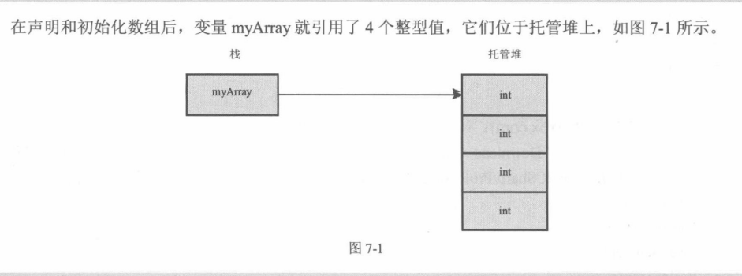
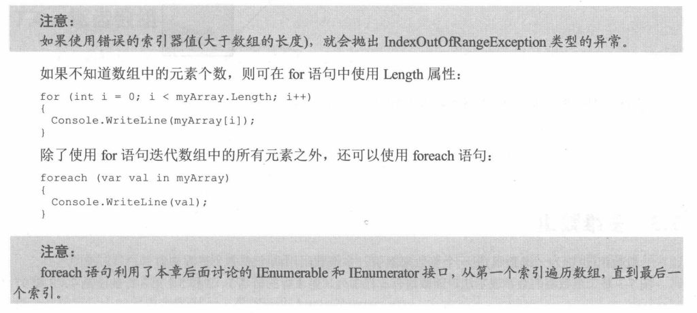
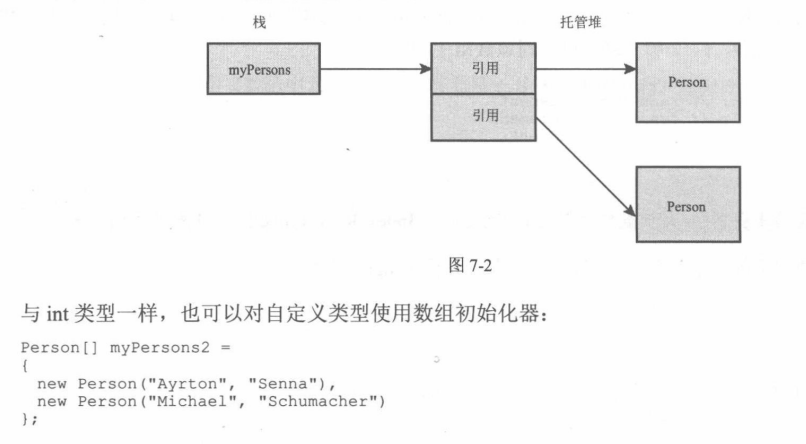
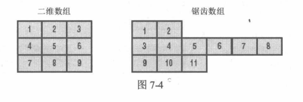
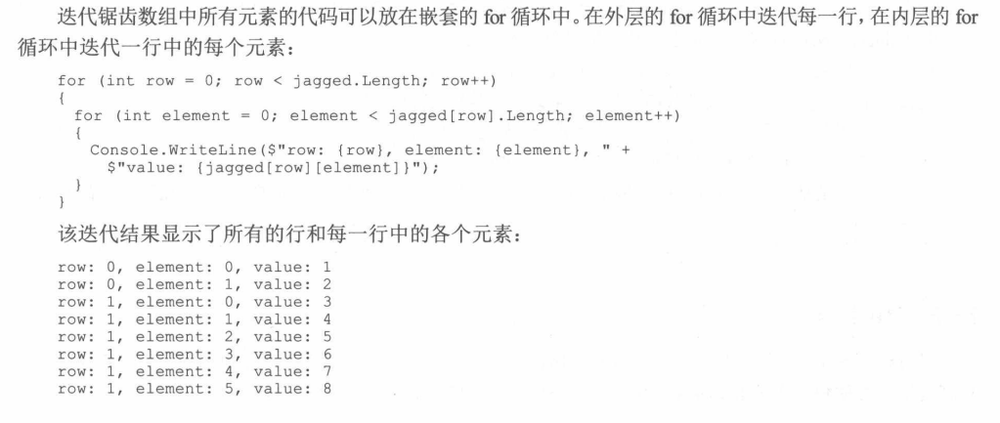
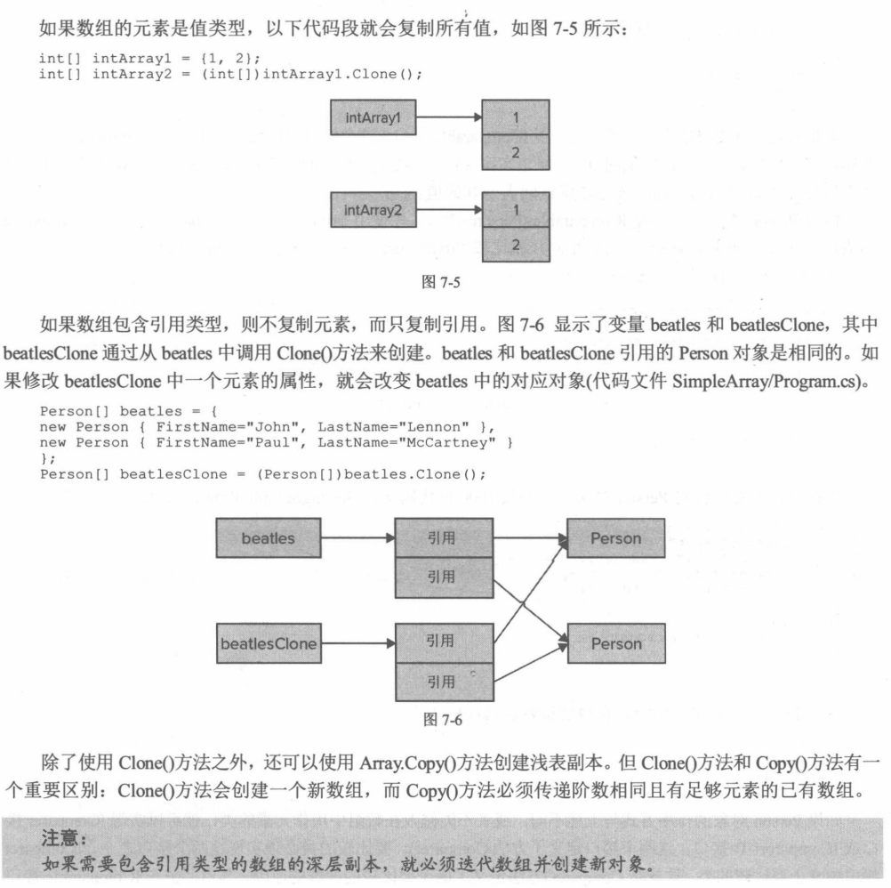
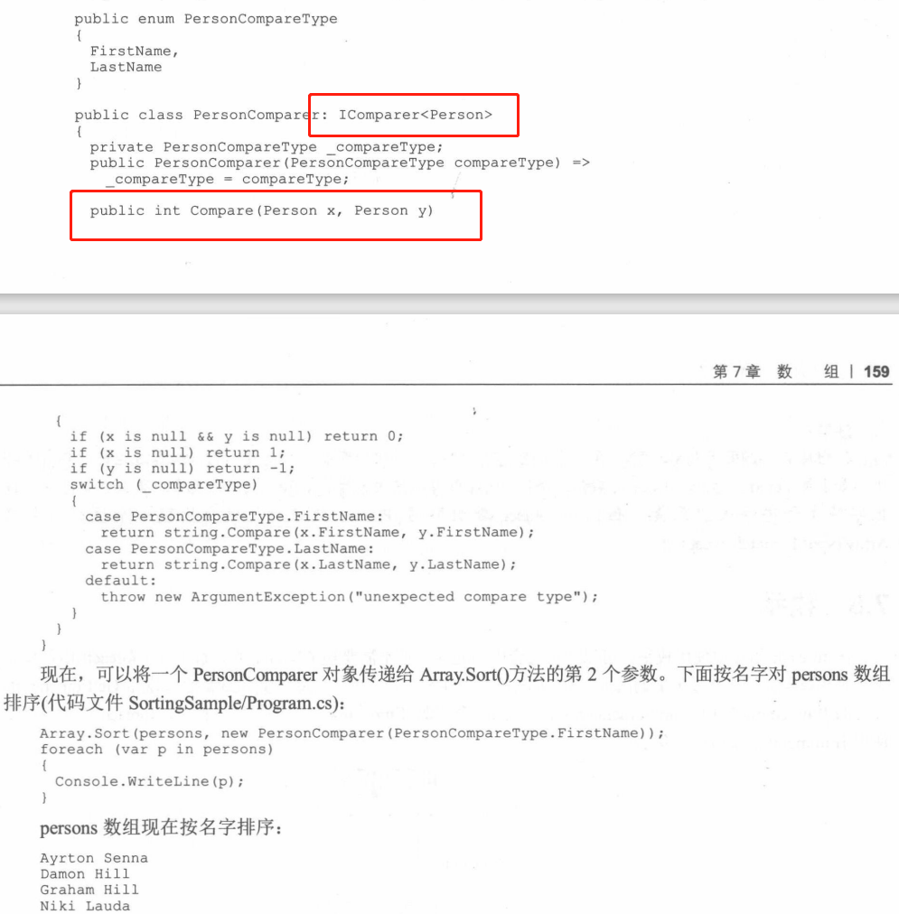
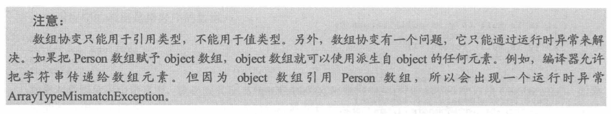

#  《C#高级编程》学习笔记（7）

## 第7章 数组

### 7.1 相同类型的多个对象

需要使用相同类型的多个对象，可以使用集合和数组。C# 用特殊的记号来声明、初始化和使用数组。

> 如果需要使用不同类型的多个对象，可以通过类、结构和元组使用它们

### 7.2 简单数组

数组是一种可以包含多个同一类型的多个元素的数据结构。

```csharp
// 声明
int[] myArray;
myArray = new int[4];
```



还可以使用数组初始化器为数组的每个元素赋值，**数组初始化器只能在声明数组变量时使用，不能在声明数组之后使用。**

```csharp
int[] myArray = new int[4] {4, 7, 11, 2};
// 使用花括号时也可以不指定数组大小，编译器会自动统计
int[] myArray = new int[] {4, 7, 11, 2};
// 还有一种更简单的声明方式
int[] myArray = {4, 7, 11, 2}
```

对于数组，可以使用 Length 获取它的元素个数，可以使用 for 和 foreach 语句迭代其中的元素。



数组也同样能够装载自定义类型。



### 7.3 多维数组

在 C# 中声明多维数组，需要在方括号中加上逗号。且声明数组，就不能修改其阶数了。

```csharp
int [,] twodim = new int[3, 3]; // 3x3 的二维数组
```

**使用数组初始化器时，必须初始化数组的每个元素，而不能把某些值放在以后去初始化**。

### 7.4 锯齿数组



声明锯齿数组时，要依次放置左右括号，之后为每一行指定行中的元素个数。

```csharp
int[][] jagged = new int[3][];
jagged[0] = new int[2] {1,2};
jagged[1] = new int[6] {3,4,5,6,7,8};
jagged[2] = new int[3] {9,10,11};
```

锯齿数组的迭代可以放在嵌套的 for 循环中：



### 7.5 Array 类

如果数组包含的元素个数超出了整数的取值范围，可以使用 LongLength 来获得元素个数，可以使用 Rank 属性来获得数组的维度。

#### 7.5.1 创建数组

除了可以使用 C# 语法创建数组实例之外，还可以使用静态方法 CreateInstance 方法创建数组。如果事先不知道元素的类型，该静态方法就非常有用，因为类型可以作为 Type 对象传递给 CreateInstance 方法。

```c#
// 创建类型为 int，大小为 5 的数组
Array intArray1 = Array.CreateInstance(typeof(int), 5);

// 创建多维数组和不基于0的数组。
// 创建一个包含了 2*3 个元素的数组，第 1 维基于 1，第 2 维基于10
int[] lengths = {2,3};
int[] lowerBounds = {1,10};
Array racers = Array.CreateInstance(typeof(Person), lengths, lowerBounds);
// SetValue() 方法用于设置数组的元素，其参数是每一维的索引
racers.SetValue(new Person(), 1, 10);
racers.SetValue(new Person(), 1, 11);
racers.SetValue(new Person(), 1, 12);
racers.SetValue(new Person(), 2, 10);
racers.SetValue(new Person(), 2, 11);
racers.SetValue(new Person(), 2, 12);
```

还可以将已创建的数组强制转换为特定类型的数组。

```csharp
int[] intArray2 = (int[])intArray1;
```

#### 7.5.2 复制数组

数组所实现的 ICloneable 接口中定义的 Clone 方法会创建数组的浅复制样本。



#### 7.5.3 排序

Array 类使用 Quicksort 算法对数组中的元素进行排序。Sort() 方法需要数组中的元素全部实现 IComparable 接口。如果一个类想要使用 Sort 方法自定义排序，可以自己实现 Icomparer\<T\> 接口。




### 7.6 数组作为参数

数组可以作为参数传递给方法，也可以从方法返回，只需要把数组声明为返回类型或参数。

```csharp
static Person[] GetPersons() => new Person[] {
  new Person("Damon", "Hill"),
}

static void DisplayPersons(Person[] persons) {
  // ...
}
```

### 7.7 数组协变

数组支持协变，这表示数组可以声明为基类，但是基类的派生元素也可以赋予数组。

```csharp
static void DisplayArray(object[] data) {
  // ...
}
```



### 7.8 枚举

在 foreach 语句中使用枚举就可以迭代集合中的元素。其原因是 foreach 语句使用了一个枚举器。


> 本次阅读至 P195  7.8 枚举 下次阅读应至 P210

