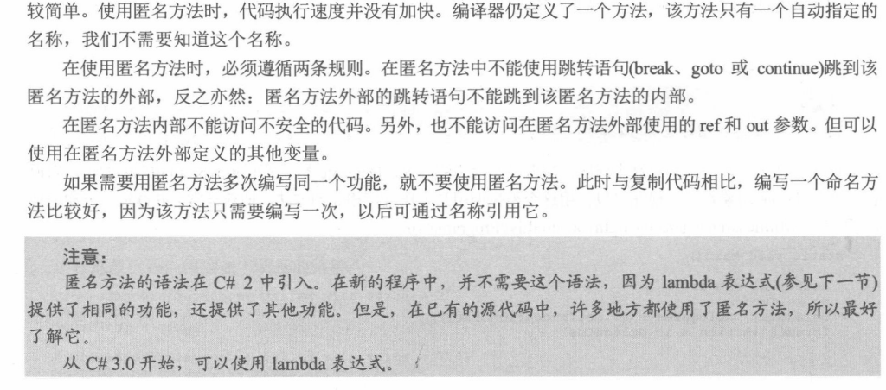
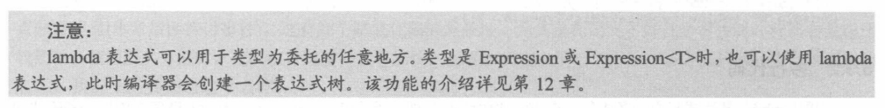

#  《C#高级编程》学习笔记（8）

## 第8章 委托、lambda表达式

### 8.1 引用方法

在 C++ 中，函数指针只是一个指向内存位置的指针，并不是类型安全的，也无法判断这个指针实际上指向什么，参数和返回类型等更加无从知晓。

而 C# 的委托虽然也是一种函数指针寻址方法，但它定义了返回类型和参数的类型，不仅包含对单个方法的引用，也可以包含对多个方法的引用，因此是类型安全的。

而 lambda 与委托直接相关，当参数是委托类型，就可以使用 lambda 表达式实现委托引用的方法。

### 8.2 委托

当要把方法传送给其他方法时，就需要使用委托。在 C 和 C++ 中，只能提取函数的地址并作为一个参数传递它。但这样做除了一些类型安全的问题外，还忽略了一点：**在进行面向对象编程时，几乎没有方法是孤立存在的**。所以在 C# 中，如果要传递方法，就必须把方法的细节封装在一种新的对象类型中，即委托。

委托只是一种特殊类型的对象，其特殊之处在于，我们以前定义的所有的对象都包含数据，而委托包含的只是一个或多个方法的地址。

```csharp
delegate void IntMethodInvoker(int x);
```

上面的示例中，声明了一个委托 IntMethodInvoker 类，在定义委托时，必须给出它所表示的方法的签名和返回类型等全部细节。

```csharp
private delegate string GetAString();
public static void Main()
{
  int x = 40;
  GetAString firstStringMethod = new GetAString(x.ToString);
  Console.WriteLine($"String is {firstStringMethod()}");
}
```

#### 8.2.4 Action\<T\>和Func\<T\>委托

> chatGPT：
>
> Q：举例详细介绍C#中的 Action 委托和 Func 委托？
>
> A：在 C# 中，Action 委托和 Func 委托是两种常用的委托类型，用于封装方法或 Lambda 表达式。它们可以简化代码，并提供了一种方便的方式来传递方法作为参数或从方法返回结果。
>
> Action 委托是一个不返回值的委托类型。它可以接受最多 16 个参数，并且不返回任何结果。以下是一个示例：
>
> ```csharp
> // 定义一个 Action 委托，接受两个整数参数
> Action<int, int> add = (x, y) =>
> {
>     int sum = x + y;
>     Console.WriteLine($"Sum: {sum}");
> };
> 
> // 调用 Action 委托
> add(5, 3);  // 输出：Sum: 8
> ```
>
> 在上面的示例中，我们定义了一个接受两个整数参数的 Action 委托，并使用 Lambda 表达式定义了它的具体实现。然后，我们通过调用委托来执行该方法，并打印出结果。
>
> Func 委托是一个具有返回值的委托类型。它可以接受最多 16 个参数，并返回一个指定类型的结果（最后一个泛型参数表示返回值的类型）。以下是一个示例：
>
> ```csharp
> // 定义一个 Func 委托，接受两个整数参数，并返回它们的和
> Func<int, int, int> add = (x, y) =>
> {
>     return x + y;
> };
> 
> // 调用 Func 委托
> int sum = add(5, 3);
> Console.WriteLine($"Sum: {sum}");  // 输出：Sum: 8
> ```
>
> 在上面的示例中，我们定义了一个接受两个整数参数并返回它们的和的 Func 委托。我们使用 Lambda 表达式定义了它的具体实现。然后，我们通过调用委托来执行该方法，并将结果存储在变量 `sum` 中，并打印出结果。
>
> 总结一下，Action 委托用于封装不返回值的方法，而 Func 委托用于封装具有返回值的方法。它们都可以简化代码，并提供了一种方便的方式来传递方法作为参数或从方法返回结果。

#### 8.2.6 多播委托

委托可以包含多个方法，这种委托称为多播委托。如果调用多播委托，就可以按顺序连续调用多个方法

```csharp
using System;

public class MyClass
{
    public void Method1(string message)
    {
        Console.WriteLine("Method1: " + message);
    }

    public void Method2(string message)
    {
        Console.WriteLine("Method2: " + message);
    }
}

public class Program
{
    public static void Main(string[] args)
    {
        MyClass obj = new MyClass();

        // 创建一个多播委托，并将 Method1 和 Method2 添加到委托链中
        Action<string> myDelegate = obj.Method1;
        myDelegate += obj.Method2;

        // 调用多播委托，将依次触发 Method1 和 Method2
        myDelegate("Hello, World!");

        // 从委托链中移除 Method1
        myDelegate -= obj.Method1;

        // 再次调用多播委托，只触发 Method2
        myDelegate("Hello, World!");
    }
}
```

> ChatGPT：
>
> 多播委托的优点包括：
>
> 1. 简化事件处理：多播委托提供了一种方便的方式来处理事件，可以将多个事件处理程序组合在一起，并在触发事件时依次调用它们。
> 2. 灵活性：可以根据需要动态地添加或移除方法，从而改变委托链的行为。
> 3. 可以返回最后一个方法的返回值：多播委托的调用会返回最后一个方法的返回值。
>
> 然而，多播委托也有一些缺点：
>
> 1. 无法获取中间方法的返回值：多播委托的调用只返回最后一个方法的返回值，中间方法的返回值会被忽略。
> 2. 方法执行顺序不可控：多播委托中方法的执行顺序是不确定的，取决于它们被添加到委托链中的顺序。

通过一个委托调用多个方法还可能导致一个更严重的问题，多播委托中的方法其中一个异常，整个迭代就会停止。

#### 8.2.7 匿名方法

通过匿名方法使用委托可以无需在外面预先定义好方法。

> chatGPT：
>
> 在C#中，匿名方法是一种可以在代码中直接定义的方法，而无需为其命名。它们通常用于简化委托的使用，尤其是在需要传递函数作为参数的情况下。
>
> 匿名方法的语法如下：
>
> ```csharp
> delegate (parameters)
> {
>     // 方法体
> };
> ```
>
> 其中，`delegate`关键字用于定义匿名方法的委托类型，`parameters`是方法的参数列表，而方法体则是匿名方法的具体实现。
>
> 下面是一个示例，演示了如何使用匿名方法来排序一个整数数组：
>
> ```csharp
> int[] numbers = { 4, 2, 7, 1, 9, 5 };
> 
> Array.Sort(numbers, delegate (int x, int y)
> {
>     return x.CompareTo(y);
> });
> 
> foreach (int number in numbers)
> {
>     Console.WriteLine(number);
> }
> ```
>
> 在上面的示例中，我们使用了`Array.Sort`方法来对整数数组进行排序。通过匿名方法，我们可以直接在排序方法的参数中定义排序的逻辑，而无需为其创建一个命名方法。
>
> 请注意，匿名方法也可以捕获外部变量，这使得它们在某些情况下非常有用。
>
> 
>
> 匿名方法和 lambda 表达式都可以用于创建委托实例，但它们在语法、参数列表、返回值和闭包等方面有一些区别。
>
> 1. 语法：
>    - 匿名方法使用 `delegate` 关键字来定义，并使用 `delegate` 关键字后面的参数列表和代码块来表示方法体。例如：
>    
>      ```csharp
>      delegate (int x, int y)
>      {
>          Console.WriteLine(x + y);
>      };
>      ```
>
>    - Lambda 表达式使用 `=>` 运算符来表示方法体，可以省略参数类型和括号（如果只有一个参数）。例如：
>    
>      ```csharp
>      (x, y) =>
>      {
>          Console.WriteLine(x + y);
>      }
>      ```
>
> 2. 参数列表：
>    - 匿名方法的参数列表必须显式声明参数的类型。例如：
>    
>      ```csharp
>      delegate (int x, int y)
>      {
>          Console.WriteLine(x + y);
>      };
>      ```
>
>    - Lambda 表达式的参数列表可以省略参数的类型，编译器会根据上下文进行推断。例如：
>    
>      ```csharp
>      (x, y) =>
>      {
>          Console.WriteLine(x + y);
>      }
>      ```
>
> 3. 返回值：
>    - 匿名方法可以有返回值，需要使用 `return` 语句显式返回值。例如：
>    
>      ```csharp
>      delegate (int x, int y)
>      {
>          return x + y;
>      };
>      ```
>
>    - Lambda 表达式的返回值可以根据上下文进行推断，可以使用隐式返回语法。例如：
>    
>      ```csharp
>      (x, y) => x + y
>      ```
>
> 4. 闭包：
>    - 匿名方法可以访问包含它们的方法的局部变量，并且在匿名方法中对局部变量的更改会影响到外部方法。例如：
>    
>      ```csharp
>      int a = 10;
>      Action action = delegate ()
>      {
>          a = 20;
>      };
>      ```
>
>    - Lambda 表达式可以捕获封闭范围内的变量，并且在 Lambda 表达式中对变量的更改也会影响到外部方法。例如：
>    
>      ```csharp
>      int a = 10;
>      Action action = () =>
>      {
>          a = 20;
>      };
>      ```
>
> 综上所述，匿名方法和 lambda 表达式在语法、参数列表、返回值和闭包等方面存在一些区别，但它们都可以用于创建委托实例，并实现类似的功能。




### 8.3 lambda 表达式

lambda 运算符“=>”的左边列出了需要的参数，而右边定义了赋予 lanbda 变量的方法的实现代码。前面使用匿名方法的例子，可以改为使用 lambda 表达式。

```csharp
Func<string, string> lambdaFunc = param => {
  return param + " world!";
};
Console.WriteteLine(lambdaFunc("hello"));
```



### 8.4事件

事件基于委托，为委托提供了一种发布/订阅机制。

> ChatGPT：
>
> 在 C# 中，事件和委托是密切相关的概念。委托用于定义方法的类型，而事件则是委托的一种特殊用法，它提供了一种机制，允许对象在特定情况下通知其他对象发生的事件。
>
> 下面是一个简单的示例，演示了事件和委托的关系以及事件的具体使用：
>
> ```csharp
> using System;
> 
> // 定义一个委托类型
> public delegate void EventHandler(string message);
> 
> // 定义包含事件的类
> public class EventPublisher
> {
>     // 声明一个事件，使用委托类型作为事件的类型
>     public event EventHandler MyEvent;
> 
>     // 触发事件的方法
>     public void RaiseEvent(string message)
>     {
>         // 检查事件是否有订阅者
>         if (MyEvent != null)
>         {
>             // 调用事件，通知所有订阅者
>             MyEvent(message);
>         }
>     }
> }
> 
> // 订阅事件的类
> public class EventSubscriber
> {
>     // 事件处理方法
>     public void HandleEvent(string message)
>     {
>         Console.WriteLine("EventSubscriber收到消息：" + message);
>     }
> }
> 
> public class Program
> {
>     public static void Main()
>     {
>         // 创建事件发布者对象和订阅者对象
>         EventPublisher publisher = new EventPublisher();
>         EventSubscriber subscriber = new EventSubscriber();
> 
>         // 订阅事件
>         publisher.MyEvent += subscriber.HandleEvent;
> 
>         // 触发事件
>         publisher.RaiseEvent("Hello, World!");
> 
>         // 取消订阅事件
>         publisher.MyEvent -= subscriber.HandleEvent;
> 
>         // 再次触发事件，但订阅者已取消订阅，不会收到消息
>         publisher.RaiseEvent("Goodbye!");
> 
>         Console.ReadLine();
>     }
> }
> ```
>
> 在上面的示例中，我们首先定义了一个委托类型 `EventHandler`，它接受一个字符串参数。然后，我们创建了一个包含事件的类 `EventPublisher`，其中声明了一个名为 `MyEvent` 的事件，其类型为 `EventHandler` 委托。在 `EventPublisher` 类中，我们编写了一个 `RaiseEvent` 方法来触发事件，它会检查事件是否有订阅者，并通过调用事件来通知所有订阅者。
>
> 接下来，我们定义了一个订阅事件的类 `EventSubscriber`，其中包含了一个名为 `HandleEvent` 的方法，用于处理事件。在 `Main` 方法中，我们创建了事件发布者对象和订阅者对象，并使用 `+=` 运算符将订阅者的 `HandleEvent` 方法添加到事件的订阅列表中。然后，我们调用 `RaiseEvent` 方法来触发事件，订阅者的 `HandleEvent` 方法会被调用并输出消息。
>
> 最后，我们使用 `-=` 运算符将订阅者的 `HandleEvent` 方法从事件的订阅列表中移除，再次调用 `RaiseEvent` 方法时，订阅者不会收到消息。
>
> 通过使用事件和委托，我们可以实现对象间的松耦合通信，让对象在特定情况下能够通知其他对象发生的事件，从而实现更灵活和可扩展的代码结构。


> 扩展阅读：
>
> Q：委托可以使用 Invoke 方法吗？有什么用？
>
> A：是的，委托可以使用 Invoke 方法。Invoke 方法用于调用委托所引用的方法。
>
> 使用 Invoke 方法的好处是可以使代码更加清晰和易读。通过调用 Invoke 方法，可以像调用普通方法一样使用委托，而无需显式地使用圆括号。
>
> 例如，假设有一个委托类型为`Action<int>`，它引用了一个接受一个整数参数并返回空值的方法。可以通过调用 Invoke 方法来调用委托引用的方法，如下所示：
>
> ```csharp
> Action<int> myDelegate = MyMethod;
> myDelegate.Invoke(42);
> ```
>
> 这与以下代码等效：
>
> ```csharp
> Action<int> myDelegate = MyMethod;
> myDelegate(42);
> ```
>
> 在大多数情况下，直接使用圆括号调用委托也是可以的。但是，在某些特定情况下，例如在使用泛型委托时，使用 Invoke 方法可以提高代码的可读性。
>
> 总之，Invoke 方法是用于调用委托引用的方法的一种方式，使代码更加清晰和易读。


