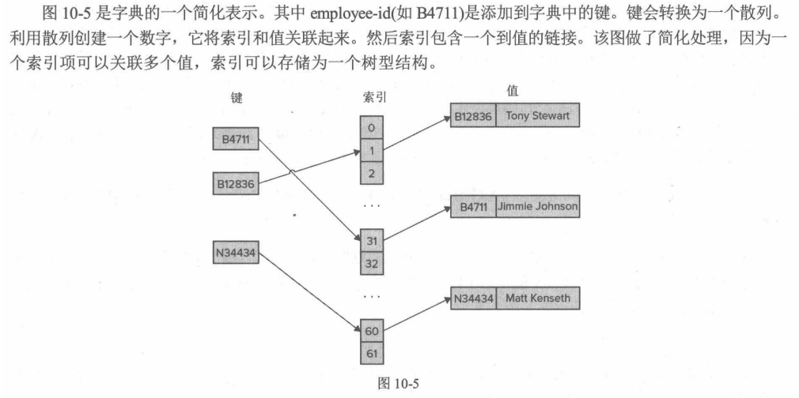

#  《C#高级编程》学习笔记（9）

## 第9章 字符串和正则表达式

在 C# 中，string 关键字的映射实际上指向 System.String，这是一个功能非常强大且用途广泛的基类，但它并不是唯一与字符串相关的类。

### 9.1 System.String 类


#### 9.1.1 构建字符串

String 类存在一个问题：重复修改给定的字符串效率会很低，因为它实际上是一个不可变的数据类型，这意味着表面上修改字符串内容的方法和运算符实际上是在创建一个新的字符串。

为了执行性能和内存空间，微软提供了 System.Text.StringBuilder 类，它并不像 String 类那样支持非常多的方法，StringBuilder 上可以进行的处理仅限于替换和追加或删除字符串中的文本，但是它的工作方式非常高效。

> ChatGPT：
>
> StringBuilder 类是 C# 中用于处理字符串操作的一个类，它位于 System.Text 命名空间中。与 String 类不同，StringBuilder 类提供了可变字符串的功能，可以高效地进行字符串的拼接、插入、替换等操作。
>
> 主要属性和方法：
>
> 1. Length：获取或设置 StringBuilder 对象中字符的数量。
> 2. Capacity：获取或设置 StringBuilder 对象内部缓冲区的容量。
> 3. Append()：将指定的字符串追加到当前 StringBuilder 对象的末尾。
> 4. Insert()：将指定的字符串插入到当前 StringBuilder 对象的指定位置。
> 5. Replace()：将指定的字符串从当前 StringBuilder 对象中的指定位置开始替换为新的字符串。
> 6. ToString()：将当前 StringBuilder 对象转换为一个字符串。
>
> 下面是一个简单的示例代码，展示了 StringBuilder 的用法：
>
> ```csharp
> using System;
> using System.Text;
> 
> class Program
> {
>     static void Main()
>     {
>         StringBuilder sb = new StringBuilder();
>         
>         sb.Append("Hello");
>         sb.Append(" ");
>         sb.Append("World!");
>         
>         Console.WriteLine(sb.ToString()); // 输出：Hello World!
>     }
> }
> ```
>
> 与 String 类相比，StringBuilder 类的优势在于它可以避免频繁创建新的字符串对象。当需要进行大量的字符串拼接操作时，使用 StringBuilder 可以提高性能和效率。这是因为 String 类是不可变的，每次进行字符串拼接时都会创建一个新的字符串对象，而 StringBuilder 类则可以在原有的字符串基础上进行修改，避免了创建新对象的开销。
>
> 因此，当需要进行频繁的字符串操作时，使用 StringBuilder 是更好的选择。但是对于少量的字符串操作或者只是简单的字符串拼接，使用 String 类也是可以的，因为 String 类的使用更加简洁和直观。


不能把 StringBuilder 强制转换为 String（隐式转换和显式都不行），如果要把内容输出为 String，唯一的方式就是使用 ToString() 方法。

### 9.2 字符串格式

#### 9.2.1 字符串插值

C# 6 引入了字符串使用 $ 符号前缀的字符串插值，这个前缀允许在花括号中包含占位符来引用代码的结果。

在现实中，这只是语法糖，对于带 $ 前缀的字符串，编译器实际上会创建 String.Format 方法调用。

```csharp
string s1 = "World";
string s2 = $"Hello, ${s1}";

// 相当于
string s1 = "World";
string s2 = String.Format("Hello, {0}", s1);
```


如果希望在插值字符串中包含花括号，可以使用两个花括号转义它们：

```csharp
string s = "Hello";
Console.WriteLine($"{{s}} displays the value of s: {s}");
// {s} displays the value of s: Hello
```

#### 9.2.3 自定义字符串格式

> ChatGPT：
>
> 常用的格式化指令包括：
>
> - `{index[,alignment][:format]}`：指定变量的索引、对齐方式和格式。
> - `D`：将数字格式化为十进制整数。
> - `F`：将数字格式化为定点数。
> - `C`：将数字格式化为货币。
> - `P`：将数字格式化为百分比。
> - `N`：将数字格式化为带有千位分隔符的数值。
>
> 示例：
>
> ```csharp
> decimal price = 12.3456m;
> string formattedPrice = string.Format("The price is: {0:C}", price);
> // or
> string formattedPrice1 = $"The price is: {price:C}"
> Console.WriteLine(formattedPrice);
> // The price is: $12.35
> ```

格式字符串不限于内置类型，还可以为自己的类型创建自定义格式字符串，为此，只需要实现接口 IFormattable 。


### 9.3 正则表达式

正则表达式作为小型技术领域的部分，在各种程序中都有着自己的作用。

在 C# 中，定义正则表达式需要用符号“@”开头，使用 Regex.Matches 方法进行匹配，如下：

```csharp
const string pattern = @"\bn";
MatchCollection myMathes = Regex.Matches("nssf", pattern, RegexOptions.IgnoreCase | RegexOptions.ExplicitCapture);
```

最后一个参数，RegexOptions 枚举有以下成员：


使用 Console.WriteMatches 方法，可以把 MatchCollection 中的所有匹配以比较详细的格式显示出来。


#### 9.3.4 匹配、组和捕获

假定要从一个 URI 中提取协议、地址和端口，且不考虑 URI 后面是否紧跟着空白，可以用下面的表达式：

```txt
\b(https?)(://)([.\w]+)([\s:]([\d]{2,5})?)\b
```

与这个表达式匹配的代码是 Match.Groups 方法，该方法会迭代匹配到的所有 Group 对象，在控制台上输出每组得到的索引和值。


也可以修改正则表达式，在组的开头指定`?<name>`给组命名。如下：


### 9.4 字符串和 Span

`Span<T>`类型除了数组以外，同样可以用来引用一个字符串的片段，而不需要复制原始内容。


## 第 10 章 集合

### 10.1 概述

Array 类，即数组的大小是固定的，如果元素个数是动态的，就应该使用集合类`List<T>`。

本章也会介绍其他的集合类以及它们的 API 性能差异，如：队列、栈、链表、字典和集。

### 10.2 集合接口和类型

大多数都可以在 System.Collections 和 System.Collections.Generic 名称空间中找到。


### 10.3 列表

C# 为动态列表提供了泛型类`List<T>`。

> ChatGPT：
>
> Q：详细介绍一下 C# 中的泛型`List<T>`，包括其主要使用方法及示例
>
> A：C# 中的泛型 `List<T>` 是一个动态数组，它可以存储任意类型的元素。它是 `System.Collections.Generic` 命名空间中的一个类，提供了许多有用的方法和属性来操作列表。
>
> 下面是 `List<T>` 的一些主要使用方法和示例：
>
> 1. 添加元素：
>    - `Add(T item)`：将元素添加到列表的末尾。
>    - 示例：
>      ```csharp
>      List<int> numbers = new List<int>();
>      numbers.Add(10);
>      numbers.Add(20);
>      ```
>
> 2. 获取元素：
>    - `T this[int index]`：通过索引获取列表中的元素。
>    - 示例：
>      ```csharp
>      List<string> names = new List<string>{"Alice", "Bob", "Charlie"};
>      string first = names[0];
>      ```
>
> 3. 移除元素：
>    - `Remove(T item)`：从列表中移除指定的元素。
>    - `RemoveAt(int index)`：通过索引移除列表中的元素。
>    - 示例：
>      ```csharp
>      List<int> numbers = new List<int>{10, 20, 30, 40};
>      numbers.Remove(20);
>      numbers.RemoveAt(2);
>      ```
>
> 4. 列表大小：
>    - `Count`：获取列表中的元素数量。
>    - 示例：
>      ```csharp
>      List<string> names = new List<string>{"Alice", "Bob", "Charlie"};
>      int count = names.Count;
>      ```
>
> 5. 遍历列表：
>    - 使用 `foreach` 循环遍历列表中的元素。
>    - 示例：
>      ```csharp
>      List<int> numbers = new List<int>{10, 20, 30};
>      foreach (int number in numbers)
>      {
>          Console.WriteLine(number);
>      }
>      ```
>
> 6. 其他常用方法：
>    - `Contains(T item)`：检查列表是否包含指定的元素。
>    - `Sort()`：按升序对列表进行排序。
>    - `Clear()`：从列表中移除所有元素。
>    - 示例：
>      ```csharp
>      List<string> fruits = new List<string>{"Apple", "Banana", "Orange"};
>      bool containsBanana = fruits.Contains("Banana");
>      fruits.Sort();
>      fruits.Clear();
>      ```
>
> 这些只是 `List<T>` 类的一些常用方法和示例，还有许多其他方法和属性可供使用。通过使用泛型 `List<T>`，您可以方便地操作和管理列表中的元素。
>
> 
>
> Q：详细介绍一下 C# 中的泛型`List<T>`的相关搜索方法
>
> A：当使用泛型 `List<T>` 时，我们可以使用一些常用的搜索方法来查找列表中的元素。下面是一些常用的搜索方法：
>
> 1. `Find` 方法：`List<T>.Find` 方法用于查找满足指定条件的第一个元素，并返回该元素。它接受一个 `Predicate<T>` 委托作为参数，该委托定义了要搜索的条件。例如：
>
>    ```csharp
>    List<int> numbers = new List<int> { 1, 2, 3, 4, 5 };
>    int result = numbers.Find(x => x > 3);
>    // result = 4
>    ```
>
>    在上面的示例中，我们使用 `Find` 方法查找列表 `numbers` 中大于 3 的第一个元素，并将结果存储在 `result` 变量中。
>
> 2. `FindAll` 方法：`List<T>.FindAll` 方法用于查找满足指定条件的所有元素，并返回一个新的 `List<T>` 包含这些元素。它也接受一个 `Predicate<T>` 委托作为参数。例如：
>
>    ```csharp
>    List<int> numbers = new List<int> { 1, 2, 3, 4, 5 };
>    List<int> results = numbers.FindAll(x => x > 3);
>    // results = [4, 5]
>    ```
>
>    在上面的示例中，我们使用 `FindAll` 方法查找列表 `numbers` 中大于 3 的所有元素，并将结果存储在 `results` 变量中。
>
> 3. `FindIndex` 方法：`List<T>.FindIndex` 方法用于查找满足指定条件的第一个元素的索引，并返回该索引。它也接受一个 `Predicate<T>` 委托作为参数。例如：
>
>    ```csharp
>    List<int> numbers = new List<int> { 1, 2, 3, 4, 5 };
>    int index = numbers.FindIndex(x => x > 3);
>    // index = 3
>    ```
>
>    在上面的示例中，我们使用 `FindIndex` 方法查找列表 `numbers` 中大于 3 的第一个元素的索引，并将结果存储在 `index` 变量中。
>
> 4. `FindLast` 方法：`List<T>.FindLast` 方法用于查找满足指定条件的最后一个元素，并返回该元素。它也接受一个 `Predicate<T>` 委托作为参数。例如：
>
>    ```csharp
>    List<int> numbers = new List<int> { 1, 2, 3, 4, 5 };
>    int result = numbers.FindLast(x => x > 3);
>    // result = 5
>    ```
>
>    在上面的示例中，我们使用 `FindLast` 方法查找列表 `numbers` 中大于 3 的最后一个元素，并将结果存储在 `result` 变量中。
>
> 这些是泛型 `List<T>` 中常用的搜索方法。通过使用它们，您可以方便地查找和获取列表中的元素。

集合在创建后是可读写的，但是在填充完集合以后，也可以创建只读集合。使用`List<T>`的`AsReadOnly()`方法即可返回`ReadOnlyCollection<T>`类，该类的所有的修改集合和方法属性都会抛出异常。

### 10.4 队列

队列使用泛型类`Queue<T>`实现。


> ChatGPT：
>
> `Queue<T>`和`List<T>`是C#中的两个不同的集合类。它们在功能和用途上有一些异同。
>
> 异同点：
> 1. 数据结构：`Queue<T>`是一个先进先出（FIFO）的队列，而`List<T>`是一个动态数组。
> 2. 插入和删除操作：在`Queue<T>`中，元素只能从队列的末尾添加（Enqueue）和从队列的开头删除（Dequeue）。而在`List<T>`中，可以在任意位置插入和删除元素。
> 3. 访问元素：`Queue<T>`只允许访问队列的开头元素（Peek），而`List<T>`可以通过索引访问任意位置的元素。
>
> 下面是一个简单的例子来说明它们的使用：
>
> 使用`Queue<T>`：
> ```csharp
> using System;
> using System.Collections.Generic;
> 
> class Program
> {
>     static void Main()
>     {
>         Queue<string> queue = new Queue<string>();
> 
>         queue.Enqueue("Apple");
>         queue.Enqueue("Banana");
>         queue.Enqueue("Orange");
> 
>         while (queue.Count > 0)
>         {
>             string fruit = queue.Dequeue();
>             Console.WriteLine(fruit);
>         }
>     }
> }
> ```
>
> 使用`List<T>`：
> ```csharp
> using System;
> using System.Collections.Generic;
> 
> class Program
> {
>     static void Main()
>     {
>         List<string> list = new List<string>();
> 
>         list.Add("Apple");
>         list.Add("Banana");
>         list.Add("Orange");
> 
>         foreach (string fruit in list)
>         {
>             Console.WriteLine(fruit);
>         }
>     }
> }
> ```
>
> 在上面的例子中，`Queue<T>`用于按照先进先出的顺序处理元素，而`List<T>`用于按照插入顺序处理元素。

### 10.5 栈

栈是一个后进先出的容器，可以使用`Stack<T>`类来进行初始化。


### 10.6 链表

`LinkedList<T>`是一个双向链表，其元素指向它前面和后面的元素。


### 10.7 有序列表

如果需要基于键对所需集合排序，就可以使用`SortedList<TKey,TValue>`类。这个集合中的值和键都可以使用任意类型。

> chatGPT：
>
> `SortedList<TKey, TValue>`类是C#中的一种泛型集合，它实现了`IDictionary<TKey, TValue>`接口。它表示一个键值对的有序集合，其中键是唯一的且按升序排序。
>
> 以下是`SortedList<TKey, TValue>`类的一些重要特性：
>
> 1. 键的唯一性：`SortedList<TKey, TValue>`中的键是唯一的，不允许重复的键存在。
>
> 2. 排序：`SortedList<TKey, TValue>`中的键值对是按键的升序进行排序的。这使得对键进行快速查找和访问成为可能。
>
> 3. 动态调整大小：`SortedList<TKey, TValue>`可以根据需要自动调整大小，以容纳更多的元素。
>
> 下面是一个示例，展示了如何使用`SortedList<TKey, TValue>`类：
>
> ```csharp
> using System;
> using System.Collections.Generic;
> 
> class Program
> {
>     static void Main()
>     {
>         // 创建一个SortedList<TKey, TValue>对象
>         SortedList<int, string> sortedList = new SortedList<int, string>();
> 
>         // 添加键值对
>         sortedList.Add(3, "Apple");
>         sortedList.Add(1, "Banana");
>         sortedList.Add(2, "Orange");
> 
>         // 访问元素
>         Console.WriteLine(sortedList[1]); // 输出: Banana
> 
>         // 修改元素
>         sortedList[1] = "Mango";
> 
>         // 遍历键值对
>         foreach (KeyValuePair<int, string> kvp in sortedList)
>         {
>             Console.WriteLine("Key: " + kvp.Key + ", Value: " + kvp.Value);
>         }
> 
>         // 移除元素
>         sortedList.Remove(2);
> 
>         // 判断键是否存在
>         bool containsKey = sortedList.ContainsKey(2); // containsKey = false
> 
>         // 判断值是否存在
>         bool containsValue = sortedList.ContainsValue("Apple"); // containsValue = false
> 
>         // 获取键的集合
>         ICollection<int> keys = sortedList.Keys;
> 
>         // 获取值的集合
>         ICollection<string> values = sortedList.Values;
>     }
> }
> ```
>
> 在上面的示例中，我们首先创建了一个`SortedList<int, string>`对象，然后使用`Add`方法添加了几个键值对。我们可以通过键来访问元素，也可以使用`foreach`循环遍历所有的键值对。我们还展示了如何修改元素、移除元素以及判断键和值是否存在的操作。最后，我们获取了键和值的集合。
>
> 希望这个示例能帮助你理解`SortedList<TKey, TValue>`类的使用。


### 10.8 字典

字典表示一种非常复杂的数据结构，也成为映射或者散列（hash）表。



C# 提供了几个字典类，可以使用最主要的类就是`Dictionary<TKey, TValue>`。

> ChatGPT：
>
> `Dictionary<TKey, TValue>`类是C#中常用的泛型集合类之一，用于存储键值对。它提供了高效的查找和访问操作，并且可以根据键快速检索对应的值。
>
> 下面是`Dictionary<TKey, TValue>`类的一些重要特性：
>
> 1. 键的唯一性：`Dictionary<TKey, TValue>`中的键是唯一的，每个键只能对应一个值。如果尝试使用已经存在的键添加新的键值对，将会抛出异常。
>
> 2. 快速查找：`Dictionary<TKey, TValue>`使用哈希表实现，因此可以在常数时间内查找指定的键。
>
> 3. 动态扩展：`Dictionary<TKey, TValue>`会根据需要自动扩展容量，以适应更多的键值对。
>
> 4. 可以使用自定义类型作为键：`Dictionary<TKey, TValue>`支持使用自定义类型作为键，只要这些类型实现了`GetHashCode()`和`Equals()`方法。
>
> 下面是一个示例，演示如何使用`Dictionary<TKey, TValue>`类：
>
> ```csharp
> // 创建一个Dictionary对象
> Dictionary<string, int> studentScores = new Dictionary<string, int>();
> 
> // 添加键值对
> studentScores.Add("Alice", 95);
> studentScores.Add("Bob", 87);
> studentScores.Add("Charlie", 92);
> 
> // 访问和修改值
> int aliceScore = studentScores["Alice"]; // 访问Alice的分数
> studentScores["Bob"] = 90; // 修改Bob的分数
> 
> // 判断键是否存在
> bool isCharlieExists = studentScores.ContainsKey("Charlie");
> 
> // 判断值是否存在
> bool isScoreExists = studentScores.ContainsValue(92);
> 
> // 遍历键值对
> foreach (KeyValuePair<string, int> kvp in studentScores)
> {
>     Console.WriteLine("Key: " + kvp.Key + ", Value: " + kvp.Value);
> }
> 
> // 删除键值对
> studentScores.Remove("Alice");
> 
> // 清空Dictionary
> studentScores.Clear();
> ```
>
> 在上面的示例中，我们首先创建了一个`Dictionary<string, int>`对象来存储学生的姓名和分数。然后，我们使用`Add()`方法添加了几个键值对。我们可以使用键来访问和修改对应的值。我们还演示了如何使用`ContainsKey()`和`ContainsValue()`方法来判断键和值是否存在。最后，我们使用`Remove()`方法删除了一个键值对，并使用`Clear()`方法清空了整个`Dictionary`。
>
> 希望这个示例能帮助你更好地理解和使用`Dictionary<TKey, TValue>`类。


#### 10.8.4 Lookup 类

`Dictionary<TKey, TValue>`类支持每个键关联一个值。而`Lookup<TKey, TElement>`类则支持把 key 映射到一个 value 的集合上。

> ChatGPT：
>
> `Lookup<TKey, TElement>` 类是 C# 中用于创建并操作键值对集合的数据结构。它是一个泛型类，其中 TKey 表示键的类型，TElement 表示值的类型。`Lookup<TKey, TElement>` 类提供了一种方便的方式来处理一个键对应多个值的情况。
>
> 以下是 `Lookup<TKey, TElement>` 类的一些重要特性：
>
> 1. `Lookup<TKey, TElement>` 类是只读的：一旦创建了一个 `Lookup<TKey, TElement>` 实例，就不能再修改它。这意味着你无法添加、删除或修改已存在的键值对。如果需要修改集合，你可以创建一个新的 `Lookup<TKey, TElement>` 实例。
>
> 2. 键对应多个值：`Lookup<TKey, TElement>` 类允许一个键对应多个值。这意味着你可以使用相同的键来存储多个值，并且可以轻松地访问和操作这些值。
>
> 3. 支持重复的键值对：`Lookup<TKey, TElement>` 类允许相同的键对应多个不同的值。这与 `Dictionary<TKey, TValue>` 类不同，`Dictionary<TKey, TValue>` 类要求每个键只能对应一个值。
>
> 下面是一个使用 `Lookup<TKey, TElement>` 类的示例：
>
> ```csharp
> using System;
> using System.Linq;
> 
> class Program
> {
>     static void Main()
>     {
>         // 创建一个 Lookup<TKey, TElement> 实例
>         var lookup = new Lookup<string, int>();
> 
>         // 向 Lookup<TKey, TElement> 实例中添加键值对
>         lookup.Add("A", 1);
>         lookup.Add("B", 2);
>         lookup.Add("A", 3);
>         lookup.Add("C", 4);
> 
>         // 获取指定键对应的所有值
>         var values = lookup["A"];
> 
>         // 输出值
>         Console.WriteLine("Values for key 'A':");
>         foreach (var value in values)
>         {
>             Console.WriteLine(value);
>         }
> 
>         // 查找不存在的键
>         var nonExistentValues = lookup["D"];
> 
>         // 输出不存在的键的值
>         Console.WriteLine("Values for key 'D':");
>         foreach (var value in nonExistentValues)
>         {
>             Console.WriteLine(value);
>         }
>     }
> }
> ```
>
> 在上面的示例中，我们首先创建了一个 `Lookup<string, int>` 实例，并向其中添加了一些键值对。然后，我们使用索引器访问键 `"A"` 对应的值，并输出这些值。接下来，我们尝试访问一个不存在的键 `"D"`，并输出其对应的值。请注意，当访问一个不存在的键时，`Lookup<TKey, TElement>` 类会返回一个空的序列。
>
> 希望这个示例能够帮助你理解和使用 `Lookup<TKey, TElement>` 类。如果你有任何进一步的问题，请随时提问。

#### 10.8.5 有序字典

`SortedDictionary<TKey, TValue>`是一个二叉搜索树。其中的元素根据 Key 来排序。


### 10.9 集

包含不重复元素的集合称为“集(set)”。C# 中实现了两个 Set：`HashSet<T>`和`SortedSet<T>`。

> ChatGPT：
>
> 当然！我很乐意为您提供关于 C# 中 `HashSet<T>` 和 `SortedSet<T>` 类的详细介绍和使用示例。
>
> 1. `HashSet<T>` 类的特点：
>    - `HashSet<T>` 是一个无序集合，它存储不重复的元素。
>    - `HashSet<T>` 使用哈希表实现，因此插入、删除和查找操作的时间复杂度都是 O(1)。
>    - `HashSet<T>` 不保证元素的顺序，因此无法按照插入的顺序进行遍历。
>
> 下面是 `HashSet<T>` 类的使用示例：
>
> ```csharp
> // 创建一个 HashSet<T> 对象
> HashSet<int> numbers = new HashSet<int>();
> 
> // 添加元素
> numbers.Add(1);
> numbers.Add(2);
> numbers.Add(3);
> 
> // 判断元素是否存在
> bool containsOne = numbers.Contains(1);  // true
> bool containsFour = numbers.Contains(4); // false
> 
> // 删除元素
> numbers.Remove(2);
> 
> // 遍历元素
> foreach (int number in numbers)
> {
>     Console.WriteLine(number);
> }
> ```
>
> 2. `SortedSet<T>` 类的特点：
>    - `SortedSet<T>` 是一个有序集合，它存储不重复的元素。
>    - `SortedSet<T>` 使用红黑树实现，因此插入、删除和查找操作的时间复杂度都是 O(log n)。
>    - `SortedSet<T>` 会根据元素的值进行排序，因此可以按照元素的顺序进行遍历。
>
> 下面是 `SortedSet<T>` 类的使用示例：
>
> ```csharp
> // 创建一个 SortedSet<T> 对象
> SortedSet<int> numbers = new SortedSet<int>();
> 
> // 添加元素
> numbers.Add(3);
> numbers.Add(1);
> numbers.Add(2);
> 
> // 判断元素是否存在
> bool containsOne = numbers.Contains(1);  // true
> bool containsFour = numbers.Contains(4); // false
> 
> // 删除元素
> numbers.Remove(2);
> 
> // 遍历元素
> foreach (int number in numbers)
> {
>     Console.WriteLine(number);
> }
> ```
>
> 希望这些示例能帮助您更好地理解和使用 `HashSet<T>` 和 `SortedSet<T>` 类！如果您有任何进一步的问题，请随时提问。

### 10.10 性能

许多集合类都提供了相同的功能，例如 SortedList 与 SortedDictionary 类的功能几乎完全相同，但是其性能常常有很大的区别。


