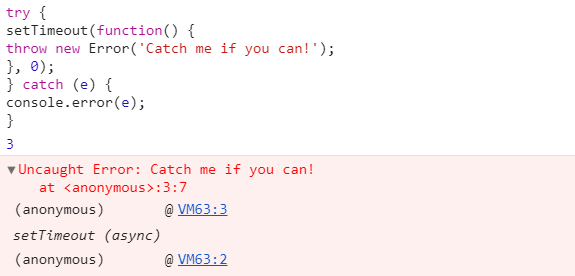

# 《JavaScript异步编程》学习笔记（一）

> 资料下载地址(pdf压缩文件):
>
> [百度网盘](https://pan.baidu.com/s/1PdPSFrLApizcuileAvTFZQ)
>
> 提取码: uyq5
>
> **本资料仅用于学习交流，如有能力请到各大销售渠道支持正版 !**

## 第1章 深入理解 JavaScript 事件

本章将介绍 JavaScript 异步机制，并破除一些常见的误解。

### 1.1 事件的调度

如果想让 JavaScript 中的某段代码将来再运行，可以将它放在回调中。

在常规的认知中，我们对 setTimeout 以及其中的回调函数认知是这样的：

> 给定一个回调及 n毫秒的延迟，setTimeout 就会在 n毫秒后运行该回调。

但是，**可怕的总是那些细节**，哪怕是像 setTimeout 这种看起来很简单的东西。事实上，像上面这样的描述，只能说接近正确，甚至在一些极端情况中，更可以说是完全错误的。

想要真正理解 setTimeout ，必须先大体了解 JavaScript 事件模型。

#### 1.1.1 现在还是将来运行

尝试运行以下代码

```javascript
for ( var i = 1; i <= 3; i++ ) {
    setTimeout(function () {console.log(i)}, 0)
}
// 4 4 4
```

要理解上面输出的这个结果，需要知道以下 3 件事：

- 这里只有一个名为 i 的变量，其作用域由生命语句`var i`定义(该生命语句在不经意间让 i 的作用域不是循环内部，而是扩散至蕴含循环的那个最内侧函数)
- 循环结束后，`i === 4`一直递增，直到不再满足条件`i <= 3`为止
- JavaScript 事件处理器在线程空闲之前不会运行

#### 1.1.2 线程的阻塞

```javascript
var start = new Date()
setTimeout(function () {
    var end = new Date()
     console.log('Time elapsed:', end - start, 'ms')
}, 500)
while (new Date() - start < 1000) {}

// 在 chrome 下运行的结果: Time elapsed: 1000 ms
// 在 EDGE 下运行的结果：Time elapsed: 1001 ms
```

以上代码可以证明 setTimeout  的计时不是精准的。不过，这个数字肯定至少是 1000，因为 setTimeout 在循环结束运行之前不可能被触发。

那么 setTimeout 既然没有使用另一个线程，那它到底干了什么呢。

#### 1.1.3 队列

调用 setTimeout 的时候，**会有一个延时事件排入队列**。然后 setTimeout 调用之后的那行代码运行，接着是再下一行代码，直到再也没有任何代码，JavaScript 引擎才会到**队列**中取出事件来执行。

> 输入事件的工作方式完全一样：用户单击一个已附加有单击事件处 理器的 DOM（Document Object Model，文档对象模型）元素时， 会有一个单击事件排入队列。但是，该单击事件处理器要等到当前 所有正在运行的代码均已结束后（可能还要等其他此前已排队的事 件也依次结束）才会执行。因此，使用 JavaScript的那些网页一不 小心就会变得毫无反应。 

JavaScript 代码永远不会被中断，这是因为代码在运行期间只需要排队事件即可，而这些事件在代码运行结束之前不会被触发。

### 1.2 异步函数的类型

JavaScript 环境提供的异步函数可以分为两大类：

- I/O 函数
- 计时函数

如果想在应用中定义复杂的异步行为，就要使用这两类异步函数作为基本的构造块。

#### 1.2.1 异步的I/O函数

> 创造 Node.js，并不是为了人们能在服务器上运行 JavaScript，仅仅是 因为 Ryan Dahl想要一个建立在某高级语言之上的事件驱动型服务器框架。JavaScript碰巧就是适合干这个的语言。为什么？因为JavaScript 语言可以完美地实现非阻塞式 I/O。 

相比于其他一不小心就会因为IO调用引起"阻塞"的应用，JavaScript 中这种阻塞方式几乎沦为无稽之谈。类似下面的循环将会永远运行下去，不可能停下来。

```javascript
var ajaxRequest = new XMLHttpRequest
ajaxRequest.open('GET', url)
ajaxRequest.send(null)
while (ajaxRequest.readyState === XMLHttpRequest.UNSENT) {
    // readyState 在循环返回之前不会有更改
    // 个人理解：即便数据返回了，由于 JavaScript 的特性，也必须要在这段循环完之后才能进行事件队列的调用，所以是无解的
}
```

相反，我们需要附加一个事件处理器，随即返回事件队列

```javascript
var ajaxRequest = new XMLHttpRequest
ajaxRequest.open('GET', url)
ajaxRequest.send(null)
ajaxRequest.onreadystatechange = function () {
    // ...
}
```

> 在浏览器端，Ajax方法有一个可设置为 false 的 async 选项（但永 远、永远别这么做），这会挂起整个浏览器窗格直到收到应答为止。 
>
> 在 Node.js 中，同步的 API 方法在名称上会有明确的标示，譬如 fs.readFileSync。编写短小的脚本时，这些同步方法会很方便。但是，如果所编写的应用需要处理并行的多个请求或多项操作，则应该避免使用它们。

非阻塞式 I/O 既是障碍也是优势，有了非阻塞式的 IO ，才能自然而然地写出高效的基于事件的代码。

#### 1.2.2 异步的计时函数

在 JavaScript 中，如果我们想让一个函数在将来某个时刻再运行——这样的函数可能是为了作动画或模拟。基于时间的事件涉及两个著名的函数，即`setTimeout`与`setInterval`。

遗憾的是，这两个著名的计时器函数都有上述提到的缺陷，即 JavaScript 代码的单线程执行性。但即便容忍了这一局限性，这两个函数也还有一个不确定性，更加令人难以容忍：

**如果使用 setInterval ** 调度事件并且延迟设定为 0 毫秒，则会尽可能的频繁运行此事件，但是在现代的浏览器中，它们的触发频率是不一样的！

而事实上，HTML 规范推行的延时 / 时隔的最小值就是 4 毫秒！

也就是说，当需要小于 4 毫秒的粒度计时时，这两个函数就是**完全不可靠**的了。

当然，还有一些环境提供了备选方案：

- 在 Node 中，process.nextTick 允许将事件调度成尽可能快地触发。其触发频率可以超过10万次/秒。

- 一些现代浏览器带有一个名为`requestAnimationFrame`函数。此函数有两个目标：

  1. 允许以 60+ 帧 / 秒 的速度运行 JavaScript 动画
  2. 避免后台选项卡运行这些动画

  在最新的 Chrome 中，该函数甚至能实现亚毫秒级的精度。

到这里，关于 JavaScript 基本异步函数的简要概览就结束了。但怎样才能知道一个函数何时异步呢？下一节我们来探讨这个问题。

### 1.3 一步函数的编写

JavaScript 中的每个异步函数都构建在其它某个或某些异步函数之上。**凡是异步函数，从上到下(一直到原生代码)都是异步的**！

以下是一些异步函数的种类

#### 1.3.2 间或异步的函数

> 有些函数某些时候是异步的，但其他时候却不然。举个例子， jQuery 的同名函数（通常记作$）可用于延迟函数直至 DOM 已经结束加载。 但是，若 DOM 早已结束了加载，则不存在任何延迟， $的回调将会 立即触发。    
>
> ```javascript
> // application.js
> $(function() {
> utils.log('Ready');
> });
> // utils.js
> window.utils = {
> log: function() {
> if (window.console) console.log.apply(console, arguments);
> }
> };
> ```
>
> ```html
> <script src ＝"application.js"></script>
> <script src ＝"util.js"></script>
> ```
>
> 这段代码运行得很好，但前提是浏览器并未从缓存中加载页面（这会 导致 DOM 早在脚本运行之前就已加载就绪）。如果出现这种情况，传递给$的回调就会在设置 utils.log 之前运行，从而导致一个错误。    

#### 1.3.3 缓存型异步函数

间或异步函数的常见变种是可缓存结果的异步请求类函数。通过缓存是否存在来决定函数的运行模式，同步或者异步。

#### 1.3.4 异步递归与回调存储

以上两种都是异步的方式，一般来说，异步递归通常使用 setTimeout ，更容易理解，但是大量的使用延时会造成巨大的计算荷载。

总的来说，我们应尽量避免异步递归，更多使用回调机制。

#### 1.3.5 返值与回调的混搭

在函数返回一个值的时候，请确定要返回的值不是由异步操作所执行产生的，不然的话这种操作非但得不到自己想要的值，严重的情况下还会导致程序崩溃。

```javascript
// 一下就是一段典型的无法返回正确结果的代码
function returnError () {
  let hey
  setTimeout(() => {hey = 3}, 0)
  return hey
}
returnError()
// undefined
```

### 1.4 异步错误的处理

JavaScript 允许抛出异常，然后使用 try/catch 语句捕获。大多数 JavaScript 环境都会提供一个有用的堆栈轨迹。堆栈轨迹不仅告诉我们哪里抛出了错误，而且说明了最初出错的地方。

然而，这种自顶而下的抛出错误的方法其实并不适用于异步编程的时候。

#### 1.4.1 回调内抛出错误

由于 JavaScript 的事件队列执行机制，当异步函数执行时，其父执行环境或作用域并不在堆栈轨迹中，所以通常异步函数出错都只会抛出一条极其简短的错误。

同理，try/catch 语句块也并不能捕获从异步回调中捕获的错误。



总的来说，即使在使用异步回调函数的时候包装上try / catch 语句块，也只是无用之举。

所以 Node.js 的回调几乎总是接受一个错误作为其首个参数，这样就允许回调自己来决定如何处理这个错误。

如下面阅读文件的代码，就负责记录下其中的错误。

```javascript
var fs = require('fs');
fs.readFile('fhgwgdz.txt', function(err, data) {
if (err) {
return console.error(err);
};
console.log(data.toString('utf8'));
});
```

#### 1.4.2 未捕获异常的处理

而对于 JavaScript 代码中没有被捕获的异常，不同的浏览器和执行环境有着不同的规则。

浏览器通常会在控制台显示这些错误，返回事件队列。（通过给`window.onerror`设定一个返回`true`的函数能够改变其默认行为）

在 Node 环境中，遇到未捕获的异常会立即退出。

#### 1.4.3 抛出还是不抛出

> 关于异步错误的处理，目前的最佳实践是什么呢？我认为应该 听从 Schlueter 的建议：如果想让整个应用停止工作，请勇往直前地 大胆使用 throw。否则，请认真考虑一下应该如何处理错误。是想给 用户显示一条出错消息吗？是想重试请求吗？还是想唱一曲“雏菊铃 之歌” ①？那就这么处理吧，只是请尽可能地靠近错误源头。

### 1.5 嵌套式回调的解嵌套

> 嵌套式回调诱惑我们通过添加更多代码来添加更多特性，而不是将这 些特性实现为可管理、可重用的代码片段。    

以上也就是编程过程中很重要的原则：开闭原则。即**对扩展开放，对修改关闭**。一个函数在完成之后，其功能就应该是定型的，后续即便功能再添加，也应该是以输入修改的方式，而不是修改函数内部逻辑的方式。

按照惯例，**请避免两层以上的函数嵌套**，回调本身没有必要再嵌套，以防止回调地狱的出现。