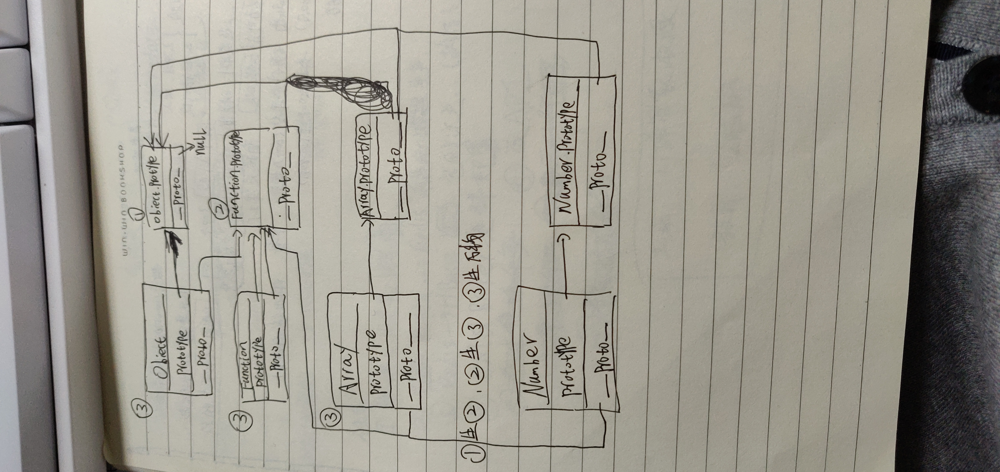

# 《JavaScript设计模式与开发实践》学习笔记（一）

>  资料下载地址(equb, mobi, awz3, pdf):
>
>  [百度网盘](https://pan.baidu.com/s/1m_5TZX7RSVvAzvGdnuE7dQ)
>
>  提取码: ntmc
>
>  **本资料仅用于学习交流，如有能力请到各大销售渠道支持正版！**

## 前言

**Q**: 设计模式是什么？

**A**: 在软件设计领域，设计模式的定义是，在面向对象软件设计过程中，针对特定问题的简介而优雅的解决方案。通俗的来说，设计模式就是给一些好的软件设计取一个好听的名字。

> 也许这个小故事可以说明名字对于模式的重要性：假设你是一名足球教练，正在球场边指挥 一场足球赛。通过一段时间的观察后，发现对方的后卫技术精湛，身体强壮，但边后卫速度较慢， 中后卫身高和头球都非常一般。于是你在场边大声指挥队员：“用速度突破对方边后卫之后，往 球门方向踢出高球，中路接应队员抢点头球攻门。” 在机会稍纵即逝的足球场上，教练这样费尽口舌地指挥队员比赛无疑是荒谬的。实际上这种 战术有一个名字叫作“下底传中”。正因为战术有了对应的名字，在球场上教练可以很方便地和 球员交流。“下底传中”这种战术即是足球场上的一种“模式”。 

**Q**: 模式在不同语言之间的区别？

**A**: 设计模式实际上是解决某些问题的一种思想，与具体使用的语言无关。《设计模式》完全是从面向对象设计的角度出发的，通过对封装、继承、多态、组合等技术的反复使用，提炼出一些可以重复使用的面向对象的设计技巧。近几年，函数式语言的发展也非常迅猛。在函数式或者其他编程范型的语言中，设计模式依然存在。

> 人类飞上天空需要借助飞机等工具，而鸟儿天生就有翅膀。在Dota游戏里，牛头人的人生目标是买一把跳刀（跳刀可以使用跳跃技能），而敌法师天生就有跳跃技能。因为语言的不同，一 些设计模式在另外一些语言中的实现也许跟我们在《设计模式》一书中看到的大相径庭，这一点 也不令人意外。 

例如，在 JAVA 这种静态编译型语言中，无法动态地给已存在的对象添加职责，所以一般通过包装类的方式来实现装饰者模式，但在 JavaScript 中，给对象动态添加职责是语言自带的功能，所以在 JavaScript 中，我们更关注于给函数动态添加指责。

**Q**: 设计模式的适用性？

**A**: 设计模式可能会带来代码量的增加，但设计模式的作用是让人们写出可复用和可维护性高的程序。只有深刻理解了设计模式的意图，结合实际场景，才能更好的运用设计模式。

---

**第一部分 基础知识**

---

## 第一章 面向对象的 JavaScript

JavaScript 没有提供传统的面向对象语言中的类式继承，而是通过原型委托的方式来实现与对象之间的继承。JavaScript 也没有在语言层面提供对抽象类和接口的支持（笔者注：这一点在 TypeScript 上有了）。正因为存在这些跟传统面向对象语言不一致的地方，所以在使用设计模式时，我们需要将其与传统面向对象的语言加以区别。

### 1.1 动态类型语言和鸭子类型

编程语言按照数据类型大致可以分成两类：

- 静态类型语言，在编译时便已确定变量的类型
- 动态类型语言，要在程序运行时，待变量被赋予某个值后，才会具有某种类型

静态类型的优点是在编译的时候就能发现类型不匹配的错误，让各类 IDE（编辑器）提供更可靠的代码提示。其次也方便编译器进行优化，提高程序执行速度。

动态类型语言的优点是代码数量更少更简洁，可读性更好，让程序员可以更专注于逻辑表达。然而相应的也要承担各种类型报错的代价。

JavaScript 是一门典型的动态类型语言。

所谓鸭子类型（ duck typing ）出自一个通俗的说法: `如果它走起 路来像鸭子，叫起来也是鸭子，那么它就是鸭子`。

利用鸭子类型的思想，我们不必借助超类型的帮助，就能轻松地在动态类型语言中实现一个原则：`面向接口编程，而不是面向实现编程`。例如，一个对象若有 push 和 pop 方法且这些方法的实现正确，那么它就可以被当作栈来使用。一个对象若有 length 属性，可以依照下标来去属性，那这个对象就可以被当作数组来使用。

在静态语言中，实现`面向接口编程`不是一件容易的事情，往往要通过抽象类或者接口等将对象进行向上转型。当对象真正的类型被隐藏在它的超类型身后，这些对象才能在类型检察系统的“监视”下互相呗替换使用。

但在 JavaScript 中，面向接口编程的过程跟主流的静态类型语言完全不一样，因此，在 JavaScript 中实现设计模式的过程与其他的语言会大相庭径。

### 1.2 多态

> “多态”一词源于希腊文 polymorphism，拆开来看是 poly（复数）+ morph（形态）+ ism， 从字面上我们可以理解为复数形态。

多态的实际含义是：同一操作作用于不同的对象上面，可以产生不同的解释和不同的执行结果。换句话说，给不同的对象发送同一个消息的时候，这些对象会根据这个消息分别给出不同的反馈。

#### 1.2.1 一段“多态”的 JavaScript 代码

```javascript
var makeSound = function (animal) {
    if ( animal instanceof Duck ) {
        console.log('嘎嘎嘎')
    } else if ( animal instanceof Chicken ) {
        console.log('咯咯咯')
    }
}
var Duck = function () {}
var Chicken = function () {}

makeSound(new Duck()) // 嘎嘎嘎
makeSound(new Chicken()) // 咯咯咯
```

这段代码确实体现了“多态性”，但是上面的代码不符合开闭原则，即**对扩展开放，对修改封闭**。当需要扩展功能时，修改的地方越多，程序出错的可能性就越大。

#### 1.2.2 对象的多态性

要实现对象的多态性，我们首先要把不变的部分隔离出来，以上面的代码为例，就是所有的动物都会发出叫声：

```javascript
var makeSound = function (animal) {
    animal.sound()
}

var Duck = function () {}
Duck.prototype.sound = function () {
    console.log('嘎嘎嘎')
}

var Chicken = function () {}
Chicken.prototype.sound = function () {
    console.log('咯咯咯')
}

makeSound(new Duck())
makeSound(new Chicken())
```

上面的代码实现了鸡鸭两种对象，他们在接收到消息后会作出“叫唤”的动作，而动作的内容不尽相同。在日后的维护中，我们只需要增加类似的对象，就可以达到不用改动 makeSound 函数也能扩展类似功能的目的了。

#### 1.2.3 类型检查和多态

为了真正了解多态的目的，我们需要从静态类型语言说起。

以 Java 为例，由于在代码编译时要进行严格的类型检查，所以不能给变量赋予不同类型的值。类似如下：

```java
String str;
str = "abc"; // Ok
str = 2; // Error
```

我们尝试把让鸭子和鸡叫唤的例子换成 Java 代码：

```java
public class Duck {
    public void makeSound () {
        System.out.println("嘎嘎嘎");
    }
}
public class Chicken {
    public void makeSound () {
        System.out.println("咯咯咯");
    }
}
public class AnimalSound {
    public void makeSound (Duck duck) {
        duck.makeSound();
    }
}
public class Test {
    public static void main (String args[]) {
        AnimalSound animalSound = new AnimalSound();
        Duck duck = new Duck();
        animalSound.makeSound(duck);
    }
}
```

上面的代码可以让鸭子发出叫声，却无法让鸡也叫唤起来。因为 AnimalSound 类的 makeSound 方法被我们规定为只能接受 Duck 类型的参数，这就是静态语言类型检查带来的困扰。

为了解决这一问题，静态类型的面向对象语言通常被设计为可以**向上转型**：当给一个类变量赋值时，这个变量的类型既可以使用这个类本身，也可以使用这个类的超类。

当 Duck 对象和 Chicken 对象的类型都被隐藏在超类型 Animal 身后，Duck 对象和 Chicken 对象就能被交换使用，这是让对象表现出多态性的必经之路。

#### 1.2.4 使用继承得到多态效果

> Java 中存在两种继承，抽象类实现继承和接口继承，其主要的区别可以参考[这篇文章](https://yq.aliyun.com/articles/206541)。

继承通常包括实现继承和接口继承，本章我们讨论实现继承。

首先创建一个 Animal 抽象类，再分别让 Duck 和 Chicken 都继承自 Animal 抽象类。代码如下：

```java
public abstract class Animal {
    abstract void makeSound(); // 抽象方法
}
public class Chicken extends Animal {
    public void makeSound () {
        System.out.println("咯咯咯");
    }
}
public class Duck extends Animal {
    public void makeSound () {
        System.out.println("嘎嘎嘎");
    }
}
```

然后让 AnimalSound 类的 makeSound 方法接受 Animal 类型的参数，而不是具体的 Duck 类型或者 Chicken 类型。代码如下：

```java
public class AnimalSound {
    public void makeSound (Animal animal) {
        animal.makeSound();
    }
}
public class Test {
    public static void main (String args[]) {
        AnimalSound animalSound = new AnimalSound();
        Animal duck = new Duck();
        Animal chicken = new Chicken();
        animalSound.makeSound(duck); // 嘎嘎嘎
        animalSound.makeSound(chicken); // 咯咯咯
    }
}
```

#### 1.2.5 JavaScript 的多态

**多态的思想实际上就是把“做什么”和“谁去做”分离开来**。要实现这一点，**归根结底要先消除类型之间的耦合关系**。

在 Java 中，由于如果在方法中指定了参数的类型，就不可能再被替换为另外一个类型，所以我们只能通过向上转型来实现多态。

但 JavaScript 的变量类型在运行期是可变的。一个 JavaScript 对象，既可以表示 Duck 类型的对象，又可以表示 Chicken 类型的对象，这意味着 JavaScript 对象的多态性是与生俱来的。

> 这种与生俱来的多态性并不难解释。JavaScript作为一门动态类型语言，它在编译时没有类型 检查的过程，既没有检查创建的对象类型，又没有检查传递的参数类型。在1.2.2节的代码示例中， 我们既可以往 makeSound 函数里传递 duck 对象当作参数，也可以传递 chicken 对象当作参数

#### 1.2.6 多态在面向对象程序设计中的作用

多态最根本的作用是通过把过程化的条件分支语句转化为对象的多态性，从而消除这些条件分支语句。

利用对象的多态性，在得到一个消息时，每个对象自然就明白了自己该做什么，每个对象负责它们自己的行为。所以这些对象可以根据同一个消息进行各自的工作。而这正是面向对象设计的优点。

#### 1.2.7 设计模式与多态

**绝大部分设计模式的实现都离不开多态性的思想**。

在 JavaScript 这种将函数作为一等对象的语言中，函数本身也是对象，函数用来封装行为并且能够被四处传递。

**我所理解的原型链 (间接说明函数在 JavaScript 中是一等公民) **



### 1.3 封装

封装的目的一般是将信息隐藏，而更广义的封装不仅包括封装数据和封装实现，还包括封装类型和封装变化。

#### 1.3.1 封装数据

在许多语言的对象系统中，会提供诸如`private`、`public`、`protected`等关键字来提供不同的访问权限。

但 JavaScript 并没有提供对这些关键字的支持，我们只能依赖变量的作用域来实现封装特性，且只能模拟出`public`和`private`这两种封装性。

除了 ECMAScript 6 中提供的`let`以外，我们一般通过函数来创建作用域：

```javascript
var myObject = (function () {
    var __name = 'sven' // private 变量
    return {
        // public 方法
        getName: function () {
            return __name
        }
    }
})()
```

另外，在 ES6 中我们还可以通过 Symbol 创建私有属性。

#### 1.3.2 封装实现

有时候我们喜欢把封装等同于封装数据，但实际上这是一种狭义的说法。

封装的目的是将信息隐藏，也就是说，封装不仅仅是隐藏数据，还包括隐藏实现细节，设计细节以及隐藏对象的类型等。

使用者无需关心封装的内部实现，只要它提供的功能正确便可。

#### 1.3.3 封装类型

> 《设计模式》一书中共归纳总结了23 种设计模式。从意图上区分，这23种设计模式分别被划分为创建型模式、结构型模式和行为型模式。
>
> 通过封装变化的方式，把系统中稳定不变的部分和容易变化的部分隔离开来，在系统的演变 过程中，我们只需要替换那些容易变化的部分，如果这些部分是已经封装好的，替换起来也相对容易。这可以大程度地保证程序的稳定性和可扩展性。


