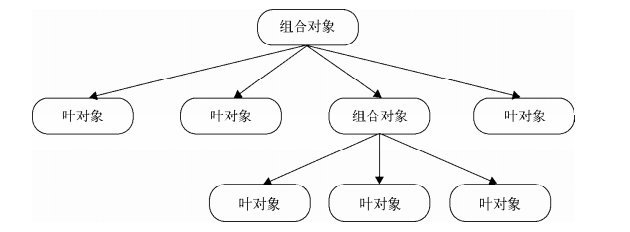

# 《JavaScript设计模式与开发实践》学习笔记（七）

## 第 9 章 命令模式

### 9.1 命令模式的用途

> 命令模式常见的应用场景是：有时候需要向某些对象发送请求，但是并不知道请求的接收 者是谁，也不知道被请求的操作是什么。此时希望用一种松耦合的方式来设计程序，使得请求发送者和请求接收者能够消除彼此之间的耦合关系。 

命令模式需要把一个请求封装成 command 对象，这个对象可以在程序中传递，请求者无需知道执行程序的名字，以达到请求调用者和接收者之间的耦合关系。

### 9.2 命令模式例子 

在传统语言环境下（Java，C++）实现命令模式，需要借助命令类来达到请求和执行分割开的目的。

```javascript
function runCommand = function (commnad) {
    command.excute()
}

// 执行
var actionA = {
    refresh: function () {console.log('refresh')}
}
var actionB = {
    add: function () {console.log('add')}
}

// 命令类
var ActionACommand = function (receiver) {
    this.receiver = receiver
}
ActionACommand.prototype.excute = function () {
    this.receiver.refresh()
}
var ActionBCommand = function (receiver) {
    this.receiver = receiver
}
ActionBCommand.prototype.excute = function () {
    this.receiver.refresh()
}

// 请求
runCommand(new ActionACommand(actionA))
runCommand(new ActionBCommand(actionB))
```

### 9.3 JavaScript 中的命令模式 ~ 9.7 宏命令

命令模式在 JavaScript 中是一种隐形的模式，由于函数作为一等对象，本身就可以被四处传递，无需借助传入类来实现。

此外，宏命令可以用于达到一次指令，执行一系列命令的目的。

下面的例子就是二者的体现。

```javascript
var commandA = {
    execute: function () {
        console.log('commandA')
    }
}
var commandB = {
    excute: function () {
        console.log('commandB')
    }
}

var MacroCommand = function () {
    return {
        commandsList: [],
        add: function (command) {
            this.commandsList.push(command)
        },
        excute: function () {
            this.commandsList.forEach(command => {
                command.excute()
            })
        }
    }
}

var macroCommand = MacroCommand()
macroCommand.add(commandA)
macroCommand.add(commandB)

macroCommand.execute()
```

## 第 10 章 组合模式

组合模式的思想是用小的子对象来构建更大的对象，而这些小的子对象本身也许是由更小的对象组成的。

### 10.2 组合模式的用途

组合模式将对象组合成树形结构，以表示“部分-整体”的层次结构

比如说在第 9 章中出现的宏命令的代码，仔细观察就可以发现，宏命令中包含了一组子命令，它们组成了一个树形结构，其结构大概如下：



其中，组合对象并不会执行真正的操作，而是会遍历它所包含的叶对象，把真正的 execute 请求委托给这些叶对象。

macroCommand 与代理模式的区别是，组合对象只负责传递请求给叶对象，而不会像代理对象一样控制对叶对象的访问。

这样做的好处是，用户无需知道自己控制的命令的内部实现就可以方便的实现多态控制，就像是一个“万能”遥控器，既可以开关空调，也可以开关电视。

### 10.7 组合模式的例子 —— 扫描文件夹

文件夹和文件之间的关系非常适合用组合模式来描述，文件夹既可以包含文件，也可以包含其他的文件夹，最终可以组合成一棵树。

下面我们就来模拟文件夹和文件这两个类的实现：

```javascript
class Folder {
  constructor (name) {
    this.name = name
    this.files = []
  }
  add (file) {
    this.files.push(file)
  }
  scan () {
    console.log('开始扫描文件夹：' + this.name)
    this.files.forEach(file => file.scan())
  }
}

class File {
  constructor (name) {
    this.name = name
  }
  add () {
    throw new Error('文件下面无法添加文件')
  }
  scan () {
    console.log('开始扫描文件：' + this.name)
  }
}

let folder = new Folder('folder')
let folder1 = new Folder('folder1')
let folder2 = new Folder('folder2')

let file = new File('file')
let file1 = new File('file1')
let file2 = new File('file2')

folder.add(folder1)
folder1.add(folder2)

folder.add(file)
folder.add(file1)
folder2.add(file2)
```

如此，我们就已经运用组合模式创建了一个树形结构，此时要遍历该树形结构如此的简单，只需要一句`folder.scan()`便已经足矣。

```javascript
folder.scan()
// 开始扫描文件夹：folder
// 开始扫描文件夹：folder1
// 开始扫描文件夹：folder2
// 开始扫描文件：file2
// 开始扫描文件：file
// 开始扫描文件：file
```

### 10.8 使用组合模式应该注意的点

1. 组合模式不是父子关系

   组合模式中根节点和叶子节点的对象并不是父子关系，只是因为它们实现了相同的接口而已。

2. 只有在对叶对象进行一致操作时才能用组合模式

   在针对某个叶节点进行单独操作时，组合模式就没有用武之处了。

### 10.9 引用父对象

一般来说，组合对象是自上而下的，但有时候我们需要在子节点上保持对父节点的引用，以便从子节点往父节点冒泡传递。

还是以上面的例子为例，当我们需要删除一个文件时，我们需要找到这个文件的父节点，从列表中将其删除，如果该文件没有父节点，则暂不删除。

```javascript
class Folder {
  constructor (name) {
    this.name = name
    this.files = []
    // 父节点
    this.parent = null
  }
  add (file) {
    // 设置父节点
    file.parent = this
    this.files.push(file)
  }
  scan () {
    console.log('开始扫描文件夹：' + this.name)
    this.files.forEach(file => file.scan())
  }
  // 删除方法
  remove () {
    if (!this.parent) return
    let index = this.parent.files.indexOf(this)
    this.parent.files.splice(index, 1)
  }
}

class File {
  constructor (name) {
    this.name = name
    this.parent = null
  }
  add () {
    throw new Error('文件下面无法添加文件')
  }
  scan () {
    console.log('开始扫描文件：' + this.name)
  }
  remove () {
    if (!this.parent) return
    let index = this.parent.files.indexOf(this)
    this.parent.files.splice(index, 1)
  }
}

let folder = new Folder('folder')
let folder1 = new Folder('folder1')
let folder2 = new Folder('folder2')

let file = new File('file')
let file1 = new File('file1')
let file2 = new File('file2')

folder.add(folder1)
folder1.add(folder2)

folder.add(file)
folder.add(file1)
folder2.add(file2)

folder.scan()

file.remove()
console.log('================ after file remove =======================')
folder.scan()
```

