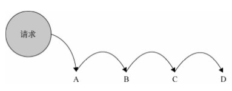

# 《JavaScript设计模式与开发实践》学习笔记（九）

## 第 13 章 职责链模式

> 在 JavaScript开发中，职责链模式是最容易被忽视的模式之一。实际上只要运用得当，职责链模式可以很好地帮助我们管理代码，降低发起请求的对象和处理请求的对象之间的耦合性。职责链中的节点数量和顺序是可以自由变化的，我们可以在运行时决定链中包含哪些节点。 

职责链模式的定义是：使多个对象都有机会处理请求，从而避免请求的发送者和接收者之间的耦合关系，将这些对象连成一条链，并沿着这条链传递请求，直到有一个对象处理为止。



职责链模式的最大优点是：请求发送者只需要直到链中的第一个节点，从而弱化了发送者和一组接收者之间的强联系。

### 13.1 实现职责链

首先来定义一个 Chian 类：

```javascript
class Chain {
    constructor (fn) {
        this.fn = fn
        this.successor = null
    }
    setNextSuccessor (successor) {
        return this.successor = successor
    }
    passRequest () {
        let ret = this.fn.apply(this, arguments)
        if (ret === 'nextSuccessor') {
            return this.successor && this.successor.passRequest.apply(this.successor, arguments)
        }
        return ret
    }
}
```

上面我们得到了一个职责链的节点类，每一个节点在生成时都应该传入一个实现方法，留待请求传入时调用，若该请求不由自己处理，则可以返回一个标志（上面的标志是字符串 ’nextSuccessor‘），接到标志后链将会自动调用下一个节点的方法，直到调用到对应的正确方法或者职责链完结为止。

下面是一个使用示例：

```javascript
var doSomething1 = function (type) {
    if (type === 1) {
        console.log('doSomething1')
    } else {
        return 'nextSuccessor'
    }
}

var doSomething2 = function (type) {
    if (type === 2) {
        console.log('doSomething2')
    } else {
        return 'nextSuccessor'
    }
}

var doSomething3 = function (type) {
    if (type === 3) {
        console.log('doSomething3')
    } else {
        return 'nextSuccessor'
    }
}

// 生成节点
var chainDoSomething1 = new Chain(doSomething1)
var chainDoSomething2 = new Chain(doSomething2)
var chainDoSomething3 = new Chain(doSomething3)

// 节点之间连接
chainDoSomething1.setNextSuccessor(chainDoSomething2)
chainDoSomething2.setNextSuccessor(chainDoSomething3)

// 传递请求
chainDoSomething1.passRequest(1)
chainDoSomething1.passRequest(2)
chainDoSomething1.passRequest(3)
```

### 13.2 异步的职责链

> 在上一节的职责链模式中，我们让每个节点函数同步返回一个特定的值"nextSuccessor"，来表示 是否把请求传递给下一个节点。而在现实开发中，我们经常会遇到一些异步的问题，比如我们要在 节点函数中发起一个ajax异步请求，异步请求返回的结果才能决定是否继续在职责链中 passRequest。

我们可以为原型添加一个 next 方法，表示手动传递请求给下一个节点。

```javascript
Chain.prototype.next = function () {
  return this.successor && this.successor.passRequest.apply(this.successor, arguments)
}
```

如此不仅可以支持同步，也可以支持异步请求传递：

```javascript
var doSomething1 = function (type) {
    if (type === 1) {
        console.log('doSomething1')
    } else {
        return 'nextSuccessor'
    }
}

var doSomething2 = function (type) {
    console.log('doSomething2')
    // 异步传递
    setTimeout(() => {
        this.next(type)
    }, 1000)
}

var doSomething3 = function (type) {
    if (type === 3) {
        console.log('doSomething3')
    } else {
        return 'nextSuccessor'
    }
}

chainDoSomething1.setNextSuccessor(chainDoSomething2).setNextSuccessor(chainDoSomething3)
chainDoSomething1.passRequest(3)
```

### 13.6 职责链模式的优缺点

优点：

- 使用职责链模式，链中的节点对象可以灵活的拆分重组，增加删除任意节点都不需要改动其他节点中的代码
- 职责链模式可以手动指定起始节点，在特定场景中可以有效减少判断数量，这是用单纯的 if else 所办不到的

弊端：

- 如果节点全都是事务性节点，则当所有节点都不符合要求时，程序将会静默或者抛错，所以职责链一般需要一个固定的尾节点用于处理即将离开链尾的请求
- 过长的职责链将会带来不菲的性能损耗

### 13.7 用 AOP 实现职责类

在 JavaScript 中，我们可以利用语言的特性，通过一种更简便的方式来创建简单的职责链。

```javascript
Function.prototype.after = function (fn) {
    let self = this
    return function () {
        let ret = self.apply(this, arguments)
        if (ret === 'nextSuccessor') {
            return fn.apply(this, arguments)
        }
        return ret
    }
} 
```

## 第 14 章 中介者模式

中介者模式的作用是接触对象与对象之间的紧耦合关系，在增加了中介者对象后，所有的相关对象都通过中介者对象来通信，而不是相互引用。当一个对象发生变化时，不需要挨个通知引用它的所有对象，只需要通知中介者即可。

### 14.2 中介者模式的例子

> 本次阅读至 P191 14.2 中介者模式的例子——泡泡堂游戏 210


