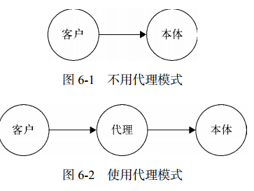

# 《JavaScript设计模式与开发实践》学习笔记（五）

## 第 6 章 代理模式

> 代理模式是一种非常有意义的模式，在生活中可以找到很多代理模式的场景。比如，明星都 有经纪人作为代理。如果想请明星来办一场商业演出，只能联系他的经纪人。经纪人会把商业演 出的细节和报酬都谈好之后，再把合同交给明星签 。

**代理模式是为一个对象提供一个代用品或者占位符，以便控制对它的访问**。



### 6.1 一个例子

> A 想给 B 送花，A 决定把花交给 A 和 B 共同的朋友 C，让她把花给 B

```javascript
var Flower = function () {}

var A = {
  sendFlower: function (target) {
    var flower = new Flower()
    target.receiveFlower(flower)
  }
}

// 代理
var C = {
  receiveFlower: function (flower) {
    B.receiveFlower(flower)
  }
}

var B = {
  receiveFlower: function (flower) {
    console.log('收到花' + flower)
  }
}

A.sendFlower(C)
```

上面的代码实现了一个最简单的代理模式，虽然此处的代理模式并没有什么用处，只是把请求简单地转交给本体。

### 6.2 保护代理和虚拟代理

代理可以帮真正的实体过滤掉一些请求，称为**保护代理**。

也可以将上面的`new flower`交由代理执行，只有当 A 或 B 满足某些条件时，代理才会执行该操作，这叫作**虚拟代理**。虚拟代理会把一些开销很大的对象，延迟到真正需要它的时候才会创建。

### 6.3 虚拟代理实现图片预加载

在 Web 中，图片预加载是一种常用的技术，常见的做法是用一张 loading 图片占位，然后用异步的方式加载图片，等图片加载好了以后再将它填充到 img 节点里。

```javascript
var myImage = (function () {
    var imgNode = document.createElement('img')
    document.body.appendChild(imgNode)
    return {
        setSrc: function (src) {
            imgNode.src = src
        }
    }
})()

var proxyImage = (function () {
    var img = new Image
    img.onload = function () {
        myImage.setSrc(this.src)
    }
    return {
        setSrc: function (src) {
            myImage.setSrc('本地loading.gif')
            img.src = src
        }
    }
})()

proxyImage.setSrc('http://imgcache.example.com/wow.jpg')
```

上面的例子中通过对 proxyImage 间接访问了 myImage。proxyImage 控制了对 myImage 的访问，并且让我们可以在真正的图片加载好之前对它做一些其他操作。

### 6.4 代理的意义

上面的预加载图片其实也可以不用代理模式，比如像下面这样：

```javascript
var myImage = (function () {
    var imgNode = ducument.createElement('img')
    document.body.appendChild(imgNode)
    var img = new Image
    img.onload = function () {
        imgNode.src = img.src
    }
    return {
        setSrc: function (src) {
            imgNode.src = '本地loading.gif'
            img.src = src
        }
    }
})()

proxyImage.setSrc('http://imgcache.example.com/wow.jpg')
```

为了说明代理模式的意义，需要介绍一个面向对象设计的原则——单一职责原则。

**单一职责原则：就一个类（通常也包括对象和函数）而言，应该仅有一个引起他变化的原因**。

职责被定义为“引起变化的原因”，上面的代码中 MyImage 对象除了负责给 img 节点设置 src 外，还要负责预加载图片。

此外，大多数情况下，若违反了任何其他原则，也会同时违反开放-封闭原则。

纵观整个程序，我们并没有改变或者增加 MyImage 的接口，而是通过代理对象给系统添加了新的行为。给 img 节点设置 src 和图片预加载两个功能被隔离在两个对象里，可以各自变化且不影响对方。

### 6.5 代理和本体接口的一致性

代理和本体接口保持一致有两个好处：

- 用户可以放心地请求代理
- 在任何使用本体的地方都可以替换成使用代理

在 Java 等语言中，代理和本体都需要显式地实现同一个接口，一方面保证了它们会拥有相同的方法，另一方面通过接口进行向上转型可以避开编译器的类型检查，将来代理和本体都可以被替换使用。

在 JavaScript 中，虽然没有了接口，设计全部依赖于程序员的自觉性，但我们还是需要遵循该原则来进行开发。