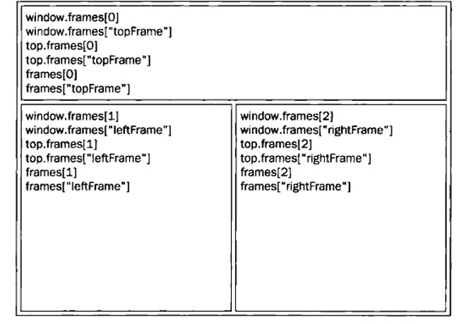
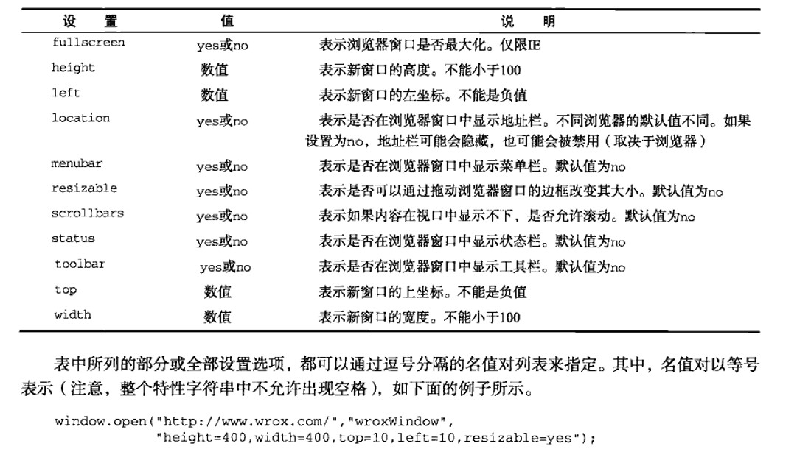
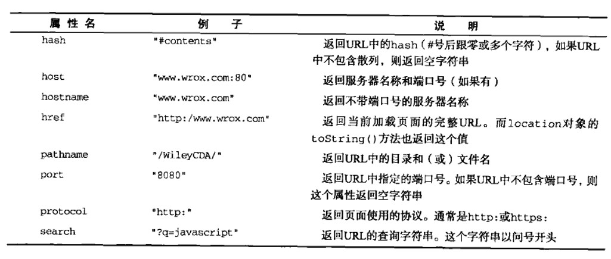
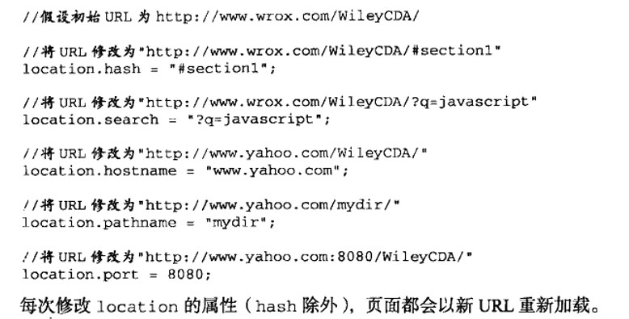

# 红宝书（javascirpt高级程序设计）学习笔记（六）

## 第8章 BOOOOOOOOOOOM ！

**本章介绍浏览器对象，实用章节，适合仔细阅读，查漏补缺。**

ECMAScript是JavaScript的核心，但是，如果要在浏览器中使用JavaScript，那就一定要了解BOM（**浏览器对象模型**）。因为BOM提供了很多对象用于访问浏览器的功能，而在真正的开发中，一个Web应用程序总是免不了要与这些功能打交道。

### 8.1 window对象

BOM的核心对象是window，它表示浏览器的一个实例。在浏览器中，window有两种角色，既是通过JavaScript访问浏览器窗口的一个借口，又是ECMAScript规定的Global对象。

#### 8.1.1 全局作用域

- 如上所述，window对象同时扮演者ECMAScript中Global对象的角色，因此所有在全局作用域中声明的变量，函数都会变成window对象的属性和方法。

- 但是定义全局变量和window对象上直接定义属性还是有一点区别，全局变量不能通过delete操作符删除，而直接在window对象上定义的属性可以。

  ```javascript
  var a = '123'
  delete a // false
  delete window.a // false
  window.aa = '123'
  delete window.aa // true
  ```

- 本章后面将要讨论的很多全局JavaScript对象（如location和navigator）实际上都是window对象的属性。

#### 8.1.2 窗口关系及框架

- 如果页面中包含框架，则每个框架都拥有自己的window对象，并且保存在frames集合中。在frames集合中，可以通过数值索引或者框架名称来访问对应的window对象。

  

  ```html
  <!DOCTYPE html>
  <html lang="en">
  <head>
      <meta charset="UTF-8">
      <title>Frameset Example</title>
  </head>
  <frameset rows="160,*">
      <frame src="https://www.baidu.com/" name="topFrame"/>
      <frameset cols="50%,50%">
          <frame src="https://www.baidu.com/" name="leftFrame"/>
          <frame src="https://www.baidu.com/" name="rightFrame"/>
      </frameset>
  </frameset>
  <!--以上代码创建了一个框架集，其中一个框架居上，两个框架居下。对这个例子而言，可以通过
  window.frames[0]或者window.frames["topFrame"]来引用上方的框架。不过，恐怕你最好使用
  top 而非window 来引用这些框架（例如，通过top.frames[0]）。
  我们知道，top 对象始终指向最高（最外）层的框架，也就是浏览器窗口。使用它可以确保在一个
  框架中正确地访问另一个框架。因为对于在一个框架中编写的任何代码来说，其中的window 对象指向
  的都是那个框架的特定实例，而非最高层的框架。图8-1 展示了在最高层窗口中，通过代码来访问前面
  例子中每个框架的不同方式。-->
  </html>
  ```

  访问各个框架的方式如下图所示

  

- 在使用框架的情况下，浏览器会存在多个Global对象。在每个框架中定义的全局变量会自动成为框架中window对象的属性。

#### 8.1.3 窗口位置

- *screenLeft* 和 *screenTop* 属性分别用于表示窗口相对于屏幕左边和上边的位置。

- 使用moveTo()和moveBy()方法可以将窗口精确地移动到一个新位置。这两个方法都接收两个参数，其中moveTo()接收的是新位置的x和y坐标值，而moveBy()接收的是在水平和垂直方向上移动的像素数。

  ```javascript
  // 将窗口移动到屏幕的左上角
  window.moveTo(0, 0)
  // 将窗口向下移动100像素
  window.moveBy(0, 100)
  // 将窗口移动到(200, 300)
  window.moveTo(200, 300)
  // 将窗口向左移动50像素
  window.moveBy(-50, 0)
  ```

  **需要注意的是，这两个方法可能会被浏览器禁用**。并且只能对最外层的window对象使用。

#### 8.1.4 窗口大小

4个属性：

- innerWidth 表示该容器中页面视图区的大小（减去边框宽度）
- innerHeight 表示该容器中页面视图区的大小（减去边框宽度）
- outerWidth 返回浏览器窗口本身的宽度
- outerHeight 返回浏览器窗口本身的高度

4个方法（还存在，但是已经全部禁用了......）:

- resizeTo
- resizeBy

#### 8.1.5 导航和打开窗口

- window.open()可以导航到一个特定的URL

  函数参数设置见下图

  

- window.close()可以关闭一个窗口（仅限于关闭通过window.open打开的弹出窗口）

#### 8.1.6 间歇调用和超时调用

JavaScript是单线程语言，但它允许通过设置超时值和间歇时间值来调度代码在特定的时刻执行。

- 超时调用：window.setTimeout()
- 间歇调用：window.setInterval()（取消间歇调用：window.clearInterval()）

#### 8.1.7 系统对话框

三种调用系统对话框的方法：

- alert()
- confirm()
- prompt()

```javascript
// prompt用法
var result = prompt("what is your name?", "")
if (result !== null) {
    alert("Welcome, " + result)
}
```

### 8.2 location对象

- *location* 是最有用的BOM对象之一，它提供了与当前窗口中加载的文档有关的信息，还提供了一些导航功能。

- *location* 对象是一个很特别的对象，因为它既是 *window* 对象的属性，也是 *document* 对象的属性。换句话说，*window.location* 和 *document.location* 引用的是同一个对象。

- *location* 不仅保存着当前文档的信息，还会降URL解析为独立的片段，让开发人员可以通过不同的属性访问这些片段。

  

  （ *location* 对象的所有属性）

#### 8.2.1 查询字符串参数

虽然通过上面的属性可以访问到 *location* 对象的大多数信息，但其中访问URL包含的查询字符串的属性并不方便。尽管 *location.search* 返回从问号到URL末尾的所有内容，但却没有办法逐个访问其中每个查询字符串参数。为此，可以像下面一样创建一个函数，用于**解析查询字符串，然后返回包含所有参数的一个对象。**

```javascript
function getQueryStringArgs(){
  var qs = (location.search.length>0?location.search.substring(1):"");
  var args = {};
  var items = qs.length?qs.split("&"):[];
  var item = null;
  var name = null;
  var value = null;
  len = items.length;
  for (var i = 0; i < len; i++) {
    item = items[i].split("=");
    name = decodeURIComponent(item[0]);
    value = decodeURIComponent(item[1]);
    if (name.length) {
      args[name] = value;
    }
  }
  return args;
}
```

通过上面的函数，每个查询字符串参数都成了返回对象的属性。这样就极大地方便了对每个参数的访问。

#### 8.2.2 位置操作

使用 *location* 对象可以通过以下几种方式来改变浏览器的位置：

- assign()方法。location.assign("https://baidu.com")

- 将 *location.href* 或 *window.location* 设置为一个URL值，这样做也会调用上面的assign方法，并且效果是完全一样的。

- 还可通过将hash、search、hostname、pathname和port属性设置为新值来改变URL

  

当通过上述任何一种方式修改URL之后，浏览器的历史记录中就会生成一条新纪录，因此用户通过单击“后退”按钮都会导航到前一个页面。如果想禁用这种行为，可以使用 *replace()* 方法。**此方法虽然会导致浏览器位置改变，但不会在历史记录中生成新纪录**。在调用完这个方法后，用户也不能回到前一个页面。

*location.reload()* 方法是重新加载该页面，其中默认会从浏览器缓存中加载，**如果要强制从服务器重新加载，则需要为该方法传递参数true**。

### 8.3 navigator 对象

*navigator* 对象用于标识客户端浏览器。与其他BOM对象的情况一样，每个浏览器中的navigator对象也都有一套自己的属性。（比较常用的属性有 *navigator.userAgent* 等）

### 8.5 history 对象

*history* 对象保存着用户上网的历史记录。开发人员无法得知用户浏览过的URL，不过却可以通过以下几种办法在不知道实际URL的情况下实现后退和前进。

```javascript
// 后退一页
history.go(-1)
// 前进一页
history.go(1)
// 前进两页
history.go(2)
// 跳转到最近的wrox.com页面
history.go('wrox.com')
// 后退
history.back()
// 前进
history.forward()
```