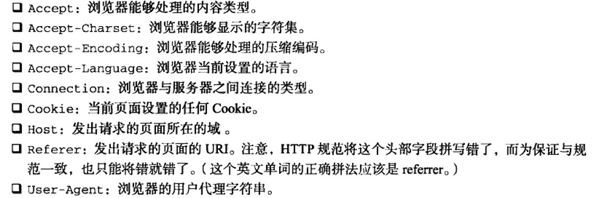
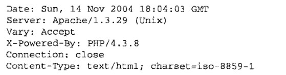

# 红宝书（javascirpt高级程序设计）学习笔记（十四）

## 第21章 Ajax与Comet

**本章开始介绍Ajax，进入原理介绍部分，建议着重认真阅读，做好笔记。**

Ajax技术的核心是`XMLHttpRequest`对象（简称XHR），通过XHR，可以以异步的方式从服务器取得更多信息，然后再通过DOM将新数据插入到页面中。另外虽然名字中包含XML，但Ajax通信与数据格式无关。

### 21.1 XMLHttpRequest 对象

使用`var xhr = new XMLHttpRequest ()`来创建一个原生的XHR对象。

#### 21.1.1 XHR的用法

在使用XHR对象时，要调用的第一个方法时`open()`，它接收3个参数：

- 发送的请求类型(get、post)
- 请求的URL(既可以是相对于当前页面的也可以是绝对路径）
- 是否异步发送请求的布尔值

调用`open()`方法不会真正的发送请求，只是启动一个请求，要发送，就要调用`send()`方法

```javascript
// 如下
xhr.open("get", "example.txt", false)
xhr.send(null)
```

`send()`方法接收一个参数，即请求主体发送的数据，**如果不发送数据，则必须传入`null` **。

当传入`false`时，则说明该次访问是同步的，JavaScript会等到服务器返回响应再继续执行，收到的响应会自动填充XHR对象的属性，共有以下相关属性：

- responseText：作为响应主体被返回的文本
- responseXML：如果响应内容类型是"text/xml"或"application/xml"，这个属性将保存包含着相应数据的XML DOM文档
- status：相应的HTTP状态
- statusText：HTTP状态的说明

一般来说，当`xhr.status`为2XX的时候，访问就算是成功了，此时`resoponseText`属性的内容已经准备就绪。此外，如果返回状态码为304，则说明资源没有被修改，可以直接使用浏览器的缓存。

```javascript
// 同步发送请求
xhr.open("get", "example.txt", false)
xhr.send(null)

if ((xhr.status >= 200 && xhr.status < 300) || xhr.status == 304) {
    alert(xhr.responseText)
} else {
    alert("Request was unsuccessful" + xhr.status)
}
```

上面使用同步发送的代码不会出错，但是在正常使用中，我们一般都是发送异步请求居多。此时，可以通过检测XHR对象的`readyState`属性来识别是否已经接受到所有响应数据。

`readyState`属性有以下的几个值。

- 0：未初始化，尚未调用`open()`
- 1：启动，已经调用`open()`，尚未`send()`
- 2：发送，调用了`send()`，尚未收到响应
- 3：接收。收到了部分响应数据
- 4：完成。接收到了全部的相应数据

每次该属性从一个值变成另一个，都会触发一次`readystatechange`事件，所以我们就可以用该事件来检测。不过要注意的是，为了确保浏览器兼容，必须在调用`open()`前就指定好该事件。

```javascript
var xhr = new XMLHttpRequest ()
xhr.onreadyStateChange = function () {
    if (xhr.readyState = 4) {
        if ((xhr.status >= 200 && xhr.status < 300) || xhr.status == 304) {
            alert(xhr.responseText)
        } else {
            alert("Request was unsuccessful" + xhr.status)
        }
    }
}
xhr.open("get", "example.txt", true)
xhr.send(null)
```

另外，在接收到响应之前可以调用`abort()`方法来取消异步请求，在终止请求后，还应该对XHR对象进行解除引用操作，由于内存原因，不建议重用XHR对象。

#### 21.1.2 HTTP头部信息

默认情况下，在发送XHR请求的同事，会发送下列头部信息：


通过`setRequestHeader()`方法可以设置自定义的请求头部信息，该方法接收两个参数：

- 头部字段的名称
- 头部字段的值

要成功发送请求头部消息，必须在调用`open()`方法之后，调用`send()`方法之前调用`setRequestHeader()`方法。

使用XHR对象的`getResponseHeader()`方法并传入头部字段名称，可以取得相应的头部信息，调用`getAllResponseHeaders()`方法则可以获得一个包含所有头部信息的字符串，如下。



#### 21.1.3 GET 请求

使用GET请求要注意，查询字符串中每个参数的名称和值都必须使用`encodeURIComponent()`进行编码后才能放到URL末尾，以防出错。而且所有名值对都必须由&号分隔。

#### 21.1.4 POST请求

在xhr对象调用`open()`时，传入"post"便可以拉起一个POST请求，发送POST请求需要在`send()`方法中传入某些数据。在此处可以传入XML DOM文档，也可以传入任意字符串。

默认情况下，服务器对POST请求和Web表单请求并不会一视同仁，但是我们可以通过设置`Content-Type`头部信息的值来通过xhr模仿任意类型的请求。例如，将`Content-Type`设置为`application/x-www-form-rulencoded`，就可以将该次发送设置为表单的形式。

### 21.2 XMLHttpRequest 2级

#### 21.2.1 FormData

XMLHttpRequest 2级定义了`FormData`类型，为序列化表单以及创建表单格式相同的数据提供了便利。

```javascript
var data = new FormData()
data.append("name", "test")
```

上面的代码创建了一个`FormData`对象，并添加了一些数据。

`append()`方法接收键和值两个参数，除此以外，也可以通过表单元素预先向其中注入键值对。

```javascript
var data = new FormData(document.forms[0])
```

随后，可以直接将它传给xhr对象，**不用设置头部**，直接发送。

```javascript
var xhr = new XMLHttpRequest ()
xhr.onreadyStateChange = function () {
    if (xhr.readyState === 4) {
        if ((xhr.status >= 200 && xhr.status < 300) || xhr.status == 304) {
            alert(xhr.responseText)
        } else {
            alert("Request was unsuccessful" + xhr.status)
        }
    }
}
xhr.open("post", "example.txt", true)
var data = new FormData(document.forms[0])
xhr.send(data)
```

XHR对象能够识别传入的数据类型是FormData的实例，并配置适当的头部信息。

#### 21.2.2 超时设定

2级规范为XHR对象添加了一个`timeout`属性，在给该属性设定一个数值后，如果超时还没收到响应，就会调用`ontimeout`事件处理程序。

```javascript
xhr.timeout = 1000 // 超时为1秒
xhr.ontimeout = function () {
    alert("timeOut!")
}
```

#### 21.2.3 overrideMimeType() 方法

调用该方法可以保证把响应当做某种文本来处理。

### 21.3 进度事件

进度事件有6种

- loadstart：接收到相应数据的第一个字节时触发
- progress：在接收响应期间持续不断地触发
- error：在请求发生错误时触发
- abort：因为调用abort()方法终止连接时触发
- load：在收到完整响应数据时触发
- loadend：在通信完成或者触发error、abort、load事件后触发

每个请求都从loadstart事件开始，最后以触发loadend事件结束。

#### 21.3.1 load事件

只要浏览器接收到了服务器响应，不管其状态如何，都会触发load事件，这意味着你依然要检查status属性。（但是可以不用检查`readyState`的值，因为该事件发生的时候已经确定是接收完数据了）

```javascript
var xhr = new XMLHttpRequest ()
xhr.onload = function () {
    if ((xhr.status >= 200 && xhr.status < 300) || xhr.status == 304) {
        alert(xhr.responseText)
    } else {
        alert("Request was unsuccessful" + xhr.status)
    }
}
```

#### 21.3.2 progress事件

该事件会在浏览器接收新数据期间周期性地触发，同时该事件的`event`对象的`target`属性是`XHR`对象，但包含着3个额外的属性：

- lengthComputable：表示进度信息是否可用的布尔值
- position：表示已经接收的字节数
- totalSize：表示根据Content-Length响应头部确定的预期字节数

使用这些信息，开发者可以为用户创建一个进度指示器。

```javascript
xhr.onprogress = function (event) {
    var testDiv = document.getElementById("status")
    if (event.lengthComputable) {
        testDiv.innerHtml = `${event.position}/${event.totalSize}`bytes
    }
}
```

为保证正确调用，必须在`open()`方法之前添加该事件处理程序。

### 21.4 跨源资源共享（跨域）

通过XHR实现Ajax会遇到的一个主要限制来源于"跨域安全策略"。即在默认情况下，XHR对象只能访问与包含它的页面位于同一个域中的资源。

CORS（跨源资源共享）是W3C的一个工作草案，定义了在必须访问跨源资源时，浏览器与服务器应该如何沟通。其基本思想是，使用自定义的HTTP头部让浏览器与服务器进行沟通，从而决定请求或响应是否应该成功。

比如一个简单的使用GET或POST请求，在发送时，给它附加一个额外的Origin头部，包括请求页面的源信息（协议、域名、端口），如`Origin: http://www.nczonline.net`。

若服务器认为这个请求可以接受，就在`Access-Control-Allow-Origin`头部中发回相同的源信息（若是公共资源，可以回发"*"）。如`Access-Control-Allow-Origin: http://www.nczonline.net`

如果没有这个头部，或者有这个头部但源信息不匹配，浏览器就会驳回请求。

注意，请求和响应都不包含cookie信息。

#### 21.4.1 IE对CORS的实现

了解即可，略

#### 21.4.2 其他浏览器对CORS的实现

对大部分浏览器来说，请求位于另一个域中的资源，使用标准的XHR对象并在`open()`方法中传入绝对的URL即可。

但是相对于同域来说，跨域XHR对象也有下列限制：

- 不能使用`setRequestHeader()`设置自定义头部
- 不能发送和接收`cookie`（**但可以通过设置`xhr.withCredentials`来强制让该跨域请求携带cookie,同时服务器需要设置`Access-Control-Allow-Credentials`响应头为true**）
- 调用`getAllResponseHeaders()`方法总会返回空字符串

#### 21.4.3 Preflighted Requests

CORS通过名为`Preflighted Requests`的透明服务器验证机制，支持开发人员使用自定义的头部，GET或POST之外的方法，以及不同类型的主体内容。在使用下列高级选项发送请求时，就会向服务器发送一个Preflight请求。这种请求使用OPTIONS方法，发送下列头部：

- Origin
- Access-Control-Request-Method：本次请求使用的方法
- Access-Control-Request-Headers：自定义的头部信息，多个头部以逗号分隔

发送这个请求后，服务器可以决定是否允许这种类型的请求。通过在响应中发送如下头部与浏览器进行沟通：

- Access-Control-Allow-Origin
- Access-Control-Allow-Methods：允许的方法，多个方法以逗号分隔
- Access-Control-Allow-Headers：允许的头部，多个头部以逗号分隔
- Access-Control-Max-Age：应该将这个Preflight 请求缓存多长时间（以秒表示）

#### 21.4.4 带凭据的请求

默认情况下，跨源请求不提供凭据（cookie, HTTP认证及客户端SSL证明等）。但可以通过将`xhr.withCredentials`设为true来发送凭据，如果服务器接收带凭据的请求，会用下面的HTTP头部响应：

`Access-Control-Allow-Credentials: true`

另外，服务器还可以在Preflight响应中发送这个HTTP头部，表示允许源发送带凭据的请求。

#### 21.4.5 跨浏览器的CORS

本小节略，xhr已经全兼容了

### 21.5 其他的跨域技术

本小节介绍不依赖XHR对象、不依赖服务器设置头也能发送的跨域请求。

#### 21.5.1 图像Ping

第一种跨域请求技术是通过``标签，通过动态的创建图像，使用它们的`onload`和`onerror`事件处理程序来确定是否收到了响应。

```javascript
var img = new Image()
img.onload = img.onerror = function () {
    alert("Done!")
}
img.src = "http://www.example.com/hi?name=myName"
```

将`onload`和`onerror`事件处理程序指定为同一个函数，这样无论是什么响应，只要请求完成，就能得到通知。而请求从设置`src`属性的那一刻开始。

这种方法最常用于追踪用户点击页面或动态广告曝光次数，但这种方法有两个缺点：

- 只能发送GET请求
- 无法访问服务器的响应文本

因此，这种方法只能用于浏览器和服务器之间的单向通信。

#### 21.5.2 JSONP

JSONP是JSON with padding的简写，是应用JSON的一种新方法，在后来的Web服务中非常流行。

其简单原理就是在网页中定义一个`callback`函数，然后通过`<script>`标签不受同源限制的原理请求一段服务器上的JS脚本，同时通过query的方式传入`callback`函数的名字。该脚本在插入页面后会立即执行，同时调用在页面中已经定义好的`callback`函数的方法，将数据以JSON的方式传入函数中，完成调用。

```javascript
function handleRes(res){
    console.log(res)
}
var script = document.createElement("script")
script.src = "http://example.net/api/?callback=handleRes"
document.body.insertBefore(script, document.body.firstChild)
```

JSONP之所以极为流行，主要原因使其简单易用的优点，而且与图像PING相比，它的优点在于能够直接访问响应文本。不过他也有一些不足：

- JSONP会从其他域中加载代码执行，有可能遇到安全问题
- 同样只支持GET方法，参数暴露
- 要确定JSONP请求是否失败并不容易

#### 21.5.3 Comet

长轮询和HTTP流

#### 21.5.4 服务器发送事件（SSE）

指围绕只读Comet交互推出的API或者模式，用于创建到服务器的单向连接。

#### 21.5.5 Web Socket

Web Sockets的目标是在一个单独的持久连接上提供全双工，双向通信。

Web Sockets使用了自定义的协议，未加密的连接不再是http://，而是ws://，加密连接也变成了wss://。

1. Web Sockets API

   要创建Web Socket，先实例一个WebSocket对象并传入要连接的URL

   ```javascript
   var socket = new WebSocket("ws://www.example.com/server")
   ```

   要注意的是，这里必须要传入绝对URL，**同源策略不适用于Web Socket**

   实例化后，浏览器会马上开始连接，与XHR类似，Web Socket也有一个表示当前状态的`readyState`，其状态如下

   - WebSocket.OPENING(0)：正在建立连接
   - WebSocket.OPEN(1)：已经建立连接
   - WebSocket.CLOSING(2)：正在关闭连接
   - WebSocket.CLOSE(3)：已经关闭连接

   readyState永远从0开始，不同的是，Web Socket没有`readystatechange`事件。

   要关闭Web Socket连接，可以在任何时候调用close()方法。

2. 发送和接收数据

   使用`send()`方法可以发送数据传入任意字符串，但注意的是，Web Socket只能接收字符串，所以任何复杂数据在传输之前都应该先进行序列化。

   当接收数据时，WebSocket对象会触发`message`事件，该事件会把返回的数据放在`event.data`属性中。

3. 其他事件

   - open：在成功建立连接时触发
   - error：在发生错误时触发，连接不能持续
   - close：在连接关闭时触发

   WebSocket对象不支持DOM 2级事件侦听器，因此必须使用DOM 0 级语法来定义事件处理程序，如下

   ```javascript
   var socket = new WebSocket("ws://www.example.com/server")
   socket.onopen = function () {
       alert("onopen")
   }
   ```

   在这三个事件中，只有`close`事件的`event`对象有额外信息：

   - wasClean：布尔值，表示连接是否已经明确关闭
   - code：服务器返回的状态码
   - reason：字符串，包含服务器发回的消息

   #### 21.5.6 SSE 与 WebSocket

   WebSocket需要服务器支持ws协议，而SSE不需要，但WebSocket能双向通信，和SSE显然不能。

   ### 21.6 安全

   对于未被授权系统有权访问某个资源的情况，称为SCRF（跨站点请求伪造），为了防止这种攻击，应选用以下几种常用的方式：

   - 要求使用SSL连接访问资源
   - 要求每一次请求附带经过相应算法的得到的验证码

   注意，**下列措施对防范CSRF攻击不起作用**：

   - 要求发送POST而不是GET——很容易改变
   - 检查来源URL确定是否可信——来源记录很容易伪造
   - 基于cookie信息进行验证——同样很容易伪造

   **另外，谨记不要在任何JavaScript代码中携带用户名和密码！**