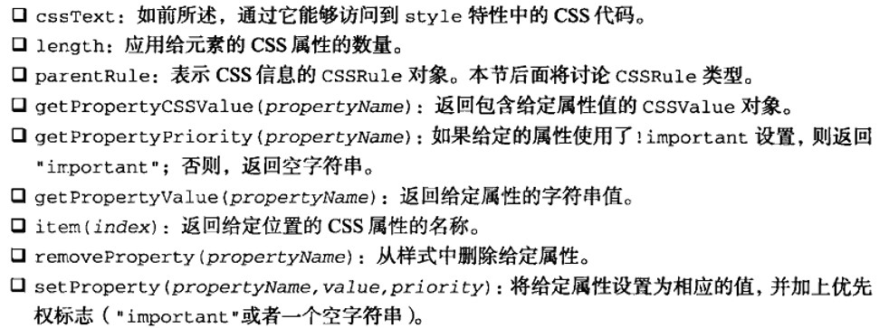

# 红宝书（javascirpt高级程序设计）学习笔记（八）

## 第11章 DOM扩展

对`DOM`两个主要的扩展是Selectors API（选择符API）和HTML5。此外还有一些个别浏览器转有的扩展。本章适合系统阅读，查缺补漏。

### 11.1 选择符API

Selectors API LEVEL 1 的核心是两个方法：querySelector() 和 querySelectorAll() 。

#### 11.1.1 querySelector()方法

*querySelector()* 方法接收一个CSS选择符，返回与该模式匹配的**第一个**元素，如果没有找到匹配的元素，**返回null**。

```javascript
// 取得body元素
var body = document.querySelector("body")
// 取得ID为"myDiv"的元素
var myDiv = document.querySelector("#myDiv")
// 取得类为"selected"的第一个元素
var selected = document.querySelector(".selected")
// 取得类为"button"的第一个图像元素
var img = document.body.querySelector("img.button")
```

如果传入了不被支持的选择符，querySelector() 会抛出错误。

能够调用 querySelector() 方法的类型包括Document、DocumentFragment和Element。

#### 11.1.2 querySelectorAll() 方法

querySelectorAll() 接收一个与上面一样的参数，返回一个 NodeList 的实例，里面包含了所有匹配的元素。如果没有找到，**返回一个空的NodeList。**

和 querySelector 类似，能够调用 querySelectorAll() 方法的类型包括Document、DocumentFragment和Element。

#### 11.1.3 matchesSelector() 方法

该方法接收一个CSS选择符，如果调用元素与该选择符匹配，返回 true ，否则返回 false。

```javascript
if (document.body.matchesSelector("body.page1")) {
    // true
}
```

在取得了某个元素引用的情况下，使用这个方法能够方便地检测它是否会被 querySelector() 或 quereySelectorAll() 方法返回。

### 11.2 元素遍历

Element Traversal API为DOM元素添加了5个属性：

- childElementCount：返回子元素（不包括文本节点和注释）的个数
- firstElementChild：指向第一个子元素
- lastElementChild: 指向最后一个子元素
- previousElementSibling: 指向前一个同辈元素
- nextElementSibling：指向后一个同辈元素

### 11.3 HTML5

在这里只讨论与DOM节点相关的HTML5的内容。

#### 11.3.1 与类相关的扩充

1. getElementsByClassName() 方法

   可以通过document对象及所有HTML元素调用该方法。

   ```javascript
   // 取得所有类中包含"username"和"current"的元素，类名先后顺序无所谓
   var allCurrentUsernames = document.getElementByClassName("username current")
   // 取得ID为"myDiv"的元素中带有类名"selected"的所有元素
   var selected = document.getElementById("myDiv").getElementByClassName("selected")
   ```

   跟之前的一样，返回的也是一个nodelist

2. classList 属性

   使用classList属性可以增删查改当前元素的class值。classList属性是新集合类型DOMTokenList的实例。该新类型有几种方法：

   - add
   - contains：表示列表中是否存在给定的值，存在返回true，否则返回false。
   - remove
   - toggle：如果列表中已经存在给定的值，删除它；如果列表中没有给定的值，添加它。

#### 11.3.2 焦点管理

- document.activeElement：该属性始终会引用DOM中当前获得了焦点的元素，默认情况下，文档刚刚加载完成时，document.activeElement中保存的是document.body元素的引用。文档加载期间，它的值为null。
- document.hasFocus()：该方法用于确定文档是否获得了焦点。

#### 11.3.3 HTMLDocument 的变化

HTML5 扩展了HTMLDocument，增加了新的功能。

1. readyState属性

   这个属性有两个可能的值：

   - loading 正在加载文档
   - complete 已经加载完文档

   使用 *document.readyState* 的最恰当方式，是通过它来实现一个指示文档已经加载完成的指示器。

   ```javascript
   if (document.readyState == "complete") {
       // 执行操作
   }
   ```

   而在这个属性泛用之前，要实现这样一个标签，必须借助 onload 事件设置一个标签。

2. 兼容模式

   在标准模式下，document.compatMode的值为"CSS1Compat"，而在混杂模式下，它的值等于 "BackCompat"

3. head 属性

   HTML5加入了document.head用于调用页面的head元素。

#### 11.3.4 字符集属性

document.charset 属性表示文档中实际使用的字符集，其默认为"UTF-16"

#### 11.3.5 自定义数据属性

HTML5规定可以为元素添加非标准属性，但要添加前缀 *data-* ，目的是为元素提供与渲染无关的信息，或者提供语义信息，如下面这个例子。

```html
<div id="myDiv" data-myname="Nicholas"></div>
```

这种非标准自定义属性除了可以通过 *element.getAttribute("data-myname")* 以外，还可以通过元素的dataset属性，通过 *element.dataset.myname* 拿到。

dataset属性的值是DOMStringMap的一个实例，也是一个名值对的映射，在这个映射中，每个data-name形式的属性都会有一个对应的属性，只不过属性名没有 data- 前缀。

通过自定义数据属性，可以给元素添加一些不可见的数据以便进行其他处理。

#### 11.3.6 插入标记

使用插入标记的技术，可以直接在DOM节点中插入HTML字符串。

1. `innerHTML`属性

   在读模式下，`innerHTML`属性放回与调用元素的所有子节点（包括元素、注释和文本节点）对应的HTML标记。在写模式下，`innerHTML`会根据指定的值创建新的DOM树，然后用这个DOM树完全替换调用元素原先的所有子节点。

   

   在写模式下，`innerHTML`的值会被解析为DOM子树，替换调用元素原来的所有子节点。当设置的值只是文本没有`HTML`标签，那么结果就是设置纯文本。

   但要注意的是，并不是所有元素都支持`innerHTML`属性。

2. `outerHTML`属性

   在读模式下，`outerHTML`返回调用它的元素及所有子节点的HTML标签。在写模式下，`outerHTML`会根据指定的HTML字符串创建新的`DOM`子树，然后用这个`DOM`子树完全替换调用元素。

   

   使用`outerHTML`设置值

   ```javascript
   div.outerHTML = "<p>This is a paragraph</p>"
   // 上面的那行代码与下面的DOM脚本代码的效果一样
   var p = document.createElement("p")
   p.appendChild(document.createTextNode("This is a paragraph."))
   div.parentNode.replaceChild(p, div)
   ```

   结果，就是新创建的`<p>`元素会取代`DOM`树中的`<div>`元素。

3. `insertAdjacentHtml()`方法

   插入标记的最后一个新增方式是`insertAdjacentHTML()`方法。这个方法接收两个参数：插入位置和要插入的HTML文本。第一个参数必须是下列值之一：

   - "beforebegin"，在当前元素之前插入一个紧邻的同辈元素
   - "afterbegin"，在当前元素之下插入一个新的子元素或在第一个子元素之前再插入新的元素
   - "beforeend"，在当前元素之下插入一个新的子元素或在最后一个元素之后再插入新的子元素
   - "afterend"，在当前元素之后插入一个紧邻的同辈元素

   注意，这些值都必须是小写形式。以下是用法例子：

   ```javascript
   // 作为前一个同辈元素插入
   element.insertAdjacentHTML("beforebegin", "<p>Hello world!</p>")
   // 作为第一个子元素插入
   element.insertAdjacentHTML("afterbegin", "<p>Hello world!</p>")
   // 作为最后一个子元素插入
   element.insertAdjacentHTML("beforeend", "<p>Hello world!</p>")
   // 作为后一个同辈元素插入
   element.insertAdjacentHTML("afterend", "<p>Hello world!</p>")
   ```

4. 内存与性能问题

   使用本节介绍的方法替换子节点有可能会导致浏览器内存占用的问题。

   在删除带有事件处理程序或引用了其他JavaScript对象子树时，就有可能导致内存占用问题。在使用`innerHTML`、`outerHTML`属性和`insertAdjacentHTML()`方法时，最好先手工删除要被替换的元素的**所有事件处理程序和JavaScript对象属性**。

#### 11.3.7 `scrollInroView()`方法

该方法可以在所有HTML元素上调用，通过滚动浏览器窗口或某个容器元素，调用元素就可以出现在视口中。

如果传入一个`true`参数或者不传入任何参数，那么窗口滚动之后会让调用元素的顶部与视口顶部尽可能平齐。

如果传入`false`，调用元素会尽可能将底部与视口顶部平齐。

```javascript
document.getElementById("test").scrollIntoView()
```

### 11.4 专有扩展

本小节介绍某些浏览器独有的扩展。

- IE8有一个文档模式，决定了可以使用哪个级别的CSS，在JavaScript中使用哪些API，可以通过`document.documentMode`来知道该页面采取的是什么文档模式。

  开发时，可以使用一个`meta`标签来定义文档模式。

  ```html
  <meta http-equiv="X-UA-Compatible" content="IE=EmulateIE7">
  ```

- `children`属性。当元素只包含元素子节点时，该属性与`childNodes`没有什么区别。

- `contains`方法。使用`contains`方法可以检测节点，如果被检测的节点时后代节点，该方法返回`true`；否则返回`false`

  ```javascript
  document.contains(document.body) // true
  ```

## 第12章 DOM2和DOM3

本章讨论除DOM2级事件之外的所有模块，DOM2级事件将在第13章进行全面讲解。

### 12.1 `DOM`变化

`DOM`2级和3级的目的在于扩展DOM API，以满足操作XML的所有需求，同时提供更好的错误处理及特性检验能力。从某种意义上讲，实现这一目的很大程度上意味着对命名空间的支持。

#### 12.1.1 针对XML命名空间的变化

命名空间要使用`xmlns`特性来指定。`XHTML`的命名空间是 *http://www.w3.org/1999/xhtml* ，在任何格式良好的XHTML页面中，都应该将其包含在`<html>`元素中。如下

```html
<html xmlns="http://www.w3.org/1999/xhtml">
    <head>
        <title>Example</title>
    </head>
    <body>
        Hello!
    </body>
</html>
```

上面这个例子中，所有的元素默认都被视为XHTML命名空间中的元素。想要明确地为XML命名空间创建前缀，可以使用`xmlns`后跟冒号，再后跟前缀。就像下面这样

```html
<xhtml:head><xhtml:title>Example</xhtml:title></xhtml:head>
```

这种乍一看上去没什么用的写法，但是在混合使用两种语言的情况下，它的用处就非常大了。当一个页面混合了`XHTML`和`SVG`语言时，如下：


在这个例子中，将`<svg>`标识为了与包含文档无关的元素。此时，`<svg>`元素的所有子元素，以及这些元素的所有特性，都被认为属于 *http://www.w3.org/2000/svg* 命名空间。即使这个文档从技术上说是一个`XHTML`文档，但因为有了命名空间，其中的`SVG`代码也仍然是有效的。

### 12.2 样式

在`HTML`中定义样式的方式有3种：通过`<link/>`元素包含外部样式表文件、使用`<style/>`元素定义嵌入式样式，以及使用`style`特性定义针对特定元素的样式。

#### 12.2.1 访问元素的样式

任何支持`style`特性的`HTML`元素在JavaScript中都有一个对应的`style`属性。这个`style`对象是`CSSStyleDeclatation`的实例，包含着通过`HTML`的`style`特性指定的所有样式信息，**但不包含与外部样式表或嵌入样式表经层叠而来的样式**。

多数情况下，都可以通过简单地转换属性名的格式来实现转换（破格号变大写，如`background-image`属性在`style`中就是`backgroundImage`）。其中一个不能直接转换的CSS属性就是`float`（因为`float`是JavaScript中的保留字，不能用作属性名），其对应的属性名应该是`cssFloat`。

```javascript
// 通过style属性更改样式
myDiv.style.border = "1px solid black"
```

以这种方式改变样式时，元素的外观会自动被更新。

**`DOM`样式属性和方法**

`DOM`2级样式规范还为`style`对象定义了一些属性和方法。



- 通过`cssText`属性可以访问`style`特性中的CSS代码。在读取模式下，`cssText`返回浏览器对style特性中CSS代码的内部表示。在写入模式下，**赋给`cssText`的值会重写整个style特性的值**。

- 设置`cssText`是为元素应用多相变化最快捷的方式，因为可以一次性应用所有变化。

- 使用`length`属性可以方便的通过` element.style[i]`这种方式来迭代元素中的css属性

#### 12.2.3 元素大小

本节介绍的属性和方法并不属于`DOM`2级样式规范，但却与`HTML`元素的样式息息相关。`DOM`中没有规定如何确定页面中元素的大小，所以由IE牵头，现在所有的浏览器都实现了下面一系列的规范：

1. 偏移量。即元素在屏幕上占用的所有可见的空间，通过以下四个属性可以取得元素的偏移量。

   - offsetHeight：元素在垂直方向上占用的空间大小，以像素计。包括元素的高度、（可见的）水平滚动条的高度、上边框高度和下边框高度。
   - offsetWidth：元素在水平方向上占用的空间大小，以像素计。包括元素的宽度、（可见的）垂直滚动条的宽度、左边框宽度和右边框宽度。
   - offsetLeft：元素的左外边框至包括元素的左内边框之间的像素距离
   - offsetTop：元素的上外边框至包含元素的上内边框之间的像素距离

   

   要想知道某个元素在页面上偏移量，将这个元素的`offsetLeft`和`offsetTop`与其`offsetParent`的相同属性相加，这样循环直至根元素，就可以得到一个基本准确的值，例子如下面的两个函数。

   ```javascript
   function getElementLeft (element) {
       var actualLeft = element.offsetLeft
       var current = element.offsetParent
       while (current !== null) {
           actualLeft += current.offsetLeft
           current = current.offsetParent
       }
       return actualLeft
   }
   
   function getElementTop (element) {
       var actualTop = element.offsetTop
       var current = element.offsetParent
       while (current !== null) {
           actualTop += current.offsetTop
           current = current.offsetParent
       }
       return actualTop
   }
   ```

   对于简单的CSS布局页面，上面两个函数可以得到准确的结构，但如果页面使用了表格或者内嵌框架的布局，计算的结果就不会太准确。

2. 客户区的大小

   客户区指的是元素内容及其**内边距**所占的空间。两个属性：

   - clientWidth：即元素内容区宽度加上左右内边距宽度
   - clientHeight：元素内容区高度加上上下内边距高度

   

   在需要确定浏览器的视口大小时，可以使用`document.documentElement`或`document.body`的`clientWidth`和`clientHeight`。

3. 滚动大小

   有些元素即使没有执行任何代码也能自动地添加滚动条。但另外一些元素则需要通过CSS的`overflow`属性进行设置才能滚动。4个相关属性：

   - scrollHeight：在没有滚动条的情况下，元素内容的总高度
   - scrollWidth：在没有滚动条的情况下，元素内容的总宽度
   - scrollLeft：被隐藏在内容区域左侧的像素数。通过设置这个属性可以改变元素的滚动位置
   - scrollTop：被隐藏在内容区域上方的像素数。通过设置这个属性可以改变元素的滚动位置

   

   通过`scrollLeft`和`scrollTop`属性既可以确定元素当前滚动的状态，也可以设置元素的滚动位置。

### 12.3 遍历

两个用于辅助完成顺序遍历DOM结构的类型：`NodeIterator`和`TreeWalker`。这两个类型能够基于DOM结构执行**深度优先**的遍历操作。

#### 12.3.1 NodeIterator

使用`document.createNodeIterator()`方法创建它的新实例，接收4个参数：

- root：想要作为搜索起点的树中的节点
- whatToShow：表示要访问哪些节点的数字代码
- filter：是一个NodeFilter对象，或者一个表示应该接受还是拒绝某种特定节点的函数
- entityReferenceExpansion：布尔值，表示是否想要扩展实体引用。

`whatToShow`是一个位掩码，其参数通常用`NodeFilter`类型来定义，如下图


使用`NodeIterator`来遍历`HTML`，我们可以用下列代码

```javascript
var div = document.getElementById("div1")
var iterator = document.createNodeIterator(div, NodeFilter.SHOW_ELEMENT, null, false)
var node = iterator.nextNode()
while (node !== null) {
    alert(node.tagName) // 输出标签名
    node = iterator.nextNode()
}
// 还可以自定义过滤器
var filter = function (node) {
    return node.tagName.toLowerCase() == "li" ?
        NodeFilter.FILTER_ACCEPT :
        NodeFilter.FILTER_SKIP
}
var iterator = document.createNodeIterator(div, NodeFilter.SHOW_ELEMENT, filter, false)
var node1 = iterator.nextNode()
while (node1 !== null) {
    alert(node.tagName) // 只会输出li标签
    node = iterator1.nextNode()
}
```

#### 12.3.2 TreeWalker

`TreeWalker`是`NodeIterator`的一个更高级的版本。除了包括`nextNode()`和`previousNode()`外，该类型还可以在不同方向上进行遍历`DOM`结构。使用`document.createTreeWalker()`方法来新建一个遍历器，从而遍历结点，详细使用方法见[MDN](https://developer.mozilla.org/zh-CN/docs/Web/API/TreeWalker)。

### 12.4 DOM中的范围

`DOM2`级在`Document`类型中定义了`createRange()`方法，用创建`DOM`范围。

由于在现代开发中已经很少用到这种精细的DOM操作（就算有也是依托于jQuery），此小节暂时略过。