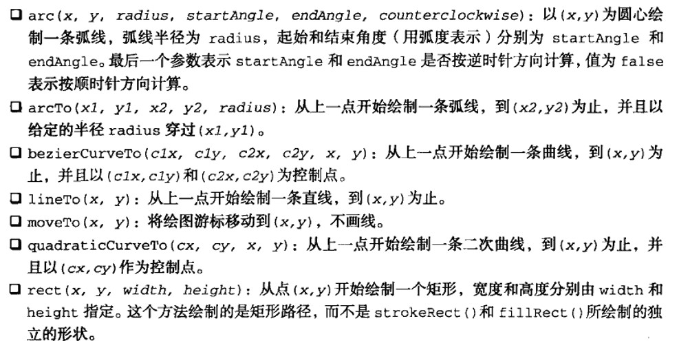
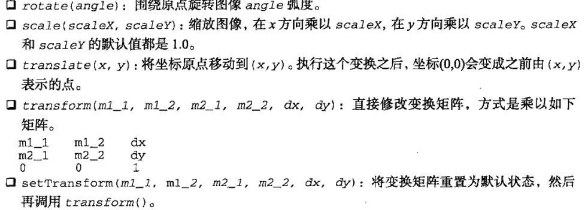

# 红宝书（javascirpt高级程序设计）学习笔记（十一）

## 第15章 使用Canvas绘图

**本章详细介绍Canvas，建议对Canvas感兴趣的同学认真阅读，做好笔记**

`<canvas>`元素是HTML5中新添加的元素，该元素负责在页面中设定一个区域，然后就可以通过JavaScript动态地在这个区域中绘制图形。

除了具备基本绘图能力的2D上下文，`<canvas>`还建议了一个名为WebGL的3D上下文。

### 15.1 基本用法

要使用`<canvas>`元素，必须先设置其`width`和`height`属性，指定可以绘图的区域大小。与其他元素一样，`canvas`元素也能通过CSS为该元素添加样式（但是不能在CSS中添加宽高，宽高应该在HTML标签中指定）

```html
<canvas id="drawing" width="200" height="200">不支持canvas</canvas>
```

若浏览器不支持`canvas`元素，上面的代码会显示开始和结束标签中的后备信息。

在使用`canvas`元素之前，首先要检测`getContext()`方法是否存在。`getContext()`方法用于取得绘图上下文的引用，传入上下文的名字（"2d"），就可以取得2D上下文对象。

```javascript
var drawing = document.getElementById("drawing")
// 确定浏览器支持canvas
if (drawing.getContext) {
    var context = drawing.getContext("2d")
    // 开始绘图
}
```

使用** `canvas`对象的 **`toDataURL()`方法，可以导出在`canvas`元素上绘制的图像。即将`canvas`上的图像导出为合适格式的图片。

### 15.2 2D上下文

使用2D绘图上下文提供的方法，可以绘制简单的2D图形，比如矩形、弧线和路径。2D上下文的坐标开始于`canvas`元素的左上角，坐标是(0, 0)。x值越大越靠右，y值越大越靠下。默认情况下，`width`和`height`表示水平和垂直两个方向上可用的像素数目。

#### 15.2.1 填充和描边

使用`fillStyle`和`strokeStyle`两个属性来决定填充和描边的样式。（颜色、渐变或图像）

#### 15.2.2 绘制矩形

使用`fillRect()`、`strokeRect()`、`clearRect()`3个函数来绘制矩形形状。

#### 15.2.3 绘制路径

要绘制路径，必须调用`beginPath()`方法，表示要开始绘制新路径，再通过以下几个方法实际地绘制。



创建完路径后，可以调用`closePath()`、`fill()`、`stroke()`、`clip()`等方法进行闭合和剪切。

#### 15.2.4 绘制文本

使用`fillText()`和`strokeText()`方法可以进行绘制文本。

#### 15.2.5 变换

通过上下文的变换，可以把处理后的图像绘制到画布上。使用下列方法来修改变换矩阵。



在变化的同时，还可以调用`save()`方法将当前状态保存入栈，然后调用`restore()`方法便可逐级返回。

#### 15.2.6 绘制图像

2D绘图上下文内置了对图像的支持。如果你想把一幅图像绘制到画布上，可以使用`drawImage()`方法。根据期望的最终结果不同，调用这个方法时，可以使用三种不同的参数组合。此外，还可以把另一个`canvas`元素作为参数将其内容绘制到当前画布上。

#### 15.2.7 阴影

使用下列参数来为形状或路径绘制出阴影。

- shadowColor
- shadowOffsetX
- shadowOffsetY
- shadowBlur

这些属性都可以通过`context`对象来修改。

#### 15.2.8 渐变

创建一个新的线性渐变，可以调用`createLinearGradient()`方法。创建一个径向渐变，可以使用`createRadialGradient()`方法。

#### 15.2.9 模式

模式其实就是重复的图像，可以用来填充或描边图形。调用`createPattern()`可以创建一个新模式，参数值与css的`background-repeat`一样。

#### 15.2.10 使用图像数据

可以通过`getImageData()`取得原始图像数据，可以是任意坐标，任意大小。

#### 15.2.11 合成

`globalAplha`属性用于指定所有绘制的透明度，默认值为0。`globalCompositionOperation`表示后绘制的图形怎样与先绘制的图形结合，即重叠与不重叠的部分的行为如何。

这两个属性会应用到2D上下文中所有的绘制操作。

### 15.3 WebGL

WebGL是针对Canvas的3D上下文，但并不是由W3C制定的标准。

#### 15.3.1 类型化数组

类型化数组`ArrayBuffer`专门用于WebGL涉及的复杂计算，需要提前设计好内存中的字节数，如下

```javascript
// 分配20B
var buffer = new ArrayBuffer(20)
```

1. 视图

   使用`ArrayBuffer`的一种特别方式就是用于创建视图。其中，最常见的视图是`DataView`。

2. 类型化视图

   类型化视图都继承了`DataView`，不同的视图之间的区别主要是位数不同。

#### 15.3.2 WebGL上下文

目前，在支持的浏览器中，WebGL的名字叫"experimental-webgl"，这是试验性的名字，也有些浏览器已经正式实现了WebGL，对于这种浏览器，可以直接使用"webgl"。如下

```javascript
try {
    // 尝试获取标准上下文，如果失败，回退到试验性上下文
    gl = canvas.getContext("webgl") || canvas.getContext("experimental-webgl");
  }
catch(e) {
    console.log('浏览器不支持WebGL', e)
}
```

WebGL涉及各种3D建模的基础知识，较为复杂，有兴趣可日后自行了解，本节略。