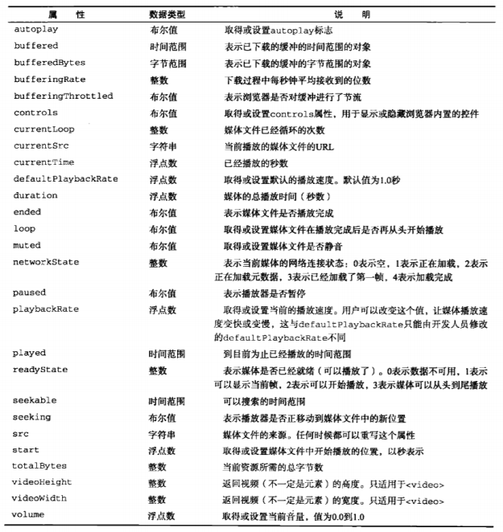
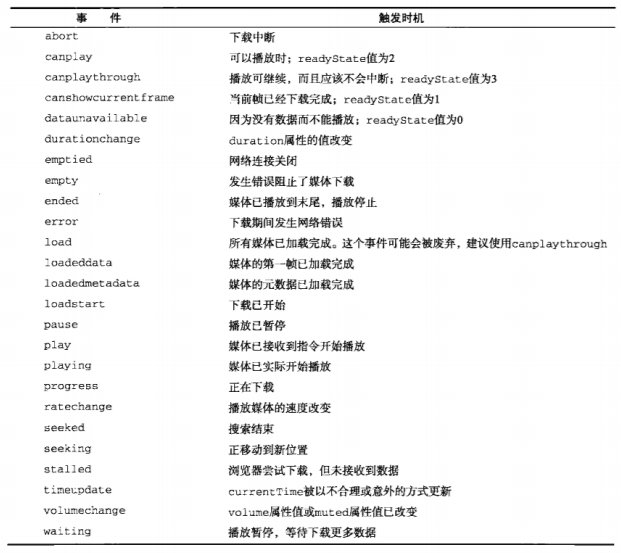
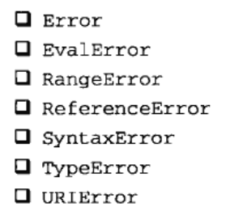

# 红宝书（javascirpt高级程序设计）学习笔记（十二）

## 第16章 HTML5脚本编程

**本章基本介绍的是HTML5的各种新特性、新标签、新API，建议大致了解，做好笔记。**

### 16.1 跨文档消息传递

跨文档消息传送简称XDM，指的是在来自不同域的页面间传递消息。对于XDM来说，也就是在不同的`<iframe>`之间传递数据。

XDM的核心是`postMessage()`方法，该方法接收两个参数：一条消息和一个表示消息接收方来自哪个域的字符串。

```javascript
// 所有支持XDM的浏览器也都支持iframe的contentWindow属性
var iframeWindow = document.getElementById("myframe").contentWindow
iframeWindow.postMessage('A secret', 'http://blog.liubasara.com')
```

第二个参数对保障安全通信非常重要，可以防止浏览器把消息发送到不安全的地方。如果第二个参数是`"*"`，则表示可以把消息发送给来自任何域的文档。

接收到XDM消息时，会触发`window`对象的`message`事件，其事件`event`对象有以下三个重要信息：

- data：传入的字符串数据
- origin：发送消息的文档所在的域
- source：发送消息的文档`window`对象的代理，可利用该对象来发送回执

最后，有些浏览器已经实现了可以使用`postMessage()`方法来传输任意格式的JavaScript数据，但为了兼容起见，最好还是将数据转换为字符串格式来传递。

### 16.2 原生拖放

即通过鼠标完成图像，文本或其他元素的拖放。

#### 16.2.1 拖放事件

拖动某元素时，会在被拖放的元素上依次触发下列事件：

- dragstart
- drag
- dragend

当某个元素被拖动到一个有效的放置目标上，会在放置目标上依次触发下列事件：

- dragenter
- dragover
- dragleave或drop

#### 16.2.2 自定义放置目标

可以通过重写`dragenter`和`dragover`事件的默认行为来将任意元素变成有效的放置目标。

#### 16.2.3 dataTransfer对象

该对象用于从被拖动元素向放置目标传递字符串格式的数据。有两个主要方法：

- getData()
- setData()

#### 16.2.4 dropEffect与effectAllowed

利用`dataTransfer`对象不光能传输数据，还能通过它来确定被拖动的元素以及作为放置目标的元素能够接收到什么操作。为此，需要访问`dataTransfer`对象的两个属性：`dropEffect`和`effectAllowed`。

其中，通过`dropEffect`属性可以知道被拖动的元素能够执行哪种放置行为。而`effectAllowed`属性表示允许拖动元素的哪种`dropEffct`。

#### 16.2.5 可拖动

默认情况下，图像、链接和文本是可以拖动的。而如果想让其它元素也可以拖动，就要将元素的`draggable`属性设为`true`，该属性也可以在HTML标签中设置。

### 16.3 媒体元素

HTML5新增了两个与媒体相关的标签，让开发人员不必依赖任何插件就能在网页中嵌入浏览器的音频和视频内容，这两个标签就是`<audio>`和`<video>`。用法如下

```html
<video src="conference.mpg" id="myVedio">Video not available</video>
<audio src="song.mp3" id="myAudio">Audio not available</audio>
```

使用这两个元素时，至少要在标签中包含`src`属性，指向要加载的媒体文件。还可以设置`width`和`height`属性指定播放器的大小。

因为并非所有浏览器都支持所有的媒体格式，所以可以用`<source>`元素来在标签下添加多个视频或音频来源。

#### 16.3.1 属性

`<video>`和`<audio>`元素都提供了完善的接口，以下是共有的属性：



#### 16.3.2 事件

两个媒体元素也能触发很多事件，如下所示



#### 16.3.3 自定义媒体播放器

使用两个元素的`play()`和`pause()`方法可以手工控制媒体文件的播放，以此来创建一个自定义的媒体播放器。

#### 16.3.4 检测编解码器的支持情况

使用`canPlayType()`可以用于检查编码器的支持情况。

#### 16.3.5 Audio类型

可以自己手动在JavaScript中编写一个`Audio`类型的实例而无需在网页中插入元素，调用`play()`即可播放音频。但在IOS中，调用该方法时会弹出一个对话框征求用户的许可。

### 16.4 历史状态管理

在现代Web应用中，**用户的每次操作不一定会打开一个全新的页面（单页面应用）**，因此"后退"和"前进"按钮也就失去了作用。要解决这个问题，首选使用`haschange`事件。

通过`haschange`事件，可以知道URL的参数什么时候发生了变化，而通过状态管理API，能够在不加载新页面的情况下改变浏览器的URL，为此，需要使用`history.pushState()`方法，该方法接收三个参数：状态对象，新状态的标题和可选的相对URL。

```javascript
history.pushState({name: "hi"}, "hi", "hi.html")
```

执行该方法后，新的状态信息就会被加入历史状态栈中，而浏览器地址也会变成新的相对URL。

而由于该方法会创建新的历史状态，所以此时你也可以使用回退按钮和`popstate`事件了。`popstate`事件的`event`对象有一个`state`属性，就是用于存储刚刚传递过来的状态对象的。。

要更新当前状态，可以调用`replaceState()`，传入的参数与`pushState()`的前两个参数相同，调用该方法不会在历史状态栈中创建新状态，只会重写当前状态。

## 第17章 错误处理与调试

**本章节旨在学习如何在不同的浏览器中调试代码以及捕捉分析错误，实用性较强。建议边阅读边实践，选择性的学习。**

### 17.2 错误处理

该小节介绍在处理JavaScript错误的时候，都有哪些手段和工具可以利用。

#### 17.2.1 try-catch 语句

```javascript
try {
    // 可能会导致错误的代码
} catch (err) {
    // 发生错误时的处理
    alert(err.message)
}
```

上面的例子使用了错误对象的`message`属性。这个`message`属性时唯一一个能够保证所有浏览器都支持的属性。

1. finally子句

   虽然在try-catch语句中是可选的，但`finally`子句一旦使用，其中的代码则无论如何都会执行。

2. 错误类型

   ECMA中定义下列7中错误类型

   

   其中，`Error`是基类型，其它错误类型都继承自该类型。`EvalError`类型的错误会在使用`eval()`函数而发生异常时被抛出。`RangeError`类型的错误会在书至超出相应范围时触发，如引用超出数组长度范围的元素时。`ReferenceError`错误出在查找不到对象的情况下。`SyntaxError`错误会出在将错误的语法传入`eval()`函数时发生。

   至于`TypeError`，这是最经常发生类型错误的情况，归根结底是因为在执行特定操作时，传入的变量不符合要求所导致。

   在使用`encodeURI()`或`decodeURI()`，而URL格式不正确时，就会导致`URIError`错误。

   在catch语句中使用instance操作符，可以做到针对不同类型的错误做出不同的操作反应，在实际开发时十分有帮助。

3. 合理使用try-catch

   try-catch不是万能的保护伞，滥用会导致当代码出错时，浏览器反而不警告，所以应当先保证自己的代码正确，再合理的使用try-catch。

#### 17.2.2 抛出错误

使用`throw`操作符，用于抛出自定义的错误。

```javascript
// 下列代码都是有效的
throw 12345
throw "hello"
throw new Error("hi")
throw new RangeError("range")
```

此外，利用原型链还可以通过继承Error来创建自定义的错误类型。此时需要为新创建的错误类型指定name和message属性。

```javascript
function MyError (message) {
    this.name = 'myError'
    this.message = message
}
MyError.prototype = Object.create(Error.prototype, {
    constructor: {
        value: MyError,
        writable: true,
        configurable: true,
        enumerable: false
    }
})
throw new MyError()
```

1. 抛出错误的时机

   应该在出现某种特定的已知错误条件，导致函数无法正常执行时抛出错误，例如，在一些函数中，如果传入参数的类型不对的话，就会抛出错误。

2. 抛出错误与使用try-catch

   一般来说，业务代码出现的错误可以使用try-catch，但如果是轮子类的函数或是纯函数，就不推荐使用try-catch了（个人理解）

#### 17.2.3 错误(error)事件

任何没有通过try-catch处理的错误都会触发`window`对象的`error`事件。

图像也支持`error`事件。只要图像的`src`特性中的URL不能返回可以被识别的图像格式，就会触发`error`事件。此时的`error`事件会返回一个以图像为目标的`event`对象。

#### 17.2.4 处理错误策略

本小节略

#### 17.2.5 常见的错误类型

- 类型转换错误
- 数据类型错误
- 通信错误

使用良好的边界条件检测来规避第一个错误，正确的使用`typeof`操作符来处理第二种错误，第三种错误难以判断和处理，但无论是Ajax还是各种新的通信工具都已经有了很完善的解决方案。

#### 17.2.6 区分致命错误和非致命错误

善用try-catch可以将许多致命错误转化为非致命错误

#### 17.2.7 把错误记录到服务器

```javascript
function logError (sev, msg) {
    var img = new Image()
    img.src = `log.php?sev${encodeURIComponent(sev)}&msg=${encodeURIComponent(msg)}`
}
```

以上函数可以用于向服务器发送错误日志，包括了严重程度的数值及错误消息，使用了`Image`对象来发送请求，可以很好的避免跨域问题以及兼顾了浏览器兼容问题。

### 17.3 调试技术

本小节略（给我用chrome调试啊魂淡！）

### 17.4 常见的IE错误

本小节略，IERBQ