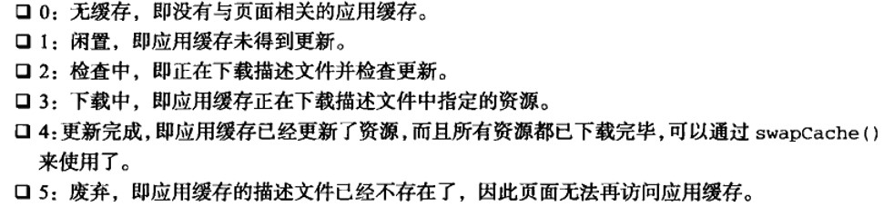
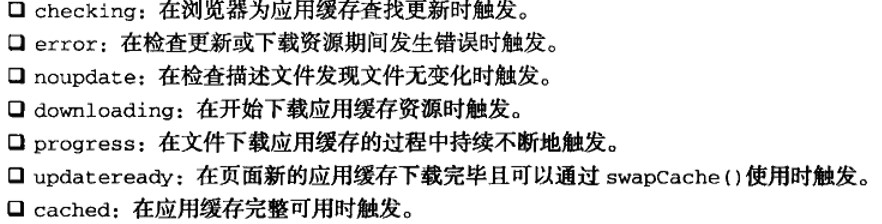

# 红宝书（javascirpt高级程序设计）学习笔记（十六）

## 第23章 离线应用与客户端存储

**本节介绍离线应用和缓存，干货章节，建议认真阅读并做好笔记**

### 23.1 离线检测

HTML5定义了一个`navigator.onLine`属性，用于表示设备能否上网。

为了确定网络是否可用，HTML5还定义了`online`和`offline`两个事件绑定在`window`上。

### 23.2 应用缓存

HTML5的应用缓存(application cache)，是专门为开发离线Web应用而设计的，Appcache就是从浏览器的缓存中分出来的一块缓存区。要在这个缓存中保存数据，可以使用一个**描述文件**，列出要下载和缓存的资源。

```ini
# 以下是一段描述文件
CACHE MAIFEST
# Comment

file.js
file.css
```

然后，可以在`<html>`中使用`manifest`属性指定该描述文件的路径

```html
<html manifest="/offline.manifest">
    
</html>
```

**PS: 描述文件的扩展名以前推荐用manifest，但现在推荐的是appcache**

在JavaScript中使用`applicationCache`对象的`status`属性，可以让你知道当前应用缓存的状态。



应用缓存还有很多相关事件，表示其状态的改变



上面这些事件理论上来说会随着页面加载顺序触发，但也可以通过手动调用`applicationCache.update()`来触发`checking`事件。如果触发了`cached`事件，即说明应用缓存已经准备就绪。如果触发了`updateready`事件，则说明有了新版本的缓存，需要手动调用`swapCache()`来启用新的缓存。

### 23.3 数据存储

前端第一个出现的客户端数据存储方式是Cookie方式。

#### 23.3.1 Cookie

HTTP Cookie要求服务器对任意HTTP请求发送Set-Cookie字段的HTTP头作为响应的一部分，其中包含会话信息。而每个HTTP请求都会在请求头上加入Cookie字段，以名值对的方式将信息发送回服务器。

1. 限制

   cookie在性质上是绑定在特定域名下的。且每个浏览器之间还对cookie有不同的限制，例如IE6就限制每个域名最多有20个cookie。且大小也不能超过4KB。

2. cookie构成

   cookie由浏览器保存的以下几块信息构成：

   - 名称
   - 值
   - 域
   - 路径
   - 失效时间
   - 安全标志

   如下面的一段信息

   

3. JavaScript中的cookie

   一般通过`document.cookie`属性来处理cookie，该属性返回当前页面所有cookie的字符串，所有的名字和值都是经过URL编码的，必须使用`decodeURIComponent()`来解码。同样的，为cookie赋值时，最好也要将所有参数用`encodeURIComponent()`来编码。

4. 子 cookie

   为了绕开浏览器的单域名下的cookie数限制，可以使用子cookie的方式，简单来说就是在一个名值对里放完自己所有的数据，然后再进行解析。

#### 23.3.2 IE用户数据

本节略，IERBQ

#### 23.3.3 Web存储机制

Web Storage存在的目的是克服由cookie带来的限制，无需将数据发回服务器也可以完成本地的存储，它完成了两件事：

- 提供一种在cookie之外的存储会话数据的路径
- 提供一种存储大量可以跨会话存在的数据的机制

Web存储机制在浏览器中主要有两种`sessionStorage`和`globalStorage`，这两个对象在支持的浏览器中都是以`windows`对象属性的形式存在的。

1. Storage 类型

   `Storage`类型提供最大的存储空间来储存名值对。`Storage`的实例与其他对象类似，有下面这些方法

   - clear()：删除所有值
   - getItem(name)：根据指定的名字name获取对应的值
   - key(index)：获得index位置处的值得名字
   - removeItem(name)：删除由name指定的名值对
   - setItem(name, value)：为指定的name设置一个对应的值

   此外，还可以使用`length`属性来判断有多少名值对放在`Storage`中，不过要注意的是，`Storage`类型只能存储字符串，任何类型传入之前都会被转换成字符串。

2. sessionStorage对象

   该对象用于存储特定于某个会话的数据，也就是该数据只保持到浏览器关闭。**这个对象就像会话`cookie`，也会在浏览器关闭后消失**。

   该对象绑定于某个服务器会话，所以当文件在本地运行的时候是**不可用的**。存储在`sessionStorage`中的数据只能由最初给对象存储数据的页面访问到，所以对多页面应用有限制。

   该对象是`Storage`的实例，所以`Storage`上的对象方法在这里都可以使用。

   `sessionStorage`对象主要应用于仅针对对话的小段数据的存储，若需要跨越会话，那么`globalStorage`或`localStorage`会更加合适。

3. globalStorage 对象

   该对象的目的是跨越会话存储数据，但要使用该对象，必须先指定那些域可以访问该数据，如下

   ```javascript
   // 保存数据
   globalStorage['example.com'].name = 'hi'
   // 获取数据
   var name = globalStorage['example.com'].name
   ```

   在上面的代码中，globalStorage对象**不是**Storage的实例，`globalStorage['example.com']`才是。该存储空间对于`example.com`及其所有的子域名都是可用的，如`globalStorage['www.example.com']`一样可用该存储空间。

   如果不使用`removeItem()`或者`delete`删除，或者用户未清理浏览器缓存，`globalStorage`属性中的数据会一直保留在磁盘上。

4. localStorage 对象

   **该对象在HTML5中作为保存客户端数据的方案取代了`globalStorage`.**与`globalStorage`不同的是，不能用该对象来指定任何访问规则，因为要访问同一个`localStorage`对象，页面必须来自同一个域名，使用同一种协议，在同一个端口遇上。相当于`globalStorage[location.host]`。

   与`sessionStorage`一样，该对象也是`Storage`对象的实例。

5. storage事件

   对`Storage`对象进行任何的修改，都会在文档上触发`storage`事件。该事件的`event`对象有以下属性

   - domain：发生变化的存储空间的域名
   - key：设置或删除的键名
   - newValue：如果是设置值，则是新值；如果是删除键，则是null
   - oldValue：键被更改之前的值

   ```javascript
   document.addEventListener('storage', function (event) {
       console.log(event.domain)
   })
   ```

   以上是事件监听示例

6. 限制

   `localStorage`虽然提供了存储方案，但也有大小限制，大多数浏览器对每个来源的大小的限制在5M。

#### 23.3.4 IndexedDB

Indexed Database API是在浏览器中保存结构化数据的一种**数据库**，用于取代被废弃的Web Sql。其核心思想是创建一套API，方便保存和读取JavaScript对象，同时支持查询和搜索。

IndexDB的数据并不是保存在表中，而是保存在对象存储空间中。创建对象存储空间时需要定义一个键，然后就可以添加数据。可以使用游标在对象存储空间中查询特定的对象，对某些特定的属性创建索引提高查询速度。

每个来源的数据库大小上限是5M，如果超过了这个配额，将会请求用户的许可。

由于兼容性还不是太好，具体的用法留待以后学习。