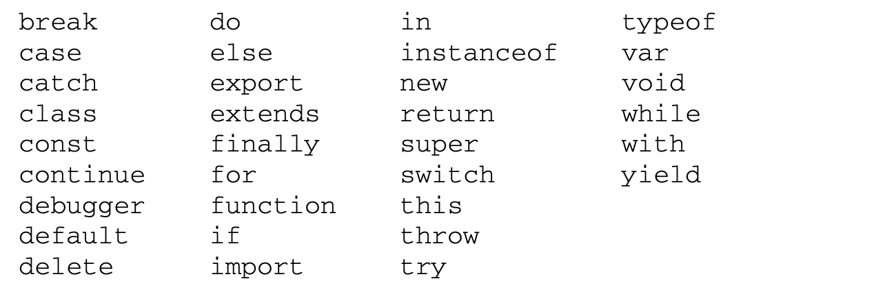
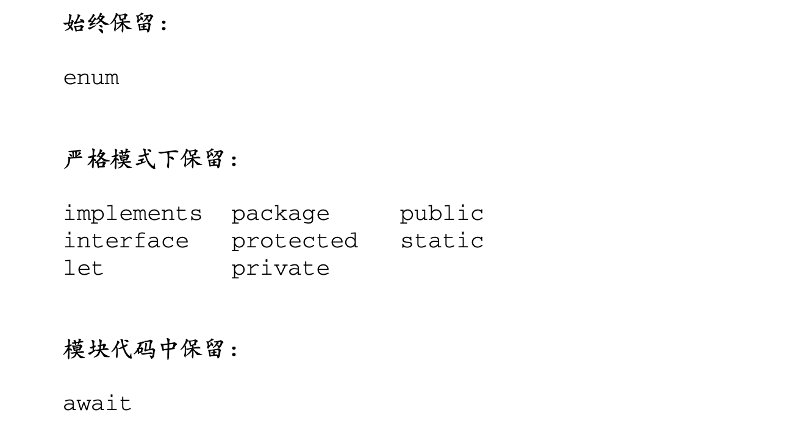
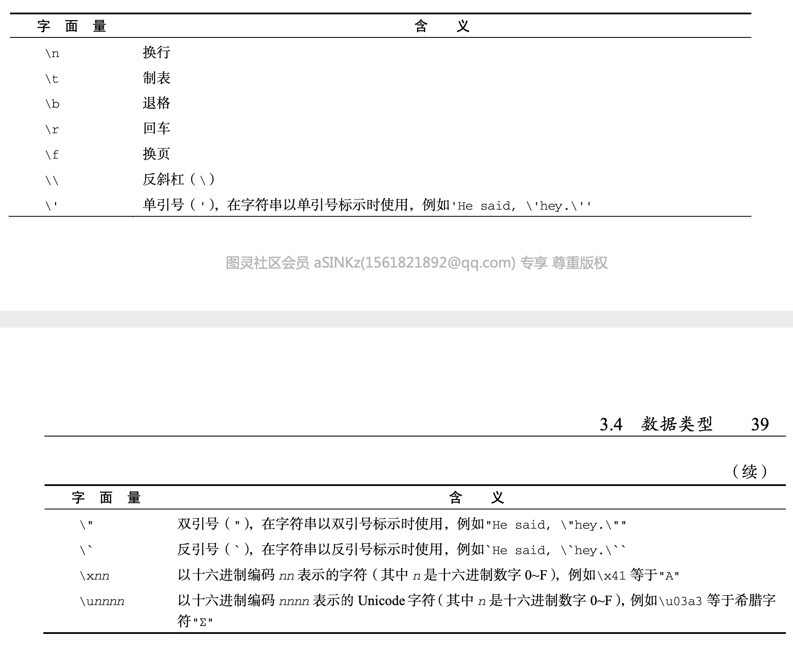

# JavaScript高级程序设计（第4版）学习笔记（一）

> **请到各大销售渠道支持正版**！

## 第 1 章 什么是 JavaScript

基本跟第三版的内容一致，主要介绍了 JavaScript 的诞生渊源、组成部分及其版本历史。

补充内容：

### 1.2 -> .2 DOM

**1. 为什么 DOM 是必须的**

为了保证 Web 跨平台的本性，为了防止浏览器厂商擅自使用不同的实现方式来开发 DHTML，万维网联盟开始了制定 DOM 标准的进程。

**2. DOM 级别**

DOM 标准有 Level1、2、3 的区分，等级越高负责的功能接口越高级。

目前，W3C 不再按照 Level 来维护 DOM 了，而是作为 DOM Living Standard 来维护，其快照称为 DOM4

> 在阅读关于DOM的资料时，你可能会看到DOMLevel0的说法。注意，并没有一 个标准叫“DOM Level 0”，这只是 DOM 历史中的一个参照点。DOM Level 0 可以看作 IE4 和 Netscape Navigator 4 中最初支持的 DHTML。

## 第 2 章 HTML 中的 JavaScript

`<script>`标签由网景公司创造出来并最早实现，用于插入在 HTML 中，又在日后被规范引入。该标签有 8 个属性：

- async：可选，表示应该立即下载脚本但不阻止其他页面动作。

  > 拓展阅读：
  >
  > - [浅谈script标签中的async和defer](https://www.cnblogs.com/jiasm/p/7683930.html)

- defer：可选，表示脚本可以延迟到文档被解析和显示之后再执行。

- charset：可选，代表 src 属性指定的代码字符集。这个属性很少使用，大多数浏览器不在乎它的值

- crossorigin：可选，配置相关请求的 CORS （跨域资源共享）设置。默认不使用 CORS。有`anonmous`和`use-credentials`这两个值，代表出站请求是否会包含凭据。

- language：废弃，最初用于表示代码块中的脚本语言。如 JavaScript、VBScript 等。

- src：可选，表示包含要执行的代码的外部文件。

- type：可选，代替 language，表示代码块中脚本语言的内容类型（MIME 类型）。默认值为"text/javascript"，而 javascript 文件的 MIME 类型通常是"application/x-javascript"（IE 浏览器）或者"application/javascript"（非 IE 浏览器）。如果这个值是`module`，则代码会被当成 ES6 模块，此时代码中的`import`和`export`关键字会生效。

使用了 src 属性的`<script>`元素不应该再在`<script>`和`</script>`标签中再包含其他 JavaScript 代码。如果两者都提供的话，则浏览器只会下载并执行脚本文件，从而忽略行内代码。

#### 2.1.1 标签位置

现代 Web 应用程序通常将所有 JavaScript 引用放在`<body>`元素中的页面内容后面。这样能提前页面的渲染（页面在浏览器解析到`<body>`的起始标签时开始渲染），让用户感觉页面加载得更快。

> 拓展阅读 ：
>
> - [原来 CSS 与 JS 是这样阻塞 DOM 解析和渲染的](https://juejin.im/post/6844903497599549453)

#### 2.1.4 动态加载脚本

通过 JavaScript 中的 DOM API，可以向 DOM 中动态添加 DOM 元素插入到 DOM 中，从而让浏览器加载更多脚本。默认情况下，以这种方式创建的`<script>`元素是以异步方式加载的，相当于添加了`async`属性。不过由于不是所有浏览器都支持`async`属性，因此如果要统一动态脚本的加载行为，可以考虑明确地将其设置为同步加载。

```javascript
let script = document.createElement('script')
script.src = 'test.js'
script.async = false
document.head.appendChild(script)
```

除此以外还有一个问题，以这种方式获取的资源对浏览器预加载器是不可见的。这会严重影响它们在资源获取队列中的优先级，以及有可能会严重影响性能。为此，可以在文档头部显示声明一下。

```html
<link rel="preload" href="test.js"></link>
```

#### 2.1.5 XHTML 中的变化

XHTML 又称可扩展超文本标记语言，是将 HTML 作为 XML 的应用重新包装的结果。XHTML 模式会在页面的 MIME 类型被指定为"application/xhtml+xml"时触发。但并不是所有浏览器都支持以这种方式送达的 XHTML。

在 XHTML 中使用 JavaScript 必须指定`type`属性且值必须为 text/javascript。且由于 XHTML 不像 HTML 一样会自动将`<script>`标签中的内容视为纯文本，还是会对字符进行转译，所以要对其进行降级兼容处理，如下：

```html
<script type="text/javascript">
//<![CDATA[
  function compare(a, b) {
    if (a < b) {
console.log("A is less than B"); } else if (a > b) {
console.log("A is greater than B"); } else {
console.log("A is equal to B"); }
}
//]]>
</script>
```

### 2.4 `<noscript>`元素

当出现以下情况时：

- 浏览器不支持脚本
- 浏览器对脚本的支持被关闭

包含在`<noscript>`中的内容就会被渲染，其余情况下则不渲染。

## 第 3 章 语言基础

本章接下来的内容主要基于 ECMAScript 第 6 版。

### 3.2 关键字与保留字

关键字的意思是在语言中含有特殊用途，不能用于作标识符或属性名，ECMA-262 第 6 版规定的关键字如下：



以及还有其他模式下的为将来保留的词汇：



### 3.3 变量

一共有三种用于声明变量的关键词：

- var：声明的范围是函数作用域，会提升变量声明，可以多次声明
- let：声明的是块级作用域，不会提升变量声明，不能多次声明（也不能在条件作用域内进行声明，没有效果），有暂时性死区（即在声明之前引用该变量会导致报错）
- const：行为与 let 基本相同，唯一一个重要的区别是它声明变量时必须同时初始化变量，且尝试修改该变量会导致运行时错误。

#### 3.3.4 声明风格及最佳实践

新的有助于提升代码质量的最佳实践：

1. 不使用 var
2. const 优先，let 次之

### 3.4 数据类型

6 种简单数据类型：

- Undefined
- Null
- Boolean
- Number
- String
- Symbol
- Object

#### 3.4.1 typeof 操作符

对一个值使用`typeof`操作符会返回下列字符串之一：

- "undefined"
- "boolean"
- "string"
- "number"
- "object"：表示值为对象（而不是函数）或 null
- "function"
- "symbol"

要注意的是，特殊值 null 被认为是一个空对象的引用，`typeof`返回的结果也是"object"。

#### 3.4.5 Number 类型

JavaScript 中的 Number 类型使用 IEEE 754 格式表示整数和浮点值。

默认的格式是十进制整数，也可以用八进制或十六进制字面量表示。对于八进制，第一个数字必须是 0，如果其后面包含的数字超出了相应的范围，就会忽略前缀的零而把后面的数字当成十进制数。对于十六进制，需要加上前缀 0x（区分大小写），然后是十六进制数字。

```javascript
// 十进制
let intNum = 55
// 八进制的 56
let octalNum1 = 070
// 无效的八进制(后面的数字超过了7)，当成十进制 79 处理
let octalNum2 = 079
// 十六进制 10
let hexNum1 = 0xA
// 十六进制 31
let hexNum2 = 0x1f
```

使用八进制和十六进制创建的数值在所有数学操作中都被视为十进制数值。

> 由于JavaScript保存数值的方式，实际中可能存在正零(+0)和负零(0)。正零和 负零在所有情况下都被认为是等同的

由于使用 IEEE 754 计数方法，所以在 JavaScript 中，对于浮点数和超过了表达最小最大数的计算并不准确，在 ES6 中对于大数的计算还可以使用`BigInt`来解决，但对于浮点数的精确计算就无能为力了。因此永远不要测试某个特定的浮点值。

> 拓展阅读：
>
> - [JS中为什么0.1+0.2 不等于0.3](https://blog.csdn.net/ZHgogogoha/article/details/107485403)

在传统 ECMAScript 中，可以表示的最小值保存在`Number.MIN_VALUE`中，最大值保存在`MAX_VALUE`中。如果该值超过了 JavaScript 可以辨识的范围，那么将会被自动转换成一个特殊的无限值`Infinity`。

要确定一个值是不是有限大，可以使用`isFinite()`函数。

此外，还有一个特殊的数值`NaN`，意思是 Not a Number。用以表示数学计算出错的场合（比如说任何一个数字去除以 0）。

**任何涉及 NaN 的操作始终返回 NaN，NaN 不等于包括 NaN 在内的任何值**。

需要判断一个值是否是 NaN，可以使用`isNaN()`函数。

使用`Number()`对一个值做数值转换时，会遇到以下几种情况：

- 布尔值：true 为1，false 为 0

- Number：直接返回

- null：直接返回

- undefined：返回 NaN

- 字符串，应用以下规则：

  - 如果字符串包含数值，转换为一个十进制数值

    如 Number("011") 返回 11，忽略前面的 0

  - 如果是一个浮点格式的值，则转换为对应的十进制浮点数

  - 如果包含有效的十六进制格式如"0xf"，则会转换为与该十六进制对应的十进制整数值

  - 如果是空字符串，返回 0

  - 不符合上述条件外的其他字符，统一返回 NaN

- 对象：调用该对象的`valueOf()`方法，并按照上述规则转换，若转换结果是 NaN，则调用`toString()`方法，再按照字符串的规则进行转换。

**parseInt**

考虑到 Number 转换字符串的规则相对反常规，所以对整数的转换来说，可以优先选择`parseInt`函数来代替进行。

> 如果第一个字符不是数值字符、加号或减号，parseInt()立即返回 NaN。这意味着空字符串也会返回 NaN(这一点跟 Number()不一样，它返回 0)。如果第一个字符 是数值字符、加号或减号，则继续依次检测每个字符，直到字符串末尾，或碰到非数值字符。比如， "1234blue"会被转换为 1234，因为"blue"会被完全忽略。类似地，"22.5"会被转换为22，因为小数点不是有效的整数字符。

```javascript
parseInt("1234blue") // 1234
parseInt("") // NaN
parseInt("0xA") // 10 解释为十六进制
parseInt(22.5) // 22
parseInt("70") // 70
parseInt("0xf") // 15
/** 通过第二个参数，可以极大扩展转换后获得的结果类型 **/
parseInt("AF", 16) // 175，如果提供了十六进制参数，那么前面的 0x 可以省掉
parseInt("10", 8) // 8 按八进制解析
parseInt("10", 2) // 2 按二进制解析
```

因为不传底数参数相当于让`parseInt()`自己决定如何解析，所以为避免解析出错，建议始终传给它第二个参数。

**parseFloat**

parseFloat 的工作方式跟 parseInt 类似，都是从第一个字符开始，解析到无效的字符为止。比如 "22.34.5" 这样的数将转换为 22.34。

`parseFloat()`函数的另一个不同之处在于，它始终会忽略字符串开头的零。而且十六进制数值始终会返回 0（只能解析十进制）。

```javascript
parseFloat("3.125e7") // 31250000
parseFloat("0908.5") // 908.5
parseFloat("0xA") // 0
parseFloat("1234blue") // 1234
```

#### 3.4.6 String 类型

JavaScript 中，字符串可以使用双引号，单引号，反引号来表示。

**字符字面量**

字符串中，有一些表示特殊功能的字符。



```javascript
let text = "This is the letter sigma: \u03a3."
// \u03a3 算作一个单一字符
text.length // 28
```

**转换为字符串**

默认情况下，Nubmber 的`toString()`方法返回的数值是以十进制字符串来表示，但也可以传入一个底数，得到数值的不同字符串表示。

```javascript
let num = 10
num.toString() // 10
num.toString(2) // 1010
num.toString(8) // 12
num.toString(16) // a
```

对于其他值，调用`String()`方法会遵循下列规则：

- 如果值有`toString()`方法，则调用该方法（不传参数）返回结果
- 如果是 null，返回"null"
- 如果是 undefined，返回"undefined"

**模板字面量与标签函数**

模板字面量（即反引号字符串）会保留里面的所有空格，同时也支持定义标签函数。

```javascript
function simpleTag(strings, a, b, c) {
  console.log(strings)
  console.log(a)
  console.log(b)
  console.log(c)
  return 'hi~'
}
let a = 1
let b = 2
let untaggedRes = `${a} + ${b} = ${a + b}` // "1 + 2 = 3"
let taggedRes = simpleTag`${a} + ${b} = ${a + b}` // "hi~"
// (4) ["", " + ", " = ", "", raw: Array(4)]
// 1
// 2
// 3
```

#### 3.4.7 Symbol 类型

Symbol 是 ES6 新增的数据类型，属于基本类型，且它的实例是唯一，不可变的。符号的用途是确保对象属性使用唯一标识符，不会发生属性冲突的危险。

与 String，Number 等类型不同，Symbol 不能与 new 关键词一起作为构造函数使用。

如果需要重复使用一个共享的符号实例，那么可以使用`Symbol.for`方法，使用一个字符串作为 key，注册这个符号。

> Symbol.for()对每个字符串键都执行幂等操作。第一次使用某个字符串调用时，它会检查全局运 行时注册表，发现不存在对应的符号，于是就会生成一个新符号实例并添加到注册表中。后续使用相同 字符串的调用同样会检查注册表，发现存在与该字符串对应的符号，然后就会返回该符号实例。

还可以使用`Symbol.keyFor()`来查询某个符号，返回对应的字符串 key。

```javascript
let s = Symbol.for('foo')
console.log(Symbol.keyFor(s)) // foo
```

**使用符号作为属性**

```javascript
let s1 = Symbol('foo')
let o = {
  [s1]: 'foo val'
}
o[s1] // foo val
```

使用 Symbol 作为 key 的属性不会被`Object.getOwnPropertyNames()`或`Object.keys()`检测到，但能被`Object.getOwnPropertySymbols(o)`检测到。而`Reflect.ownKeys()`则会返回所有类型的 key。

因为符号属性是对内存中符号的一个引用，所以直接创建并用作属性的符号不会丢失。但是，如果没有显式地保存对这些属性的引用，那么必须遍历对象的所有符号属性才能找到相应的属性键。

**常用内置符号**


> 本次阅读应至 P47 常用内置符号 72