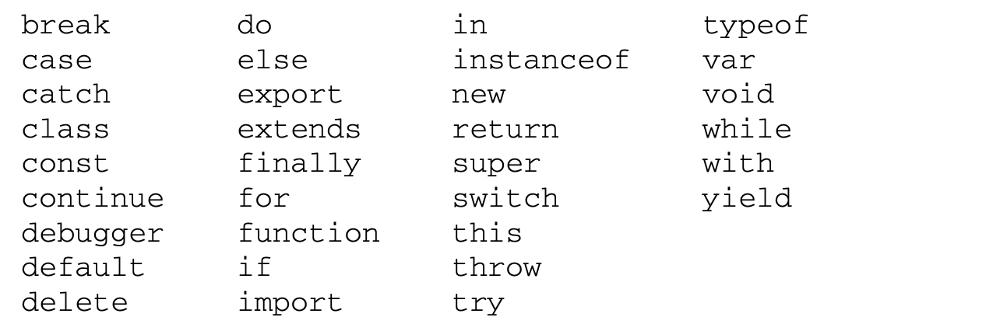

# JavaScript高级程序设计（第4版）学习笔记（二）

## 第 3 章 语言基础

本章接下来的内容主要基于 ECMAScript 第 6 版。

### 3.2 关键字与保留字

关键字的意思是在语言中含有特殊用途，不能用于作标识符或属性名，ECMA-262 第 6 版规定的关键字如下：



以及还有其他模式下的为将来保留的词汇：


### 3.3 变量

一共有三种用于声明变量的关键词：

- var：声明的范围是函数作用域，会提升变量声明，可以多次声明
- let：声明的是块级作用域，不会提升变量声明，不能多次声明（也不能在条件作用域内进行声明，没有效果），有暂时性死区（即在声明之前引用该变量会导致报错）
- const：行为与 let 基本相同，唯一一个重要的区别是它声明变量时必须同时初始化变量，且尝试修改该变量会导致运行时错误。

#### 3.3.4 声明风格及最佳实践

新的有助于提升代码质量的最佳实践：

1. 不使用 var
2. const 优先，let 次之

### 3.4 数据类型

6 种简单数据类型：

- Undefined
- Null
- Boolean
- Number
- String
- Symbol
- Object

#### 3.4.1 typeof 操作符

对一个值使用`typeof`操作符会返回下列字符串之一：

- "undefined"
- "boolean"
- "string"
- "number"
- "object"：表示值为对象（而不是函数）或 null
- "function"
- "symbol"

要注意的是，特殊值 null 被认为是一个空对象的引用，`typeof`返回的结果也是"object"。

#### 3.4.5 Number 类型

JavaScript 中的 Number 类型使用 IEEE 754 格式表示整数和浮点值。

默认的格式是十进制整数，也可以用八进制或十六进制字面量表示。对于八进制，第一个数字必须是 0，如果其后面包含的数字超出了相应的范围，就会忽略前缀的零而把后面的数字当成十进制数。对于十六进制，需要加上前缀 0x（区分大小写），然后是十六进制数字。

```javascript
// 十进制
let intNum = 55
// 八进制的 56
let octalNum1 = 070
// 无效的八进制(后面的数字超过了7)，当成十进制 79 处理
let octalNum2 = 079
// 十六进制 10
let hexNum1 = 0xA
// 十六进制 31
let hexNum2 = 0x1f
```

使用八进制和十六进制创建的数值在所有数学操作中都被视为十进制数值。

> 由于JavaScript保存数值的方式，实际中可能存在正零(+0)和负零(0)。正零和 负零在所有情况下都被认为是等同的

由于使用 IEEE 754 计数方法，所以在 JavaScript 中，对于浮点数和超过了表达最小最大数的计算并不准确，在 ES6 中对于大数的计算还可以使用`BigInt`来解决，但对于浮点数的精确计算就无能为力了。因此永远不要测试某个特定的浮点值。

> 拓展阅读：
>
> - [JS中为什么0.1+0.2 不等于0.3](https://blog.csdn.net/ZHgogogoha/article/details/107485403)

在传统 ECMAScript 中，可以表示的最小值保存在`Number.MIN_VALUE`中，最大值保存在`MAX_VALUE`中。如果该值超过了 JavaScript 可以辨识的范围，那么将会被自动转换成一个特殊的无限值`Infinity`。

要确定一个值是不是有限大，可以使用`isFinite()`函数。

此外，还有一个特殊的数值`NaN`，意思是 Not a Number。用以表示数学计算出错的场合（比如说任何一个数字去除以 0）。

**任何涉及 NaN 的操作始终返回 NaN，NaN 不等于包括 NaN 在内的任何值**。

需要判断一个值是否是 NaN，可以使用`isNaN()`函数。

使用`Number()`对一个值做数值转换时，会遇到以下几种情况：

- 布尔值：true 为1，false 为 0

- Number：直接返回

- null：直接返回

- undefined：返回 NaN

- 字符串，应用以下规则：

  - 如果字符串包含数值，转换为一个十进制数值

    如 Number("011") 返回 11，忽略前面的 0

  - 如果是一个浮点格式的值，则转换为对应的十进制浮点数

  - 如果包含有效的十六进制格式如"0xf"，则会转换为与该十六进制对应的十进制整数值

  - 如果是空字符串，返回 0

  - 不符合上述条件外的其他字符，统一返回 NaN

- 对象：调用该对象的`valueOf()`方法，并按照上述规则转换，若转换结果是 NaN，则调用`toString()`方法，再按照字符串的规则进行转换。

**parseInt**

考虑到 Number 转换字符串的规则相对反常规，所以对整数的转换来说，可以优先选择`parseInt`函数来代替进行。

> 如果第一个字符不是数值字符、加号或减号，parseInt()立即返回 NaN。这意味着空字符串也会返回 NaN(这一点跟 Number()不一样，它返回 0)。如果第一个字符 是数值字符、加号或减号，则继续依次检测每个字符，直到字符串末尾，或碰到非数值字符。比如， "1234blue"会被转换为 1234，因为"blue"会被完全忽略。类似地，"22.5"会被转换为22，因为小数点不是有效的整数字符。

```javascript
parseInt("1234blue") // 1234
parseInt("") // NaN
parseInt("0xA") // 10 解释为十六进制
parseInt(22.5) // 22
parseInt("70") // 70
parseInt("0xf") // 15
/** 通过第二个参数，可以极大扩展转换后获得的结果类型 **/
parseInt("AF", 16) // 175，如果提供了十六进制参数，那么前面的 0x 可以省掉
parseInt("10", 8) // 8 按八进制解析
parseInt("10", 2) // 2 按二进制解析
```

因为不传底数参数相当于让`parseInt()`自己决定如何解析，所以为避免解析出错，建议始终传给它第二个参数。

**parseFloat**

parseFloat 的工作方式跟 parseInt 类似，都是从第一个字符开始，解析到无效的字符为止。比如 "22.34.5" 这样的数将转换为 22.34。

`parseFloat()`函数的另一个不同之处在于，它始终会忽略字符串开头的零。而且十六进制数值始终会返回 0（只能解析十进制）。

```javascript
parseFloat("3.125e7") // 31250000
parseFloat("0908.5") // 908.5
parseFloat("0xA") // 0
parseFloat("1234blue") // 1234
```

#### 3.4.6 String 类型

JavaScript 中，字符串可以使用双引号，单引号，反引号来表示。

**字符字面量**

字符串中，有一些表示特殊功能的字符。


```javascript
let text = "This is the letter sigma: \u03a3."
// \u03a3 算作一个单一字符
text.length // 28
```

**转换为字符串**

默认情况下，Nubmber 的`toString()`方法返回的数值是以十进制字符串来表示，但也可以传入一个底数，得到数值的不同字符串表示。

```javascript
let num = 10
num.toString() // 10
num.toString(2) // 1010
num.toString(8) // 12
num.toString(16) // a
```

对于其他值，调用`String()`方法会遵循下列规则：

- 如果值有`toString()`方法，则调用该方法（不传参数）返回结果
- 如果是 null，返回"null"
- 如果是 undefined，返回"undefined"

**模板字面量与标签函数**

模板字面量（即反引号字符串）会保留里面的所有空格，同时也支持定义标签函数。

```javascript
function simpleTag(strings, a, b, c) {
  console.log(strings)
  console.log(a)
  console.log(b)
  console.log(c)
  return 'hi~'
}
let a = 1
let b = 2
let untaggedRes = `${a} + ${b} = ${a + b}` // "1 + 2 = 3"
let taggedRes = simpleTag`${a} + ${b} = ${a + b}` // "hi~"
// (4) ["", " + ", " = ", "", raw: Array(4)]
// 1
// 2
// 3
```

#### 3.4.7 Symbol 类型

Symbol 是 ES6 新增的数据类型，属于基本类型，且它的实例是唯一，不可变的。符号的用途是确保对象属性使用唯一标识符，不会发生属性冲突的危险。

与 String，Number 等类型不同，Symbol 不能与 new 关键词一起作为构造函数使用。

如果需要重复使用一个共享的符号实例，那么可以使用`Symbol.for`方法，使用一个字符串作为 key，注册这个符号。

> Symbol.for()对每个字符串键都执行幂等操作。第一次使用某个字符串调用时，它会检查全局运 行时注册表，发现不存在对应的符号，于是就会生成一个新符号实例并添加到注册表中。后续使用相同 字符串的调用同样会检查注册表，发现存在与该字符串对应的符号，然后就会返回该符号实例。

还可以使用`Symbol.keyFor()`来查询某个符号，返回对应的字符串 key。

```javascript
let s = Symbol.for('foo')
console.log(Symbol.keyFor(s)) // foo
```

**使用符号作为属性**

```javascript
let s1 = Symbol('foo')
let o = {
  [s1]: 'foo val'
}
o[s1] // foo val
```

使用 Symbol 作为 key 的属性不会被`Object.getOwnPropertyNames()`或`Object.keys()`检测到，但能被`Object.getOwnPropertySymbols(o)`检测到。而`Reflect.ownKeys()`则会返回所有类型的 key。

因为符号属性是对内存中符号的一个引用，所以直接创建并用作属性的符号不会丢失。但是，如果没有显式地保存对这些属性的引用，那么必须遍历对象的所有符号属性才能找到相应的属性键。

**常用内置符号**

ES6 也引入了一批常用的内置 Symbol 用于暴露一些对象的默认方法，开发者可以通过这些 Symbol 直接访问、重写或者模拟这些方法。（PS：这一段的翻译简直就是灾难...）

比如说`for-of`循环会在相关对象上使用`Symbol.iterator`属性，那么就可以通过在自定义对象上重新定义`Symbol.iterator`的值，用于改变`for-of`在迭代对象时的行为。

> 注意：在提到 ECMAScript规范时，经常会引用符号在规范中的名称，前缀为@@。比如， `@@iterator`指的就是 `Symbol.iterator`

**1. Symbol.iterator**

```javascript
let range = {
  from: 1,
  to: 5,
  // 在刚使用 for..of 循环时，for..of 就会调用一次这个方法
  [Symbol.iterator]() {
    // ...它返回 iterator object：
    // 后续的操作中，for..of 将只针对这个对象
    // 并使用 next() 向它请求下一个值
    return {
      current: this.from,
      last: this.to,
      // for..of 循环在每次迭代时都会调用 next()
      next() {
        // 它应该以对象 {done:.., value :...} 的形式返回值
        if (this.current <= this.last) {
          return { done: false, value: this.current++ };
        } else {
          return { done: true };
        }
      }
    };
  }
};
for(let value of range) {
  console.log(value); // 1，然后 2，然后 3，然后 4，然后 5
}
```

**2. Symbol.asyncIterator**

该属性作为一个方法返回对象默认的`AsyncIterator`，由`for-await-of`语句使用。

`for-await-of`会利用这个函数执行异步迭代操作，循环时会调用以`Symbol.asyncIterator`为键的函数，并期望这个函数会返回一个实现迭代器 API 的对象（简而言之这是个生成器函数）。而这个函数生成返回的对象应该可以通过显式调用`next()`方法返回，与`Symbol.iterator`不同的是，`for-await-of`可以接受并处理 Promise 对象。

```javascript
let range = {
  from: 1,
  to: 5,

  // 在刚使用 for await..of 循环时，for await..of 就会调用一次这个方法
  [Symbol.asyncIterator]() {
    return {
      current: this.from,
      last: this.to,

      // for await..of 循环在每次迭代时都会调用 next()
      next() {
        // 它应该以对象 {done:.., value :...} 的形式返回值
        // (会被 async 自动包装成一个 promise)

        // 可以在内部使用 await，执行异步任务：
        return new Promise(resolve => {
          setTimeout(() => {
            if (this.current <= this.last) {
              resolve({ done: false, value: this.current++ });
            } else {
              resolve({ done: true });
            }
          }, 1000)
        })

        
      }
    };
  }
};

(async () => {

  for await (let value of range) {
    console.log(value); // 1,2,3,4,5
  }

})()
```

> Symbol.asyncIterator 是 ES2018 规范定义的，因此只有版本非常新的浏览器支持它
>
> 拓展阅读：
>
> - [Async iterator 和 generator](https://zh.javascript.info/async-iterators-generators)

**3. Symbol.hasInstance**

该符号属性也是一个方法，用于决定一个构造器对象是否认可一个对象是它的实例。也就是决定`instanceof`操作符的表现。

```javascript
function Foo () {}
let f = new Foo()
console.log(f instanceof Foo) // true
console.log(Foo[Symbol.hasInstance](f)) // true
Object.defineProperty(Foo, Symbol.hasInstance, {
  value: function () {return false}
})
console.log(f instanceof Foo) // false
console.log(Foo[Symbol.hasInstance](f)) // false
```

要注意的是，这个方法不仅可以定义在构造函数的原型(Function.prototype)上，也可以直接挂载在构造函数上。`instanceof`相当于是函数直接调用这个方法，入参是实例。同样，也可以在继承的类上通过定义这个静态方法重新定义这个继承关系。

```javascript
function Foo () {}
var f = new Foo()
f[Symbol.hasInstance] = function () {return false}
var fChild = {}
Object.setPrototypeOf(fChild, f)
fChild instanceof f // false
fChild instanceof Foo // true
```

**4. Symbol.isConcatSpreadable**

该符号作为一个属性表示一个布尔值，如果为`true`，则意味着该对象被当做`Array.prototype.concat()`的入参时，可以打平其数组元素。（PS：又是一个不看用例就看不懂的灾难性翻译...）

数组对象默认情况下会被打平到已有的数组，false 或假值会导致整个对象被追加到数组末尾。类数组对象默认情况下会被追加到数组末尾，true 或真值会导致这个类数组对象被打平到数组实例。其他不是类数组对象的对象在 Symbol.isConcatSpreadable 被设置为 true 的情况下将被忽略。 

```javascript
let initial = ['foo']
let array = ['bar']
console.log(array[Symbol.isConcatSpreadable]) // undefined
initial.concat(1) // ['foo', 1]
console.log(initial.concat(array)) // ['foo', 'bar']
array[Symbol.isConcatSpreadable] = false
initial.concat(array) // ['foo', ['bar']]

let arrayLikeObj = { length: 1, 0: 'baz' }
arrayLikeObj[Symbol.isConcatSpreadable] = true
console.log(initial.concat(arrayLikeObject)) // ['foo', 'baz']

let otherObj = { test: 123 }
otherObj[Symbol.isConcatSpreadable] = true
console.log(initial.concat(otherObj)) // ['foo']
```

**5. Symbol.match**

该符号作为一个方法，可以让任何拥有该属性方法的对象作为正则表达式，在`String.prototype.match()`的场合下来使用。

```javascript
function FooMatcher () {}
Object.defineProperty(FooMatcher, Symbol.match, {
  value: function (target) {
    return target.includes('foo')
  }
})
console.log('foobar'.match(FooMatcher)) // true
```

**6. Symbol.replace**

类似于`Symbol.match`的用法。

```javascript
function FooReplacer () {}
Object.defineProperty(FooReplacer, Symbol.replace, {
  value: function (target, replacement) {
    return target.split('').join(replacement)
  }
})
console.log('foo'.replace(FooReplacer, 123)) // f123o123o
```

**7. Symbol.search**

类似于 match 和 replace 的用法。

```javascript
function FooSearch () {}
Object.defineProperty(FooSearch, Symbol.search, {
  value: function (target) {
    return target.indexOf('foo')
  }
})
console.log('afafaffoo'.search(FooSearch)) // 6
```

**8. Symbol.species**

该符号作为一个属性，在内置类型中十分常用，用于暴露一个类实例化对象的方法。用`Symbol.species`定义静态的 getter，可以覆盖新创建实例的原型对象。（又是不当人的翻译...简单来说就是`new`的时候会在第一步被用来创建派生对象。）

```javascript
function Baz () {}
Object.setPrototypeOf(Baz.prototype, Array.prototype)
Object.defineProperty(Baz, Symbol.species, {
  get: function () {
    return Array
  }
})
var a = new Baz()
a instanceof Baz // true
a instanceof Array // true
a = a.concat()
a instanceof Array // true
a instanceof Baz // false
```

**9. Symbol.split**

该符号类似于 Symbol.search 等正则符号。

```javascript
function FooSpliter () {}
Object.defineProperty(FooSpliter, Symbol.split, {
  value: function (target) {
    return target.split('foo')
  }
})
console.log('foobar'.split(FooSpliter)) // ["", "bar"]
```

**10. Symbol.toPrimitive**

该符号用于对象在隐式转换时使用。

```javascript
var bar = {}
bar[Symbol.toPrimitive] = function () {return 'ohhhhhh!!'}
3 + bar // "3ohhhhhh!!"
```

> 拓展阅读：
>
> - [坑爹的隐式转换们](https://blog.liubasara.info/#/blog/articleDetail/mdroot%2F%E6%8A%80%E6%9C%AF%2F%E5%9D%91%E7%88%B9%E7%9A%84%E9%9A%90%E5%BC%8F%E8%BD%AC%E6%8D%A2%E4%BB%AC.md)

**11. Symbol.toStringTag**

该符号作为一个属性表示在对象被`Object.prototype.toString`调用时返回的结果。

```javascript
var foo = {}
foo[Symbol.toStringTag] = 'test'
Object.prototype.toString.call(foo) // [object test]
foo.toString() // [object test]
```

**16. Symbol.unscopables**

设置该符号的值为`true`，可以阻止该属性出现在`with`环境绑定中。

```javascript
var o = { foo: 'bar', ha: 'ha' }
with (o) {console.log(foo)} // bar
o[Symbol.unscopables] = {
  foo: true
}
with (o) {console.log(ha); console.log(foo)} // ha ReferenceError
```

> 不推荐使用 with，因此也不推荐使用 Symbol.unscopables。 

#### 3.4.8 Object 类型

每个 Object 实例都有如下属性和方法：

- constructor：用于创建当前对象的函数
- hasOwnProperty(propertyName)：用于判断当前对象是否为另一个对象的原型
- propertyIsEnumerable(propertyName)：用于判断给定的属性是否可以使用`for-in`语句枚举。与`hasOwnProperty()`一样，属性名必须是字符串
- toLocaleString()：返回对象的字符串表示，同时注意到本地化的执行环境
- toString()：返回对象的字符串表示
- valueOf()：返回对象对应的字符串、数值或布尔值表示

> 注意 严格来讲，ECMA-262 中对象的行为不一定适合 JavaScript 中的其他对象。比如浏览器环境中的 BOM 和 DOM 对象，都是由宿主环境定义和提供的宿主对象。而宿主对象 不受 ECMA-262约束，所以它们可能会也可能不会继承 Object

### 3.5 操作符


> 本次阅读至 P56 81 操作符
