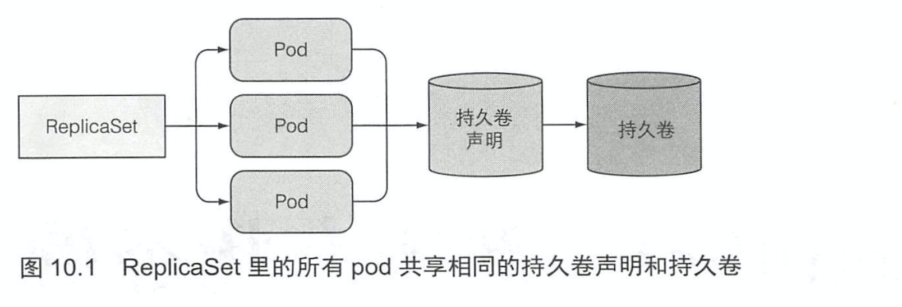
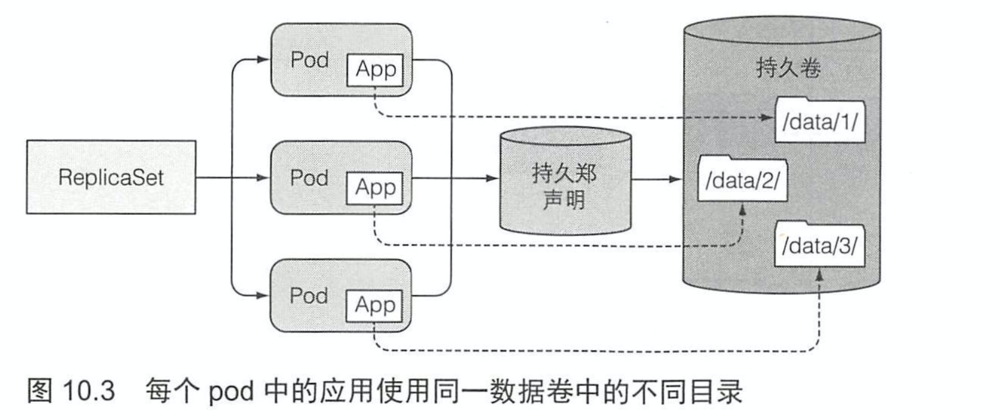
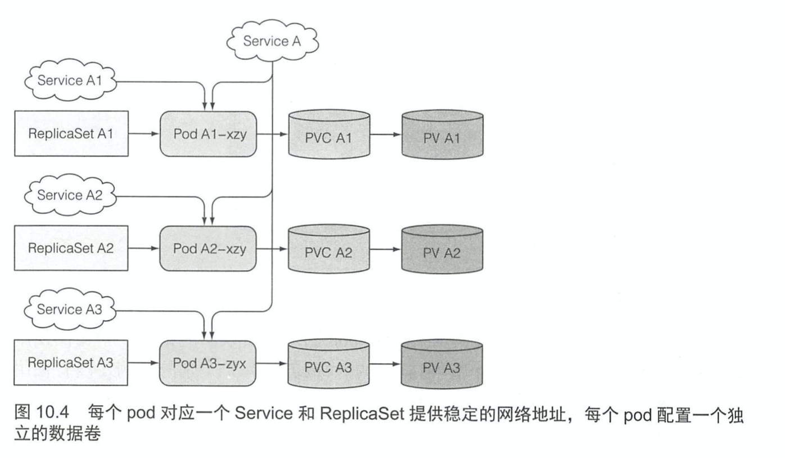
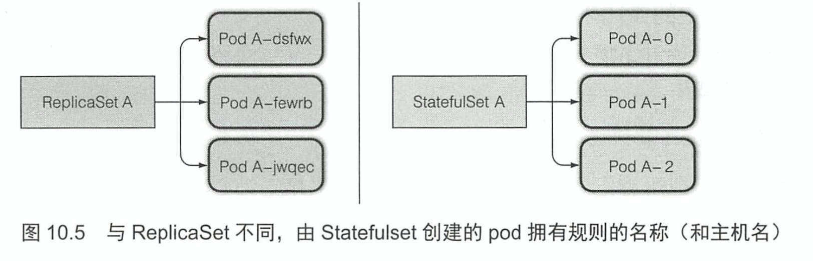
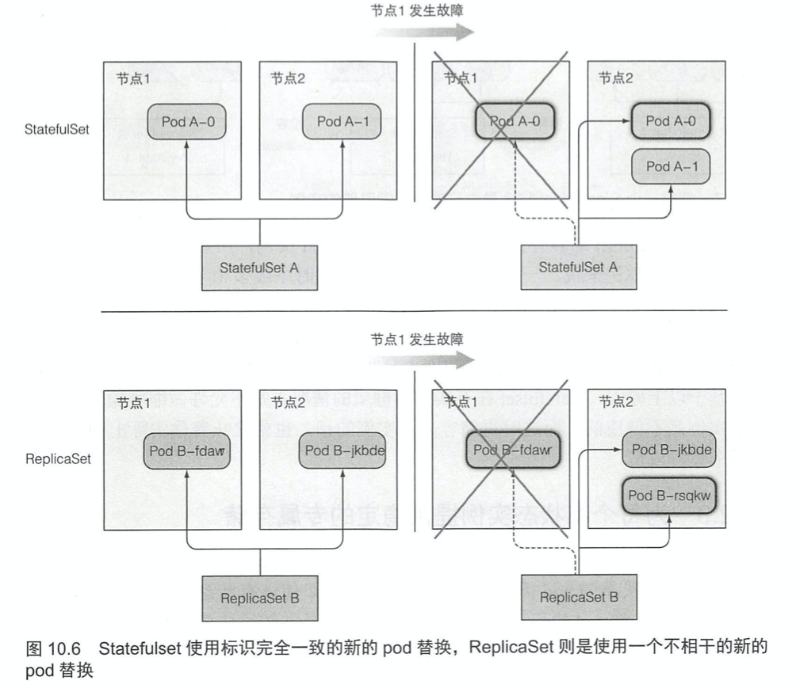
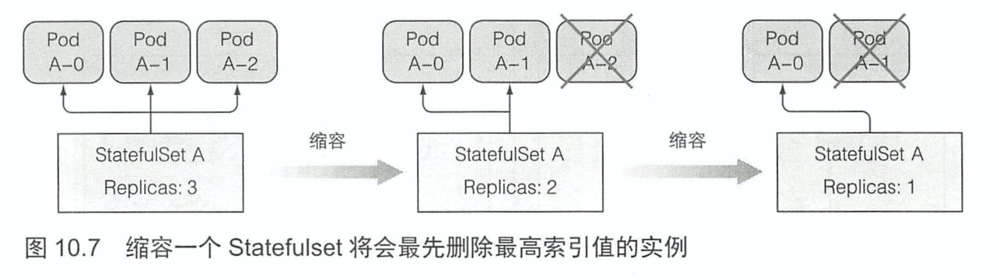
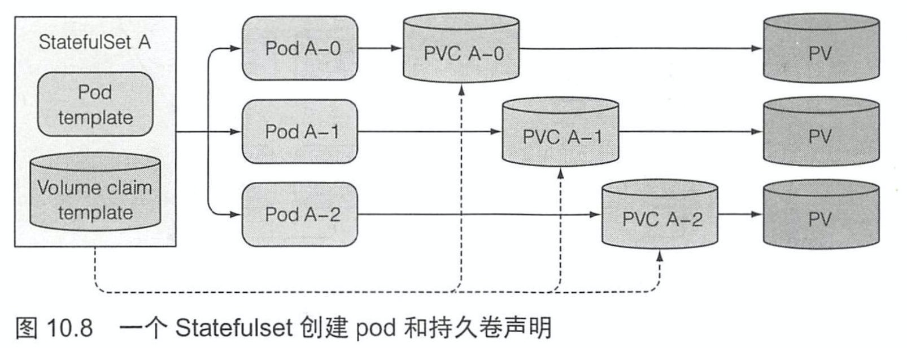
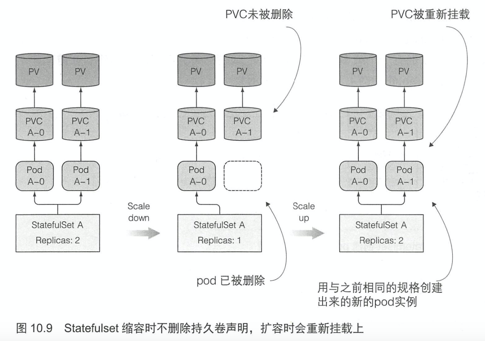

# KubernetesInAction学习笔记（10）

## 第10章 StatefulSet: 部署有状态的多副本应用

### 10.1 复制有状态 pod

rc 和 rs 都通过一个 pod 模板创建多个 pod 副本。这些副本除了它们的名字和 IP 地址不同外，没有什么区别。如果 pod 模板里描述了一个关联到特定持久卷声明的数据卷，那么 rs 的所有副本都会共享这个持久卷声明。

因为是在 pod 模板里关联声明的，又会依据 pod 模板创建多个 pod 副本，则不能对每个副本都指定独立的持久卷声明。所以也无法通过一个 rs 来运行一个每个实例都需要独立存储的分布式数据存储服务。（PS：个人理解就是卷跟 rs 绑定不跟 pod 绑定，所以无法保存每个实例特定的状态）

#### 10.1.1 运行每个实例都有单独存储的多副本

那如何让每个 pod 都有独立的存储卷呢，rs 会根据一个 pod 创建一致的副本，所以不能通过它们来达到目的。

##### 手动创建 pod

可以手动创建多个 pod，每个 pod 都使用一个独立的持久卷声明，但这种情况需要自己手动管理，当有的 pod 消失后就需要去手动创建，因此这不是一个好的选择。

##### 一个 pod 实例对应一个 rs

创建多个 rs 并将每个 rs 的副本数设为 1，做到 pod 和 rs 一一对应，为每个 rs 的 pod 模板关联一个专属的持久卷声明。尽管这样能保证 pod 的自动重新调度创建，但这种方法还是比较笨重的，而且，在这种模式下无法进行自动伸缩扩容。

##### 使用同一数据卷的不同目录

还有一个比较取巧的做法是让每个 pod 在数据卷中使用不同的数据目录。

但是由于不能指定一个实例使用哪个特定目录而只能让每个实例自动选择或创建一个别的实例还没有使用的数据目录，所以这种方案会要求实例之间相互协作，其正确性很难保证。同时，共享存储也会成为整个应用的性能瓶颈。

#### 10.1.2 每个 pod 都需要提供稳定的标识

除了上面说的存储需求，集群应用也会要求每一个实例拥有生命周期内的唯一标识。也就是新的 pod 不应该使用旧实例的数据。

**之所以会有这种需求，是因为在能够支持分布式部署的应用中，通常都会要求管理者在每个集群成员的配置文件中列出所有其他集群成员和它们的 IP 地址（或主机名）。但在 K8S 中，每次重新调度一个 pod，其集群成员就会有一个新的主机名和 IP 地址**。

一个比较取巧的做法是：针对集群中的每个成员实例，都创建一个独立的 K8S Service 来提供稳定的网络地址。因为服务 IP 是固定的，可以在配置文件中指定**集群成员对应的服务 IP（而不是 pod IP）**。

这种做法跟之前提到的为每个成员创建一个 ReplicaSet 并配置独立存储是一样的，将这两种方法结合起来就是如下的架构：

但这种解决方法其实十分粗糙，最实际的一点就是：每个 pod 无法知道其他特定状态的 pod 所对应的 Service 和 IP。就算使用 headless Service，也会由于其他的 pod 副本的名称中包含随机生成的 hash 值而无法确定准确的域名。

### 10.2 了解 Statefulset

幸运的是，K8S 提供了这类需求的完美解决方案：Statefuleset。

在 Statefulset 中运行的应用每一个实例都是不可替代的个体，都拥有稳定的名字和状态。

#### 10.2.1 对比 Statefulset 和 ReplicaSet

Statefulset（以下简称 ss）又称有状态的应用。和 rs 与 rc 相比，后两者所管理的 pod 都是无状态的，任何时候它们都可以被一个全新的 pod 替换。**而 ss 的实例如果要重建，则必须与被替换的实例拥有相同的名称、网络标识和状态，这就是 ss 管理 pod 的方法**。

与 rs 类似，ss 也会指定期望的副本数，决定同一时间内运行的副本数量，同样也是根据指定的 pod 模板创建 pod。**但不同的是**，ss 创建的 pod 副本并不是完全一样的。**每个 pod 都可以拥有一组独立的数据卷（持久化状态），此外，每个 pod 副本的名字都是固定的**。

一个 ss 创建的每个 pod 都有一个从零开始的顺序索引，这些会体现在 pod 的名称和主机名还有对应的固定存储上。这些 pod 的名称是可以预知的，由 ss 的名称加上该实例的顺序索引值所组成。

#### 10.2.2 提供稳定的网络标识

让 pod 拥有可预知的名称和主机名并不是全部，如上一节所说，有状态的 pod 需要通过其主机名来定位，在操作时也希望操作的是其中处于特定状态的某一个。

基于这种原因，一个 ss 通常会要求你创建一个用来记录每个 pod 网络标记的 headless Service（前面介绍过，详情见第 5 章）。

> 简单来讲，headless 服务就是一种能够让 pod 通过服务访问特定的 pod 的服务，而不是像一般的服务那样通过服务代理的负载均衡来随机选择一个 pod。

通过 headless Service，每个 pod 将拥有独立的 DNS 记录，这样就方便集群里它的伙伴或客户端可以通过主机名方便的找到它。比如说，default 命名空间中名为 foo 的控制服务有一个 pod 的名称为 A-0，那么其完整域名即为`a-0.foo.default.svc.cluster.local`。

此外，在后面的章节中会介绍到，还可以通过域名查找所有的 SRV 记录来获取一个 ss 中所有 pod 的名称。

##### 替换消失的副本

当一个 ss 管理的一个 pod 实例消失了以后（pod 所在节点发生故障，或是有人手动删除了 pod）。ss 会重启一个新的 pod 实例替换它，与 rs 和 rc 不同的是，新的 pod 会拥有与之前的 pod 完全一样的主机名。

但有一点与无状态 pod 相同，新的 pod 并不一定会调度到相同的节点上，对于有状态的 pod 来说也是这样。

##### 扩缩容 Statefulset

有状态的 pod 缩容将会最先删除最高索引值的实例，缩容的结果是可预知的。

要注意，ss 的缩容在任何时候都只会操作一个 pod 实例，所以有状态应用的缩容不会很迅速。原因是如果同时有两个实例下线，一份数据记录就会丢失。如果缩容是线性的，分布式存储就有时间把丢失的副本复制到其他节点，保证数据不会丢失。

基于以上原因，ss 在有实例不健康的情况下是不容许做缩容操作的。

#### 10.2.3 为每个有状态的实例提供稳定的专属存储

有状态的 pod 的存储必须是持久的，并且与 pod 解耦。通过在 pod 模板中添加卷声明模板，可以让 ss 依据 pod 的个数创建相同数量的持久卷量。

##### 在 pod 模板中添加卷声明模板

一个 ss 可以拥有一个或多个卷声明模板，这些持久卷声明会在创建 pod 前创建出来，绑定到一个 pod 实例上。

##### 持久卷的创建和删除

当 ss 进行扩容的时候，会创建一个 pod + 与之关联的一个或多个持久卷声明。但缩容的时候则只会删除一个 pod。

只有手动删除声明，与 pod 实例绑定的持久卷才会被回收或删除。

也正因如此，新的 pod 实例能够运行到与之前完全一致的状态，如果因为误操作而缩容了一个 ss，马上就可以做一次扩容来弥补自己的过失。

#### 10.2.4 Statefulset 的保障

ss 不仅拥有稳定的标记和独立的存储，它的 pod 还有其他的一些保障。

K8S 必须保证两个拥有相同标记和绑定相同持久卷声明的有状态的 pod 实例不会同时运行。**一个 ss 必须保证有状态的 pod 实例的 at-most-one 语义**。也就是说 ss 必须在准确确认一个 pod 不再运行后，才会去创建它的替换 pod。

### 10.3 使用 Statefulset

接下来实际创建一个 ss，看看它是如何工作的。

#### 10.3.1 创建应用和容器镜像

> 本次阅读至 P294 10.2.4 Statefulset 的保障 309

