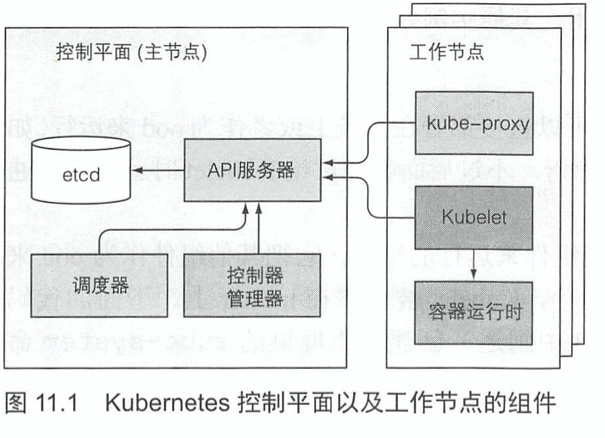

# KubernetesInAction学习笔记（11）

## 第11章 了解Kubernetes机理

本章内容：

- K8S 集群包含哪些组件
- 每个组件的作用以及它们是如何工作的
- 运行的 pod 是如何创建一个部署对象的
- 运行的 pod 是什么
- pod 之间的网络如何工作
- K8S 服务如何工作
- 如何保证高可用

### 11.1 了解架构

K8S 集群分为两部分：

- Kubernetes 控制平面
- （工作）节点

控制平面负责控制并使得整个集群正常运转，其中又包含以下组件：

- etcd 分布式持久化存储
- API 服务器
- 调度器
- 控制器管理器

这些组件用于存储、管理集群状态，但它们不是运行应用的容器。

工作节点用于运行容器，其中包含以下组件：

- Kubelet
- Kubelet 服务代理（kube-proxy）
- 容器运行时（Docker、rkt 或者其他）

此外 K8S 还有一些附加组件，用于为集群提供一些必要的功能，包含：

- K8S DNS 服务器
- 仪表板
- Ingress 控制器
- Heapster（容器集群监控）
- 容器网络接口插件

#### 11.1.1 Kubernetes 组件的分布式特性

K8S 的组件之间有个字的依赖关系，如下：



通过`kubectl get componentstatuses`可以查看控制平面中每个组件的健康状态。

```shell
$ kubectl get componentstatuses
NAME                 STATUS      MESSAGE                                                                                       ERROR
scheduler            Unhealthy   Get "http://127.0.0.1:10251/healthz": dial tcp 127.0.0.1:10251: connect: connection refused
controller-manager   Unhealthy   Get "http://127.0.0.1:10252/healthz": dial tcp 127.0.0.1:10252: connect: connection refused
etcd-0               Healthy     {"health":"true"}
```

K8S 的系统组件之间只能通过 API 服务器通信.

#### 11.1.2 Kubernetes 如何使用 etcd

etcd 是一个响应快、分布式、一致的 key-value 存储。唯一直接和 etcd 通信的是 API 服务器组件，所有其他组件通过 API 服务器间接地读取、写入数据到 etcd。

> 值得强调的是，etcd 是 K8S 存储集群状态和元数据的唯一地方。

为保证高可用性，常常会运行多个 etcd 实例。为保证多个 etcd 实例之间的一致性，etcd 在内部使用 RAFT 算法保障在任何时间点，每个节点的状态要么是大部分节点的当前状态，要么是之前确认过的状态。

#### 11.1.3 API 服务器做了什么


> 本次阅读至 P322 11.1.3 API 服务器做了什么 336