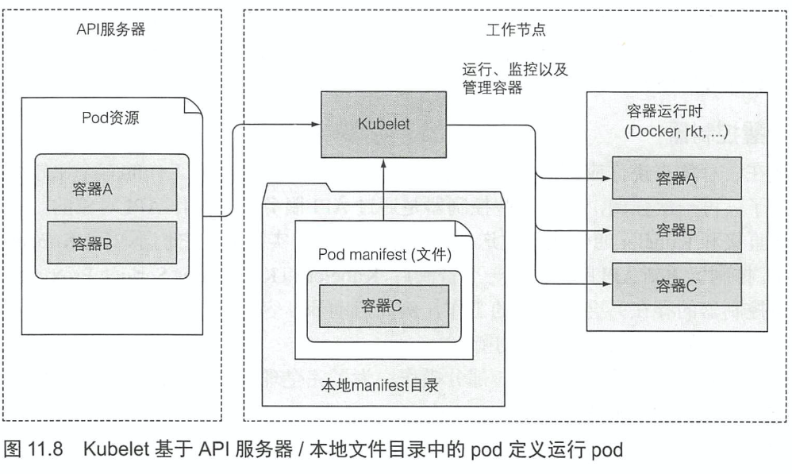
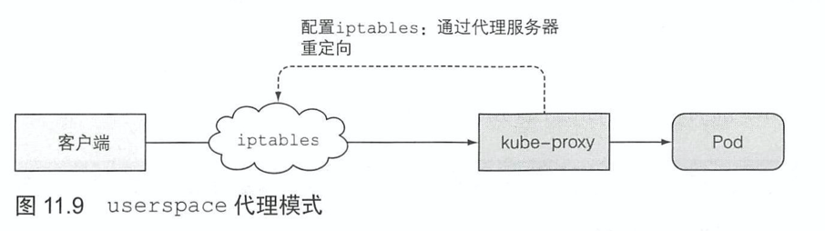
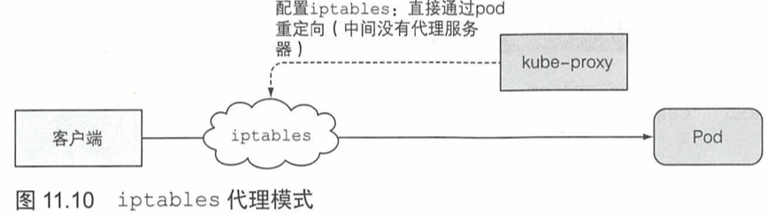
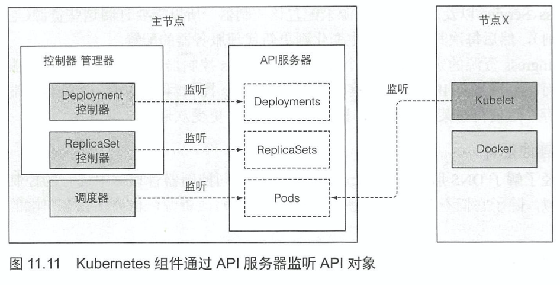
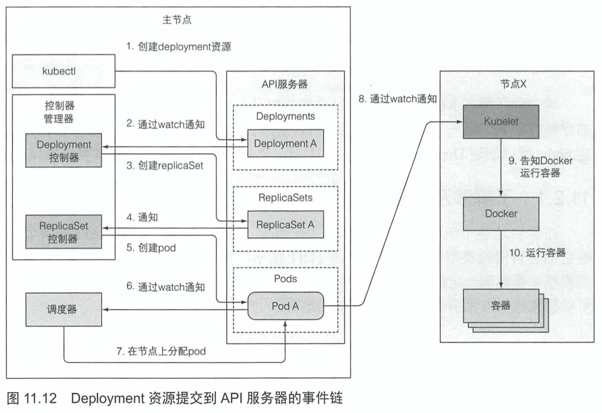
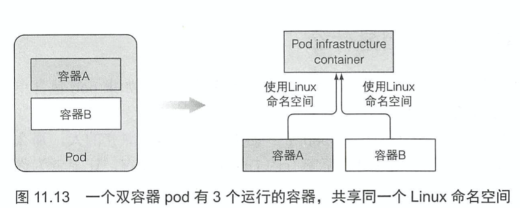
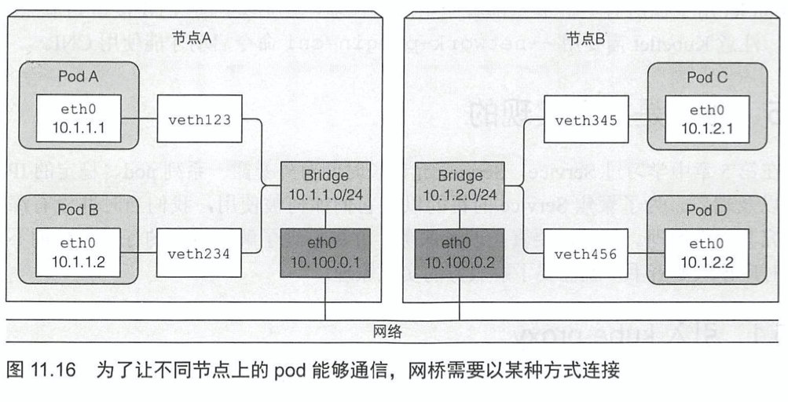
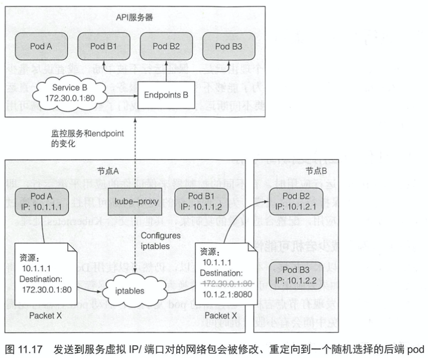

# KubernetesInAction学习笔记（11）

## 第11章 了解Kubernetes机理

本章内容：

- K8S 集群包含哪些组件
- 每个组件的作用以及它们是如何工作的
- 运行的 pod 是如何创建一个部署对象的
- 运行的 pod 是什么
- pod 之间的网络如何工作
- K8S 服务如何工作
- 如何保证高可用

### 11.1 了解架构

K8S 集群分为两部分：

- Kubernetes 控制平面
- （工作）节点

控制平面负责控制并使得整个集群正常运转，其中又包含以下组件：

- etcd 分布式持久化存储
- API 服务器
- 调度器
- 控制器管理器

这些组件用于存储、管理集群状态，但它们不是运行应用的容器。

工作节点用于运行容器，其中包含以下组件：

- Kubelet
- Kubelet 服务代理（kube-proxy）
- 容器运行时（Docker、rkt 或者其他）

此外 K8S 还有一些附加组件，用于为集群提供一些必要的功能，包含：

- K8S DNS 服务器
- 仪表板
- Ingress 控制器
- Heapster（容器集群监控）
- 容器网络接口插件

#### 11.1.1 Kubernetes 组件的分布式特性

K8S 的组件之间有个字的依赖关系，如下：


通过`kubectl get componentstatuses`可以查看控制平面中每个组件的健康状态。

```shell
$ kubectl get componentstatuses
NAME                 STATUS      MESSAGE                                                                                       ERROR
scheduler            Unhealthy   Get "http://127.0.0.1:10251/healthz": dial tcp 127.0.0.1:10251: connect: connection refused
controller-manager   Unhealthy   Get "http://127.0.0.1:10252/healthz": dial tcp 127.0.0.1:10252: connect: connection refused
etcd-0               Healthy     {"health":"true"}
```

K8S 的系统组件之间只能通过 API 服务器通信.

#### 11.1.2 Kubernetes 如何使用 etcd

etcd 是一个响应快、分布式、一致的 key-value 存储。唯一直接和 etcd 通信的是 API 服务器组件，所有其他组件通过 API 服务器间接地读取、写入数据到 etcd。

> 值得强调的是，etcd 是 K8S 存储集群状态和元数据的唯一地方。

为保证高可用性，常常会运行多个 etcd 实例。为保证多个 etcd 实例之间的一致性，etcd 在内部使用 RAFT 算法保障在任何时间点，每个节点的状态要么是大部分节点的当前状态，要么是之前确认过的状态。

#### 11.1.3 API 服务器做了什么

K8S API 服务器作为中心组件，以 RESTful API 的形式提供了可以查询、修改集群状态的 CRUD 接口，然后会将状态存储到 etcd 中。其他组件或者客户端都会去调用该服务器。


#### 11.1.4 API 服务器如何通知客户端资源变更

客户端通过创建到 API 服务器的 HTTP 连接来监听变更。通过此连接，客户端会接收到监听对象的一系列变更通知。每当更新对象，服务器会把新版本对象发送至所有监听该对象的客户端。


此外，还可以在 kubectl 命令执行的时候加入`--watch`选项，这样当资源发生更改时，就会定期通知你。

```shell
$ kubectl get pods --watch
# 甚至可以让 kubectl 打印出整个监听事件的 YAML 文件
$ kubectl get pods -o yaml --watch
```

#### 11.1.5 了解调度器

调度器会利用 API 服务器的监听机制等待新创建的 pod，然后给每个新的、没有节点集的 pod 分配节点。调度器不会命令选中的节点去运行 pod。调度器做的就是通过 API 服务器更新 pod 的定义。然后由 API 服务器再去通知 Kubelet，当目标节点上的 Kubelet 发现该 pod 被调度到本节点，它就会创建并且运行 pod 的容器。

调度器使用以下原则去检查哪些节点对 pod 可用于调度：

- 节点能否满足 pod 对硬件资源的请求
- 节点是否耗尽资源
- pod 是否要求被调度到指定节点，是否是当前节点
- 节点是否有和 pod 定义里的节点选择器一致的标签
- 如果 pod 要求绑定指定的主机端口，那么该节点傻姑娘的这个端口是否已经被占用？
- 如果 pod 要求有特定类型的卷，该节点是否能为此 pod 加载此卷，或者说该节点上的该卷是否已经有 pod 占用了？
- pod 是否能够容忍节点的污点（？？？16章内容）
- pod 是否定义了节点，pod 的亲缘性以及非亲缘性规则，调度节点给该 pod 是否会违反规则（？？？16章内容）

所有的这些测试都必须通过，然后调度器就会得到节点集的一个子集，该节点进入到节点池，有资格调度给 pod。

此外，K8S 在选择节点时还做了很多事情，比如说两个同样有资格调度到 pod 的节点，一个节点有 pod，另一个没有，则没有 pod 的节点会被优先选择。

##### 使用多个调度器

可以通过在 pod 特性中设置 schedulerName 属性指定调度器来调度特定的 pod。未设置改属性的 pod 由默认调度器调度，默认值为`default-scheduler`。

可以实现自己的调度器部署到集群，或者可以部署有不同配置项的额外 K8S 调度器实例。

#### 11.1.6 介绍控制器管理器中运行的控制器

API 服务器只做了存储资源到 etcd 和通知客户端有变更的工作。而调度器只是给 pod 分配节点。所以需要有活跃的组件确保系统真实状态朝 API 服务器定义的期望的状态收敛，而这个工作由控制器管理器里的控制器来实现。

控制器包括：

- Replication
- rs、ds、Job
- Deployment
- StatefulSet
- Node
- Service
- Endpoints
- Namespace
- PersistentVolume
- 其他

由此可见控制器就是活跃的 K8S 组件，去做具体工作部署资源。

##### 了解控制器做了什么以及如何做的

控制器通过 API 服务器监听资源变更，然后执行将实际状态调整为期望状态（会将新的实际状态写入资源的`status`部分，通过 describe 命令可以看到）。控制器利用监听机制来订阅变更，定期执行重列举操作来确保不会丢掉什么。

以 rc 管理器举例，控制器不会每次循环去轮询 pod，而是通过监听 rc 和 pod 资源的变化类型，**该类型的变化将触发控制器重新检查期望的以及实际的复制集数量**，然后作出相应操作：


#### 11.1.7 Kubelet 做了什么

**Kubelet 是负责所有运行在工作节点上内容的组件**。通常会执行以下任务：

- 在 API 服务器中创建一个 Node 资源来注册该节点
- 持续监控 API 服务器是否把该节点分配给 pod
- 启动 pod 容器，具体实现方式是告知配置好的容器运行时来从特定容器镜像运行容器
- 运行容器存活探针，当探针报错时会负责重启容器
- 负责终止容器，并通知服务器 pod 已经被终止了

##### 抛开 API 服务器运行静态 pod

Kubelet 不仅可以使用 API 服务器传过来的配置文件，也可以使用本地节点的配置文件来启动 pod。



#### 11.1.8 Kubernetes Service Proxy 的作用

除了 Kubelet，每个工作节点还会运行 kube-proxy，用于确保对服务 IP 和端口的连接最终能到达支持服务的某个 pod 处。如果有多个 pod 支撑一个服务，那么代理会发挥对 pod 的负载均衡作用。

##### 为什么被叫作代理

kube-proxy 有两种实现模式，userspace 代理模式和 iptables 代理模式。userspace 模式会真实地生成一个代理服务器，而 iptables 模式则不会。





一般默认都会使用性能更好的 iptables 模式。

#### 11.1.9 介绍 Kubernetes 插件

K8S 有许多插件提供新的功能，比如启用 K8S 服务的 DNS 查询，Ingress 服务，K8S web 仪表板等特性。

这些插件工作时都会以 K8S 中资源的形式存在，比如说 DNS 插件会作为 Deployment 部署，Ingress 控制器和仪表板插件会按照 rc 部署。

### 11.2 控制器如何协作

当你启动一个流程之前（以创建一个 Deployment 为例），就已经存在许多监听关系了，等待触发时刻的开始。



#### 11.2.2 事件链

以创建 Deployment 为例，事件链的流程如下所示：



### 11.3 了解运行中的 pod 是什么

pod 在运行时，kubelet 会负责调用容器技术来创建容器，除了工作的所需容器以外，还会创建一个暂停的容器，它的唯一目的就是保存所有的命名空间。所有 pod 的其他用户定义容器使用 pod 的该基础容器的命名空间。



应用容器可能会挂掉并重启，当容器重启时，由于有这个基础容器的存在，所以它们能够处于与之前相同的 Linux 命名空间中。该基础容器的生命周期会与 pod 绑定。

### 11.4 跨 pod 网络

K8S 中，网络是由系统管理员或者 Container Network Interface（CNI）插件建立的，而非 Kubernetes 本身。

K8S 并不会要求你使用特定的网络技术，但是会要求 pod 不论是否运行在同一个工作节点上，都可以相互通信。



### 11.5 服务是如何实现的

Service 允许长时间对外暴露一系列 pod、稳定的 IP 地址以及端口。本节介绍服务的实现原理。

#### 11.5.1 引入 kube-proxy

和 Service 相关的任何事情都由每个节点上运行的 kube-proxy 进程处理。之前提到过，kube-proxy 有两个模式。

- 对于 userspace（用户空间）代理模式来说，kube-proxy 确实是一个 proxy，等待连接，对每个进来的连接，连接到一个 pod。
- 而 iptables 代理模式则不是，仅是通过 iptables 的规则引入到其他的 pod，并不会启动一个真正的代理服务器。也因此这种模式更轻量，性能更好。也是默认的模式。

每个 Service 有其自己稳定的 IP 地址和端口。客户端（通常为 pod）通过连接该 IP 和端口使用服务。该 IP 地址是虚拟的没有被分配给任何网络接口，所以服务 IP 本身并不代表任何东西，这就是为什么无法 ping 这些 IP。

#### 11.5.2 kube-proxy 如何使用 iptables

通过建立一些`iptables`规则，kube-proxy 可以确保每个目的地为服务的 IP/端口对的数据包被解析，目的地址被修改，这样数据包就会被重定向到支持服务的一个 pod。



### 11.6 运行高可用集群

在 K8S 上运行应用的一个理由就是高可用性，保证运行不被中断，或者说尽量减少人工介入基础设施导致的宕机。

#### 11.6.1 让你的应用变得高可用

为了保证应用的高可用性，可以通过 Deployment 资源运行应用，配置合适数量的复制集，其他的交给 K8S 处理。


> 本章剩下的内容太水了，全是概念性的东西，跳过。