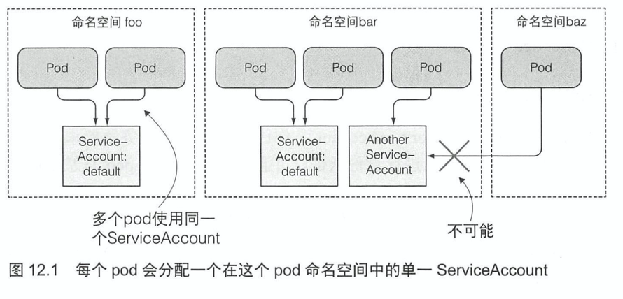
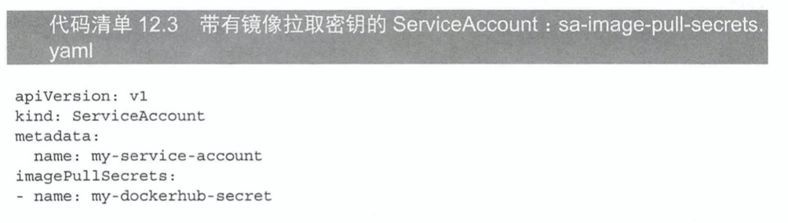
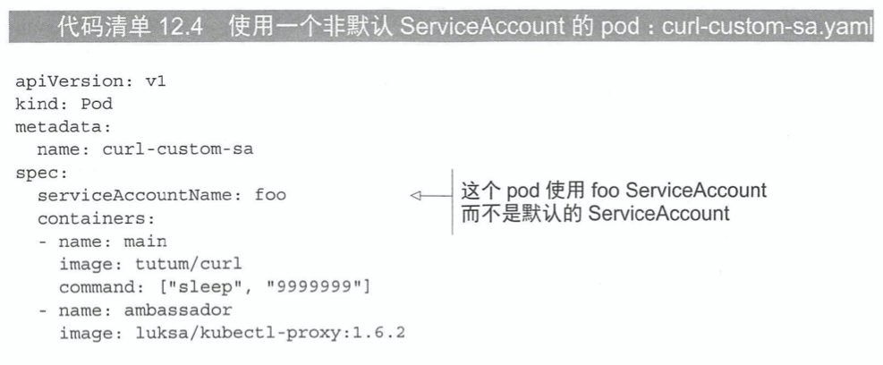
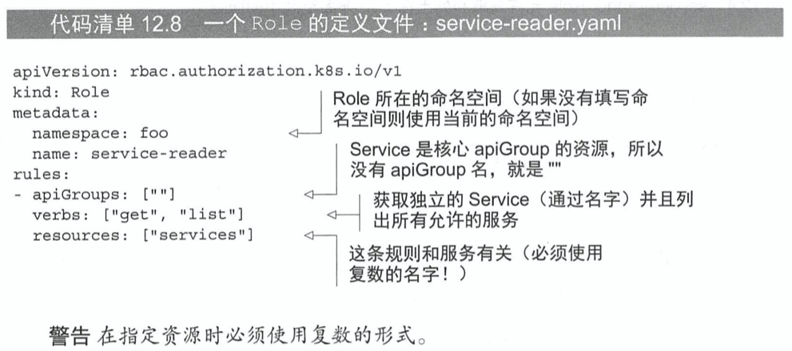
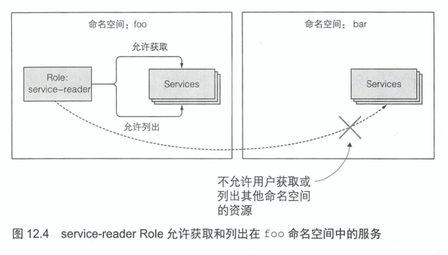
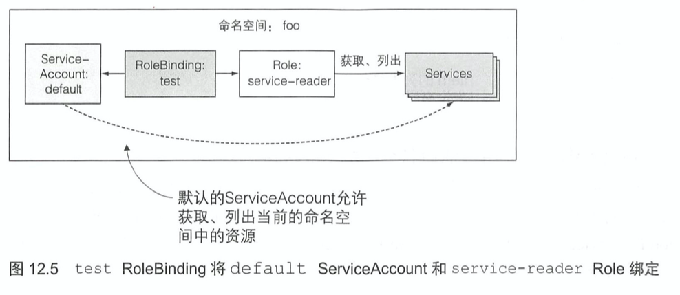
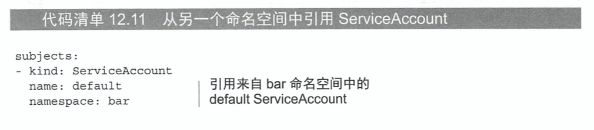
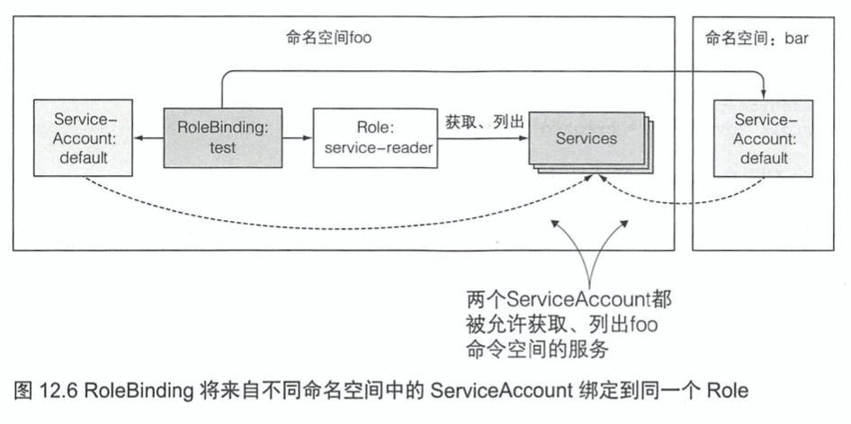

# KubernetesInAction学习笔记（12）

## 第12章 Kubernetes API服务器的安全防护

### 12.1 了解认证机制

API 服务器可以配置一个到多个认证的插件，目前有几个认证插件是直接可用的。它们使用下列方法获取客户端的身份认证：

- 客户端证书
- 传入在 HTTP 头中的认证 token
- 基础的 HTTP 认证
- 其他

启动 API 服务器时，通过命令行选项可以开启认证插件。

#### 12.1.1 用户和组

K8S 区分了两种连接到 API 服务器的客户端：

- 真实的用户
- pod（运行在 pod 中的应用）

pod 使用一种称为 service accounts 的机制，该机制被创建和存储在集群中作为 ServiceAccount 资源。

#### 12.1.2 ServiceAccount 介绍

之前了解过 pod 是怎么通过发送`/var/run/secrets/kubernetes.io/serviceaccount/token`文件内的内容来进行身份认证。这个文件会通过加密卷挂载进每个容器的文件系统中。

每个 pod 都与一个 ServiceAccount 相关联，它代表了运行在 pod 中应用程序的身份证明。token 文件持有 ServiceAccount 的认证 token，应用程序使用这个 token 连接 API 服务器时，相当于对 ServiceAccount 进行认证。

ServiceAccount 用户名的格式像这样：`system:serviceaccount:<namespace>:<service account name>`

##### 了解 ServiceAccount 资源

ServiceAccount 就像 pod、sSecret、ConfigMap 等一样都是资源，应用程序通过在请求中传递 ServiceAccount token 来实现这一点。

```shell
$ kubectl get sa
NAME      SECRETS   AGE
default   1         61d
```

当前命名空间只包含 default 的 ServiceAccount，其他额外的 sa 可以在需要时添加。每个 pod 都与一个 sa 相关联，但是多个 pod 可以使用同一个 sa，但只能是同一个命名空间中的。



在 pod 的 manifest 文件中，可以用指定账户名称的方式将一个 sa 赋值给一个 pod。如果不显式地指定 sa 的账户名称，pod 就会使用命名空间中的默认 sa。

可以通过将不同的 sa 赋值给 pod 来控制每个 pod 可以访问的资源。API 服务器会通过 RBAC 原则对管理员配置好的系统级别认证插件来获取这些信息。

#### 12.1.3 创建 ServiceAccount

```shell
$ kubectl create serviceaccount foo
serviceaccount/foo created

$ kubectl describe serviceaccounts foo
Name:                foo
Namespace:           default
Labels:              <none>
Annotations:         <none>
Image pull secrets:  <none>
Mountable secrets:   foo-token-h7srm
Tokens:              foo-token-h7srm
Events:              <none>
```

此外还可以通过`kubectl describe secrets foo-token-h7srm`来查看密钥中的值。

PS：ServiceAccount 中使用的身份认证 token 形式是 JWT token（JSON Web Token）。

##### 了解 ServiceAccount 的镜像拉取密钥

sa 可以包含一个用于拉取密钥的 list。



向 sa 中添加镜像拉取密钥，再在 pod 中使用该 sa，这个镜像拉取密钥就会自动添加到该 pod 中，就不必对每个 pod 都单独进行镜像拉取密钥的添加操作了。

##### 了解 ServiceAccount 上的课挂载密钥

默认情况下，pod 可以挂在任何它所需要的迷药。但是可以通过对 sa 的配置让 pod 只允许挂载 sa 中列出的可挂载密钥。开启该功能的方式为添加以下注解：`kubernetes.io/enforce-mountable-secrets="true"`。

如果 sa 被加上了这个注解，任何使用该 sa 的 pod 只能挂载进 sa 的可挂载密钥——也即是这些 pod 不能使用其他密钥。

#### 12.1.4 将 ServiceAccount 分配给 pod

通过在 pod manifest 文件的`spec.serviceAccountName`字段上可以将 sa 分配给 pod。（PS：pod 的 sa 必须要在 pod 创建时进行设置，**且后续不能被修改**）



### 12.2 通过基于角色的权限控制加强集群安全

RBAC 授权规则是通过四种资源来进行配置的，可以分为两个组：

- Role（角色） 和 ClusterRole（集群角色），它们用于定义不同角色的权限
- RoleBinding（角色绑定）和 ClusterRoleBinding（集群角色绑定），负责将不同的用户绑定到不同的角色上。

#### 12.2.3 使用 Role 和 RoleBinding

Role 资源定义了哪些操作（权限）可以在哪些资源上执行。



```yaml
apiVersion: rbac.authorization.k8s.io/v1
kind: Role
metadata:
  namespace: foo
  name: service-reader
rules:
- apiGroups: [""]
  verbs: ["get", "list"]
  resources: ["services"]
```

```shell
# 先创建一个命名空间
$ kubectl create namespace foo
namespace/foo created

$ kubectl create -f demo-service-role.yaml
role.rbac.authorization.k8s.io/service-reader created
```

该角色只被允许和列出在 foo 命名空间中的服务。



##### 绑定角色到 ServiceAccount

通过创建一个 RoleBinding 资源来实现将角色绑定到主体（特定的用户）。

```shell
$ kubectl create rolebinding test --role=service-reader --serviceaccount=foo:default -n foo
rolebinding.rbac.authorization.k8s.io/test created
```

运行上面的命令，可以将角色绑定到 default 命名空间中的名为 foo 的 ServiceAccount。然后使用该 ServiceAccount 的 pod 就可以通过访问 kubectl-proxy 中的 foo 命名空间并列出 services 了。

> PS：如果要绑定一个角色到一个 user 而不是 ServiceAccount 上，可以使用 --user 作为参数来指定用户名。如果要绑定角色到组，可以使用 --group 参数。



RoleBinding 可以将特定的角色绑定到多个主体上，也就是角色和主体通过 RoleBinding 实现了一对多的关系。

##### 在角色绑定中使用其他命名空间的 ServiceAccount

可以修改任意命名空间的 RoleBinding（`kubectl edit`），在其中添加另一个 pod 的 ServiceAccount，然后该 ServiceAccount 也就拥有该角色（Role）的权限了。





#### 12.2.4 使用 ClusterRole 和 ClusterRoleBinding

Role 和 RoleBinding 都是命名空间的资源，这意味着它们属于和应用在一个单一的命名空间资源上。但是一些特定的资源完全不在命名空间中（包括 Node、PersistentVolume、Namesapce 等等）。这些资源不能使用常规角色来进行授权，此时就需要用到 ClusterRole 和 ClusterRoleBinding，它们允许访问没有命名空间的资源和非资源型的 URL，或者作为单个命名空间内部绑定的公共角色，从而避免必须在每个命名空间中重新定义相同的角色。

##### 允许访问集群级别的资源

如下是一个允许 pod 列出集群中 PersistentVolume 的 ClusterRole。

```shell
$ kubectl create clusterrrole pv-reader --verb=get,list --resource=persistentvolumes
```

然后创建一个 ClusterRoleBinding 来绑定特定 ServiceAccount。

```shell
$ kubectl create clusterrolebinding pv-test --clusterrole=pv-reader --serviceaccount=foo:default
```

如上的指定并不需要指定的命名空间（集群资源没有命名空间），此时的 ServiceAccount 就拥有集群级别的资源访问权限了。

##### 允许访问非资源性的 URL


> 本次阅读至P371 允许访问非资源性的 URL 385