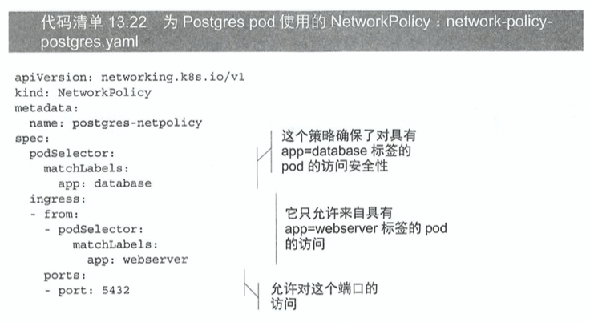

# KubernetesInAction学习笔记（13）

## 第13章 保障集群内节点和网络安全

本章介绍

- 如何允许 pod 访问所在宿主节点的资源
- 配置集群，定义和限制 pod 对于节点的权限
- 保障 pod 的网络安全

### 13.1 在 pod 中使用宿主节点的 Linux 命名空间

每一个 pod 都拥有自己的网络命名空间、PID 命名空间和 IPC 命名空间。

网络命名空间决定每个 pod 有自己的 IP 和端口空间。

PID 决定每个 pod 拥有自己的进程树。

IPC 命名空间仅允许同一 pod 内的进程通过进程间通信机制进行交流。

#### 13.1.1 在 pod 中使用宿主节点的网络命名空间

某些 pod 可能需要在宿主节点的默认命名空间中运行，用以看到宿主节点上的网络信息，比如宿主节点的网络适配器。

这可以通过将 pod spec 中的`hostNetwork`设置为 true 实现。

在这种情况下，意味着 pod 没有自己的 IP 地址，如果 pod 某一个进程绑定了某个端口，那么该进程将会被绑定到宿主节点的端口上。


K8S 控制平面组件通过 pod 部署时，这些 pod 都会使用`hostNetwork`选项，让它们的应用的行为与不在 pod 中运行时相同。

#### 13.1.2 绑定宿主节点上的端口而不使用宿主节点的网络命名空间

可以通过配置 pod 的`spec.containers.ports`字段中某个容器某一端口的`hostPort`属性来实现。对于使用该属性的 pod，到达宿主节点的端口的连接会被直接转发到 pod 对应的端口上。

而在之前介绍的 NodePort 服务中，到达宿主机的端口的连接将被转发到负载均衡随机选取的 pod 上（即便该 pod 可能在其他节点上）。

另外一个区别是，NodePort 类型的服务会在所有的节点上绑定端口，即便这个节点上没有运行对应的 pod 也是。而 hostPort 的 pod 只会对运行了这类 pod 的节点绑定对应的端口。


如果想要使用副本（rc、rs、deployment 等）来管理使用了 hostPort 的 pod，要注意它们将永远不会把两个 pod 部署到一个节点上，因为两个相同的进程不能绑定宿主机的同一个端口。同理，如果你只有 3 个节点而要部署 4 个 pod 副本，那将永远只有 3 个副本能部署成功，剩余一个将始终保持 Pending 状态。

**hostPort 功能最初是用于暴露通过 ds（之前介绍过的 DeamonSet）部署在每个节点上的系统服务**。后来也被用于保证一个 pod 的两个副本不被调度到同一节点，但是现在有更好的方法来实现后者这一需求，后面会介绍到。

#### 13.1.3 使用宿主节点的 PID 和 IPC 命名空间

pod spec 中的`hostPID`和`hostIPC`选项与前面的`hostNetwork`类似，当它们被设为 true 时，pod 中的容器会使用宿主节点的 PID 和 IPC 命名空间，这意味着它们能看到宿主机上的全部进程，也能通过 IPC 机制与它们通信。

### 13.2 配置节点的安全上下文

在 pod 或其所属容器的描述中通过`security-Context`选项来配置安全相关的特性，该选项可以运用于整个 pod，或是每个 pod 中的单独容器。

##### 了解安全上下文中可以配置的内容

- 指定容器中运行进程的用户（用户ID）
- 阻止容器使用 root 用户运行（容器的默认运行用户通常在其镜像中指定，所以也需要在容器中进行配置）
- 使用特权模式运行容器，使其对宿主节点的内核具有完全的访问权限
- 与上一条相反，可以通过添加或禁用内核功能，配置细粒度的内核访问权限
- 设置 SELinux（Security Enhaced Linux，安全增强型 Linux）选项，加强对容器的限制
- 阻止进程写入容器的根文件系统

接下来开始探索这些选项的细节。

#### 13.2.1 使用指定用户运行容器

通过配置 pod 中的`spec.containers.securityContext.runAsUser`选项，可以使用一个与镜像中不同的用户 ID 来运行 pod。


然后在容器中输入 id 命令就可以查看到对应的效果。

```shell
$ kubectl exec pod-as-user-guest id
```

#### 13.2.2 阻止容器以 root 用户运行

如果不关心容器以哪个用户运行而只是单纯希望阻止以 root 用户运行，则可以设定`spec.containers.securityContext.runAsNonRoot`为 true。


**虽然容器与宿主节点基本上是隔离的，但不使用 root 用户来运行容器中的进程依然有其意义**。例如当宿主节点上的一个目录被挂载到容器中时，如果该容器中的进程使用了 root 用户运行，它就会拥有该目录的完整访问权限。而如果用非 root 用户运行，则不会有完整权限，可以有效防止攻击场景的发生。

#### 13.2.3 使用特权模式运行 pod

有时需要允许 pod 在它们的宿主节点上做任何事，例如说操作被保护的系统设备，或使用其他在通常容器中不能使用的内核功能。

kube-system 就有一个这样的例子：kube-proxy pod，它需要修改宿主机的 iptables 规则来让 K8S 中的服务规则生效，也就需要能够运行宿主机上这些命令的权限，就需要该 pod 在特权模式下运行。

通过配置`securityContext`中的`privileged`为 true，即可使 pod 在特权模式下运行。


还有一个例子，如果要在树莓派上运行一个 pod，用这个 pod 来控制相连的 LED，由于这些 LED 是通过串口挂载在 /dev 文件夹下的，所以也必须使用特权模式来运行这个 pod。

#### 13.2.4 为容器单独添加内核功能

相较于上一节让容器运行在特权模式下，拥有无限权限的做法，一个更安全的方法是只给予它使用到的真正需要的内核权限的功能。

K8S 允许通过`spec.containers.securityContext.capabilities.add`为特定的容器添加内核功能或禁用部分内核功能，以容许对容器进行更加精细的权限控制。


添加内核功能远比通过设置`privileged:true`更好，但前提是使用者需要了解各种内核功能（可以在 Linux 手册中进行查询）。

#### 13.2.5 在容器中禁用内核功能

另一方面你也可以通过`spec.containers.securityContext.capabilities.drop`来禁用容器中的内核功能来限制容器中的权限。


比如上面这个例子就禁用了容器默认的 chown 功能，以禁用其修改文件的所有者。

#### 13.2.6 阻止对容器根文件系统的写入

因为安全原因，可能需要阻止容器中的进程对容器的根文件系统进行写入，而仅允许它们写入挂载的存储卷。

这样做的原因是可以阻止一些攻击通过修改容器中提供系统服务的文件来达到攻击应用使其崩溃的效果。通过将`spec.containers.securityContext.readOnlyRootFilesystem`设置为 true 可以实现。


该 pod 容器虽然会以 root 用户运行，但却无法在除了 volume 挂载目录以外的目录进行文件的写入。

为提高安全性，所有在生产环境运行的容器的`spec.containers.securityContext.readOnlyRootFilesystem`应该都是 true。

##### 设置 pod 级别的安全上下文

在`spec.securityContext.readOnlyRootFilesystem`可以直接进行 pod 级别的安全设置，这些设置会作为每一个容器的默认安全上下文，但也会被容器级别的特别设置所覆盖，十分有用。

#### 13.2.7 容器使用不同用户运行时共享存储卷

第 6 章中已经介绍如何使用存储卷在 pod 中的不同容器中共享数据。但有一个前提是，这两个容器都用 root 用户运行，对存储卷中的所有文件拥有全部权限。但如果使用了上面提到的`runAsUser`选项，就可能会出现不一定能够顺利读取或写入另一个容器的文件的情况。

因此，K8S 允许为 pod 中所有容器指定 supplemental 组，以允许它们无论以哪个用户 ID 运行都可以共享文件。这可以通过`spec.securityContext`中的以下两个属性设置：

- fsGroup
- supplementalGroups


在 pod 定义中，将 fsGroup 设置为 555，进入容器后，存储卷就会属于用户组 ID 为 555 的用户组，而其中容器的用户 ID 也会属于这个用户组。

而 supplementalGroups 属性则定义了某个用户所关联的额外的用户组。

以上面的例子为例，容器中的挂载卷目录会属于 555 用户组，而 uid 为 1111 和 2222 的两个用户则会属于 555、666、777 这三个组。

### 13.3 限制 pod 使用安全相关的特性

集群管理人员可以通过创建 podSecurityPolicy 资源来限制安全相关的特性的使用。比如说，部署一个特权模式的 pod，使用 podSecurityPolicy 可以阻止这种 pod 在节点上部署。

podSecurityPolicy 资源是一种集群级别的资源，由集成在 API 服务器中的 PodSecurityPolicy 准入控制插件完成。


> Minikube 开启插件比较麻烦，而且感觉不是很实用，暂时略过这一节。

### 13.4 隔离 pod 的网络

如果网络插件支持，可以通过 NetworkPolicy 资源配置网络隔离，从而限制 pod 可以与其他哪些 pod 通信，以确保 pod 之间的网络安全。

NetworkPolicy 会应用在匹配它的标签选择器的 pod 上，指明允许访问这些 pod 的源地址和这些 pod 可以访问的目标地址。

在`spec.podSelector`中可以指定匹配的 pod 标签，如果该项为空，则会匹配这个命名空间中的所有 pod。

#### 13.4.2 允许同一命名空间中的部分 pod 访问一个服务端 pod




以上就是一个限制仅允许具有 app=webserver 标签的 pod 访问具有 app=database 标签的 pod 的例子。

#### 13.4.3 在不同 K8S 命名空间之间进行网络隔离


使用`namespaceSelector`中的`matchLabels`即可以对命名空间进行选择，比如上面就保证了只有具有`tenant=manning`标签的命名空间中运行的 pod 可以访问服务。


#### 13.4.4 使用 CIDR 隔离网络

除了通过选择器，还可以通过 CIDR 表示法（PS：其实就是网段+掩码...整得那么复杂）来指定一个 IP 段。在这个 IP 段的 pod 允许访问，其余的 pod 不能访问。


#### 13.4.5 限制 pod 的对外访问流量


以上 NetworkPolicy 仅允许具有标签 app=webserver 的 pod 访问具有标签 app=database 的 pod，除此以外不能访问任何地址。