# KubernetesInAction学习笔记（14）

## 第14章 计算资源管理

在本章会学习如何为 pod 配置资源预期的 CPU 和内存使用量，以确保 pod 可以公平地使用 K8S 集群资源，同时也影响整个集群 pod 的调度方式。

### 14.1 为 pod 中的容器申请资源

使用`pod.spec.containers.resources.requests`字段可以为其指定 CPU 和内存的资源请求量。

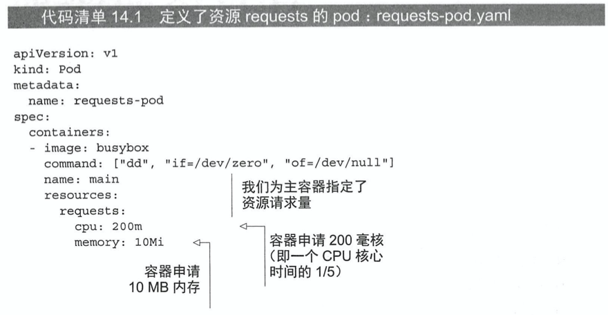

上面我们声明了一个容器需要 1/5 核（200 毫核）的 CPU 才能正常运行。换句话说，五个同样的 pod（或容器）可以足够快地运行在一个 CPU 核上。

此外还为容器申请了 10MB 的内存，说明期望容器内的进程最大消耗 10MB 的 RAM。

#### 14.1.2 资源 requests 如何影响调度

通过设置资源 requests 我们指定了 pod 对资源需求的最小值，调度器会在调度的过程中用到该信息，只考虑那些未分配资源量满足 pod 需求量的节点。如果节点的未分配资源量小于 pod 需求量，K8S 就不会将该 pod 调度到这个节点。

##### 调度器如何判断一个 pod 是否适合调度到某个节点

比较意外的是，调度器在调度的时候**并不会关注各类资源在当前时刻的实际使用量**，而只会关心**节点上部署的所有 pod 资源申请量之和**。

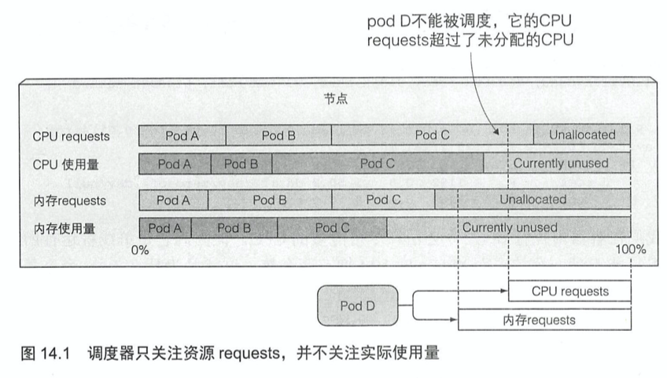

##### 调度器如何利用 pod requests 为其选择最佳节点

在调度时调度器会先排除那些不满足需求的节点，然后使用优先级函数对其余节点进行排序，在 K8S 中有两种基于资源请求量的优先级排序：

- LeastRequestedPriority：优先将 pod 调度到请求量少的节点上
- MostRequestedPriority：优先将 pod 调度到请求量多的节点上

使用 LeastRequestedPriority 可以理解，但是 MostRequestedPriority 会在什么时候使用。答案是当使用第三方的云服务时，需要为每个 pod 提供足量 CPU/内存资源的同时，确保 K8S 使用尽可能少的节点（节省开销～）。

##### 查看节点资源总量

使用 describe 命令可以查看节点的资源。

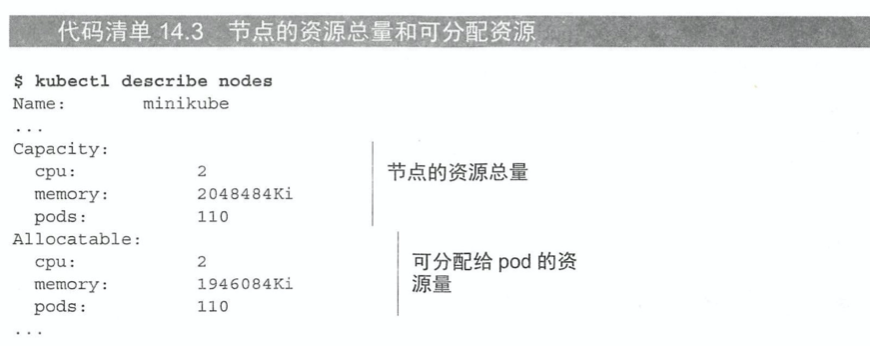

#### 14.1.3 CPU requests 如何影响 CPU 时间分配

CPU requests 不仅仅在调度时起作用，它还决定着剩余的 CPU 时间如何在 pod 之间分配。如果说一个 pod 请求了 200 毫核，另一个请求了 1000 毫核。那么未使用的 CPU 将按照 1:5 的比例来分给这两个 pod。

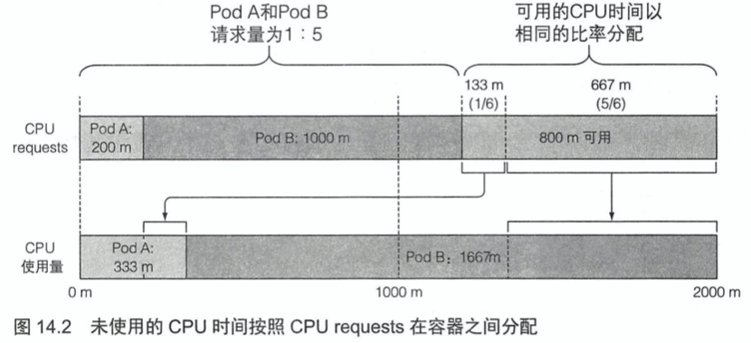

#### 14.1.4 定义和申请自定义资源

K8S 允许用户添加属于自己的自定义资源，并在 spec 的 resource.requests 字段下来指定创建 pod 的申请量。

### 14.2 限制容器的可用资源

requests 和 limits 限制是不一样的，requests 除了会声明 pod 使用的硬件资源外，并不会硬性限制 pod 的最大使用量，也就是说，当节点的 CPU 和内存有空余的时候，会允许 pod 对它们进行主动的占用。

如果要限制容器可以消耗资源的最大量，就必须要使用 limits 字段。

#### 14.2.1 设置容器可使用资源量的硬限制

内存是一种不可压缩资源，在被占用的进程主动释放之前都无法被回收，如果不对内存进行限制，工作节点上的容器（或者 pod）可能会吃掉所有的可用内存甚至导致整个节点不可用，所以势必需要限制容器的最大内存分配量。

##### 创建一个带有资源 limits 的 pod

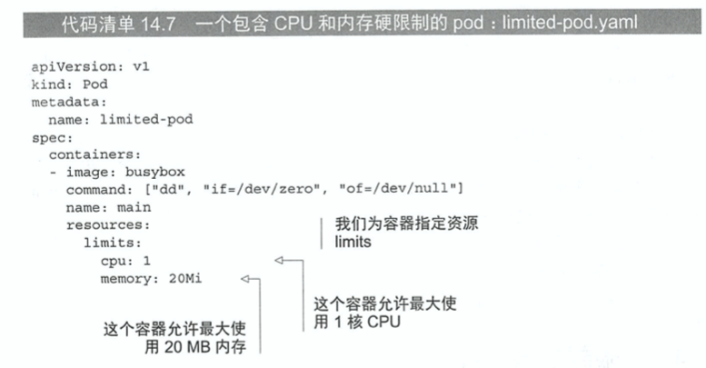

上面的 manifest 规定了容器内的进程不允许消耗超过 1 核 CPU 和 20MB 内存。

> PS：如果没有指定资源 requests，它将被设置为资源 limits 相同的值

##### 可超卖的 limits

与 requests 不同的是，limits 不受节点可分配资源量的约束，所有 limits 的总和允许超过节点资源总量的 100%。但如果节点资源使用量超过了 100%，就会有一些容器被杀掉。

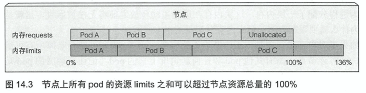

#### 14.2.2 超过 limits

因为 CPU 是可压缩资源，当进程不等待 IO 操作时消耗所有的 CPU 时间是非常常见的，因此当为一个容器设置 CPU 限额时，该进程只会分不到比限额更多的 CPU 而已。

但内存却有所不同，当进程尝试申请分配比限额更多的内存时会被杀掉。如果 pod 的重启策略为 Always 或 OnFailure，进程将会立即重启，如果它继续超限并被杀死，pod 将会处于 CrashLoopBackOff 的状态。

CrashLoopBackOff 状态表示 Kubelet 还没有放弃，它代表**在每次崩溃之后，Kubelet 就会增加下次重启之间的间隔时间**。随着不断崩溃，延迟时间会按照 0、10、20、80、160 秒这样子增长，并最终收敛在 300s。最后 Kubelet 将以 300s 为间隔时间对容器进行无限重启，直到容器正常运行或被删除。

使用 describe 命令可以定位容器崩溃的原因。

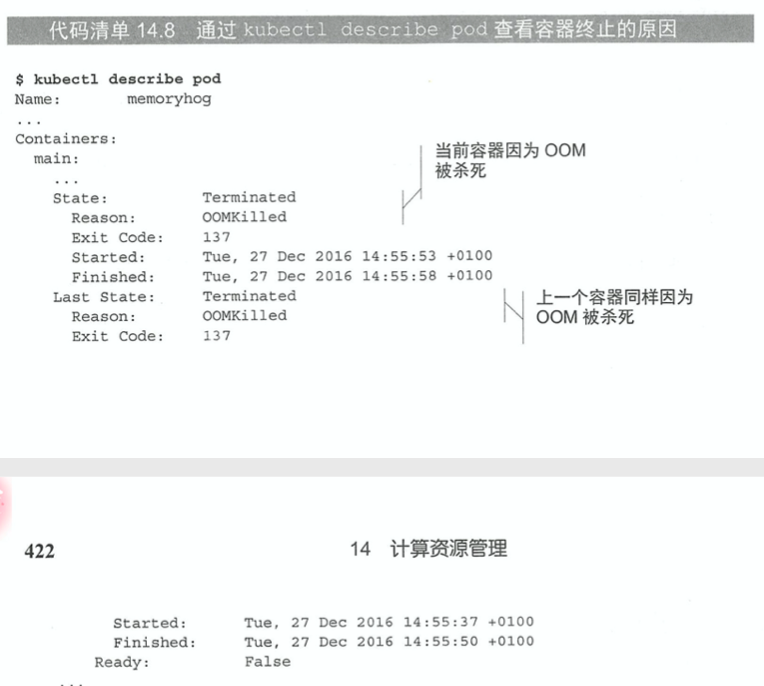

当 OOMKilled 状态告诉我们容器正式因为内存不足而被系统杀掉。

#### 14.2.3 容器中的应用如何看待 limits

即使你为容器设置了最大可用内存的限额，但在容器内部看到的始终都会是节点的内存而不是容器本身的内存。且在容器内同样可以看到节点所有的 CPU 核。这一点对于一些依赖于本机内存限额来执行程序的语言来说非常致命，比如说依赖 JVM 来执行应用的低版本 JAVA，就会由于无法识别到内存限额而申请超出限额的内存，然后被 OOM 杀死。

这也提醒了开发者，不要依赖应用程序从系统中获取硬件资源的具体情况，开发者可以使用 Downward API 将 CPU 限额传递至容器并使用这个值，也可以通过 cgroup 系统直接获取配置的 CPU 限制，在容器内查看下列文件：

- /sys/fs/cgroup/cpu/cpu.cfs_quota_us
- /sys/fs/cgroup/cpu/cpu.cfs_period_us

### 14.3 了解 pod QoS 等级

假设现在有两个 pod，pod A 使用了节点内存的 90%，pod B 突然需要比之前更多的内存，这时的节点无法提供足量内存，那么哪个容器会被杀掉呢？

K8S 通过一种名为 Qos 的等级制度制定哪种 pod 在该场景中优先级更高，K8S 将 pod 划分为三种 QoS 等级：

- BestEffort（优先级最低）
- Burstable
- Guaranteed（优先级最高）

#### 14.3.1 定义 pod 的 QoS 等级

QoS 等级并不来自于一个特定的独立字段，而是通过 requests 和 limits 的配置来决定。

##### 为 pod 分配 BestEffort 等级

这是最低优先级的 QoS，会分配给那些**没有设置任何 requests 和 limits 的 pod**。前面章节创建的 pod 都是这个等级，该登记运行的容器没有任何资源保证，在需要为其他 pod 释放内存时它们会被第一批杀死。不过也正因为如此，当有充足的可用内存时，这些容器可以使用任意多的内存。

##### 为 pod 分配 Guaranteed 等级

这是最高优先级的 QoS，会分配给那些**所有资源 request 和 limits 相等的 pod**，要注意的是，每个容器都需要设置资源量，也就是**每个容器的每种资源的 requests 和 limits 都必须相等**。这些 pod 的容器可以使用它所申请的等额资源，但是无法消耗更多的资源。

##### 为 pod 分配 Burstable 等级

除了以上两种意外，其他所有的 pod 都属于这个登记，包括：

- 容器的 requests 和 limits 不相同的单容器 pod
- 至少有一个容器只定义了 requests 但没有定义 limits 的pod
- 一个容器的 requests 和 limits，但另一个容器不指定 requests 或 limits 的 pod。

Burstable pod 可以获得它们所申请的等额资源，并可以使用额外的资源（不超过 limits）

##### requests 和 limits 之间的关系如何定义 QoS 等级

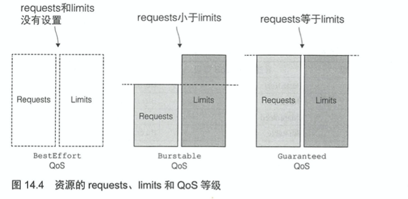

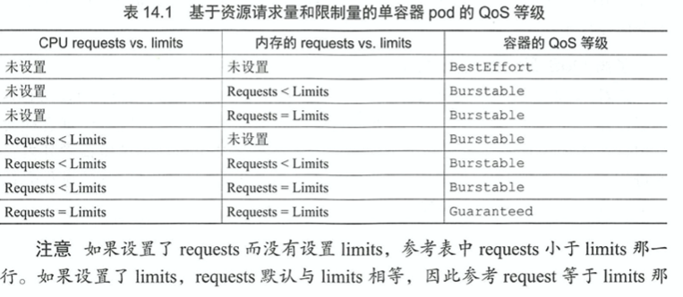

#### 14.3.2 内存不足时哪个进程会被杀死

BestEffort 等级的 pod 会首先被杀掉。其次是 Burstable 等级，最后是 Guaranteed 等级。而 Guaranteed 的 pod 只有在系统进程需要内存时才会被杀掉。

##### 如何处理相同 QoS 等级的容器

每个运行中的进程都有一个称为 OOM（OutOfMemory）分数的值。由两个参数计算得出：

- 进程已消耗内存占用内存的百分比
- 基于 pod QoS 等级和容器内存申请量固定的 OOM 分数调节因子

对于两个同等级的单容器 pod，系统会杀掉该 OOM 分数更高的 pod。

举个例子，一个 pod 中的 A 容器申请了 1M 的内存使用了 900KB，相当于占用了 90% 的申请量。而 B 容器申请了 2M 的内存使用了 1M 内存，相当于占用了 50% 的申请量。则当 K8S 需要杀进程来释放内存时，会优先删除 A 容器中的进程。尽管后者比前者使用了更多兆字节的内存。

### 14.4 为命名空间中的 pod 设置默认的 requests 和 limits

为每个容器都设置 requests 和 limits 很有必要，可是挨个设置未免显得太麻烦。通过 LimitRange 资源，可以为命名空间中的 pod 中的容器设置 requests 和 limit 默认值。

#### 14.4.1 LimitRange 资源简介

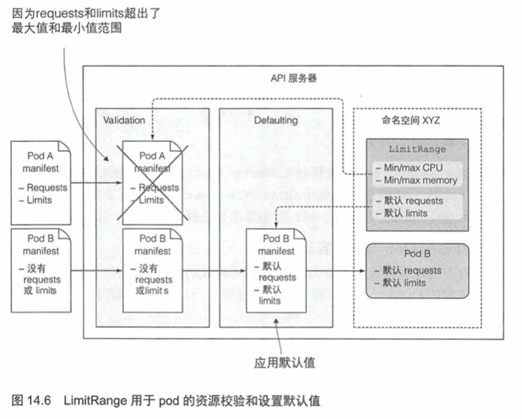

API 服务器接收到带有 pod 描述信息的 POST 请求时，K8S 中的 LimitRanger 插件会对 pod spec 进行校验，如果校验失败，将会直接拒绝。

因此 LimitRange 对象的一个广泛应用场景就是阻止用户创建大于单个节点资源量的 pod。

LimitRange 需要集群额外开启插件来运行。

#### 14.4.2 LimitRange 对象的创建

LimitRange 资源中的 limits 应用于同一个命名空间中每个独立的 pod、容器，或者其他类型的对象。但并不会限制这个命名空间中所有 pod 可用资源的总量。总量是在 ResourceQuota 对象中指定的（在 14.5 节中进行说明）。

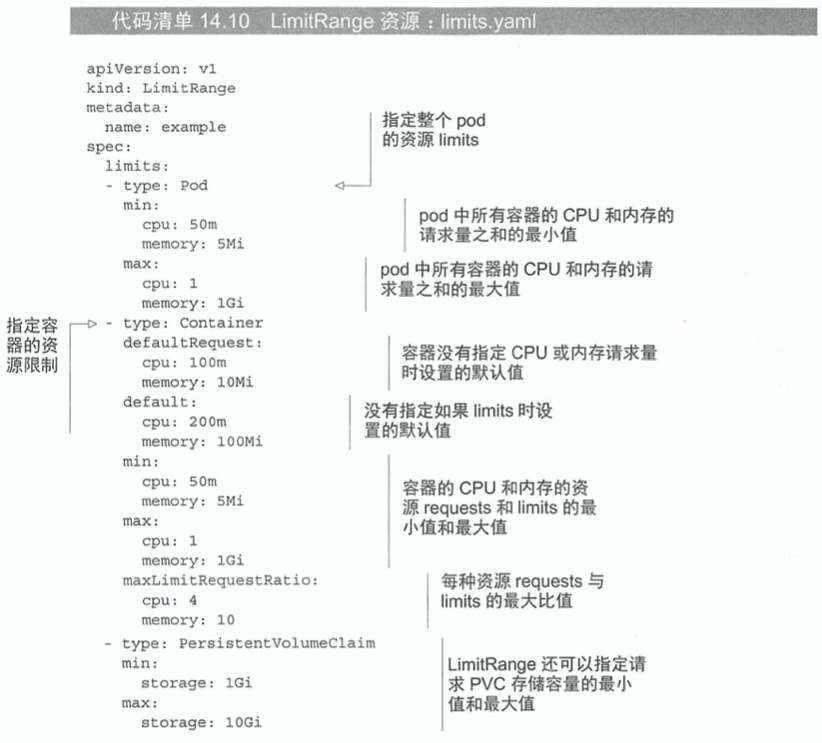

上面是一个 limitRange 的完整定义，整个 pod 资源限制的最小值和最大值是可以配置的。它应用于 pod 内所有容器的 requests 和 limits 之和。

此外，正如 CPU 和内存一样，也可以为 pod 的持久化存储大小进行限制。如果一个命名空间中有多个不同种类的 LimitRange（比如一个用于容器限制，另一个用于 PVC 限制），那么他们会在校验 pod 或 PVC 合法性时自动进行合并。

#### 14.4.3 强制进行限制

当我们尝试创建一个 CPU 申请量大于 LimitRange 的 pod 时，比如说 LimitRange 最多允许 2 核，而在 pod 的 yaml 大于这个值，那么使用`create`命令创建的时候就会报错。

#### 14.4.4 应用资源 requests 和 limits 的默认值

而像上面所说，如果在一个拥有 LimitRange 资源的命名空间中不特殊指定每个 pod 的 request 和 limit，那么他们的默认值就会是这个 LimitRange 所设定的默认值。

这样做的好处是不需要特殊更改 pod 的 manifest，就能在不同的命名空间中为其分配不同的限制，让其专注于容器本身，动态配置不同的资源限制。

### 14.5 限制命名空间中的可用资源总量

但要注意的是，LimitRange 只应用于单独的 pod，只设置了 LimitRange 的情况下，用户依然可能因为创建了大量的 pod 而吃掉了集群的所有可用资源。为了解决这种方法，需要用到 ResourceQuota 资源，用于限制命名空间中的可用资源总量。

ResourceQuota 资源同样也需要集群开启额外的控制插件。

#### 14.5.1 ResourceQuota 资源介绍

ResourceQuota 插件和 LimitRange 类似，都会在创建 pod 时进行检查。若该 pod 是会引起总资源量超出限制的情况，该创建请求就会被拒绝。因为只会在创建时进行检查，所以 ResourceQuota 不会影响已经存在的 pod，只会对其后创建的 pod 产生影响。

##### 为 CPU 和内存创建 ResourceQuota

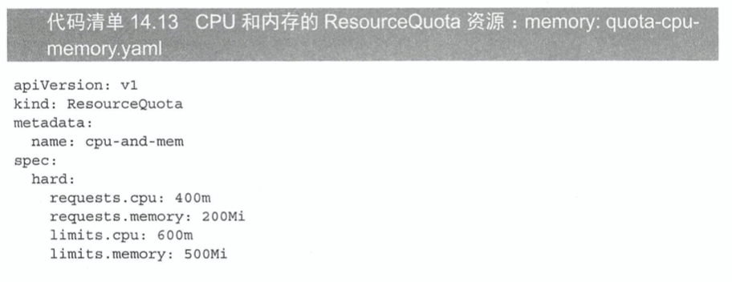

上面分别定义了 CPU 和内存的 requests 和 limits 总量，**而不是简单地为每种资源只定义一个总量**。

该 ReourceQuota 设置了命名空间中所有 pod 最多可申请的 CPU 数量为 400 毫核，limits 最大总量为 600 毫核。对于内存，设置所有 requests 最大总量为 200MiB，limits 为 500MiB。

和 LimitRange 一样，可以执行`kubectl describe`来查看当前配额已经使用了多少。

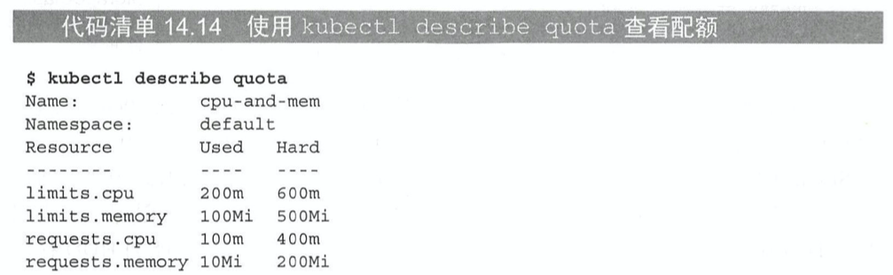

##### 与 ResourceQuota 同时创建 LimitRange

需要注意的是，创建 ResourceQuota 往往还需要随之创建一个 LimitRange。假设没有配置，没有指定 requests 和 limits 的 pod 将无法成功创建。

#### 14.5.2 为持久化存储指定配额

RQ 同样可以限制命名空间中最多可以声明的持久化存储总量。

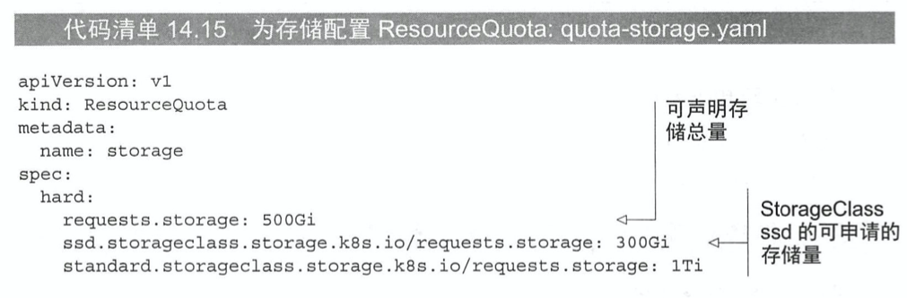

如上面所示的例子中可申请的 PVC 总量被限制为 500GiB（通过在 pod 中的 requests.storage 配置）。但是可以通过动态声明（StorageClass）的 SSD 存储总量为 300GiB，低性能的 HDD 存储限制为 1TB。

#### 14.5.3 限制可创建的个数

RQ 同样可以限制命名空间中的 pod、RC、Service 以及其他对象的个数。

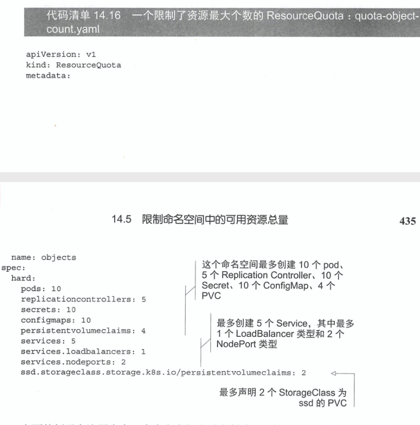

#### 14.5.4 为特定的 pod 状态或者 QoS 等级指定配额

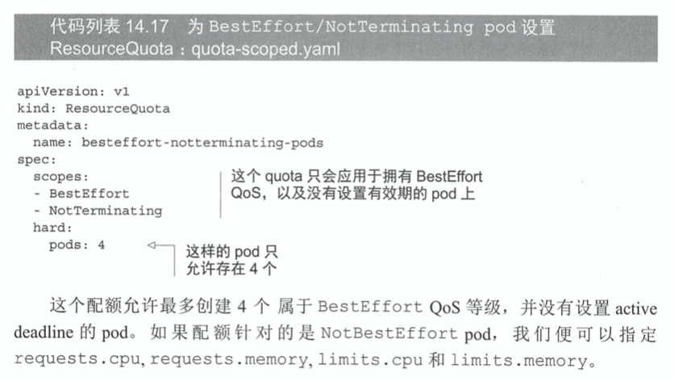

### 14.6 监控 pod 的资源使用量

如果 requests 设置得太高，集群节点利用率就会比较低。如果设置得太低，应用就会处于 CPU 饥饿状态，甚至很容易被 OOM Killer 杀死，那么如何找到 requests 和 limits 的最佳配置呢。

答案是通过对容器在期望负载下的资源实际使用率，然后找到这个最佳配置。而如果这个应用暴露在公网，就应该保持监控并且在需要的时候对资源的 requests 和 limits 进行调节。

#### 14.6.1 收集、获取实际资源使用情况

如何监控在 K8S 中运行的应用呢，Kubelet 自身就包含了一个名为 cAdvisor 的 agent，它会收集当前节点，和节点上运行的所有的资源消耗情况。集中统计整个集群的监控信息还需要运行一个叫作 Heapster 的附加组件。

Heapster 以 pod 的方式运行在某个节点上，通过普通的 Service 暴露服务，使外部可以通过一个稳定的 IP 地址访问。它会从集群中所有的 cAdvisor 收集数据并展示。

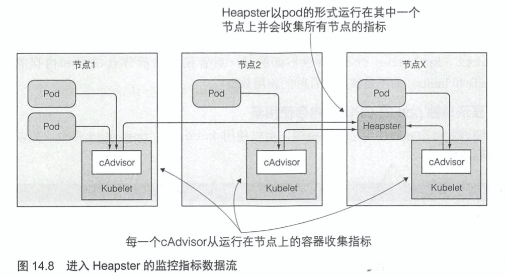

pod 和 pod 中的容器并不会感知到 cAdvisor 的存在，cAdvisor 也感知不到 Heapster 的存在。Heapster 会主动请求所有的 cAdvisor，而 cAdvisor 无须通过与 pod 容器内进程通信就可以收集到容器和节点的资源使用数据。

##### 启用 Heapster

> 本次阅读至P438 启用 Heapster 452