# KubernetesInAction学习笔记（14）

## 第14ç«  计算资æºç®¡ç†

在本章会学习如何为 pod é…置资æºé¢„期的 CPU 和内存使用é‡ï¼Œä»¥ç¡®ä¿ pod å¯ä»¥å…¬å¹³åœ°ä½¿ç”¨ K8S 集群资æºï¼ŒåŒæ—¶ä¹Ÿå½±å“整个集群 pod 的调度方å¼ã€‚

### 14.1 为 pod 中的容器申请资æº

使用`pod.spec.containers.resources.requests`字段å¯ä»¥ä¸ºå…¶æŒ‡å®š CPU 和内存的资æºè¯·æ±‚é‡ã€‚


上é¢æˆ‘们声æ˜äº†ä¸€ä¸ªå®¹å™¨éœ€è¦ 1/5 核（200 毫核）的 CPU æ‰èƒ½æ­£å¸¸è¿è¡Œã€‚æ¢å¥è¯è¯´ï¼Œäº”个åŒæ ·çš„ pod（或容器）å¯ä»¥è¶³å¤Ÿå¿«åœ°è¿è¡Œåœ¨ä¸€ä¸ª CPU 核上。

此外还为容器申请了 10MB 的内存，说æ˜æœŸæœ›å®¹å™¨å†…的进程最大消耗 10MB çš„ RAM。

#### 14.1.2 èµ„æº requests 如何影å“调度

é€šè¿‡è®¾ç½®èµ„æº requests 我们指定了 pod 对资æºéœ€æ±‚的最å°å€¼ï¼Œè°ƒåº¦å™¨ä¼šåœ¨è°ƒåº¦çš„过程中用到该信æ¯ï¼Œåªè€ƒè™‘那些未分é…资æºé‡æ»¡è¶³ pod 需求é‡çš„节点。如æœèŠ‚点的未分é…资æºé‡å°äº pod 需求é‡ï¼ŒK8S å°±ä¸ä¼šå°†è¯¥ pod 调度到这个节点。

##### 调度器如何判断一个 pod 是å¦é€‚åˆè°ƒåº¦åˆ°æŸä¸ªèŠ‚点

比较æ„外的是，调度器在调度的时候**并ä¸ä¼šå…³æ³¨å„类资æºåœ¨å½“å‰æ—¶åˆ»çš„å®é™…使用é‡**，而åªä¼šå…³å¿ƒ**节点上部署的所有 pod 资æºç”³è¯·é‡ä¹‹å’Œ**。

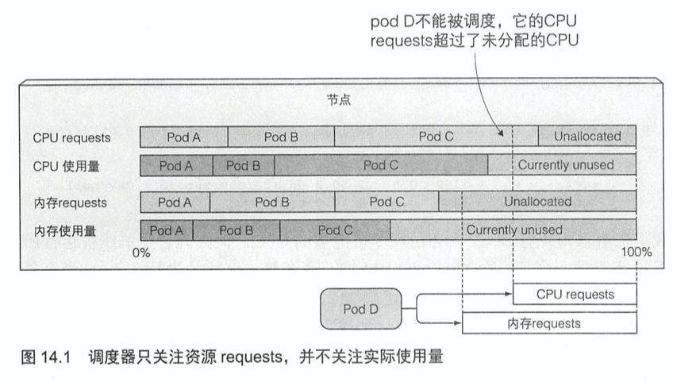

##### 调度器如何利用 pod requests 为其选择最佳节点

在调度时调度器会先æ’除那些ä¸æ»¡è¶³éœ€æ±‚的节点，然å使用优先级函数对其余节点进行æ’åºï¼Œåœ¨ K8S 中有两ç§åŸºäºèµ„æºè¯·æ±‚é‡çš„优先级æ’åºï¼š

- LeastRequestedPriority：优先将 pod 调度到请求é‡å°‘的节点上
- MostRequestedPriority：优先将 pod 调度到请求é‡å¤šçš„节点上

使用 LeastRequestedPriority å¯ä»¥ç†è§£ï¼Œä½†æ˜¯ MostRequestedPriority 会在什么时候使用。答案是当使用第三方的云æœåŠ¡æ—¶ï¼Œéœ€è¦ä¸ºæ¯ä¸ª pod æä¾›è¶³é‡ CPU/内存资æºçš„åŒæ—¶ï¼Œç¡®ä¿ K8S 使用尽å¯èƒ½å°‘的节点（节çœå¼€é”€ï½ï¼‰ã€‚

##### 查看节点资æºæ€»é‡

使用 describe 命令å¯ä»¥æŸ¥çœ‹èŠ‚点的资æºã€‚


#### 14.1.3 CPU requests å¦‚ä½•å½±å“ CPU 时间分é…

CPU requests ä¸ä»…仅在调度时起作用，它还决定ç€å‰©ä½™çš„ CPU 时间如何在 pod 之间分é…。如æœè¯´ä¸€ä¸ª pod 请求了 200 毫核，å¦ä¸€ä¸ªè¯·æ±‚了 1000 毫核。那么未使用的 CPU 将按照 1:5 的比例æ¥åˆ†ç»™è¿™ä¸¤ä¸ª pod。

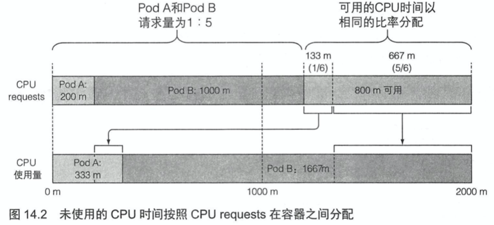

#### 14.1.4 定义和申请自定义资æº

K8S å…许用户添加å±äºè‡ªå·±çš„自定义资æºï¼Œå¹¶åœ¨ spec çš„ resource.requests 字段下æ¥æŒ‡å®šåˆ›å»º pod 的申请é‡ã€‚

### 14.2 é™åˆ¶å®¹å™¨çš„å¯ç”¨èµ„æº

requests å’Œ limits é™åˆ¶æ˜¯ä¸ä¸€æ ·çš„，requests é™¤äº†ä¼šå£°æ˜ pod 使用的硬件资æºå¤–，并ä¸ä¼šç¡¬æ€§é™åˆ¶ pod 的最大使用é‡ï¼Œä¹Ÿå°±æ˜¯è¯´ï¼Œå½“节点的 CPU 和内存有空余的时候，会å…许 pod 对它们进行主动的å ç”¨ã€‚

如æœè¦é™åˆ¶å®¹å™¨å¯ä»¥æ¶ˆè€—资æºçš„最大é‡ï¼Œå°±å¿…é¡»è¦ä½¿ç”¨ limits 字段。

#### 14.2.1 设置容器å¯ä½¿ç”¨èµ„æºé‡çš„硬é™åˆ¶

内存是一ç§ä¸å¯å‹ç¼©èµ„æºï¼Œåœ¨è¢«å ç”¨çš„进程主动释放之å‰éƒ½æ— æ³•è¢«å›æ”¶ï¼Œå¦‚æœä¸å¯¹å†…存进行é™åˆ¶ï¼Œå·¥ä½œèŠ‚点上的容器（或者 pod）å¯èƒ½ä¼šåƒæ‰æ‰€æœ‰çš„å¯ç”¨å†…存甚至导致整个节点ä¸å¯ç”¨ï¼Œæ‰€ä»¥åŠ¿å¿…需è¦é™åˆ¶å®¹å™¨çš„最大内存分é…é‡ã€‚

##### åˆ›å»ºä¸€ä¸ªå¸¦æœ‰èµ„æº limits çš„ pod

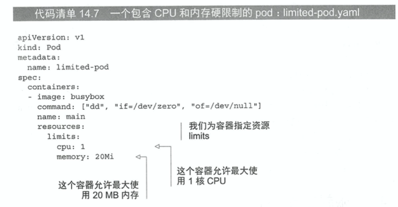

上é¢çš„ manifest 规定了容器内的进程ä¸å…许消耗超过 1 æ ¸ CPU å’Œ 20MB 内存。

> PS：如æœæ²¡æœ‰æŒ‡å®šèµ„æº requestsï¼Œå®ƒå°†è¢«è®¾ç½®ä¸ºèµ„æº limits 相åŒçš„值

##### å¯è¶…å–çš„ limits

ä¸ requests ä¸åŒçš„是，limits ä¸å—节点å¯åˆ†é…资æºé‡çš„约æŸï¼Œæ‰€æœ‰ limits 的总和å…许超过节点资æºæ€»é‡çš„ 100%。但如æœèŠ‚点资æºä½¿ç”¨é‡è¶…过了 100%，就会有一些容器被æ€æ‰ã€‚


#### 14.2.2 超过 limits

因为 CPU 是å¯å‹ç¼©èµ„æºï¼Œå½“进程ä¸ç­‰å¾… IO æ“作时消耗所有的 CPU 时间是é常常è§çš„，因此当为一个容器设置 CPU é™é¢æ—¶ï¼Œè¯¥è¿›ç¨‹åªä¼šåˆ†ä¸åˆ°æ¯”é™é¢æ›´å¤šçš„ CPU 而已。

但内存å´æœ‰æ‰€ä¸åŒï¼Œå½“进程å°è¯•ç”³è¯·åˆ†é…比é™é¢æ›´å¤šçš„内存时会被æ€æ‰ã€‚å¦‚æœ pod çš„é‡å¯ç­–略为 Always 或 OnFailure，进程将会立å³é‡å¯ï¼Œå¦‚æœå®ƒç»§ç»­è¶…é™å¹¶è¢«æ€æ­»ï¼Œpod å°†ä¼šå¤„äº CrashLoopBackOff 的状æ€ã€‚

CrashLoopBackOff 状æ€è¡¨ç¤º Kubelet 还没有放弃，它代表**在æ¯æ¬¡å´©æºƒä¹‹å，Kubelet 就会å¢åŠ ä¸‹æ¬¡é‡å¯ä¹‹é—´çš„间隔时间**。éšç€ä¸æ–­å´©æºƒï¼Œå»¶è¿Ÿæ—¶é—´ä¼šæŒ‰ç…§ 0ã€10ã€20ã€80ã€160 秒这样å­å¢é•¿ï¼Œå¹¶æœ€ç»ˆæ”¶æ•›åœ¨ 300s。最å Kubelet 将以 300s 为间隔时间对容器进行无é™é‡å¯ï¼Œç›´åˆ°å®¹å™¨æ­£å¸¸è¿è¡Œæˆ–被删除。

使用 describe 命令å¯ä»¥å®šä½å®¹å™¨å´©æºƒçš„åŸå› ã€‚

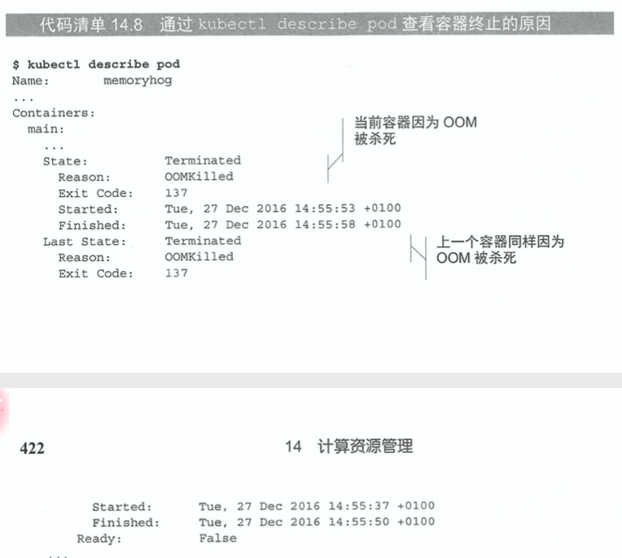

当 OOMKilled 状æ€å‘Šè¯‰æˆ‘们容器正å¼å› ä¸ºå†…å­˜ä¸è¶³è€Œè¢«ç³»ç»Ÿæ€æ‰ã€‚

#### 14.2.3 容器中的应用如何看待 limits

å³ä½¿ä½ ä¸ºå®¹å™¨è®¾ç½®äº†æœ€å¤§å¯ç”¨å†…存的é™é¢ï¼Œä½†åœ¨å®¹å™¨å†…部看到的始终都会是节点的内存而ä¸æ˜¯å®¹å™¨æœ¬èº«çš„内存。且在容器内åŒæ ·å¯ä»¥çœ‹åˆ°èŠ‚点所有的 CPU 核。这一点对äºä¸€äº›ä¾èµ–äºæœ¬æœºå†…å­˜é™é¢æ¥æ‰§è¡Œç¨‹åºçš„语言æ¥è¯´é常致命，比如说ä¾èµ– JVM æ¥æ‰§è¡Œåº”用的ä½ç‰ˆæœ¬ JAVA，就会由äºæ— æ³•è¯†åˆ«åˆ°å†…å­˜é™é¢è€Œç”³è¯·è¶…出é™é¢çš„内存，然å被 OOM æ€æ­»ã€‚

这也æ醒了开å‘者，ä¸è¦ä¾èµ–应用程åºä»ç³»ç»Ÿä¸­è·å–硬件资æºçš„具体情况，开å‘者å¯ä»¥ä½¿ç”¨ Downward API å°† CPU é™é¢ä¼ é€’至容器并使用这个值，也å¯ä»¥é€šè¿‡ cgroup 系统直æ¥è·å–é…置的 CPU é™åˆ¶ï¼Œåœ¨å®¹å™¨å†…查看下列文件：

- /sys/fs/cgroup/cpu/cpu.cfs_quota_us
- /sys/fs/cgroup/cpu/cpu.cfs_period_us

### 14.3 了解 pod QoS 等级

å‡è®¾ç°åœ¨æœ‰ä¸¤ä¸ª pod，pod A 使用了节点内存的 90%，pod B çªç„¶éœ€è¦æ¯”之å‰æ›´å¤šçš„内存，这时的节点无法æ供足é‡å†…存，那么哪个容器会被æ€æ‰å‘¢ï¼Ÿ

K8S 通过一ç§å为 Qos çš„ç­‰çº§åˆ¶åº¦åˆ¶å®šå“ªç§ pod 在该场景中优先级更高，K8S å°† pod åˆ’åˆ†ä¸ºä¸‰ç§ QoS 等级：

- BestEffort（优先级最ä½ï¼‰
- Burstable
- Guaranteed（优先级最高）

#### 14.3.1 定义 pod 的 QoS 等级

QoS 等级并ä¸æ¥è‡ªäºä¸€ä¸ªç‰¹å®šçš„独立字段，而是通过 requests å’Œ limits çš„é…ç½®æ¥å†³å®šã€‚

##### 为 pod åˆ†é… BestEffort 等级

这是最ä½ä¼˜å…ˆçº§çš„ QoS，会分é…给那些**没有设置任何 requests å’Œ limits çš„ pod**。å‰é¢ç« èŠ‚创建的 pod 都是这个等级，该登记è¿è¡Œçš„容器没有任何资æºä¿è¯ï¼Œåœ¨éœ€è¦ä¸ºå…¶ä»– pod 释放内存时它们会被第一批æ€æ­»ã€‚ä¸è¿‡ä¹Ÿæ­£å› ä¸ºå¦‚此，当有充足的å¯ç”¨å†…存时，这些容器å¯ä»¥ä½¿ç”¨ä»»æ„多的内存。

##### 为 pod åˆ†é… Guaranteed 等级

这是最高优先级的 QoS，会分é…给那些**æ‰€æœ‰èµ„æº request å’Œ limits 相等的 pod**，è¦æ³¨æ„的是，æ¯ä¸ªå®¹å™¨éƒ½éœ€è¦è®¾ç½®èµ„æºé‡ï¼Œä¹Ÿå°±æ˜¯**æ¯ä¸ªå®¹å™¨çš„æ¯ç§èµ„æºçš„ requests å’Œ limits 都必须相等**。这些 pod 的容器å¯ä»¥ä½¿ç”¨å®ƒæ‰€ç”³è¯·çš„ç­‰é¢èµ„æºï¼Œä½†æ˜¯æ— æ³•æ¶ˆè€—更多的资æºã€‚

##### 为 pod åˆ†é… Burstable 等级

除了以上两ç§æ„外，其他所有的 pod 都å±äºè¿™ä¸ªç™»è®°ï¼ŒåŒ…括：

- 容器的 requests å’Œ limits ä¸ç›¸åŒçš„å•å®¹å™¨ pod
- 至少有一个容器åªå®šä¹‰äº† requests 但没有定义 limits çš„pod
- 一个容器的 requests å’Œ limits，但å¦ä¸€ä¸ªå®¹å™¨ä¸æŒ‡å®š requests 或 limits çš„ pod。

Burstable pod å¯ä»¥è·å¾—它们所申请的等é¢èµ„æºï¼Œå¹¶å¯ä»¥ä½¿ç”¨é¢å¤–的资æºï¼ˆä¸è¶…过 limits）

##### requests 和 limits 之间的关系如何定义 QoS 等级


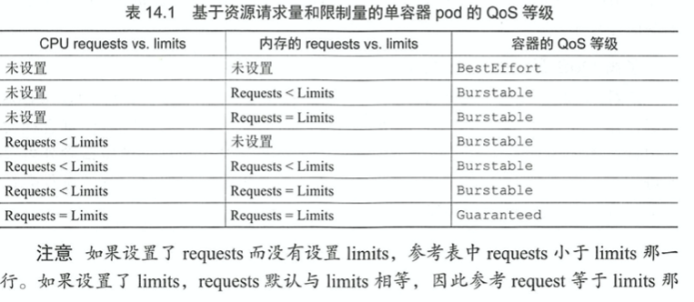

#### 14.3.2 内存ä¸è¶³æ—¶å“ªä¸ªè¿›ç¨‹ä¼šè¢«æ€æ­»

BestEffort 等级的 pod 会首先被æ€æ‰ã€‚其次是 Burstable 等级，最å是 Guaranteed 等级。而 Guaranteed çš„ pod åªæœ‰åœ¨ç³»ç»Ÿè¿›ç¨‹éœ€è¦å†…存时æ‰ä¼šè¢«æ€æ‰ã€‚

##### 如何处ç†ç›¸åŒ QoS 等级的容器

æ¯ä¸ªè¿è¡Œä¸­çš„进程都有一个称为 OOM（OutOfMemory）分数的值。由两个å‚数计算得出：

- 进程已消耗内存å ç”¨å†…存的百分比
- åŸºäº pod QoS 等级和容器内存申请é‡å›ºå®šçš„ OOM 分数调节因å­

对äºä¸¤ä¸ªåŒç­‰çº§çš„å•å®¹å™¨ pod，系统会æ€æ‰è¯¥ OOM 分数更高的 pod。

举个例å­ï¼Œä¸€ä¸ª pod 中的 A 容器申请了 1M 的内存使用了 900KB，相当äºå ç”¨äº† 90% 的申请é‡ã€‚而 B 容器申请了 2M 的内存使用了 1M 内存，相当äºå ç”¨äº† 50% 的申请é‡ã€‚则当 K8S 需è¦æ€è¿›ç¨‹æ¥é‡Šæ”¾å†…存时，会优先删除 A 容器中的进程。尽管å者比å‰è€…使用了更多兆字节的内存。

### 14.4 为命å空间中的 pod 设置默认的 requests å’Œ limits

为æ¯ä¸ªå®¹å™¨éƒ½è®¾ç½® requests å’Œ limits 很有必è¦ï¼Œå¯æ˜¯æŒ¨ä¸ªè®¾ç½®æœªå…显得太麻烦。通过 LimitRange 资æºï¼Œå¯ä»¥ä¸ºå‘½å空间中的 pod 中的容器设置 requests å’Œ limit 默认值。

#### 14.4.1 LimitRange 资æºç®€ä»‹

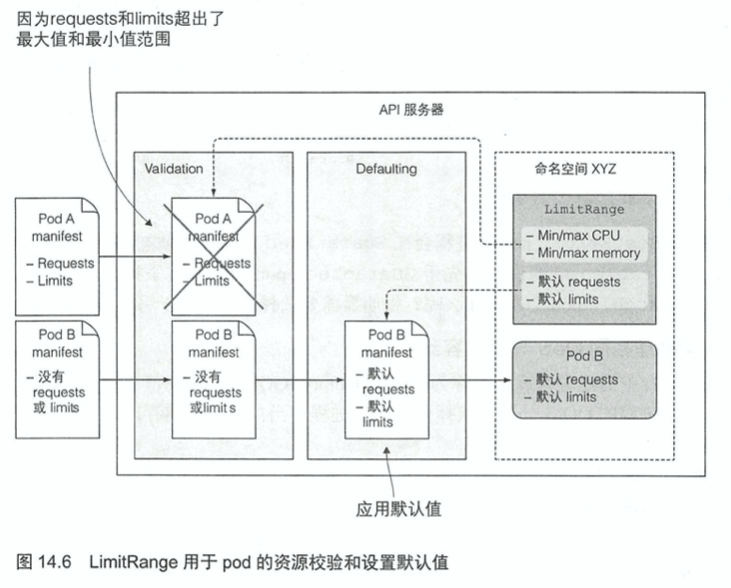

API æœåŠ¡å™¨æ¥æ”¶åˆ°å¸¦æœ‰ pod æè¿°ä¿¡æ¯çš„ POST 请求时，K8S 中的 LimitRanger æ’件会对 pod spec 进行校验，如æœæ ¡éªŒå¤±è´¥ï¼Œå°†ä¼šç›´æ¥æ‹’ç»ã€‚

å› æ­¤ LimitRange 对象的一个广泛应用场景就是阻止用户创建大äºå•ä¸ªèŠ‚点资æºé‡çš„ pod。

LimitRange 需è¦é›†ç¾¤é¢å¤–å¼€å¯æ’件æ¥è¿è¡Œã€‚

#### 14.4.2 LimitRange 对象的创建

LimitRange 资æºä¸­çš„ limits 应用äºåŒä¸€ä¸ªå‘½å空间中æ¯ä¸ªç‹¬ç«‹çš„ podã€å®¹å™¨ï¼Œæˆ–者其他类å‹çš„对象。但并ä¸ä¼šé™åˆ¶è¿™ä¸ªå‘½å空间中所有 pod å¯ç”¨èµ„æºçš„总é‡ã€‚总é‡æ˜¯åœ¨ ResourceQuota 对象中指定的（在 14.5 节中进行说æ˜ï¼‰ã€‚

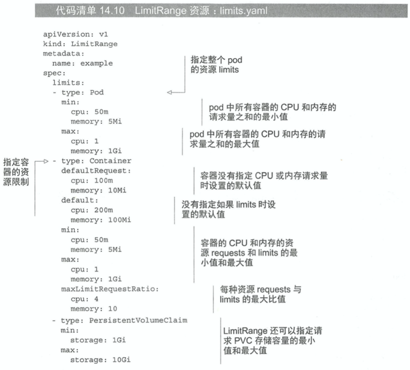

上é¢æ˜¯ä¸€ä¸ª limitRange 的完整定义，整个 pod 资æºé™åˆ¶çš„最å°å€¼å’Œæœ€å¤§å€¼æ˜¯å¯ä»¥é…ç½®çš„ã€‚å®ƒåº”ç”¨äº pod 内所有容器的 requests å’Œ limits 之和。

此外，正如 CPU 和内存一样，也å¯ä»¥ä¸º pod çš„æŒä¹…化存储大å°è¿›è¡Œé™åˆ¶ã€‚如æœä¸€ä¸ªå‘½å空间中有多个ä¸åŒç§ç±»çš„ LimitRange（比如一个用äºå®¹å™¨é™åˆ¶ï¼Œå¦ä¸€ä¸ªç”¨äº PVC é™åˆ¶ï¼‰ï¼Œé‚£ä¹ˆä»–们会在校验 pod 或 PVC åˆæ³•æ€§æ—¶è‡ªåŠ¨è¿›è¡Œåˆå¹¶ã€‚

#### 14.4.3 强制进行é™åˆ¶

当我们å°è¯•åˆ›å»ºä¸€ä¸ª CPU 申请é‡å¤§äº LimitRange çš„ pod 时，比如说 LimitRange 最多å…许 2 核，而在 pod çš„ yaml 大äºè¿™ä¸ªå€¼ï¼Œé‚£ä¹ˆä½¿ç”¨`create`命令创建的时候就会报错。

#### 14.4.4 åº”ç”¨èµ„æº requests å’Œ limits 的默认值

而åƒä¸Šé¢æ‰€è¯´ï¼Œå¦‚æœåœ¨ä¸€ä¸ªæ‹¥æœ‰ LimitRange 资æºçš„命å空间中ä¸ç‰¹æ®ŠæŒ‡å®šæ¯ä¸ª pod çš„ request å’Œ limit，那么他们的默认值就会是这个 LimitRange 所设定的默认值。

这样åšçš„好处是ä¸éœ€è¦ç‰¹æ®Šæ›´æ”¹ pod çš„ manifest，就能在ä¸åŒçš„命å空间中为其分é…ä¸åŒçš„é™åˆ¶ï¼Œè®©å…¶ä¸“注äºå®¹å™¨æœ¬èº«ï¼ŒåŠ¨æ€é…ç½®ä¸åŒçš„资æºé™åˆ¶ã€‚

### 14.5 é™åˆ¶å‘½å空间中的å¯ç”¨èµ„æºæ€»é‡

但è¦æ³¨æ„的是，LimitRange åªåº”用äºå•ç‹¬çš„ pod，åªè®¾ç½®äº† LimitRange 的情况下，用户ä¾ç„¶å¯èƒ½å› ä¸ºåˆ›å»ºäº†å¤§é‡çš„ pod 而åƒæ‰äº†é›†ç¾¤çš„所有å¯ç”¨èµ„æºã€‚为了解决这ç§æ–¹æ³•ï¼Œéœ€è¦ç”¨åˆ° ResourceQuota 资æºï¼Œç”¨äºé™åˆ¶å‘½å空间中的å¯ç”¨èµ„æºæ€»é‡ã€‚

ResourceQuota 资æºåŒæ ·ä¹Ÿéœ€è¦é›†ç¾¤å¼€å¯é¢å¤–çš„æ§åˆ¶æ’件。

#### 14.5.1 ResourceQuota 资æºä»‹ç»

ResourceQuota æ’件和 LimitRange 类似，都会在创建 pod 时进行检查。若该 pod 是会引起总资æºé‡è¶…出é™åˆ¶çš„情况，该创建请求就会被拒ç»ã€‚因为åªä¼šåœ¨åˆ›å»ºæ—¶è¿›è¡Œæ£€æŸ¥ï¼Œæ‰€ä»¥ ResourceQuota ä¸ä¼šå½±å“å·²ç»å­˜åœ¨çš„ pod，åªä¼šå¯¹å…¶å创建的 pod 产生影å“。

##### 为 CPU 和内存创建 ResourceQuota

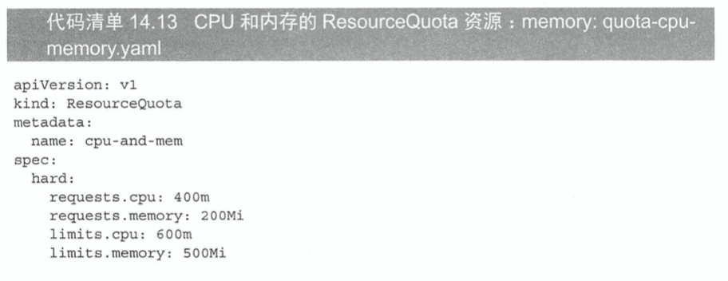

上é¢åˆ†åˆ«å®šä¹‰äº† CPU 和内存的 requests å’Œ limits 总é‡ï¼Œ**而ä¸æ˜¯ç®€å•åœ°ä¸ºæ¯ç§èµ„æºåªå®šä¹‰ä¸€ä¸ªæ€»é‡**。

该 ReourceQuota 设置了命å空间中所有 pod 最多å¯ç”³è¯·çš„ CPU æ•°é‡ä¸º 400 毫核，limits 最大总é‡ä¸º 600 毫核。对äºå†…存，设置所有 requests 最大总é‡ä¸º 200MiB，limits 为 500MiB。

å’Œ LimitRange 一样，å¯ä»¥æ‰§è¡Œ`kubectl describe`æ¥æŸ¥çœ‹å½“å‰é…é¢å·²ç»ä½¿ç”¨äº†å¤šå°‘。

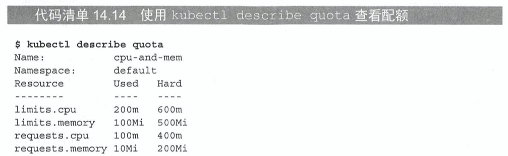

##### ä¸ ResourceQuota åŒæ—¶åˆ›å»º LimitRange

需è¦æ³¨æ„的是，创建 ResourceQuota 往往还需è¦éšä¹‹åˆ›å»ºä¸€ä¸ª LimitRange。å‡è®¾æ²¡æœ‰é…置，没有指定 requests å’Œ limits çš„ pod 将无法æˆåŠŸåˆ›å»ºã€‚

#### 14.5.2 为æŒä¹…化存储指定é…é¢

RQ åŒæ ·å¯ä»¥é™åˆ¶å‘½å空间中最多å¯ä»¥å£°æ˜çš„æŒä¹…化存储总é‡ã€‚

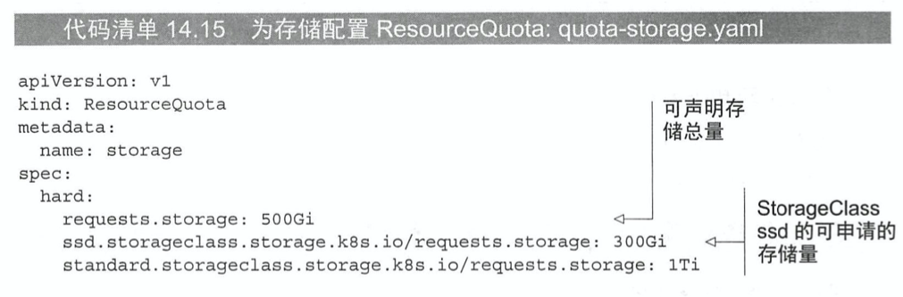

如上é¢æ‰€ç¤ºçš„例å­ä¸­å¯ç”³è¯·çš„ PVC 总é‡è¢«é™åˆ¶ä¸º 500GiB（通过在 pod 中的 requests.storage é…置）。但是å¯ä»¥é€šè¿‡åŠ¨æ€å£°æ˜ï¼ˆStorageClass）的 SSD 存储总é‡ä¸º 300GiB，ä½æ€§èƒ½çš„ HDD 存储é™åˆ¶ä¸º 1TB。

#### 14.5.3 é™åˆ¶å¯åˆ›å»ºçš„个数

RQ åŒæ ·å¯ä»¥é™åˆ¶å‘½å空间中的 podã€RCã€Service 以åŠå…¶ä»–对象的个数。

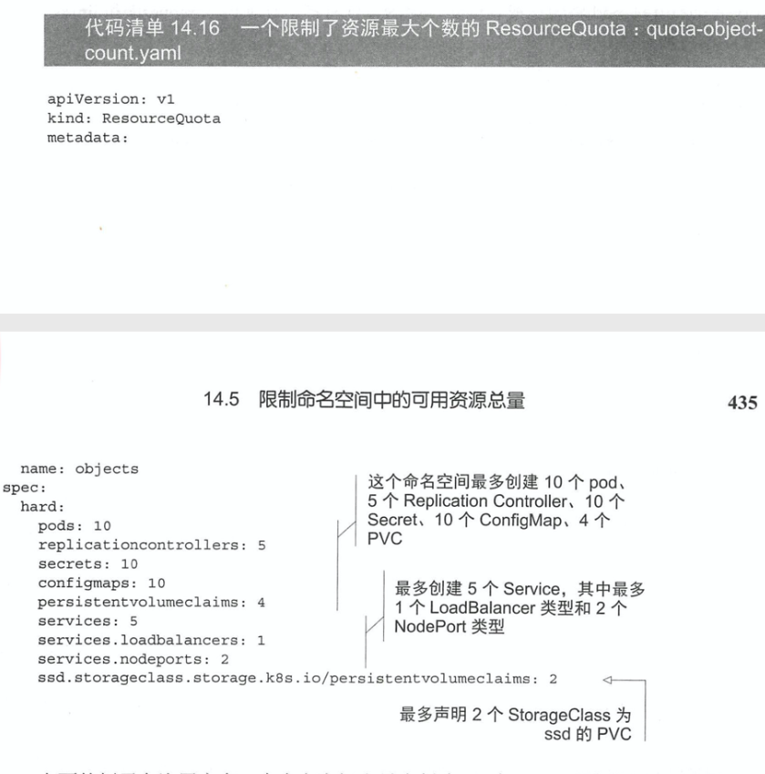

#### 14.5.4 为特定的 pod 状æ€æˆ–者 QoS 等级指定é…é¢

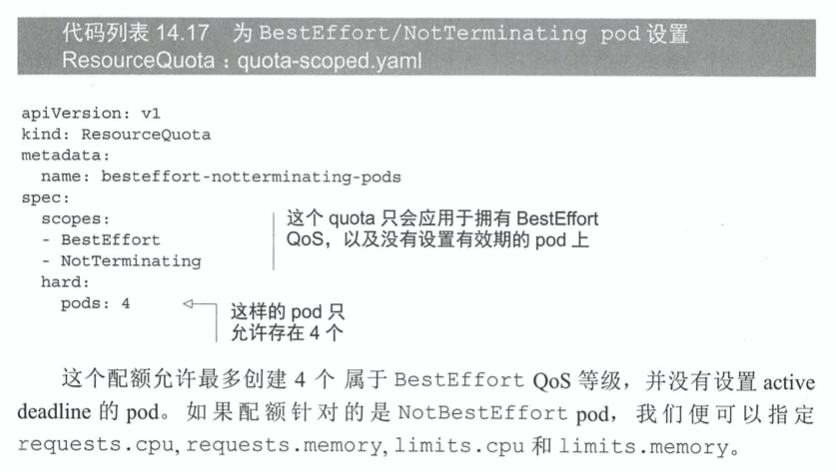

### 14.6 ç›‘æ§ pod 的资æºä½¿ç”¨é‡

å¦‚æœ requests 设置得太高，集群节点利用ç‡å°±ä¼šæ¯”较ä½ã€‚如æœè®¾ç½®å¾—太ä½ï¼Œåº”ç”¨å°±ä¼šå¤„äº CPU 饥饿状æ€ï¼Œç”šè‡³å¾ˆå®¹æ˜“被 OOM Killer æ€æ­»ï¼Œé‚£ä¹ˆå¦‚何找到 requests å’Œ limits 的最佳é…置呢。

答案是通过对容器在期望负载下的资æºå®é™…使用ç‡ï¼Œç„¶å找到这个最佳é…置。而如æœè¿™ä¸ªåº”用暴露在公网，就应该ä¿æŒç›‘æ§å¹¶ä¸”在需è¦çš„时候对资æºçš„ requests å’Œ limits 进行调节。

#### 14.6.1 收集ã€è·å–å®é™…资æºä½¿ç”¨æƒ…况

如何监æ§åœ¨ K8S 中è¿è¡Œçš„应用呢，Kubelet 自身就包å«äº†ä¸€ä¸ªå为 cAdvisor çš„ agent，它会收集当å‰èŠ‚点，和节点上è¿è¡Œçš„所有的资æºæ¶ˆè€—情况。集中统计整个集群的监æ§ä¿¡æ¯è¿˜éœ€è¦è¿è¡Œä¸€ä¸ªå«ä½œ Heapster 的附加组件。

Heapster 以 pod çš„æ–¹å¼è¿è¡Œåœ¨æŸä¸ªèŠ‚点上，通过普通的 Service 暴露æœåŠ¡ï¼Œä½¿å¤–部å¯ä»¥é€šè¿‡ä¸€ä¸ªç¨³å®šçš„ IP 地å€è®¿é—®ã€‚它会ä»é›†ç¾¤ä¸­æ‰€æœ‰çš„ cAdvisor 收集数æ®å¹¶å±•ç¤ºã€‚


pod å’Œ pod 中的容器并ä¸ä¼šæ„ŸçŸ¥åˆ° cAdvisor 的存在，cAdvisor 也感知ä¸åˆ° Heapster 的存在。Heapster 会主动请求所有的 cAdvisor，而 cAdvisor æ— é¡»é€šè¿‡ä¸ pod 容器内进程通信就å¯ä»¥æ”¶é›†åˆ°å®¹å™¨å’ŒèŠ‚点的资æºä½¿ç”¨æ•°æ®ã€‚

##### å¯ç”¨ Heapster

如æœé›†ç¾¤è¿è¡Œåœ¨è°·æ­Œäº‘å¹³å°ä¸Šï¼ŒHeapster 默认会å¯ç”¨ï¼Œå¦‚æœä½¿ç”¨çš„是 Minikube，则需è¦é€šè¿‡æ’件开å¯ã€‚

```shell
$ minikube addons enable heapster
⌛  enable metrics-server addon instead of heapster addon because heapster is deprecated
🌟  å¯åŠ¨ 'metrics-server' æ’件
```

##### 显示集群节点的 CPU 和内存使用é‡

使用`kubectl top`命令å¯ä»¥è·å¾—节点和å•ä¸ª pod 的资æºç”¨é‡ã€‚

```shell
# 显示节点上è¿è¡Œçš„所有 pod 当å‰çš„ CPU 和内存的å®é™…使用é‡
$ kubectl top node
NAME       CPU(cores)   CPU%   MEMORY(bytes)   MEMORY%
minikube   195m         9%     1726Mi          44%

# 显示所有命å空间中 pod 的用é‡
$ kubectl top pod --all-namespaces
NAMESPACE              NAME                                        CPU(cores)   MEMORY(bytes)
kube-system            coredns-6c76c8bb89-qqjql                    3m           8Mi
kube-system            etcd-minikube                               16m          35Mi
kube-system            ingress-nginx-controller-789d9c4dc-r6v8r    1m           64Mi
kube-system            kube-apiserver-minikube                     51m          270Mi
kube-system            kube-controller-manager-minikube            19m          40Mi
kube-system            kube-proxy-7xkk6                            0m           11Mi
kube-system            kube-scheduler-minikube                     2m           12Mi
kube-system            metrics-server-868987f44f-nclhx             0m           10Mi
kube-system            storage-provisioner                         1m           8Mi
kubernetes-dashboard   dashboard-metrics-scraper-c95fcf479-qv5m2   0m           4Mi
kubernetes-dashboard   kubernetes-dashboard-5c448bc4bf-j8lfg       0m           6Mi
```

PS：有时候执行会é‡åˆ°å¦‚下报错：

```shell
# 查看所有 pod 其中所有容器的资æºç”¨é‡
$ kubectl top pod --containers=true --all-namespaces
W0313 23:23:42.213496    5833 top_pod.go:274] Metrics not available for pod default/demo-statefulset-0, age: 523h26m44.213057s
error: Metrics not available for pod default/demo-statefulset-0, age: 523h26m44.213057s
```

è¿™ç§æƒ…况并ä¸ä»£è¡¨çœŸçš„出错，而是 Heapster 正在进行数æ®æ±‡æ€»ï¼Œæ— æ³•å°†ç»“æœç«‹åˆ»è¿”å›ã€‚è¿™ç§æƒ…况下åªè¦ç­‰å¾…一会儿å†é‡æ–°æ‰§è¡Œå‘½ä»¤ã€‚

#### 14.6.2 ä¿å­˜å¹¶åˆ†æå†å²èµ„æºçš„使用统计信æ¯

`top`命令仅仅åªå±•ç¤ºäº†å½“å‰çš„资æºä½¿ç”¨é‡ï¼Œä½†å¹¶ä¸ä¼šæ˜¾ç¤ºä»ä¸€å°æ—¶ã€ä¸€å¤©æˆ–者一周å‰åˆ°ç°åœ¨ pod çš„ CPU 和内存使用了多少。事å®ä¸Šæ— è®ºæ˜¯ cAdvisor 还是 Heapster 都åªä¼šä¿å­˜ä¸€ä¸ªå¾ˆçŸ­æ—¶é—´çª—的资æºä½¿ç”¨é‡æ•°æ®ã€‚一般æ¥è¯´äº‘å¹³å°æœåŠ¡æ供商都会æ供一些é¢å¤–工具æ¥å¯¹é›†ç¾¤è¿›è¡Œç›‘æ§ï¼ˆæ¯”如谷歌云平å°çš„ Google Cloud Monitoring），如æœæ˜¯æœ¬åœ°çš„ K8S 集群，人们往往会使用 InfluxDB æ¥å­˜å‚¨æ•°æ®ï¼Œç„¶å使用 Grafana 对数æ®è¿›è¡Œå¯è§†åŒ–和分æ。

##### InfluxDB 和 Grafana

InfluxDB 是一个用äºå­˜å‚¨åº”用指标以åŠå…¶ä»–监æ§æ•°æ®çš„å¼€æºçš„时许数æ®åº“，Grafana åˆ™æ˜¯ä¸€ä¸ªåŸºäº web çš„æ•°æ®åˆ†æå’Œå¯è§†åŒ–套件。这两者都是开æºçš„。

InfluxDB å’Œ Grafana 都å¯ä»¥ä»¥ pod è¿è¡Œï¼Œéƒ¨ç½²å分方便，部署文件å¯ä»¥é€šè¿‡ Heapster çš„ Git 仓库è·å–。而如æœä½¿ç”¨çš„是 Minikube，则甚至无需部署，在å¯ç”¨ Heapster 的时候就会éšä¹‹å¼€å¯äº†ã€‚

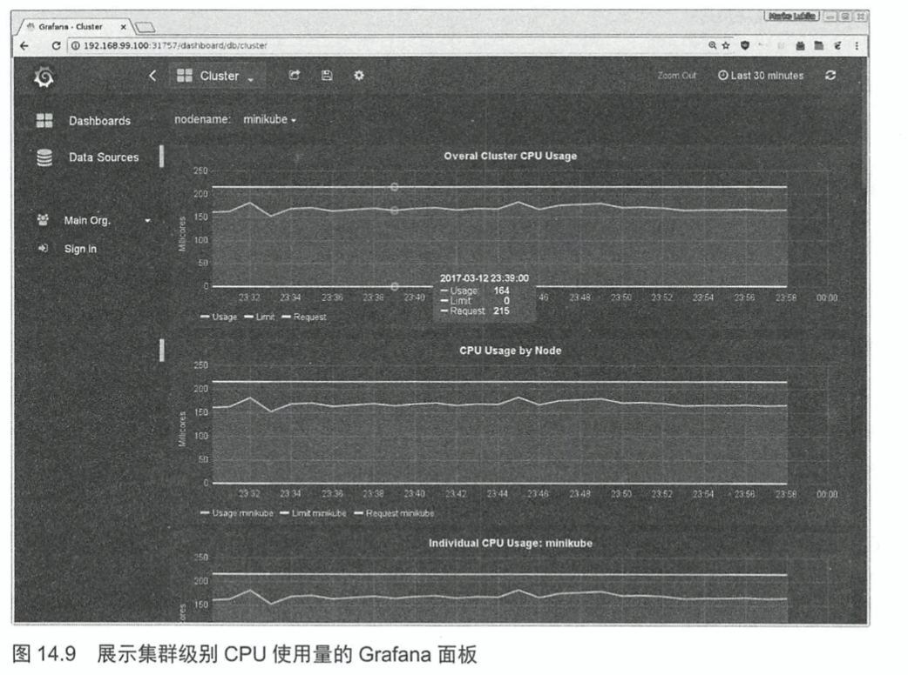

使用`kubectl cluster-info`æ¥æŸ¥çœ‹ Grafana web æ§åˆ¶å°çš„ URL，然å进行访问，就å¯ä»¥æŸ¥çœ‹ pod å®æ—¶çš„æµé‡æ•°æ®äº†ã€‚

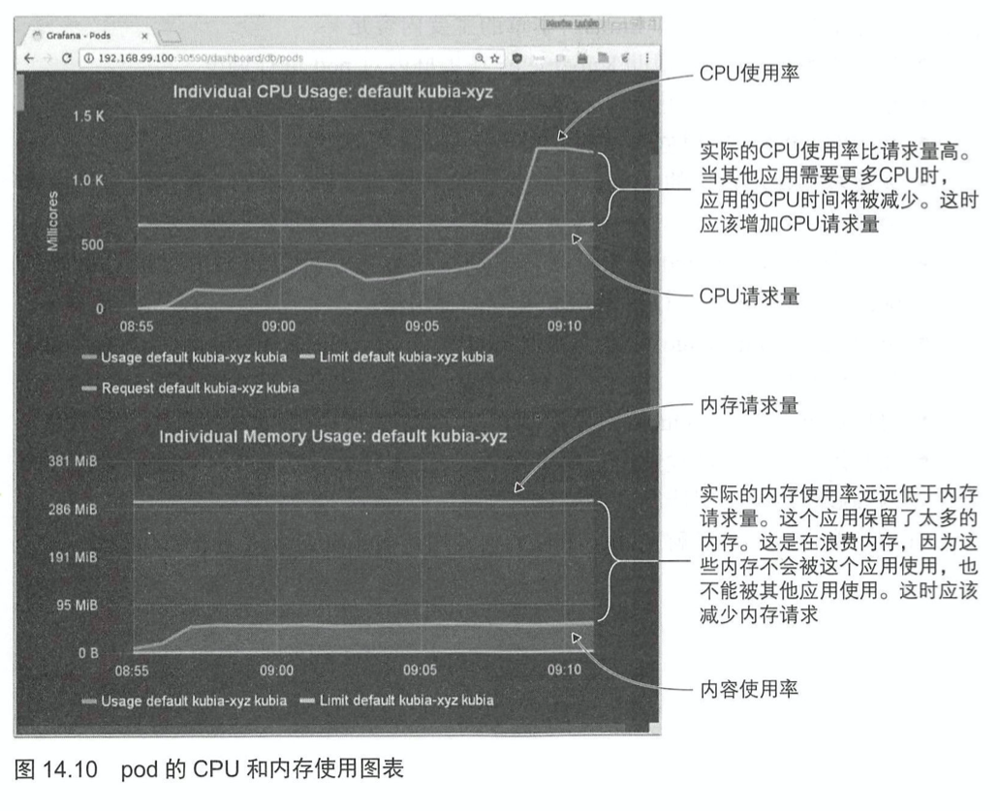

> PS：使用 minikube 时，grafana çš„æ§åˆ¶å°é€šè¿‡ NodePort Service 暴露，å¯ä»¥ä½¿ç”¨`minikube service monitoring-grafana -n kube-system`命令æ¥æ‰“开。（但很é—憾在笔者的 minikube 版本 v1.13.1 无法打开，åŸå› å¤§æ¦‚是这个版本 heapster æ’件已ç»è¢«åºŸå¼ƒäº†ï¼Œæ”¹ç”¨äº† metrics-server，QAQ）