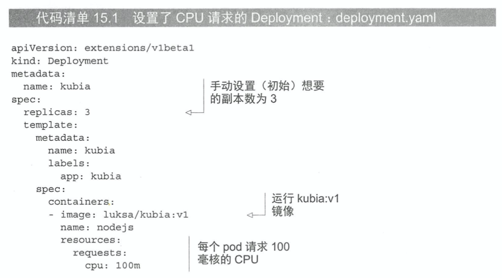
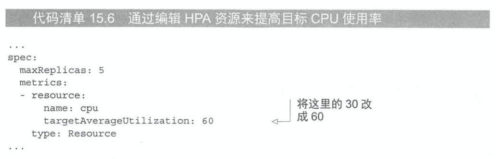
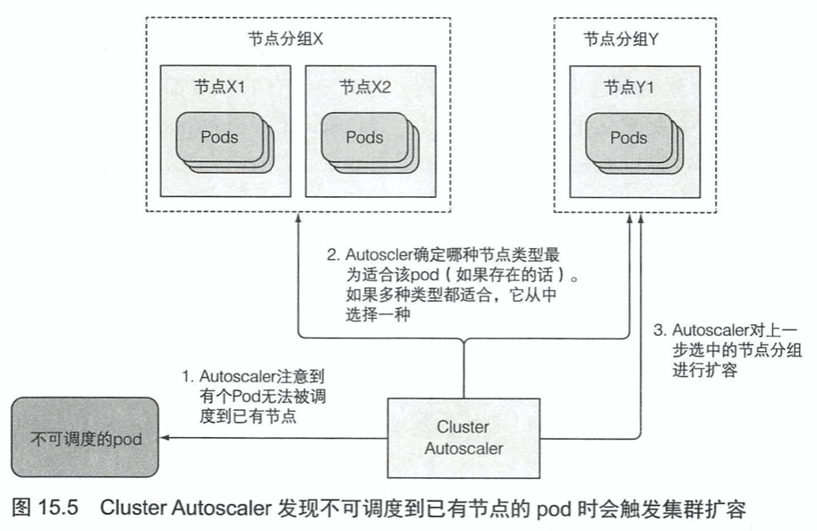

# KubernetesInAction学习笔记（15）

## 第15章 自动横向伸缩pod与集群节点

通过调高 RC、RS、SS、Deployment 等可伸缩资源的`replicas`字段，可以手动实现 pod 中应用的横向扩容。虽然也可以通过给 pod 容器更多的资源限制来纵向扩容 pod，但一来这种操作只能在 pod 创建时完成，二来应用本身有着并发量的限制，所以并不鼓励。

如果能预先知道负载何时会飙升，手动扩容是可以接受的，但始终指望靠人工干预来处理突发而不可预测的流量增长仍然不够理想。

幸运的是 K8S 可以监控 pod，并在检测到 CPU 使用率或其他度量增长时自动对它们进行扩容。如果 K8S 运行在云端的架构上，它甚至可以做到自动申请并扩建更多的节点，从而横向扩展更多的 pod。

> PS：K8S 自动伸缩在 1.6 和 1.7 版本中间经历了一次重写，以下介绍的特性不一定通用

### 15.1 pod 的横向自动伸缩

横向 pod 自动伸缩由 Horizontal 控制器执行，通过创建一个 HorizontalpodAutoScaler（简称 HPA）资源来启用和配置 Horizontal 控制器。

HPA 启用的 Autoscaler 资源会周期性地检查 pod 度量，进而调整目标资源的`replicas`字段。

#### 15.1.1 了解自动伸缩过程

自动伸缩的过程可以分为三个步骤：

- 获取被伸缩资源对象所管理的所有 pod 度量
- 计算使度量数值到达所指定目标数值所需的 pod 数量
- 更新被伸缩资源的 replicas 字段


##### 获取 pod 度量

HPA 控制器通过向集群发送 REST 请求来获取所有 pod 度量数据，如下是获取度量数据的流程（注意所有连接都是按照箭头反方向发起的）


这样的数据流也意味着必须运行 Heapster 才能实现自动伸缩。


##### 计算所需的 pod 数量

HPA 在获得所有 pod 的全部度量之后，就会依据这些度量计算出所需的 pod 副本数量，目标是使所有 pod 副本上度量的平均值尽量接近配置的目标值。

##### 更新被伸缩资源的副本数

最后一步是更新伸缩资源对象（RS、Deployment等）上副本的`replicas`字段，然后再让这些对象来完成伸缩 pod 的工作。

#### 15.1.2 基于 CPU 使用率进行自动伸缩

CPU 资源的使用通常是不稳定的，比较靠谱的做法是在 CPU 被压垮之前，甚至是在平均负载达到或超过 80% 的时候就进行扩容。但问题是上一章中提到，容器中的进程在没有设置 limits 的时候是默认能够使用节点上所有的 CPU 资源的，所以 PHA 并不能通过监控发现此时节点的高使用率是由于节点空闲还是节点繁忙。因此要基于 CPU 使用率的来设置 PHA，前提是节点有自己的 LimitRange，限制了 pod 的 CPU 请求。

##### 基于 CPU 使用率创建 HPA

首先创造一个普通的 deployment 对象：



```yaml
# kubectl autoscale deployment demo-hpa-deployoment --cpu-percent=30 --min=1 --max=5
apiVersion: apps/v1
kind: Deployment
metadata:
  name: demo-hpa-deployoment
spec:
  replicas: 3
  selector:
    matchLabels:
      app: demo-hpa-deployment-pod-label
  template:
    metadata:
      name: demo-hpa-deployment-pod
      labels:
        app: demo-hpa-deployment-pod-label
    spec:
      containers:
      - image: demo-rollupdate-image:v1
        imagePullPolicy: Never
        name: demo-hpa-deployment-pod-container
        resources:
          requests:
            cpu: 100m
```

创建了 Deployment 之后，为了赋予它自动伸缩功能，需要创建一个 HPA 对象并把它指向该 Deployment。而除了使用 yaml 来创建以外，还可以使用`kubectl autoscale`命令。

```shell
$ kubectl create -f demo-hpa-deployment.yaml
deployment.apps/demo-hpa-deployoment created
$ kubectl autoscale deployment demo-hpa-deployoment --cpu-percent=30 --max=5 --min=1
horizontalpodautoscaler.autoscaling/demo-hpa-deployoment autoscaled

$ kubectl get hpa
NAME                   REFERENCE                         TARGETS         MINPODS   MAXPODS   REPLICAS   AGE
demo-hpa-deployoment   Deployment/demo-hpa-deployoment   <unknown>/30%   1         5         3          8m12s
```

`kubectl autoscale`命令会创建 HPA 对象，并将指定 deployment 设置为伸缩目标。在上面的 hpa 中，设置了 pod 的目标 CPU 使用率为 30%，指定了副本的最小和最大数量。

Autoscaler 会持续调整副本的数量使 CPU 使用率接近 30%，但它永远不会调整到少于 1 个或多于 5 个。

##### 观察第一个自动伸缩事件

如果 cAdvisor 还没有从 Heapster 收集到这些度量，这时候使用`kubectl get`显示 HPA 资源，TARGETS 列就会像上面一样显示`<unknown>`（还是那个问题，笔者的 minikube 版本没有 Heapster...导致放了一晚上都是 unknown，[相关链接1](https://stackoverflow.com/questions/59262706/k8s-hpa-cant-get-the-cpu-information)，[相关链接2](https://stackoverflow.com/questions/54106725/docker-kubernetes-mac-autoscaler-unable-to-find-metrics)）

可以通过`kubectl describe hpa`来观察到 HPA 的更多信息（包括错误信息）

可以通过`kubectl get pod --watch`和`kubectl get deployment --watch`命令来查看 autoScaler 扩容时节点资源的变化。

##### 修改一个已有 HPA 对象的目标度量值



通过`kubectl edit`命令可以修改现有 pha 的 CPU 限制。

#### 15.1.3 基于内存使用进行自动伸缩

基于内存的自动伸缩比基于 CPU 困难很多。原因在于扩容之后原本的 pod 需要有办法释放内存，而这只能由应用完成，系统无法代劳。系统能做的只有杀死并重启应用，以期希望它能比之前少占用这些内存。但如果重启之后的占用内存还是一样，那么系统就会进行扩容，直至达到 HPA 资源上配置的最大 pod 数量。

基于内存使用的自动伸缩配置方法与基于 CPU 的自动伸缩完全相同。

#### 15.1.4 基于其他自定义度量进行自动伸缩

除了内存和 CPU，K8S 还支持对于一些其他参数进行扩容，比如根据 Ingress 对象的数量来进行 pod 的扩容，根据 pod 的每秒查询次数（QPS）等等，但并不是所有度量都适合作为自动伸缩的基础，而且该功能不一定足够稳定，因此本节了解即可。

### 15.2 pod 的纵向自动伸缩

纵向伸缩——即通过给一个应用更多的 CPU 或内存赋予其更强的能力。但截止至本书完成，K8S 并未支持 pod 的纵向伸缩功能。但已经有了相应提案。

### 15.3 集群节点的横向伸缩

万一所有的节点都被 pod 实例塞满的时候，还是无法满足当前的服务器压力，在这个时候，如果 K8S 运行在物理节点上，那么就只能通过自己添加一台物理机并将其加入节点进行扩容。但如果 K8S 运行在云端的基础架构之上，就可以通过 K8S 的 ClusterAutoscaler 资源来自动化添加节点。

#### 15.3.1 Cluster Autoscaler 介绍

Cluster Autoscaler 用于在由于节点资源不足而无法调度 pod 到已有节点时，自动部署新节点，也会在节点长时间使用率低下的情况下下线节点。



此外当节点出现故障时，也可以手动被标记为不可调度并排空，可以使用`kubectl`命令来完成

- `kubectl cordon <node>`标记节点为不可调度（但对其上的 pod 不做任何事）
- `kubectl drain <node>`标记节点为不可调度，随后疏散其上所有的 pod
- `kubectl uncordon <node>`解除节点的不可调度状态，在此之前不会有新的 pod 被调度到该节点。

#### 15.3.2 启用 Cluster Autoscaler

集群自动伸缩在以下的云服务提供商可用：

- GKE（谷歌K8S云引擎）
- GCE（谷歌计算云引擎）
- AWS（亚马逊云服务）
- Microsoft Azure（微软）

> 可以用带有`-it`和`--rm`选项的`kubectl run`命令在 pod 中运行一次性的进程，并在按下 CTRL + C 组合键时自动停止并删除该临时 pod。