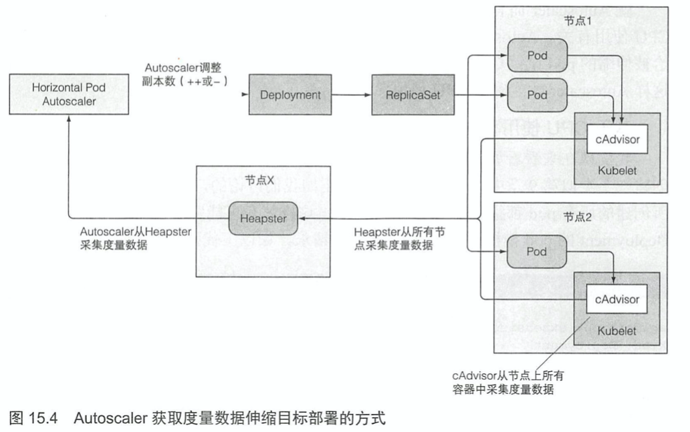

# KubernetesInAction学习笔记（15）

## 第15章 自动横向伸缩pod与集群节点

通过调高 RC、RS、SS、Deployment 等可伸缩资源的`replicas`字段，可以手动实现 pod 中应用的横向扩容。虽然也可以通过给 pod 容器更多的资源限制来纵向扩容 pod，但一来这种操作只能在 pod 创建时完成，二来应用本身有着并发量的限制，所以并不鼓励。

如果能预先知道负载何时会飙升，手动扩容是可以接受的，但始终指望靠人工干预来处理突发而不可预测的流量增长仍然不够理想。

幸运的是 K8S 可以监控 pod，并在检测到 CPU 使用率或其他度量增长时自动对它们进行扩容。如果 K8S 运行在云端的架构上，它甚至可以做到自动申请并扩建更多的节点，从而横向扩展更多的 pod。

> PS：K8S 自动伸缩在 1.6 和 1.7 版本中间经历了一次重写，以下介绍的特性不一定通用

### 15.1 pod 的横向自动伸缩

横向 pod 自动伸缩由 Horizontal 控制器执行，通过创建一个 HorizontalpodAutoScaler（简称 HPA）资源来启用和配置 Horizontal 控制器。

HPA 启用的控制器会周期性地检查 pod 度量，进而调整目标资源的`replicas`字段。

#### 15.1.1 了解自动伸缩过程

自动伸缩的过程可以分为三个步骤：

- 获取被伸缩资源对象所管理的所有 pod 度量
- 计算使度量数值到达所指定目标数值所需的 pod 数量
- 更新被伸缩资源的 replicas 字段

##### 获取 pod 度量

HPA 控制器通过向集群发送 REST 请求来获取所有 pod 度量数据，如下是获取度量数据的流程（注意所有连接都是按照箭头反方向发起的）

这样的数据流也意味着必须运行 Heapster 才能实现自动伸缩。

##### 计算所需的 pod 数量

HPA 在获得所有 pod 的全部度量之后，就会依据这些度量计算出所需的 pod 副本数量，目标是使所有 pod 副本上度量的平均值尽量接近配置的目标值。

##### 更新被伸缩资源的副本数

最后一步是更新伸缩资源对象（RS、Deployment等）上副本的`replicas`字段，然后再让这些对象来完成伸缩 pod 的工作。

#### 15.1.2 基于 CPU 使用率进行自动伸缩

CPU 资源的使用通常是不稳定的，比较靠谱的做法是在 CPU 被压垮之前，甚至是在平均负载达到或超过 80% 的时候就进行扩容。但问题是上一章中提到，容器中的进程在没有设置 limits 的时候是默认能够使用节点上所有的 CPU 资源的，所以 PHA 并不能通过监控发现此时节点的高使用率是由于节点空闲还是节点繁忙。因此要基于 CPU 使用率的来设置 PHA，前提是节点有自己的 LimitRange，限制了 pod 的 CPU 请求。

##### 基于 CPU 使用率创建 HPA

> 本次阅读至P448 基于 CPU 使用率创建 HPA 462