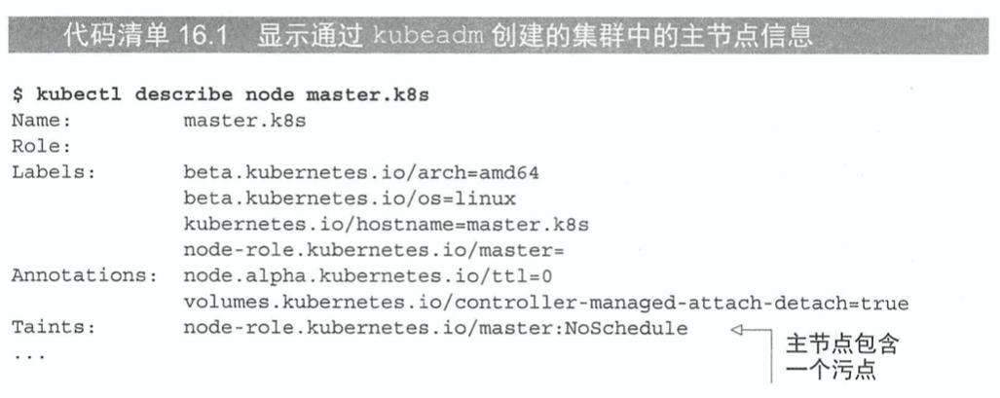
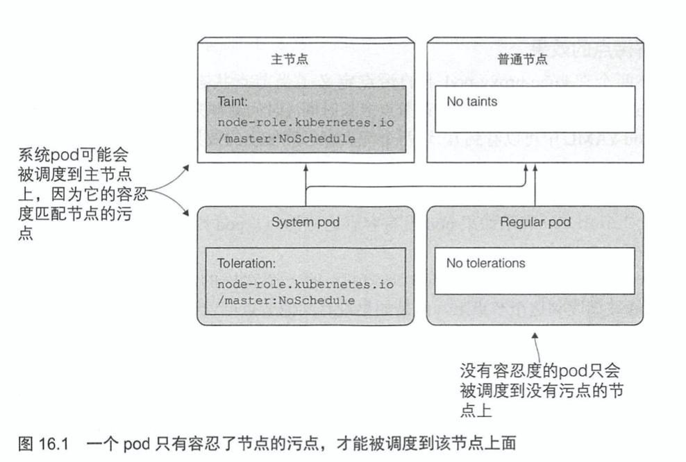
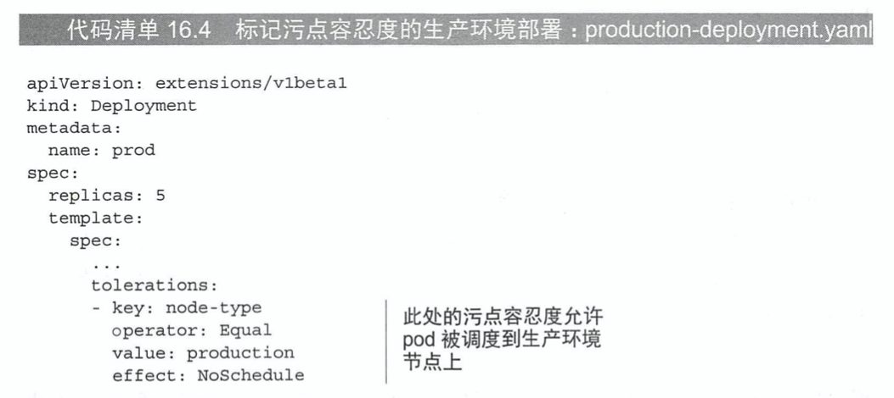
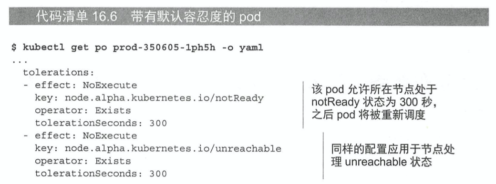

# KubernetesInAction学习笔记（16）

## 第16章 高级调度

K8S 允许开发者去影响 pod 被调度到哪个节点，而不仅仅是像第三章介绍的那样，只能通过 pod 的`spec.nodeSelector`标签进行节点的选择。本章将介绍这些能够影响部署的规则。

### 16.1 使用污点和容忍度阻止节点调度到特定节点

通过在节点上添加污点信息，就可以在不修改已有 pod 信息的前提下，拒绝 pod 在某些节点上的部署。

#### 16.1.1 介绍污点和容忍度

通过`kubectl describe node`可以查看节点的污点信息。



污点`Taints`包含了一个 key、value，以及一个 effect，表现为`<key>=<value>:<effect>`。如上面的污点信息，包含一个名为`node-role.kubernetes.io/master`的 key，一个空的 value，以及值为 NoSchedule 的 effect。

这个污点将阻止 pod 调度到这个节点上面，除非有 pod 能容忍这个污点。



##### 了解污点的效果 effect

每一个污点都可以关联一个效果，该效果包含了以下三种：

- NoSchedule：表示如果 pod 没有容忍这些污点，pod 则不能被调度到包含这个污点的节点上
- PreferNoSchedule：这是 NoSchedule 的一个宽松的版本，表示尽量阻止 pod 被调度到这个节点上，但如果没有其他节点可以调度，pod 依然会被调度到节点上
- NoExecute：不同于前两者只会在调度期间起作用，NoExecute 也会影响正在节点上运行着的 pod。如果在一个节点上添加了 NoExecute 污点，运行着的 pod 如果没有忍受这个污点，就会从这个节点自动去除。

#### 16.1.2 在节点上添加自定义污点

可以使用`kubectl taint`命令来添加污点。

```shell
$ kubectl taint node minikube node-type=production:NoSchedule
node/minikube tainted
$ kubectl delete pod demo-hpa-deployoment-859f7b4c8d-2sncp
pod "demo-hpa-deployoment-859f7b4c8d-2sncp" deleted

$ kubectl get pod
# 新生成的 pod 无法被部署
NAME                                    READY   STATUS    RESTARTS   AGE
demo-hpa-deployoment-859f7b4c8d-b9484   1/1     Running   0          7h59m
demo-hpa-deployoment-859f7b4c8d-kgbr7   1/1     Running   0          7h59m
demo-hpa-deployoment-859f7b4c8d-kvthq   0/1     Pending   0          45s
```

这个命令添加了一个污点（taint），其中 key 为`node-type`，value 为`production`，效果为`NoSchedule`。接下来如果没有在 pod 上添加污点容忍度`Toleration`，就没人能将 pod 部署到该节点上了。

之后可以在这个命令后面加一个 - 号删除这个 taint。

```shell
$ kubectl taint node minikube node-type=production:NoSchedule-
node/minikube untainted

$ kubectl get pod
NAME                                    READY   STATUS    RESTARTS   AGE
demo-hpa-deployoment-859f7b4c8d-b9484   1/1     Running   0          8h
demo-hpa-deployoment-859f7b4c8d-kgbr7   1/1     Running   0          8h
demo-hpa-deployoment-859f7b4c8d-kvthq   1/1     Running   0          6m22s
```

#### 16.1.3 在 pod 上添加污点容忍度



通过在 pod manifest 文件的`spec.tolerations`中添加以下属性就可以添加相应的污点容忍度。

#### 16.1.4 了解污点和污点容忍度的使用场景

污点可以用来组织新 pod 的调度（noSchedule）或者定义非优先调度的节点（PreferNoSchedule），甚至将已有的 pod 从当前节点剔除。

而污点容忍度也可以通过设置 Equal 操作符来指定匹配的 value，或者也可以通过设置 Exists 操作符来匹配污点的 key。

当你的部分节点提供了某种特殊硬件，并且只有部分 pod 需要使用到这些硬件的时候，就可以通过设置污点和容忍度来实现这一需求。

##### 配置节点失效之后的 pod 重新调度最长等待时间

通过`pod.spec.tolerations.tolerationSeconds`可以设置 pod 的容忍度信息，当 pod 运行在这个节点中，状态变为 unready 或者 unreachable 状态时，该属性代表该 pod 会被调度到其他节点的最长等待时间。超过这个时间，这个 pod 就会被调度到其他节点。



### 16.2 使用节点亲缘性将 pod 调度到特定节点上


> 本次阅读至 P469 16.2 使用节点亲缘性将 pod 调度到特定节点上  483