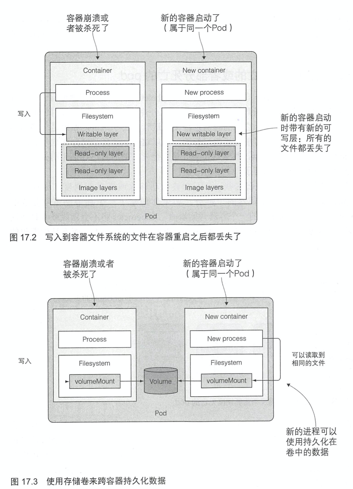

# KubernetesInAction学习笔记（17）

## 第17章 开发应用的最佳实践

本章将介绍一个常见的应用是如何跑在 K8S 上面的。

### 17.1 集中一切资源

一个实际跑在 K8S 上的应用程序会用到以下的 K8S 资源，下面是一个典型应用的 manifest：

一个典型的应用 manifest 应该包含一个或多个 Deployment 和 StatefulSet 对象。这些对象中包含一个或者多个容器的 pod 模板，**而每个容器都有一个存活探针，并且为容器提供的服务（如果有的话）提供就绪探针**。提供服务的 pod 通过一个或者多个服务暴露自己，当需要从集群外访问这些服务的时候，**要么将这些服务配置为 LoadBalancer 或者 NodePort 类型的服务，要么通过 Ingress 资源来开放服务**。

pod 模板通常会引用两种类型的私密凭据（Secret）。一种是从私有镜像拉取镜像时使用的，另一种则是 pod 中运行的进程直接使用的。Secret 通常并不会是应用 manifest 的一部分，而是通常会通过分配给 ServiceAccount，然后再将 ServicAccount 分配给每个单独的 pod。

一个应用还包含一个或者多个 ConfigMap 对象，用于初始化环境变量，或者在 pod 中以 configMap 卷来挂载。有一些 pod 会使用额外的卷，如 emptyDir（用于在一个 pod 的多个容器中共享数据）或 gitRepo（用于在 pod 运行时自动拉取仓库），需要持久化存储的 pod 则需要 persistentVolumeClaim 卷，而被 persistentVolumeClaim 所引用的 StorageClass 则是由系统管理员事先创建的。

在某些情况下，一个应用还需要使用任务（Jobs）和定时任务（CronJobs）。而守护进程集（DaemonSet）一般不会做为应用部署的一部分，它们通常由系统管理员创建，在全部或者部分节点桑拿运行系统服务。

此外还有围绕 pod 的水平扩容器（HorizontalpodAutoscaler）可以由开发者包含在 manifest 中或者后续由运维团队添加到系统中。集群管理员还会在每个节点上创建 LimitRange 和 ResourceQuota 对象，以控制每个 pod 和所有的 pod 的计算资源使用情况。

在应用部署后，各种 K8S 控制器还会自动创建其他的对象，比如说 Endpoint controller 创建的 Endpoint 对象，Deployment controller 创建的 ReplicaSet 对象，以及由 ReplicaSet （或 RC，Job，CronJob，SS，DS）创建的实际的 pod 对象。

### 17.2 了解 pod 的生命周期

pod 是所有一切资源的中心，也是 K8S 中最重要的资源。从应用的角度来看 pod，它可以看作是一个轻量的虚拟机，但还是有很多显著的差异。

#### 17.2.1 应用必须预料到会被杀死或者重新调度

运行在虚拟机中的应用很少会被从一台机器迁移到另外一台机器。但是在 K8S 中，pod 会被频繁的调度，而其中的应用也就因此有可能随时会被杀死重启。这意味着开发者在开发的时候就要想到他们的应用应该可以支持被频繁迁移的场景。

##### 预料到本地 IP 和主机名会发生变化

应用开发者在开发一个跑在 K8S 场景下的应用时，要尽可能的不依赖应用所处的 IP 和主机名来进行开发。对于一些需要持久化的应用来说，K8S 可以使用 StatefulSet 来确保应用的主机名不会变化，但 IP 地址依旧无法保证。所以一个集群应用绝不应该依赖成员的 IP 地址来构建彼此的关系。

##### 预料到写入磁盘的数据会丢失/使用存储卷跨容器持久化数据

但个容器可能会因为各种原因被重启，当这种情况发生时，虽然 pod 还是一样，但是容器却是全新的了。Kubelet 不会将一个容器运行多次，而是会重新创建一个容器，所以应用不应该信赖在程序运行时容器文件系统中的所有文件。（除了挂载卷所在目录）

但有时候使用存储卷来跨容器存储数据是把双刃剑，万一由于存储卷中的数据损坏而导致应用崩溃，就会使得容器无论重启多少次都陷入崩溃的状态（CrashLoopBackOff）。

#### 17.2.2 重新调度死亡或者部分死亡的 pod

如果一个 pod 陷入了无限循环的崩溃状态（CrashLoopBackOff），RS 或者类似的副本控制器是不会为环境自动移除这些 pod 的，只会由 kubelet 一直尝试重启下去，重启间隔也会不断变长，在这些间隔时，这些 pod 相当于“死亡”了，且节点上的可用副本数量也会因此 -1。

为什么这些 pod 不会被自动移除呢？因为副本控制器并不关心 pod 是否处于死亡状态，它只关心 pod 的数量是否匹配期望的副本数量。

#### 17.2.3 以固定顺序启动 pod

有时应用之间会有相互依赖的关系，需要按照特定的顺序来进行启动。但在 K8S 上批量发布时，K8S 并没有内置的方法来先运行某些 pod，等其成功后再运行其他 pod。

##### 了解 pod 是如何启动的

K8S API 服务器确实是按照 YAML/JSON 文件中定义的对象的顺序来进行处理的，但是这只意味着它们在被写入到 etcd 的时候是有顺序的。无法确保 pod 会按照这个顺序启动。

但 K8S 允许开发者阻止一个一个容器的启动，**直到它的预置条件满足为止**。这个通过在 pod 中包含一个叫作 init 的容器来实现。

##### init 容器介绍

init 容器可以用来初始化 pod，这通常意味着向容器的存储卷中写入数据，然后将这个存储卷挂载到主容器中。

一个 pod 可以拥有任意数量的 init 容器。init 容器是顺序执行的，并且仅当最后一个 init 容器执行完毕才会去启动主容器。换句话说，init 容器也可以用来延迟 pod 的主容器的启动。

例如，直到满足某一个条件的时候，init 容器可以一直等待直到主容器所依赖的服务启动完成并且可以提供服务，然后 init 容器执行结束，然后主容器就可以启动了。

##### 将 init 容器加入 pod

> 本次阅读至 P492 将 init 容器加入 pod 505